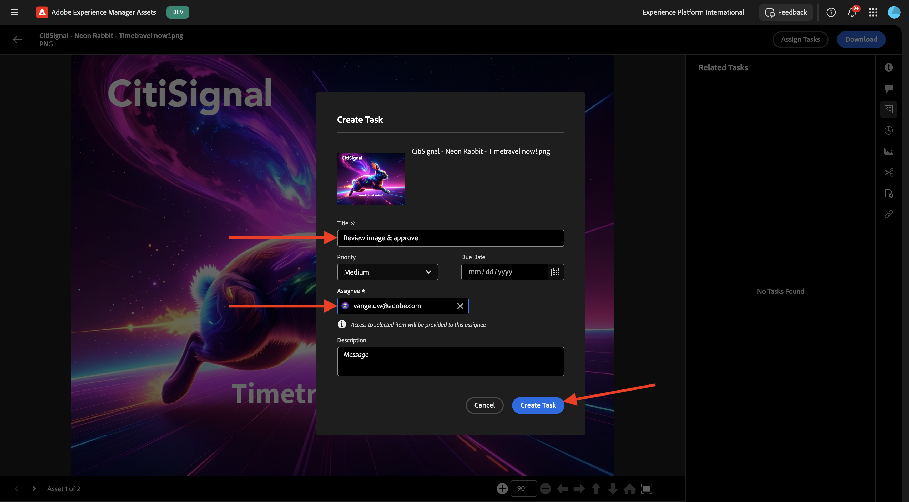

# 1.2.1 Prise en main d’AEM Assets

Accédez à [https://experience.adobe.com/](https://experience.adobe.com/){target="_blank"}. Assurez-vous que vous vous trouvez dans l’environnement correct, qui doit être nommé `--aepImsOrgName--`.

Ouvrez **Adobe Experience Manager Assets**.

Sélectionnez l’environnement AEM Assets CS qui vous est affecté. Dans ce cas, l’environnement à sélectionner est `--aepUserLdap-- - CitiSignal dev author`.

Vous devriez alors voir ceci. Accédez à **Assets**.

Vous devez utiliser un dossier nommé `--aepUserLdap-- - CitiSignal Fiber Campaign`. S’il n’existe pas encore, cliquez sur **Créer un dossier**.

Saisissez le nom `--aepUserLdap--` votre dossier et cliquez sur **Créer**.

Ouvrez le dossier que vous venez de créer. Dans l’un des exercices précédents, vous avez créé 2 images nommées `CitiSignal - Neon Rabbit - Get On Board Now!.png` et `CitiSignal - Neon Rabbit - Timetravel now!.png`. Vous devez maintenant charger ces images dans ce dossier si elles n’y sont pas encore.

Si vous ne disposez plus de ces fichiers, vous pouvez les télécharger [ici](./images/CitiSignal_Neon_Rabbit.zip){target="_blank"}.

Cliquez sur **Ajouter Assets**.

Sélectionnez les 2 images mentionnées ci-dessus. Cliquez sur **Ouvrir**.

Cliquez sur **Télécharger**.

Cliquez sur l’une des images pour la sélectionner.

Cliquez sur **Détails**.

Les métadonnées disponibles du fichier spécifique s’affichent à présent.

Dans le menu de droite, accédez à **Rendus**. Un certain nombre de rendus prédéfinis de l’image que vous avez sélectionnée s’affichent alors, avec la possibilité de les télécharger.

Dans le menu de droite, cliquez sur l’icône **ciseaux**. Plusieurs actions de modification, optimisées par Adobe Express, sont à votre disposition. Cliquez sur **Supprimer l’arrière-plan**.

Au bout de quelques secondes, vous devriez voir quelque chose de similaire à ceci, avec la possibilité d’appliquer vos modifications ou de télécharger le nouveau fichier. Fermez la fenêtre contextuelle.

Clip **Recadrer l’image**.

Vous pouvez tester certaines variations de différentes tailles de recadrage.

Dans le menu de droite, accédez à **Tâches**. Cliquez sur **Affecter des tâches**.

Définissez le **Titre de la tâche** sur `Review image & approve`. Attribuez-vous. Cliquez sur **Créer**.

Cliquez sur **Afficher** dans la notification.

Vous pouvez également actualiser l’écran pour afficher les nouvelles tâches créées dans la liste **Tâches associées**. Cliquez sur le bouton **Ouvrir** pour afficher le détail de la tâche.

Vous devriez alors voir quelque chose comme ça. Cliquez sur **Approuver**.

Confirmez en cliquant sur **Approuver**.

Votre ressource est maintenant approuvée dans AEM Assets.

Étape suivante : [Résumé et avantages](./summary.md){target="_blank"}

Revenir à [Adobe Experience Manager Assets](./aemassets.md){target="_blank"}

[Revenir à tous les modules](./../../../overview.md){target="_blank"}
