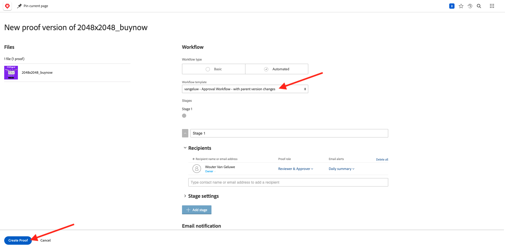
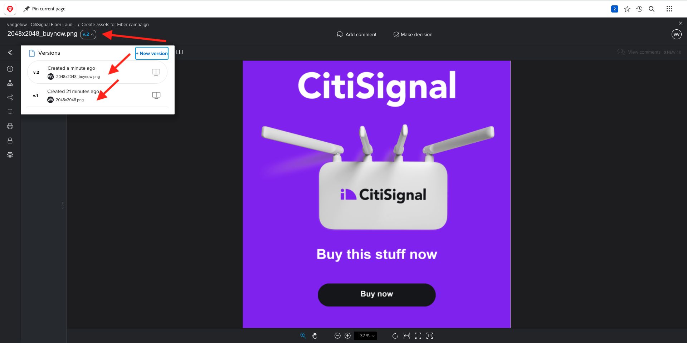
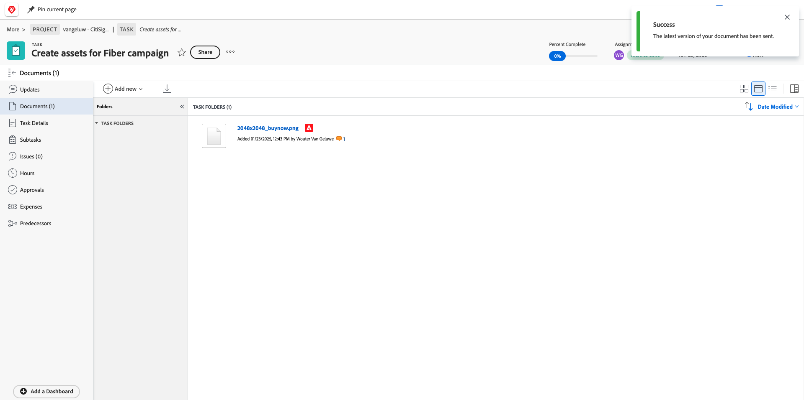

# 1.2.2 Relecture avec Workfront

## 1.2.2.1 Créer un flux d’approbation

Accédez à [https://experienceplatform.my.workfront.com/](https://experienceplatform.my.workfront.com/){target="_blank"}.

Cliquez sur l’icône des 9 points **hamburger** et sélectionnez **Vérification**.

Accédez à **Workflows**, cliquez sur **+ Nouveau** puis sélectionnez **Nouveau modèle**.

Définissez le **Nom du modèle** sur `--aepUserLdap-- - Approval Workflow` et définissez le **Propriétaire du modèle** sur vous-même.

Faites défiler vers le bas, puis sous **Étapes** > **Étape 1**, ajoutez **Wouter Van Geluwe** avec le **Rôle** de **Réviseur et approbateur**.

Cliquez sur **Créer**.

Votre workflow d’approbation de base est maintenant prêt à être utilisé.

## 1.2.2.2 Créer un projet

Sur la page d’accueil de Workfront, cliquez sur **Nouveau** dans l’onglet **Mes projets**. Sélectionnez **Projet vierge**.

Vous devriez alors voir ceci. Remplacez le nom par `--aepUserLdap-- - CitiSignal Fiber Launch`.

Votre projet est maintenant créé.

## 1.2.2.3 Créer une nouvelle tâche

Saisissez le nom de votre tâche : **Créer des ressources pour une campagne Fibre optique**. Cliquez sur **Créer une tâche**.

Vous devriez alors voir ceci.

## 1.2.2.4 Ajouter un nouveau document à votre tâche via le flux d’approbation

Cliquez sur **+ Ajouter** puis sélectionnez **Document**.

Téléchargez [ce fichier](./images/2048x2048.png) sur votre bureau.

{width="50px" align="left"}

Sélectionnez le fichier **2048x2048.png** et cliquez sur **Ouvrir**.

Tu devrais avoir ça. Cliquez sur **Créer une épreuve** puis choisissez **Épreuve avancée**.

Dans la fenêtre **nouveau BAT**, sélectionnez le modèle de workflow que vous avez créé précédemment et qui doit être nommé `--aepuserLdap-- - Approval Workflow`. Cliquez sur **Créer une épreuve**.

Vous reprendrez alors votre tâche. Cliquez sur le bouton **Affecter à** et sélectionnez **M’affecter**.

Cliquez sur **Enregistrer**.

Cliquez sur **Travailler dessus**.

Cliquez sur **Ouvrir l&#39;épreuve**

Vous pouvez maintenant examiner le BAT. Sélectionnez **Ajouter un commentaire** pour ajouter une remarque qui nécessite la modification du document.

Saisissez votre commentaire et cliquez sur **Publier**. Cliquez sur **Fermer**.

Ensuite, vous devez modifier votre rôle de **Réviseur** en **Réviseur et approbateur**. Pour ce faire, revenez à votre tâche et cliquez sur **Workflow de relecture**.

Remplacez votre rôle **Réviseur** par **Réviseur et approbateur**.

Revenez à votre tâche et ouvrez à nouveau l’épreuve. Un nouveau bouton apparaît, **Prendre une décision**. Cliquez dessus.

Sélectionnez **Modifications requises** puis cliquez sur **Prendre une décision**.

Tu devrais alors être de retour ici. Vous devez maintenant charger une deuxième image qui prend en compte les commentaires qui ont été fournis.

Téléchargez [ce fichier](./images/2048x2048_buynow.png) sur votre bureau.

{width="50px" align="left"}

Dans l&#39;affichage Tâche, sélectionnez l&#39;ancien fichier image qui n&#39;a pas été approuvé. Cliquez ensuite sur **+ Ajouter nouveau**, sélectionnez **Version** puis **Document**.

Sélectionnez le fichier **2048x2048_buynow.png** et cliquez sur **Ouvrir**.

Tu devrais avoir ça. Cliquez sur **Créer une épreuve** puis sélectionnez à nouveau **Épreuve avancée**.

Tu verras ça. Le **modèle de workflow** est maintenant présélectionné, car Workfront suppose que le workflow d’approbation précédent est toujours valide. Cliquez sur **Créer une épreuve**.

Sélectionnez **Ouvrir l’épreuve**.

Vous pouvez maintenant voir 2 versions du fichier l’une à côté de l’autre.

Cliquez sur **Prendre une décision**, sélectionnez **Approuvé** et cliquez de nouveau sur **Prendre une décision**.

Fermez l&#39;aperçu de l&#39;épreuve.

Vous serez alors de retour dans la vue Tâche avec une ressource approuvée. Cette ressource doit maintenant être partagée vers AEM Assets.

Cliquez sur l’icône **flèche de partage** et sélectionnez votre intégration AEM Assets, qui doit être nommée `--aepUserLdap-- - Citi Signal AEM`.

Double-cliquez sur le dossier que vous avez créé précédemment et qui doit être nommé `--aepUserLdap-- - Workfront Assets`.

Cliquez sur **Sélectionner un dossier**.

Au bout de 1 à 2 minutes, votre document sera désormais publié dans AEM Assets. Une icône AEM apparaît en regard du nom du document.

Cliquez sur **Ouvrir le résumé**.

Accédez à **Métadonnées**, vous devriez voir ceci :

Accédez à **Aperçu** et cliquez sur **+ Ajouter** pour ajouter une description.

Saisissez votre description. Les paramètres de votre épreuve et de votre document sont maintenant définis.

## 1.2.2.5 Afficher votre fichier dans AEM Assets

Accédez à votre dossier dans AEM Assets, qui s’appelle `--aepUserLdap-- - Workfront Assets`.

Cliquez sur les 3 points de votre image, puis sélectionnez **Détails**.

Vous verrez ensuite le formulaire de métadonnées que vous avez créé précédemment, avec les valeurs qui ont été renseignées automatiquement par l’intégration entre Workfront et AEM Assets.

Revenir à [Gestion des workflows avec Adobe Workfront](./workfront.md){target="_blank"}

[Revenir à tous les modules](./../../../overview.md){target="_blank"}
