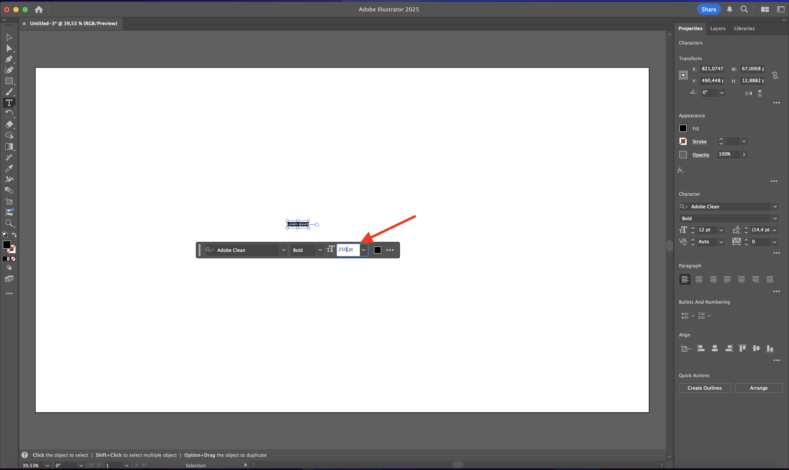
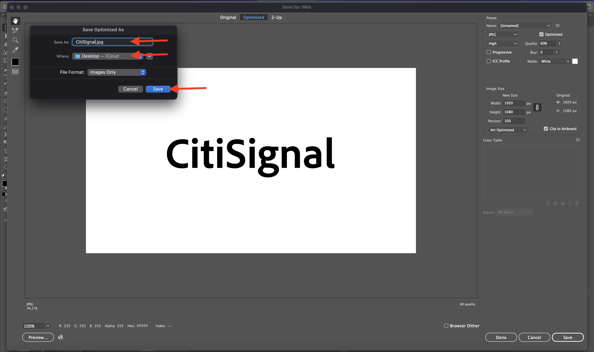
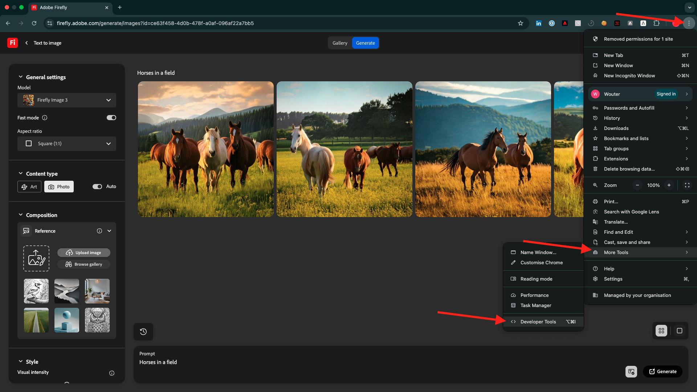
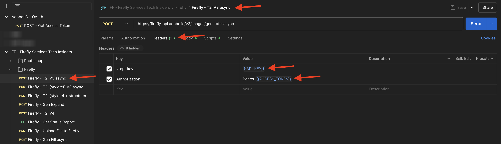
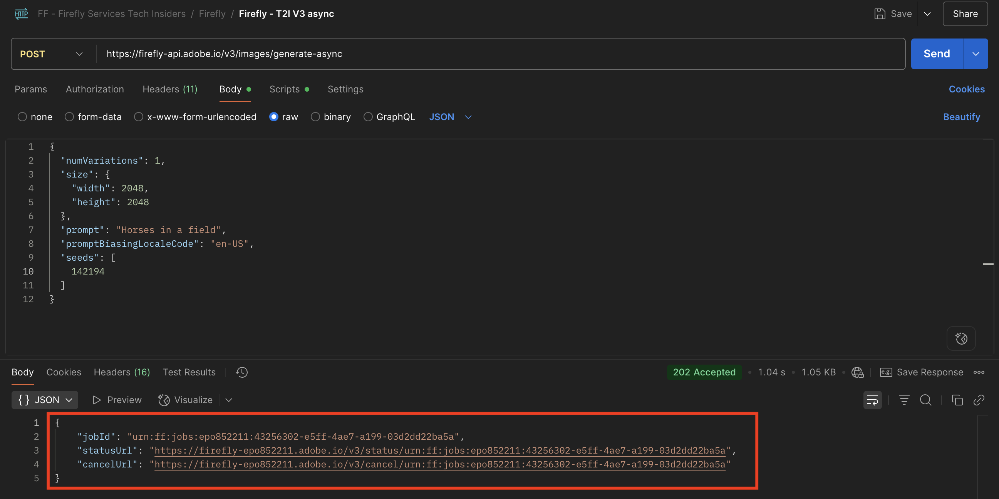
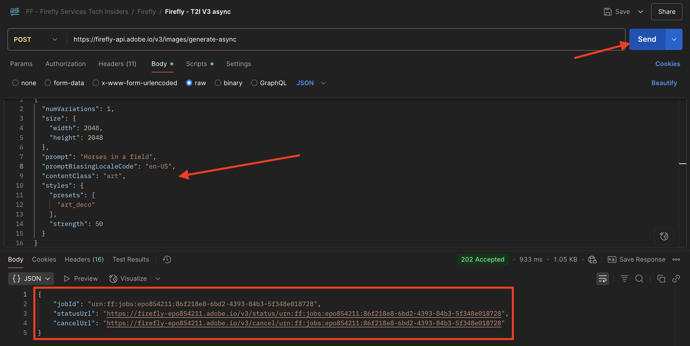
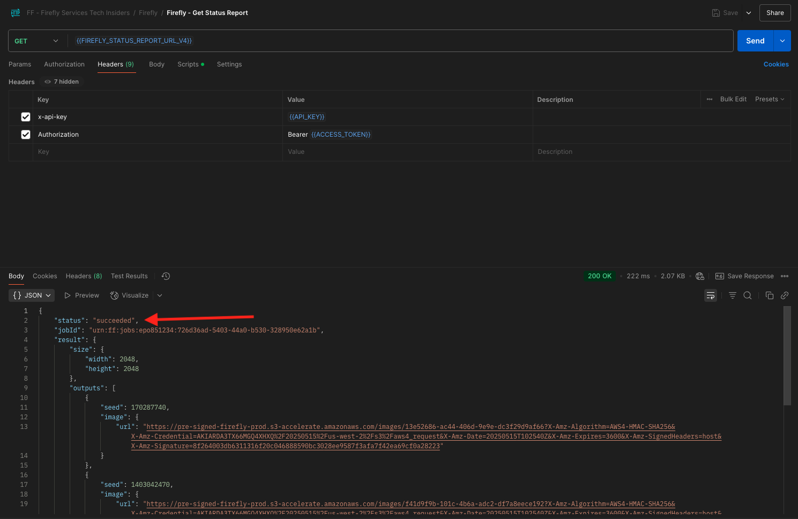
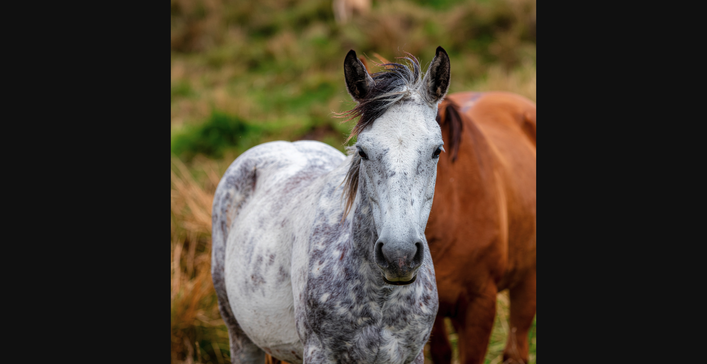

# 1.1.1 Prise en main de Firefly Services

Firefly Services comprend **les API Firefly** **les API Lightroom**, **les API Photoshop** **les API InDesign** et **les API de balisage de contenu**.

Ces suites d’API associent la puissance des outils de création d’Adobe tels que Photoshop et Lightroom à des fonctionnalités d’IA/ML de pointe telles que le balisage de contenu, le remplissage génératif, la conversion de texte en image, etc.

Avec Firefly Services, vous ne vous contentez pas de créer : vous automatisez, dimensionnez votre production de contenu et exploitez les dernières technologies d’IA/ML pour booster vos workflows.

Dans cet exercice, vous apprendrez à utiliser Postman et Adobe I/O pour travailler avec les différentes API de Adobe Firefly Services.

Cet exercice se concentre spécifiquement sur les API Firefly, telles que :

- **API Firefly Generate Images** : cette API est utilisée pour générer des images à l’aide de modèles de Firefly
- **API Firefly Generate similar Images** : cette API est utilisée pour générer des images similaires à une image déjà existante
- **API Expand Image de Firefly** : cette API est utilisée pour développer une image existante pour obtenir un plus grand format/taille
- **API Firefly Fill Image** : cette API remplit une zone d’une image existante en fonction des images générées par Firefly en fonction de votre invite. Pour ce faire, utilisez un masque qui définit la zone à remplir.
- **API Generate Object Composite de Firefly** : cette API vous permet de fournir vous-même une image d’entrée, qui combine ensuite votre image avec des images générées par Firefly pour créer une image composite, ou scène.
- **API de modèles personnalisés Firefly** : cette API vous permet d’utiliser vos propres modèles personnalisés Firefly afin de générer de nouvelles images en fonction de votre modèle personnalisé Firefly

## Conditions préalables 1.1.1.1

Avant de poursuivre cet exercice, vous devez avoir terminé la configuration de [votre projet Adobe I/O](./../../../modules/getting-started/gettingstarted/ex6.md) et vous devez également avoir configuré une application pour interagir avec les API, telles que [Postman](./../../../modules/getting-started/gettingstarted/ex7.md) ou [PostBuster](./../../../modules/getting-started/gettingstarted/ex8.md).

## Principes de base des API 1.1.1.2

Il existe plusieurs types de requêtes API :

- **GET** : utilisé pour tenter de récupérer des informations à partir d’un point d’entrée de l’API, comme obtenir un rapport de statut
- **POST** : il est utilisé lorsque quelque chose de nouveau doit être fait, comme demander à Adobe Firefly Services de générer une nouvelle image
- **PUT** : permet de mettre à jour complètement les données existantes
- **PATCH** : permet de mettre à jour les données existantes de manière sélective
- **DELETE** : utilisé pour supprimer des données

Lorsque vous utilisez des API, vous remarquerez également que des codes de réponse sont renvoyés par les différents points d’entrée de l’API.

Il existe 5 catégories de réponses possibles :

- **1xx réponse informative** : la demande a été reçue, poursuite du processus
- **2xx réussi** : la demande a bien été reçue, comprise et acceptée
- **redirection 3xx** : d’autres actions doivent être entreprises pour terminer la demande.
- Erreur du client **4xx** : la requête contient une syntaxe incorrecte ou ne peut pas être honorée
- **erreur de serveur xx** : le serveur n’a pas réussi à satisfaire une requête apparemment valide

Voici un exemple de codes de réponse courants auxquels vous pouvez vous attendre :

- **200 OK** : c&#39;est bon, votre demande est terminée avec succès
- **201 Créé** : cette opération est correcte, par exemple, votre image a été créée
- **202 Accepted** : est correct, votre demande est acceptée et sera traitée
- **401 Non autorisé** : ce n&#39;est pas correct, il est probable que votre jeton d&#39;accès ne soit pas valide
- **403 Interdit** : ce n&#39;est pas correct, vous ne disposez probablement pas des autorisations requises pour l&#39;action que vous essayez d&#39;exécuter
- **404 Introuvable** : ce n&#39;est pas correct, il est probable que l&#39;URL que vous essayez d&#39;atteindre n&#39;existe pas
- **429 Too Many Requests** : ce n&#39;est pas bien, vous avez probablement envoyé à de nombreuses demandes en peu de temps. Réessayez plus tard.

## 1.1.1.3 Explorer firefly.adobe.com - étape 1

Commençons à explorer Adobe Firefly Services. Pour l&#39;exploration, vous commencerez par un exemple de génération d&#39;images CitiSignal. L&#39;équipe de conception de CitiSignal souhaite générer une version au néon de la marque CitiSignal. Ils voudraient utiliser Adobe Firefly Services pour ce faire.

La première chose à faire pour y parvenir est une version en noir et blanc de la marque CitiSignal, quelque chose qui ressemble à ceci :


### 1.1.1.3.1 Création de votre image de référence de composition

Vous pouvez utiliser [cet exemple d’image](./images/CitiSignal.jpg) ou vous pouvez créer votre propre texte pour tester. Suivez les étapes ci-dessous dans Adobe Illustrator pour créer votre propre fichier image. Si vous choisissez d’utiliser l’image prédéfinie, ignorez la section ci-dessous et passez directement à l’étape **1.1.1.3.2 Générer l’image**

Ouvrez **Adobe Illustrator**. Cliquez sur **Nouveau fichier**.


Sélectionnez **Web-Large 1 920 x 1 080 px**. Cliquez sur **Créer**.


Tu devrais avoir ça. Cliquez sur l’icône de texte **T**.


Tu devrais avoir ça.


Remplacez le type de police par une police de votre choix. Dans ce cas, le type de police est **Adobe Clean Bold**.


Définissez la taille de la police sur la taille de votre choix, en l’occurrence 250 points **&#x200B;**.



Tu devrais avoir ça.


Modifiez le texte comme vous le souhaitez, dans ce cas **CitiSignal**.


Centrez le texte dans votre fichier.


Accédez à **Fichier > Exporter > Enregistrer pour le Web (hérité)**


Tu devrais avoir ça. Cliquez sur **Enregistrer**.


Donnez un nom à votre fichier et enregistrez-le sur votre bureau. Cliquez sur **Enregistrer**.



### 1.1.1.3.2 Générer votre image

Accédez à [https://firefly.adobe.com](https://firefly.adobe.com). Cliquez sur l’icône **profil** et vérifiez que vous êtes connecté au **Compte** de droite, qui doit être `--aepImsOrgName--`. Si nécessaire, cliquez sur **Changer de profil** pour passer à ce compte.


Saisissez le `neon light lettering on a brick wall of a night club` d’invite. Cliquez sur **Générer**.


Vous devriez alors avoir quelque chose de similaire à ceci. Ces images ne sont pas encore utiles. Sous **Composition**, cliquez sur **Télécharger l’image**.


Sélectionnez l&#39;image que vous avez créée précédemment, ici **CitiSignal.jpg**. Cliquez sur **Ouvrir** puis sur **Générer**.


Vous devriez alors avoir quelque chose de similaire à ceci. L’application de la référence Composition n’est pas encore optimale. Pour modifier ce paramètre, définissez le curseur **Portée** sur la valeur maximale. Cliquez de nouveau sur **Générer**.


Vous disposez désormais de plusieurs images qui affichent une version au néon du nom de marque CitiSignal, que vous pouvez utiliser pour effectuer une itération plus approfondie.


Vous avez maintenant appris à utiliser Firefly pour résoudre un problème de conception en quelques minutes.

## 1.1.1.4 Explorer firefly.adobe.com - étape 2

Accédez à [https://firefly.adobe.com/generate/image](https://firefly.adobe.com/generate/image). Vous devriez alors voir ceci. Cliquez sur la liste déroulante **Modèle**. Vous remarquerez qu’il existe trois versions de Adobe Firefly Services disponibles :

- Firefly Image 3
- Firefly Image 4
- Firefly Image 4 Ultra


>[!NOTE]
>
>Firefly Image 3 et Image 4 sont disponibles pour tous les utilisateurs de Adobe Firefly Services, tandis que Firefly Image 4 Ultra nécessite une licence Firefly Pro.

Cliquez pour sélectionner **Firefly Image 3** pour cet exercice.


Saisissez le `Horses in a field` d’invite et cliquez sur **Générer**.


Vous devriez alors voir quelque chose de similaire à ceci.


Ouvrez ensuite l’**outil de développement** dans votre navigateur.



Vous devriez alors voir ceci. Accédez à l’onglet **Réseau**. Cliquez ensuite de nouveau sur **Générer**.


Saisissez le terme de recherche **generate-async**. Vous devriez alors voir une requête nommée **generate-async**. Sélectionnez-la, puis accédez à **Payload** où vous verrez les détails de la requête.


La requête que vous voyez ici est la requête qui est envoyée au serveur principal côté serveur de Firefly Services. Il contient plusieurs paramètres importants :

- **prompt** : il s’agit de votre invite, demandant le type d’image que Firefly doit générer

- **seed** : dans cette requête, les adresses de contrôle ont été générées de manière aléatoire. Chaque fois que Firefly génère une image, il lance par défaut le processus en sélectionnant un nombre aléatoire appelé graine. Ce nombre aléatoire contribue à rendre chaque image unique, ce qui est idéal lorsque vous souhaitez générer une grande variété d’images. Cependant, il peut arriver que vous souhaitiez générer des images similaires entre elles sur plusieurs requêtes. Par exemple, lorsque Firefly génère une image que vous souhaitez modifier à l’aide d’autres options de Firefly (telles que les paramètres prédéfinis de style, les images de référence, etc.), utilisez l’adresse de contrôle de cette image dans les futures requêtes HTTP pour limiter le caractère aléatoire des images futures et affiner l’image que vous souhaitez.


Jetez à nouveau un coup d’œil à l’interface utilisateur d’. Remplacez **Format** par **Écran large (16 :9)**.


Faites défiler jusqu’à **Effets**, accédez à **Thèmes** et sélectionnez un effet tel que **Art déco**.


Assurez-vous que **Outils de développement** est toujours ouvert dans votre navigateur. Cliquez ensuite sur **Générer** et examinez la requête réseau envoyée.


Lorsque vous examinez les détails de la requête réseau, les éléments suivants s’affichent :

- **prompt** n&#39;a pas changé par rapport à la requête précédente
- **seed** a changé par rapport à la requête précédente.
- La **taille** a été modifiée en fonction de la modification du **format**.
- **styles** a été ajouté et contient une référence à l&#39;effet **art_deco** que vous avez sélectionné


Pour l&#39;exercice suivant, vous devrez utiliser l&#39;un des nombres **seed**. Notez un nombre de départ de votre choix.

>[!NOTE]
>
>Les valeurs de départ sont des nombres aléatoires qui sont choisis au moment où vous cliquez sur **Générer**. Si vous souhaitez que l’aspect de votre image générée soit cohérent sur plusieurs requêtes **Generate**, il est important de mémoriser et de spécifier le **numéro de contrôle** de choix dans les requêtes ultérieures.

Dans l’exercice suivant, vous ferez des choses similaires avec Firefly Services, mais en utilisant l’API plutôt que l’interface utilisateur. Dans cet exemple, le numéro de la graine est **142194** pour la première image, qui comporte 2 chevaux se regardant avec leurs têtes face à face.

## 1.1.1.5 Adobe I/O - access_token

Dans la collection **Adobe IO - OAuth**, sélectionnez la requête nommée **POST - Obtenir le jeton d’accès** et sélectionnez **Envoyer**. La réponse doit contenir un nouveau **access_token**.


## API 1.1.1.6 Firefly Services, image Texte 2, image 3

Maintenant que vous disposez d’un nouveau jeton d’accès valide, vous êtes prêt à envoyer votre première requête aux API Firefly Services.

La requête que vous utiliserez ici est une requête **asynchrone**, qui fournit une réponse contenant l’URL de la tâche qui a été envoyée, ce qui signifie que vous devrez utiliser une seconde requête pour vérifier le statut de la tâche et accéder à l’image qui a été générée.

>[!NOTE]
>
>Avec la publication des versions Firefly Image 4 et Image 4 Ultra, les requêtes synchrones seront abandonnées au profit des requêtes asynchrones.

Sélectionnez la requête nommée **POST - Firefly - T2I V3 async** dans la collection **FF - Firefly Services Tech Insiders**. Accédez à **En-têtes** et vérifiez les combinaisons de paire clé/valeur.

| Clé | Valeur |
|:-------------:| :---------------:| 
| `x-api-key` | `{{API_KEY}}` |
| `Authorization` | `Bearer {{ACCESS_TOKEN}}` |

Les deux valeurs de cette requête font référence à des variables d’environnement qui ont été définies au départ. `{{API_KEY}}` fait référence au champ **ID client** de votre projet Adobe I/O. Dans le cadre de la section **Prise en main** de ce tutoriel, vous l’avez configuré dans Postman.

La valeur du champ **Autorisation** est un peu spéciale : `Bearer {{ACCESS_TOKEN}}`. Il contient une référence au **jeton d’accès** que vous avez généré à l’étape précédente. Lorsque vous avez reçu votre **jeton d’accès** à l’aide de la requête **POST - Get Access Token** dans la collection **Adobe IO - OAuth**, un script s’est exécuté dans Postman qui a stocké le champ **access_token** en tant que variable d’environnement, qui est désormais référencée dans la requête **POST - Firefly - T2I V3 async**. Veuillez noter l&#39;ajout spécifique du mot **porteur** et d&#39;un espace avant le `{{ACCESS_TOKEN}}`. Le porteur de mot est sensible à la casse et l’espace est requis. Si cette opération n’est pas effectuée correctement, Adobe I/O renvoie une erreur **401 Non autorisé**, car il ne pourra pas traiter correctement votre **jeton d’accès**.



Ensuite, accédez à la **Corps** et vérifiez l’invite. Cliquez sur **Envoyer**.


Vous obtiendrez alors une réponse immédiate. Cette réponse ne contient pas les URL d’image de l’image générée, mais une URL du rapport d’état du traitement que vous avez lancé et une autre URL qui vous permet d’annuler le traitement en cours.

>[!NOTE]
>
>La collection Postman que vous utilisez a été configurée pour utiliser des variables dynamiques. Par exemple, le champ **statusUrl** a été stocké en tant que variable dynamique dans Postman grâce aux **Scripts** qui ont été configurés dans Postman.


Pour vérifier le rapport de statut de votre tâche en cours d’exécution, sélectionnez la requête nommée **GET - Firefly - Obtenir le rapport de statut** dans la collection **FF - Firefly Services Tech Insiders**. Cliquez pour l’ouvrir, puis cliquez sur **Envoyer**. Sélectionnez l’URL de l’image générée et ouvrez-la dans votre navigateur.

>[!NOTE]
>
>La collection Postman que vous utilisez a été configurée pour utiliser des variables dynamiques. Par exemple, le champ **statusUrl** de la requête précédente a été stocké en tant que variable dynamique dans Postman et il est désormais utilisé comme URL pour la requête **GET - Firefly - Get Status Report**.


Vous auriez dû recevoir une réponse similaire. Il s’agit de la vue d’ensemble du traitement qui a été exécuté. Vous pouvez voir le champ **url**, qui contient l’image générée. Copiez (ou cliquez) sur l’URL de l’image à partir de la réponse et ouvrez-la dans votre navigateur web pour afficher l’image.


Vous devriez voir une belle image représentant `horses in a field`.


Dans le **Corps** de votre requête **POST - Firefly - T2I V3 asynchrone**, ajoutez ce qui suit sous le champ `"promptBiasingLocaleCode": "en-US"` et remplacez la variable `XXX` par l’un des numéros de contrôle qui ont été utilisés de manière aléatoire par l’interface utilisateur de Firefly Services. Dans cet exemple, le nombre **seed** est `142194`.

```json
,
  "seeds": [
    XXX
  ]
```

Cliquez sur **Envoyer**. Vous recevrez alors à nouveau une réponse avec un lien vers le rapport d&#39;état du traitement que vous venez de soumettre.



Pour vérifier le rapport de statut de votre tâche en cours d’exécution, sélectionnez la requête nommée **GET - Firefly - Obtenir le rapport de statut** dans la collection **FF - Firefly Services Tech Insiders**. Cliquez pour l’ouvrir, puis cliquez sur **Envoyer**. Sélectionnez l’URL de l’image générée et ouvrez-la dans votre navigateur.


Vous devriez alors voir une nouvelle image avec de légères différences, en fonction de l’**origine** utilisée. Les `142194` de semence avaient 2 chevaux qui se regardaient avec leurs têtes face à face.


Ensuite, dans le **Corps** de votre requête **POST - Firefly - T2I V3 async**, collez l’objet **styles** ci-dessous sous l’objet **seed**. Le style de l’image générée devient alors **art_deco**.

```json
,
  "contentClass": "art",
  "styles": {
    "presets": [
      "art_deco"
    ],
    "strength": 50
  }
```

Tu devrais avoir ça. Cliquez sur **Envoyer**. Vous recevrez alors à nouveau une réponse avec un lien vers le rapport d&#39;état du traitement que vous venez de soumettre.


Pour vérifier le rapport de statut de votre tâche en cours d’exécution, sélectionnez la requête nommée **GET - Firefly - Obtenir le rapport de statut** dans la collection **FF - Firefly Services Tech Insiders**. Cliquez pour l’ouvrir, puis cliquez sur **Envoyer**. Sélectionnez l’URL de l’image générée et ouvrez-la dans votre navigateur.


Votre image a maintenant un peu changé. Lors de l’application de paramètres prédéfinis de style, l’image d’origine n’est plus appliquée de la même manière qu’auparavant. Dans l’ensemble, avec l’IA générative, il est très difficile de garantir que la même combinaison de paramètres d’entrée conduit à la même image générée.


Supprimez le code de l’objet **seed** dans le champ **Body** de votre requête **POST - Firefly - T2I V3 async**. Cliquez sur **Envoyer** puis sur l’URL de l’image obtenue à partir de la réponse. Vous recevrez alors à nouveau une réponse avec un lien vers le rapport d&#39;état du traitement que vous venez de soumettre.

```json
,
  "seeds": [
    XXX
  ]
```



Pour vérifier le rapport de statut de votre tâche en cours d’exécution, sélectionnez la requête nommée **GET - Firefly - Obtenir le rapport de statut** dans la collection **FF - Firefly Services Tech Insiders**. Cliquez pour l’ouvrir, puis cliquez sur **Envoyer**. Sélectionnez l’URL de l’image générée et ouvrez-la dans votre navigateur.


Votre image a de nouveau un peu changé.


## 1.1.1.7 API Firefly Services, Gen Expand

Sélectionnez la requête nommée **POST - Firefly - Gen Expand async** dans la collection **FF - Firefly Services Tech Insiders** et accédez au **Corps** de la requête.

- **size** : saisissez la résolution souhaitée. La valeur saisie ici doit être supérieure à la taille d’origine de l’image et ne peut pas dépasser 3 999.
- **image.source.url** : ce champ nécessite un lien vers l’image qui doit être développée. Dans cet exemple, une variable est utilisée pour faire référence à l’image générée dans l’exercice précédent.

- **alignement horizontal** : les valeurs acceptées sont les suivantes : `"center"`, `"left` et `"right"`.
- **alignement vertical** : les valeurs acceptées sont les suivantes : `"center"`, `"top` et `"bottom"`.


Vous recevrez alors à nouveau une réponse avec un lien vers le rapport d&#39;état du traitement que vous venez de soumettre.


Pour vérifier le rapport de statut de votre tâche en cours d’exécution, sélectionnez la requête nommée **GET - Firefly - Obtenir le rapport de statut** dans la collection **FF - Firefly Services Tech Insiders**. Cliquez pour l’ouvrir, puis cliquez sur **Envoyer**. Sélectionnez l’URL de l’image générée et ouvrez-la dans votre navigateur.


Vous verrez maintenant que l’image générée dans l’exercice précédent a été étendue à la résolution de 3 999 x 3 999.


Générez une nouvelle image à l’aide de la requête asynchrone **Firefly - T2I V3**.


Pour vérifier le rapport de statut de votre tâche en cours d’exécution, sélectionnez la requête nommée **GET - Firefly - Obtenir le rapport de statut** dans la collection **FF - Firefly Services Tech Insiders**. Cliquez pour l’ouvrir, puis cliquez sur **Envoyer**. Sélectionnez l’URL de l’image générée et ouvrez-la dans votre navigateur.


Vous devriez alors voir une image similaire.


Sélectionnez la requête nommée **POST - Firefly - Gen Expand async** dans la collection **FF - Firefly Services Tech Insiders** et accédez au **Corps** de la requête.

Lorsque vous modifiez l&#39;alignement de l&#39;emplacement, la sortie est également légèrement différente. Dans cet exemple, l’emplacement est remplacé par **gauche, bas**. Cliquez sur **Envoyer**. Vous recevrez alors à nouveau une réponse avec un lien vers le rapport d&#39;état du traitement que vous venez de soumettre.


Pour vérifier le rapport de statut de votre tâche en cours d’exécution, sélectionnez la requête nommée **GET - Firefly - Obtenir le rapport de statut** dans la collection **FF - Firefly Services Tech Insiders**. Cliquez pour l’ouvrir, puis cliquez sur **Envoyer**. Sélectionnez l’URL de l’image générée et ouvrez-la dans votre navigateur.


Vous devriez alors constater que l’image d’origine est utilisée à un emplacement différent, ce qui influence l’ensemble de l’image.


## API 1.1.1.8 Firefly Services, image Texte 2, image 4 et image 4 Ultra

Avec la version récente de Firefly Image Model 4, plusieurs améliorations ont été apportées :

- Firefly Image Model 4 offre une sortie de résolution 2K avec une définition et un détail améliorés.
- Firefly Image Model 4 offre des améliorations significatives en matière de rendu de texte, pour les humains, les animaux et l’architecture.
- Firefly Image Model 4 maintient son engagement d’Adobe en faveur d’une IA générative commercialement sûre et compatible avec la propriété intellectuelle.

Firefly Image Model 4 vous donne des images exceptionnelles de personnes, d&#39;animaux et de scènes détaillées et vous pouvez utiliser Image Model 4 Ultra pour générer des images avec des interactions humaines hyper-réalistes, des éléments architecturaux et des paysages complexes&#x200B;

### 1.1.1.8.1 image4_standard

Sélectionnez la requête nommée **POST - Firefly - T2I V4** dans la collection **FF - Firefly Services Tech Insiders** et accédez aux **en-têtes** de la requête.

Vous remarquerez que l’URL de la requête est différente de la requête **API Firefly Services, image Texte 2, image 3**, qui était **https://firefly-api.adobe.io/v3/images/generate**. Cette URL pointe vers **https://firefly-api.adobe.io/v3/images/generate-async**. L’ajout de **-async** dans l’URL signifie que vous utilisez le point d’entrée asynchrone.

Dans les variables **Header**, vous remarquerez une nouvelle variable appelée **x-model-version**. Il s’agit d’un en-tête obligatoire lors de l’interaction avec Firefly Image 4 et Image 4 Ultra. Pour utiliser Firefly Image 4 ou Image 4 Ultra lors de la génération d’images, la valeur de l’en-tête doit alors être définie sur `image4_standard` ou `image4_ultra`. Dans cet exemple, vous utiliserez `image4_standard`.

Si vous ne définissez pas le **x-model-version** sur `image4_standard` ou `image4_ultra`, Firefly Services utilisera par défaut le `image3` actuellement.


Accédez au **Corps** de la requête. Vous devriez voir que dans le corps, 4 variations d’images sont demandées. L’invite est inchangée par rapport à la précédente et demande toujours la génération de **chevaux dans un champ**. Cliquez sur **Envoyer**


Vous obtiendrez alors une réponse immédiate. Cette réponse ne contient pas les URL d’image de l’image générée, mais une URL du rapport d’état du traitement que vous avez lancé et une autre URL qui vous permet d’annuler le traitement en cours.


Pour vérifier le rapport de statut de votre tâche en cours d’exécution, sélectionnez la requête nommée **GET - Firefly - Obtenir le rapport de statut** dans la collection **FF - Firefly Services Tech Insiders**. Cliquez pour l’ouvrir, puis cliquez sur **Envoyer**.


Vous verrez ensuite le rapport de statut du traitement de génération d’images que vous venez de lancer. Vérifiez le champ **statut**, car il peut être défini sur **en cours d’exécution**, ce qui signifie que la tâche n’est pas encore terminée. Dans cet exemple, le statut de la tâche est défini sur **réussi**, ce qui signifie que les images que vous avez demandées ont été générées.



Faites défiler la réponse vers le bas pour voir qu’au total, 4 variations d’image sont renvoyées par Adobe Firefly Services. Cliquez (ou copiez) l’URL de l’une des images et ouvrez-la dans votre navigateur.


Vous devriez alors voir une image hyperréaliste de **chevaux dans un champ**.


### 1.1.1.8.2 image4_ultra

Revenez à la requête nommée **POST - Firefly - T2I V4** de la collection **FF - Firefly Services Tech Insiders** et accédez aux **en-têtes** de la requête.

Remplacez la variable **x-model-version** par `image4_ultra`. Dans cet exemple, vous utiliserez `image4_ultra`.


Accédez au **Corps** de la requête. Dans le corps, modifiez le nombre de variations d’image sur 1. Comme avec Firefly Image 4 Ultra, une seule image peut être générée en même temps. L’invite est inchangée par rapport à la précédente et demande toujours la génération de **chevaux dans un champ**. Cliquez sur **Envoyer**


La réponse contient à nouveau une URL du rapport d’état du traitement que vous avez lancé, ainsi qu’une autre URL qui vous permet d’annuler le traitement en cours.


Pour vérifier le rapport de statut de votre tâche en cours d’exécution, sélectionnez la requête nommée **GET - Firefly - Obtenir le rapport de statut** dans la collection **FF - Firefly Services Tech Insiders**. Cliquez pour l’ouvrir, puis cliquez sur **Envoyer**.


Vous verrez ensuite le rapport de statut du traitement de génération d’images que vous venez de lancer. Vérifiez le champ **statut**, car il peut être défini sur **en cours d’exécution**, ce qui signifie que la tâche n’est pas encore terminée. Dans cet exemple, le statut de la tâche est défini sur **réussi**, ce qui signifie que les images que vous avez demandées ont été générées.


Vous devriez alors voir une image hyperréaliste de **chevaux dans un champ**.



### Invitation négative

Si vous souhaitez demander à Firefly de ne pas inclure quelque chose dans l’image qui sera générée, vous pouvez inclure le champ `negativePrompt` lors de l’utilisation de l’API (cette option n’est actuellement pas exposée à l’interface utilisateur). Par exemple, si vous ne souhaitez pas que des fleurs soient incluses lors de l’exécution de l’invite **chevaux dans un champ**, vous pouvez la spécifier dans le **corps** de votre requête API :

```
"negativePrompt": "no flowers",
```

Accédez à la requête **POST - Firefly - T2I V4** dans la collection **FF - Firefly Services Tech Insiders** et accédez au **Corps** de la requête. Collez le texte ci-dessus dans le corps de la requête. Cliquez sur **Envoyer**.


Vous devriez alors voir ceci.


Pour vérifier le rapport de statut de votre tâche en cours d’exécution, sélectionnez la requête nommée **GET - Firefly - Obtenir le rapport de statut** dans la collection **FF - Firefly Services Tech Insiders**. Cliquez pour l’ouvrir, puis cliquez sur **Envoyer**. Sélectionnez l’URL de l’image générée et ouvrez-la dans votre navigateur.


Vous verrez alors l’image générée, qui ne devrait pas contenir de fleurs.


## Étapes suivantes

Accédez à [Optimiser votre processus Firefly à l’aide de Microsoft Azure et des URL prédéfinies](./ex2.md){target="_blank"}

Revenez à [ Présentation de Adobe Firefly Services ](./firefly-services.md){target="_blank"}

Revenir à [Tous les modules](./../../../overview.md){target="_blank"}