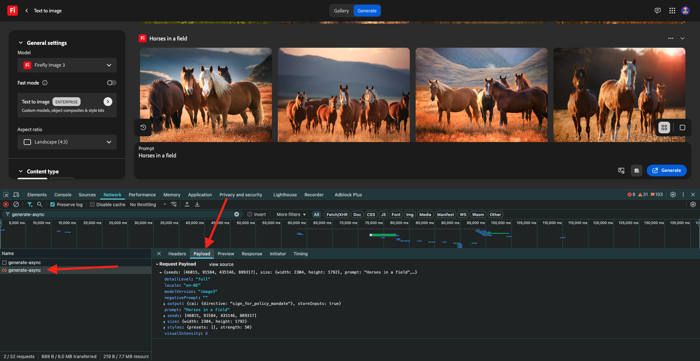

# 1.1.1 Prise en main de Firefly Services

Découvrez comment utiliser Postman et Adobe I/O pour interroger les API Adobe Firefly Services.

## Conditions préalables 1.1.1.1

Avant de poursuivre cet exercice, vous devez avoir terminé la configuration de [votre projet Adobe I/O](./../../../modules/getting-started/gettingstarted/ex6.md) et vous devez également avoir configuré une application pour interagir avec les API, telles que [Postman](./../../../modules/getting-started/gettingstarted/ex7.md) ou [PostBuster](./../../../modules/getting-started/gettingstarted/ex8.md).

## 1.1.1.2 Explorer firefly.adobe.com - étape 1

Commençons à explorer Adobe Firefly Services. Pour l&#39;exploration, vous commencerez par un exemple de génération d&#39;images CitiSignal. L&#39;équipe de conception de CitiSignal souhaite générer une version au néon de la marque CitiSignal. Ils voudraient utiliser Adobe Firefly Services pour ce faire.

La première chose à faire pour y parvenir est une version en noir et blanc de la marque CitiSignal, quelque chose qui ressemble à ceci :


### 1.1.1.2.1 Création de votre image de référence de composition

Vous pouvez utiliser [cet exemple d’image](./images/CitiSignal.jpg) ou vous pouvez créer votre propre texte pour tester. Suivez les étapes ci-dessous dans Adobe Illustrator pour créer votre propre fichier image. Si vous choisissez d’utiliser l’image prédéfinie, ignorez la section ci-dessous et passez directement à l’étape **1.1.1.2.2 Générer l’image**

Ouvrez **Adobe Illustrator**. Cliquez sur **Nouveau fichier**.


Sélectionnez **Web-Large 1 920 x 1 080 px**. Cliquez sur **Créer**.


Tu devrais avoir ça. Cliquez sur l’icône de texte **T**.


Tu devrais avoir ça.


Remplacez le type de police par une police de votre choix. Dans ce cas, le type de police est **Adobe Clean Bold**.


Définissez la taille de la police sur la taille de votre choix, en l’occurrence 250 points **&#x200B;**.


Tu devrais avoir ça.


Modifiez le texte comme vous le souhaitez, dans ce cas **CitiSignal**.


Centrez le texte dans votre fichier.


Accédez à **Fichier > Exporter > Enregistrer pour le Web (hérité)**


Tu devrais avoir ça. Cliquez sur **Enregistrer**.


Donnez un nom à votre fichier et enregistrez-le sur votre bureau. Cliquez sur **Enregistrer**.


### 1.1.1.2.2 Générer votre image

Accédez à [https://firefly.adobe.com](https://firefly.adobe.com). Cliquez sur l’icône **profil** et vérifiez que vous êtes connecté au **Compte** de droite, qui doit être `--aepImsOrgName--`. Si nécessaire, cliquez sur **Changer de profil** pour passer à ce compte.


Saisissez le `neon light lettering on a brick wall of a night club` d’invite. Cliquez sur **Générer**.


Vous devriez alors avoir quelque chose de similaire à ceci. Ces images ne sont pas encore utiles. Sous **Composition**, cliquez sur **Télécharger l’image**.


Sélectionnez l&#39;image que vous avez créée précédemment, ici **CitiSignal.jpg**. Cliquez sur **Ouvrir** puis sur **Générer**.


Vous devriez alors avoir quelque chose de similaire à ceci. L’application de la référence Composition n’est pas encore optimale. Pour modifier ce paramètre, définissez le curseur **Portée** sur la valeur maximale. Cliquez de nouveau sur **Générer**.


Vous disposez désormais de plusieurs images qui affichent une version au néon du nom de marque CitiSignal, que vous pouvez utiliser pour effectuer une itération plus approfondie.


Vous avez maintenant appris à utiliser Firefly pour résoudre un problème de conception en quelques minutes.

## 1.1.1.3 Explorer firefly.adobe.com - étape 2

Accédez à [https://firefly.adobe.com/generate/image](https://firefly.adobe.com/generate/image). Vous devriez alors voir ceci. Cliquez sur la liste déroulante **Modèle**. Vous remarquerez qu’il existe trois versions de Adobe Firefly Services disponibles :

- Firefly Image 3
- Firefly Image 4
- Firefly Image 4 Ultra


>[!NOTE]
>
>Les images Firefly 3 et Image 4 sont disponibles pour tous les utilisateurs de Adobe Firefly Services, tandis que Firefly Image 4 Ultra nécessite une licence Firefly Pro.

Cliquez pour sélectionner **Image Firefly 3** pour cet exercice.


Saisissez le `Horses in a field` d’invite et cliquez sur **Générer**.


Vous devriez alors voir quelque chose de similaire à ceci.


Ouvrez ensuite l’**outil de développement** dans votre navigateur.


Vous devriez alors voir ceci. Accédez à l’onglet **Réseau**. Cliquez ensuite de nouveau sur **Générer**.


Saisissez le terme de recherche **generate-async**. Vous devriez alors voir une requête nommée **generate-async**. Sélectionnez-la, puis accédez à **Payload** où vous verrez les détails de la requête.



La requête que vous voyez ici est la requête qui est envoyée au serveur principal côté serveur de Firefly Services. Il contient plusieurs paramètres importants :

- **prompt** : il s’agit de votre invite, demandant le type d’image que Firefly doit générer

- **seed** : dans cette requête, les adresses de contrôle ont été générées de manière aléatoire. Chaque fois que Firefly génère une image, il lance par défaut le processus en sélectionnant un nombre aléatoire appelé graine. Ce nombre aléatoire contribue à rendre chaque image unique, ce qui est idéal lorsque vous souhaitez générer une grande variété d’images. Cependant, il peut arriver que vous souhaitiez générer des images similaires entre elles sur plusieurs requêtes. Par exemple, lorsque Firefly génère une image que vous souhaitez modifier à l’aide d’autres options de Firefly (telles que les paramètres prédéfinis de style, les images de référence, etc.), utilisez l’adresse de contrôle de cette image dans les futures requêtes HTTP pour limiter le caractère aléatoire des images futures et affiner l’image que vous souhaitez.


Jetez à nouveau un coup d’œil à l’interface utilisateur d’. Remplacez **Format** par **Écran large (16:9)**.


Faites défiler jusqu’à **Effets**, accédez à **Thèmes** et sélectionnez un effet tel que **Art déco**.


Assurez-vous que **Outils de développement** est toujours ouvert dans votre navigateur. Cliquez ensuite sur **Générer** et examinez la requête réseau envoyée.


Lorsque vous examinez les détails de la requête réseau, les éléments suivants s’affichent :

- **prompt** n&#39;a pas changé par rapport à la requête précédente
- **seed** a changé par rapport à la requête précédente.
- La **taille** a été modifiée en fonction de la modification du **format**.
- **styles** a été ajouté et contient une référence à l&#39;effet **art_deco** que vous avez sélectionné


Pour l&#39;exercice suivant, vous devrez utiliser l&#39;un des nombres **seed**. Notez un nombre de départ de votre choix.

>[!NOTE]
>
>Les valeurs de départ sont des nombres aléatoires qui sont choisis au moment où vous cliquez sur **Générer**. Si vous souhaitez que l’aspect de votre image générée soit cohérent sur plusieurs requêtes **Generate**, il est important de mémoriser et de spécifier le **numéro de contrôle** de choix dans les requêtes ultérieures.

Dans l’exercice suivant, vous ferez des choses similaires avec Firefly Services, mais en utilisant l’API plutôt que l’interface utilisateur. Dans cet exemple, le numéro de la graine est **142194** pour la première image, qui comporte 2 chevaux se regardant avec leurs têtes face à face.

## 1.1.1.4 Adobe I/O - access_token

Dans la collection **Adobe IO - OAuth**, sélectionnez la requête nommée **POST - Obtenir le jeton d’accès** et sélectionnez **Envoyer**. La réponse doit contenir un nouveau **accestoken**.


## API 1.1.1.5 Firefly Services, image Texte 2, image 3

Maintenant que vous disposez d’un nouveau jeton d’accès valide, vous êtes prêt à envoyer votre première requête aux API Firefly Services.

Sélectionnez la requête nommée **POST - Firefly - T2I V3** dans la collection **FF - Firefly Services Tech Insiders** . Accédez à la **Corps** et vérifiez l’invite. Cliquez sur **Envoyer**.

La requête que vous utilisez ici est une requête **synchrone** qui vous fournit une réponse contenant l’image demandée en quelques secondes.

>[!NOTE]
>
>Avec la publication des versions Firefly Image 4 et Image 4 Ultra, les requêtes synchrones seront abandonnées au profit des requêtes asynchrones. Vous trouverez des exercices sur les requêtes asynchrones plus bas dans ce tutoriel.


Copiez (ou cliquez) sur l’URL de l’image à partir de la réponse et ouvrez-la dans votre navigateur web pour afficher l’image.


Vous devriez voir une belle image représentant `horses in a field`.


Dans le **Corps** de votre requête **POST - Firefly - T2I V3**, ajoutez ce qui suit sous le champ `"promptBiasingLocaleCode": "en-US"` et remplacez la variable `XXX` par l’un des numéros de contrôle qui ont été utilisés de manière aléatoire par l’interface utilisateur de Firefly Services. Dans cet exemple, le nombre **seed** est `142194`.

```json
,
  "seeds": [
    XXX
  ]
```

Cliquez sur **Envoyer**. Vous recevrez ensuite une réponse avec une nouvelle image générée par Firefly Services. Ouvrez l’image pour l’afficher.


Vous devriez alors voir une nouvelle image avec de légères différences, en fonction de l’**origine** utilisée. Les `142194` de semence avaient 2 chevaux qui se regardaient avec leurs têtes face à face.


Ensuite, dans le **Corps** de votre requête **POST - Firefly - T2I V3**, collez l’objet **styles** ci-dessous sous l’objet **seed**. Le style de l’image générée devient alors **art_deco**.

```json
,
  "contentClass": "art",
  "styles": {
    "presets": [
      "art_deco"
    ],
    "strength": 50
  }
```

Tu devrais avoir ça. Cliquez sur **Envoyer**.


Cliquez sur l’URL de l’image pour l’ouvrir.


Votre image a maintenant un peu changé. Lors de l’application de paramètres prédéfinis de style, l’image d’origine n’est plus appliquée de la même manière qu’auparavant. Dans l’ensemble, avec l’IA générative, il est très difficile de garantir que la même combinaison de paramètres d’entrée conduit à la même image générée.


Supprimez le code de l’objet **seed** dans le champ **Body** de votre requête. Cliquez sur **Envoyer** puis sur l’URL de l’image obtenue à partir de la réponse.

```json
,
  "seeds": [
    XXX
  ]
```


Votre image a de nouveau un peu changé.


## 1.1.1.6 API Firefly Services, Gen Expand

Sélectionnez la requête nommée **POST - Firefly - Gen Expand** dans la collection **FF - Firefly Services Tech Insiders** et accédez au **Corps** de la requête.

- **size** : saisissez la résolution souhaitée. La valeur saisie ici doit être supérieure à la taille d’origine de l’image et ne peut pas dépasser 3 999.
- **image.source.url** : ce champ nécessite un lien vers l’image qui doit être développée. Dans cet exemple, une variable est utilisée pour faire référence à l’image générée dans l’exercice précédent.

- **alignement horizontal** : les valeurs acceptées sont les suivantes : `"center"`, `"left` et `"right"`.
- **alignement vertical** : les valeurs acceptées sont les suivantes : `"center"`, `"top` et `"bottom"`.


Cliquez sur l’URL de l’image qui fait partie de la réponse.


Vous verrez maintenant que l’image générée dans l’exercice précédent a été étendue à la résolution de 3 999 x 3 999.


Lorsque vous modifiez l&#39;alignement de l&#39;emplacement, la sortie est également légèrement différente. Dans cet exemple, l’emplacement est remplacé par **gauche, bas**. Cliquez sur **Envoyer** puis sur pour ouvrir l’URL de l’image générée.


Vous devriez alors constater que l’image d’origine est utilisée à un emplacement différent, ce qui influence l’ensemble de l’image.


## API 1.1.1.7 Firefly Services, image Texte 2, image 4 et image 4 Ultra

### 1.1.1.7.1 image4_standard

Sélectionnez la requête nommée **POST - Firefly - T2I V4** dans la collection **FF - Firefly Services Tech Insiders** et accédez aux **en-têtes** de la requête.

Vous remarquerez que l’URL de la requête est différente de la requête **API Firefly Services, image Texte 2, image 3**, qui était **https://firefly-api.adobe.io/v3/images/generate**. Cette URL pointe vers **https://firefly-api.adobe.io/v3/images/generate-async**. L’ajout de **-async** dans l’URL signifie que vous utilisez le point d’entrée asynchrone.

Dans les variables **Header**, vous remarquerez une nouvelle variable appelée **x-model-version**. Il s’agit d’un en-tête obligatoire lors de l’interaction avec Firefly Image 4 et Image 4 Ultra. Pour utiliser Firefly Image 4 ou Image 4 Ultra lors de la génération d’images, la valeur de l’en-tête doit alors être définie sur `image4_standard` ou `image4_ultra`. Dans cet exemple, vous utiliserez `image4_standard`.


Accédez au **Corps** de la requête. Vous devriez voir que dans le corps, 4 variations d’images sont demandées. L’invite est inchangée par rapport à la précédente et demande toujours la génération de **chevaux dans un champ**. Cliquez sur **Envoyer**


Vous obtiendrez alors une réponse immédiate. Contrairement à la requête synchrone précédente que vous avez utilisée, cette réponse ne contient pas d’URL d’image des images générées. Il contient une URL du rapport d’état de la tâche que vous avez lancée et il contient une autre URL qui vous permet d’annuler la tâche en cours d’exécution.


Pour vérifier le rapport de statut de votre tâche en cours d’exécution, sélectionnez la requête nommée **GET - Firefly - Obtenir le rapport de statut** dans la collection **FF - Firefly Services Tech Insiders**. Cliquez pour l’ouvrir, puis cliquez sur **Envoyer**.


Vous verrez ensuite le rapport de statut du traitement de génération d’images que vous venez de lancer. Vérifiez le champ **statut**, car il peut être défini sur **en cours d’exécution**, ce qui signifie que la tâche n’est pas encore terminée. Dans cet exemple, le statut de la tâche est défini sur **réussi**, ce qui signifie que les images que vous avez demandées ont été générées.


Faites défiler la réponse vers le bas pour voir qu’au total, 4 variations d’image sont renvoyées par Adobe Firefly Services. Cliquez (ou copiez) l’URL de l’une des images et ouvrez-la dans votre navigateur.


Vous devriez alors voir une image hyperréaliste de **chevaux dans un champ**.


### 1.1.1.7.2 image4_ultra

Revenez à la requête nommée **POST - Firefly - T2I V4** de la collection **FF - Firefly Services Tech Insiders** et accédez aux **en-têtes** de la requête.

Remplacez la variable **x-model-version** par `image4_ultra`. Dans cet exemple, vous utiliserez `image4_standard`.


Accédez au **Corps** de la requête. Dans le corps, modifiez le nombre de variations d’image sur 1. Comme avec Firefly Image 4 Ultra, une seule image peut être générée en même temps. L’invite est inchangée par rapport à la précédente et demande toujours la génération de **chevaux dans un champ**. Cliquez sur **Envoyer**


La réponse contient à nouveau une URL du rapport d’état du traitement que vous avez lancé, ainsi qu’une autre URL qui vous permet d’annuler le traitement en cours.


Pour vérifier le rapport de statut de votre tâche en cours d’exécution, sélectionnez la requête nommée **GET - Firefly - Obtenir le rapport de statut** dans la collection **FF - Firefly Services Tech Insiders**. Cliquez pour l’ouvrir, puis cliquez sur **Envoyer**.


Vous verrez ensuite le rapport de statut du traitement de génération d’images que vous venez de lancer. Vérifiez le champ **statut**, car il peut être défini sur **en cours d’exécution**, ce qui signifie que la tâche n’est pas encore terminée. Dans cet exemple, le statut de la tâche est défini sur **réussi**, ce qui signifie que les images que vous avez demandées ont été générées.


Vous devriez alors voir une image hyperréaliste de **chevaux dans un champ**.


## Étapes suivantes

Accédez à [Optimiser votre processus Firefly à l’aide de Microsoft Azure et des URL prédéfinies](./ex2.md){target="_blank"}

Revenez à [ Présentation de Adobe Firefly Services ](./firefly-services.md){target="_blank"}

Revenir à [Tous les modules](./../../../overview.md){target="_blank"}
