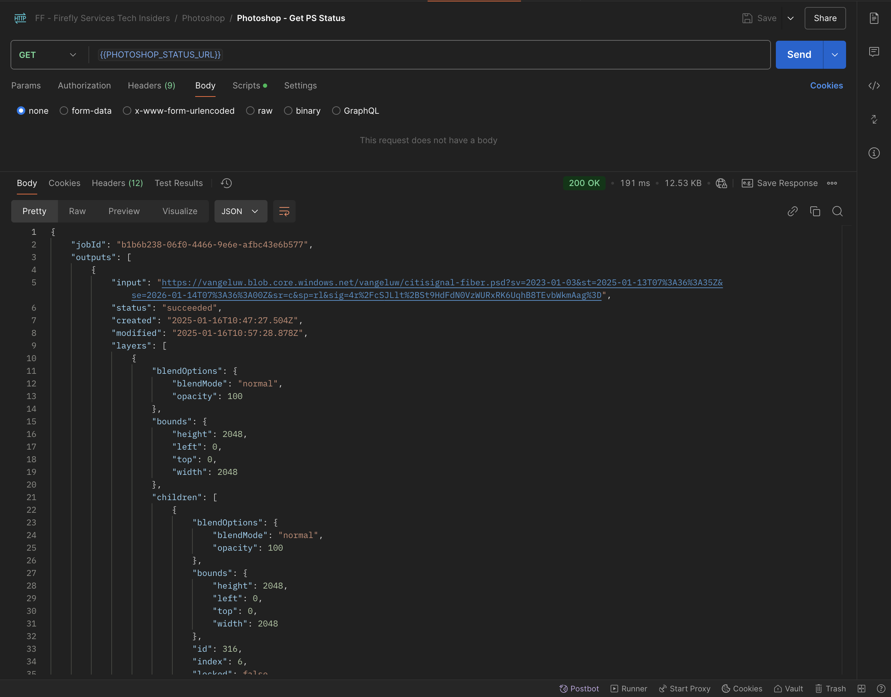
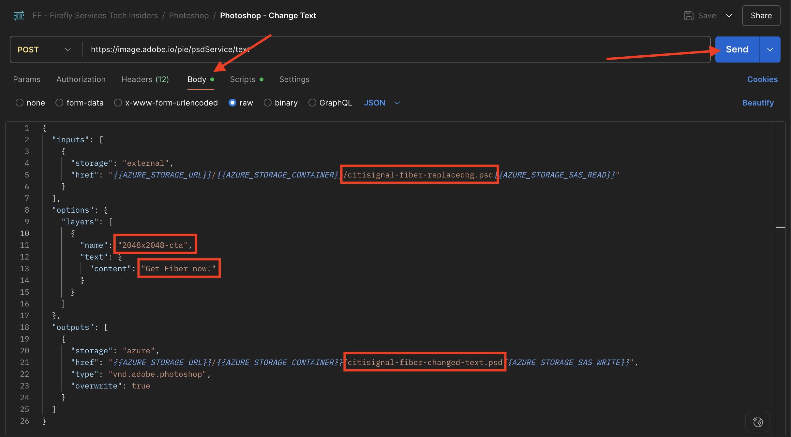
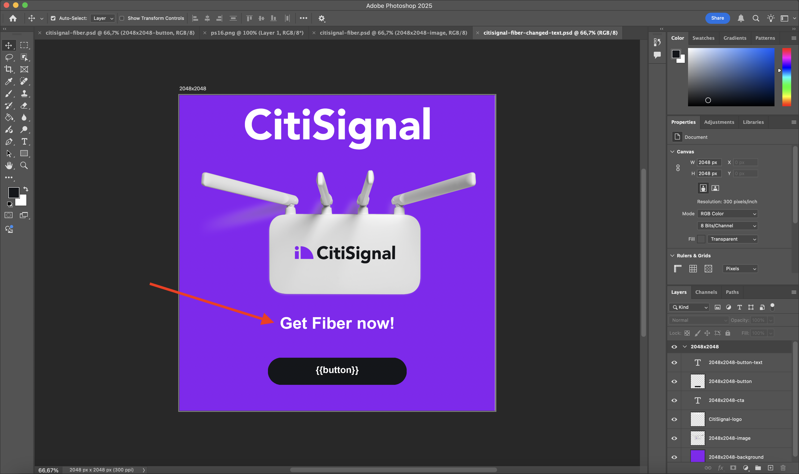
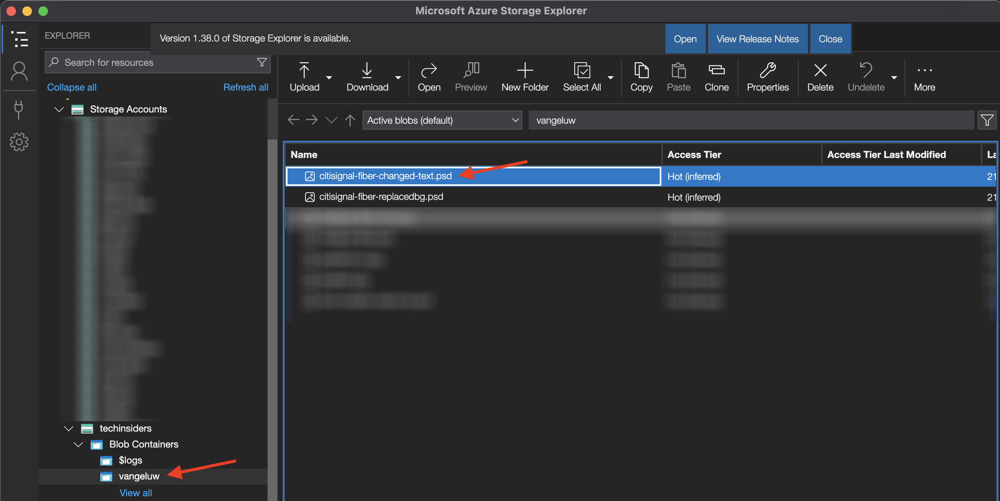

# 1.1.3 Utilisation des API Photoshop

Découvrez comment utiliser les API Photoshop et Firefly Services.

## Conditions préalables 1.1.3.1

Avant de poursuivre cet exercice, vous devez avoir terminé la configuration de [votre projet Adobe I/O](./../../../modules/getting-started/gettingstarted/ex6.md) et vous devez également avoir configuré une application pour interagir avec les API, telles que [Postman](./../../../modules/getting-started/gettingstarted/ex7.md) ou [PostBuster](./../../../modules/getting-started/gettingstarted/ex8.md).

## 1.1.3.2 Adobe I/O - access_token

Dans la collection **Adobe IO - OAuth**, sélectionnez la requête nommée **POST - Obtenir le jeton d’accès** et sélectionnez **Envoyer**. La réponse doit contenir un nouveau **accestoken**.


## 1.1.3.3 Interagir par programmation avec un fichier PSD

Téléchargez [citisignal-fibre.psd](./../../../assets/ff/citisignal-fiber.psd){target="_blank"} sur votre bureau.

Ouvrez **citisignal-fibre.psd** dans Photoshop.


Dans le volet **Calques**, le concepteur du fichier a attribué un nom unique à chaque calque. Vous pouvez afficher les informations sur le calque en ouvrant le fichier PSD dans Photoshop, mais vous pouvez également le faire par programmation.

Envoyons votre première requête d’API aux API Photoshop.

### API Photoshop - Bonjour le monde

Ensuite, disons bonjour aux API Photoshop pour tester si toutes les autorisations et tous les accès sont correctement définis.

Dans la collection **Photoshop**, ouvrez la requête **Photoshop Hello (Tester l’authentification).**. Sélectionnez **Envoyer**.


Vous devriez recevoir la réponse **Bienvenue dans l’API Photoshop !**.


Ensuite, pour interagir par programmation avec le fichier PSD **citisignal-fibre.psd**, vous devez le charger sur votre compte de stockage . Vous pouvez le faire manuellement, en le faisant glisser et en le déposant dans votre conteneur à l’aide de l’explorateur de stockage Azure, mais cette fois, vous devez le faire via l’API.

### Chargement de PSD vers Azure

Dans Postman, ouvrez la demande **Chargement de PSD vers le compte de stockage Azure**. Dans l’exercice précédent, vous avez configuré ces variables d’environnement dans Postman, que vous allez utiliser maintenant :

- `AZURE_STORAGE_URL`
- `AZURE_STORAGE_CONTAINER`
- `AZURE_STORAGE_SAS_READ`
- `AZURE_STORAGE_SAS_WRITE`

Comme vous pouvez le voir dans la requête **Charger PSD sur le compte de stockage Azure**, l’URL est configurée pour utiliser ces variables.


Dans **Body**, sélectionnez le fichier **citisignal-fibre.psd**.


Votre écran devrait ressembler à ceci. Sélectionnez **Envoyer**.


Vous devriez obtenir cette réponse vide en retour d’Azure, ce qui signifie que votre fichier est stocké dans votre conteneur dans votre compte de stockage Azure.


Si vous utilisez Azure Storage Explorer pour consulter votre fichier, veillez à actualiser votre dossier.


### API Photoshop - Obtenir le manifeste

Ensuite, vous devez obtenir le fichier manifeste de votre fichier PSD.

Dans Postman, ouvrez la requête **Photoshop - Obtenir le manifeste PSD**. Accédez à **Corps**.

Le corps doit ressembler à ceci :

```json
  {
    "inputs": [
      {
        "storage": "external",
        "href": "{{AZURE_STORAGE_URL}}/{{AZURE_STORAGE_CONTAINER}}/citisignal-fiber.psd{{AZURE_STORAGE_SAS_READ}}"
      }
    ],
    "options": {
      "thumbnails": {
        "type": "image/jpeg"
      }
    }
  }
```

Sélectionnez **Envoyer**.

Un lien s’affiche désormais dans la réponse. Les opérations dans Photoshop pouvant parfois prendre un certain temps, Photoshop fournit un fichier de statut en réponse à la plupart des requêtes entrantes. Pour comprendre ce qui se passe avec votre requête, vous devez lire le fichier de statut.


Pour lire le fichier de statut, ouvrez la requête **Photoshop - Obtenir le statut PS**. Vous pouvez constater que cette requête utilise une variable comme URL, qui est une variable définie par la requête précédente que vous avez envoyée, **Photoshop - Get PSD Manifest**. Les variables sont définies dans les **Scripts** de chaque requête. Sélectionnez **Envoyer**.


Votre écran devrait ressembler à ceci. Actuellement, le statut est défini sur **en attente**, ce qui signifie que le processus n’est pas encore terminé.


Sélectionnez Envoyer plusieurs fois de plus sur **Photoshop - Obtenir le statut PS**, jusqu&#39;à ce que le statut passe à **réussi**. Cela peut prendre quelques minutes.

Lorsque la réponse est disponible, vous pouvez voir que le fichier json contient des informations sur tous les calques du fichier PSD. Il s’agit d’informations utiles, car des éléments tels que le nom ou l’identifiant du calque peuvent être identifiés.



Par exemple, recherchez le `2048x2048-cta` de texte . Votre écran doit ressembler à ceci :


### API Photoshop - Remplacement d’objet intelligent

Ensuite, vous devez modifier l’arrière-plan du fichier citisignal-fibre.psd en utilisant l’image que vous avez générée à l’aide de Firefly dans l’un des exercices précédents.

Dans Postman, ouvrez la requête **Photoshop - Remplacement d’objet intelligent** et accédez à **Corps**.

Votre écran doit ressembler à ceci :

- tout d&#39;abord, un fichier d&#39;entrée est spécifié : `citisignal-fiber.psd`
- ensuite, le calque à modifier est spécifié, avec le nouveau fichier d’arrière-plan à utiliser
- troisièmement, un fichier de sortie est spécifié : `citisignal-fiber-replacedbg.psd`

```json
  {
    "inputs": [
        {
            "storage": "azure",
            "href": "{{AZURE_STORAGE_URL}}/{{AZURE_STORAGE_CONTAINER}}/citisignal-fiber.psd{{AZURE_STORAGE_SAS_READ}}"
        }
    ],
    "options": {
        "layers": [
            {
                "name": "2048x2048-image",
                "input": {
                    "href": "{{FIREFLY_COMPLETED_ASSET_URL}}",
                    "storage": "external"
                }
            }
        ]
    },
    "outputs": [
        {
            "storage": "azure",
            "href": "{{AZURE_STORAGE_URL}}/{{AZURE_STORAGE_CONTAINER}}/citisignal-fiber-replacedbg.psd{{AZURE_STORAGE_SAS_WRITE}}",
            "type": "vnd.adobe.photoshop",
            "overwrite": true
        }
    ]
}
```

Le fichier de sortie porte un nom différent, car vous ne souhaitez pas remplacer le fichier d’entrée d’origine.

Sélectionnez **Envoyer**.


Comme auparavant, la réponse contient un lien pointant vers le fichier de statut qui effectue le suivi de la progression.


Pour lire le fichier de statut, ouvrez la requête **Photoshop - Obtenir le statut PS** et sélectionnez **Envoyer**. Si le statut n’est pas défini sur **réussi** attendez immédiatement quelques secondes, puis sélectionnez à nouveau **Envoyer**.

Sélectionnez l’URL pour télécharger le fichier de sortie.


Ouvrez **citisignal-fibre-replacedbg.psd** après avoir téléchargé le fichier sur votre ordinateur. Vous devriez voir que l’image d’arrière-plan a été remplacée par une image similaire comme ci-dessous :


Vous pouvez également voir ce fichier dans votre conteneur à l’aide de l’explorateur de stockage Azure.


### API Photoshop - Modifier le texte

Vous devez ensuite modifier le texte du call to action à l’aide des API.

Dans Postman, ouvrez la requête **Photoshop - Modifier le texte** et accédez à **Corps**.

Votre écran doit ressembler à ceci :

- tout d’abord, un fichier d’entrée est spécifié : `citisignal-fiber-replacedbg.psd`, qui est le fichier qui a été généré à l’étape précédente lorsque vous avez modifié l’image d’arrière-plan
- ensuite, le calque à modifier est spécifié, avec le texte à modifier
- troisièmement, un fichier de sortie est spécifié : `citisignal-fiber-changed-text.psd`

```json
  {
  "inputs": [
    {
      "storage": "external",
      "href": "{{AZURE_STORAGE_URL}}/{{AZURE_STORAGE_CONTAINER}}/citisignal-fiber-replacedbg.psd{{AZURE_STORAGE_SAS_READ}}"
    }
  ],
  "options": {
    "layers": [
      {
        "name": "2048x2048-cta",
        "text": {
          "content": "Get Fiber now!"
        }
      }
    ]
  },
  "outputs": [
    {
      "storage": "azure",
      "href": "{{AZURE_STORAGE_URL}}/{{AZURE_STORAGE_CONTAINER}}/citisignal-fiber-changed-text.psd{{AZURE_STORAGE_SAS_WRITE}}",
      "type": "vnd.adobe.photoshop",
      "overwrite": true
    }
  ]
}
```

Le fichier de sortie porte un nom différent, car vous ne souhaitez pas remplacer le fichier d’entrée d’origine.

Sélectionnez **Envoyer**.



Comme auparavant, la réponse contient un lien pointant vers le fichier de statut qui effectue le suivi de la progression.


Pour lire le fichier de statut, ouvrez la requête **Photoshop - Obtenir le statut PS** et sélectionnez **Envoyer**. Si le statut n’est pas défini sur **réussi** attendez immédiatement quelques secondes, puis sélectionnez à nouveau **Envoyer**.

Sélectionnez l’URL pour télécharger le fichier de sortie.


Ouvrez **citisignal-fibre-changed-text.psd** après avoir téléchargé le fichier sur votre ordinateur. Vous devriez voir que l’espace réservé pour le call to action a été remplacé par le texte **Get Fiber now !**.



Vous pouvez également voir ce fichier dans votre conteneur à l’aide de l’explorateur de stockage Azure.



## Étapes suivantes

Accédez à l’API [Modèles personnalisés Firefly](./ex4.md){target="_blank"}

Revenez à [ Présentation de Adobe Firefly Services ](./firefly-services.md){target="_blank"}

Revenir à [Tous les modules](./../../../overview.md){target="_blank"}