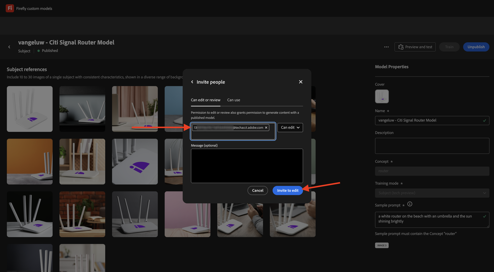

# API des modèles personnalisés Firefly 1.1.4

## 1.1.4.1 Que sont les modèles personnalisés Firefly ?

Avec les modèles personnalisés Firefly, vous pouvez générer des variations d’image conformes à votre marque à l’aide de la fonction Texte en image . En formant ces modèles avec vos propres images, vous pouvez générer du contenu qui reflète l’identité de votre marque.
Transformez votre style ou votre sujet pour explorer de nouvelles idées, visualiser différents environnements, générer du contenu innovant et adapter le contenu à des segments spécifiques.

Avec les modèles personnalisés Firefly, vous pouvez...

- Création d’idées et de concepts de marque
- Générer des thèmes de caractères avec des styles cohérents
- Créer des styles de marque cohérents pour développer rapidement les campagnes

Pour ce faire, les modèles personnalisés Firefly prennent en charge les éléments suivants :

- Modèles d’objet personnalisés
- Modèles de style personnalisés

### Modèles d’objet personnalisés

Lors de l’entraînement de modèles personnalisés sur un sujet spécifique (qu’il s’agisse d’objets ou de caractères), l’objectif est d’identifier les caractéristiques essentielles du sujet et d’aider le modèle à les répliquer dans différents contextes et positions.

Recherchez des images présentant les caractéristiques suivantes lors de l’entraînement d’un modèle de sujet :

- Cohérence de l’objet : fournissez des images de la même marque et du même modèle que votre sujet, tout en veillant à ce que le sujet ne soit pas très différent d’une image à l’autre. Évitez de mélanger plusieurs couleurs et assurez-vous d’avoir un thème ou un motif commun parmi les images. Cependant, votre sujet peut varier selon les scènes, les poses, les vêtements et l&#39;arrière-plan.
- Object focus : Utilisez des images du sujet avec une mise au point claire sans distractions inutiles. Gardez le sujet près du centre de l’image et assurez-vous qu’il occupe au moins 25 % de la zone de l’image.
- Contexte environnemental : Fournissez des images du sujet dans différentes vues et contextes, en le montrant dans diverses conditions d&#39;éclairage. Bien que des images avec des arrière-plans blancs ou transparents puissent être utilisées, il est préférable de combiner également un environnement plus complexe.
- Évitez les autres objets : évitez les éléments volumineux en arrière-plan ou associés au caractère. Tout élément volumineux affiché dans les images est mémorisé par le modèle et apparaît dans les images générées, comme le même élément dans le jeu de données d’entraînement.

### Modèles de style personnalisés

Les modèles personnalisés entraînés sur un style identifient l’aspect des ressources pour générer des images similaires lorsque vous y êtes invité.

Pour entraîner un modèle de style efficace :

- Fournissez une esthétique similaire : incluez des images qui montrent différentes scènes et différents objets tout en conservant la même apparence.
- Utiliser des images différentes : utilisez autant d’images que possible pour éviter que le modèle ne se concentre trop sur des objets ou des sujets indésirables.
- Évitez les expressions fixes : un modèle fixe a un poids plus important que les autres expressions. Par exemple, si chaque légende contient « L’arrière-plan est entièrement noir » ou « Styles de dessin animé mignons », le modèle dépend de cette expression et aucune invite de test sans celle-ci ne générera les résultats souhaités.

## 1.1.4.2 Configurer votre modèle personnalisé

Accédez à [https://firefly.adobe.com/](https://firefly.adobe.com/). Cliquez sur **Modèles personnalisés**.

{zoomable="yes"}

Il se peut que ce message s’affiche. Si c’est le cas, cliquez sur **Accepter** pour continuer.

{zoomable="yes"}

Vous devriez alors voir ceci. Cliquez sur **Entraîner un modèle**.

{zoomable="yes"}

Configurez les champs suivants :

- **Name** : utilisez `--aepUserLdap-- - Citi Signal Router Model`
- **Mode de formation** : sélectionnez **Sujet (aperçu technique)**
- **Concept** : saisissez `router`
- **Enregistrer dans** : ouvrez la liste déroulante et cliquez sur **+ Créer un projet**

{zoomable="yes"}

Attribuez un nom au nouveau projet : `--aepUserLdap-- - Custom Models`. Cliquez sur **Créer**.

{zoomable="yes"}

Vous devriez alors voir ceci. Cliquez sur **Continuer**.

{zoomable="yes"}

Vous devez maintenant fournir les images de référence pour le modèle personnalisé à entraîner. Cliquez sur **Sélectionner des images sur votre ordinateur**.

{zoomable="yes"}

Téléchargez les images de référence [ici](https://one-adobe-tech-insiders.s3.us-west-2.amazonaws.com/CitiSignal_router.zip). Décompressez le fichier de téléchargement, ce qui devrait vous donner ceci.

{zoomable="yes"}

Accédez au dossier contenant les fichiers image de téléchargement. Sélectionnez-les tous et cliquez sur **Ouvrir**.

{zoomable="yes"}

Vous verrez alors que vos images sont en cours de chargement.

{zoomable="yes"}

Au bout de quelques minutes, vos images sont correctement chargées. Il se peut que certaines images comportent une erreur, car la légende de l’image n’a pas été générée ou n’est pas suffisamment longue. Vérifiez chaque image avec une erreur et saisissez une légende qui répond aux exigences et décrit l’image.

{zoomable="yes"}

Une fois que toutes les images comportent des légendes qui répondent aux exigences, vous devez toujours fournir un exemple d’invite. Saisissez une invite qui utilise le mot &#39;routeur&#39;. Une fois que vous avez fait cela, vous pouvez commencer à entraîner votre modèle. Cliquez sur **Former**.

{zoomable="yes"}

Tu verras ça. L’entraînement de votre modèle peut prendre entre 20 et 30 minutes, voire plus.

{zoomable="yes"}

Après 20 à 30 minutes, votre modèle est maintenant entraîné et peut être publié. Cliquez sur **Publier**.

{zoomable="yes"}

Cliquez de nouveau sur **Publier**.

{zoomable="yes"}

Fermez la fenêtre contextuelle **Partager un modèle personnalisé**.

{zoomable="yes"}

## 1.1.4.3 utiliser votre modèle personnalisé dans l’interface utilisateur

Accédez à [https://firefly.adobe.com/cme/train](https://firefly.adobe.com/cme/train). Cliquez sur votre modèle personnalisé pour l’ouvrir.

{zoomable="yes"}

Cliquez sur **Prévisualiser et tester**.

{zoomable="yes"}

L’exemple d’invite que vous avez saisi avant d’être exécuté s’affiche.

{zoomable="yes"}

## 1.1.4.4 Activer votre modèle personnalisé pour l’API de modèles personnalisés Firefly Services

Une fois votre modèle personnalisé entraîné, il peut également être utilisé via l’API. Dans l’exercice 1.1.1, vous avez déjà configuré votre projet Adobe I/O pour l’interaction avec Firefly Services via l’API.

Accédez à [https://firefly.adobe.com/cme/train](https://firefly.adobe.com/cme/train). Cliquez sur votre modèle personnalisé pour l’ouvrir.

{zoomable="yes"}

Cliquez sur le **de 3 points...**, puis sur **Partager**.

{zoomable="yes"}

Pour accéder à un modèle personnalisé Firefly, celui-ci doit être partagé avec l’e-mail **compte technique** de votre projet Adobe I/O.

Pour récupérer l’e-mail de votre **compte technique**, rendez-vous sur [https://developer.adobe.com/console/projects](https://developer.adobe.com/console/projects). Cliquez pour ouvrir votre projet, qui s’appelle `--aepUserLdap-- One Adobe tutorial`.

{zoomable="yes"}

Cliquez sur **OAuth de serveur à serveur**.

{zoomable="yes"}

Cliquez pour copier l’e-mail **compte technique**.

{zoomable="yes"}

Collez l’e-mail **compte technique** et cliquez sur **Inviter à modifier**.

{zoomable="yes"}

L’e-mail **compte technique** doit maintenant pouvoir accéder au modèle personnalisé.

{zoomable="yes"}

## 1.1.4.5 Interaction avec l’API des modèles personnalisés de Firefly Services

Dans l’exercice 1.1.1, Prise en main de Firefly Services, vous avez téléchargé le fichier suivant : [postman-ff.zip](./../../../assets/postman/postman-ff.zip) sur votre bureau local, puis vous avez importé cette collection dans Postman.

Ouvrez Postman et accédez au dossier **FF - API de modèles personnalisés**.

{zoomable="yes"}

Ouvrez la requête **1. FF - getCustomModels** et cliquez sur **Envoyer**.

{zoomable="yes"}

Vous devriez voir le modèle personnalisé que vous avez créé précédemment, nommé `--aepUserLdap-- - Citi Signal Router Model`, dans le cadre de la réponse. Le champ **assetId** est l’identifiant unique de votre modèle personnalisé, qui sera référencé dans la requête suivante.

{zoomable="yes"}

Ouvrez la requête **2. Générer des images asynchrones**. Dans cet exemple, vous allez demander la génération de 2 variations en fonction de votre modèle personnalisé. N’hésitez pas à mettre à jour l’invite qui, dans ce cas, est `a white router on a volcano in Africa`.

Cliquez sur **Envoyer**.

{zoomable="yes"}

La réponse contient un champ **jobId**. La tâche de génération de ces 2 images est en cours d’exécution. Vous pouvez vérifier le statut à l’aide de la requête suivante.

{zoomable="yes"}

Ouvrez la requête **3. Obtenez le statut CM** puis cliquez sur **Envoyer**. Vous devriez alors voir que le statut est défini sur en cours d’exécution.

{zoomable="yes"}

Après quelques minutes, cliquez de nouveau sur **Envoyer** pour la requête **3. Obtention du statut CM**. Vous devriez alors constater que le statut est passé à **réussi** et vous devriez voir deux URL d’image dans le cadre de la sortie. Cliquez pour ouvrir les deux fichiers.

{zoomable="yes"}

Il s’agit de la première image générée dans cet exemple.

{zoomable="yes"}

Il s’agit de la deuxième image générée dans cet exemple.

{zoomable="yes"}

Vous avez maintenant terminé cet exercice.

## Étapes suivantes

Accédez à [ Résumé et avantages ](./summary.md){target="_blank"}

Revenez à [ Utilisation des API Photoshop ](./ex3.md){target="_blank"}

Revenez à [ Présentation de Adobe Firefly Services ](./firefly-services.md){target="_blank"}
