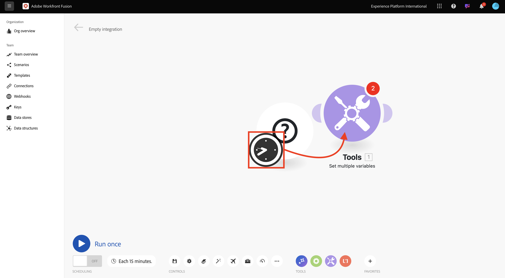
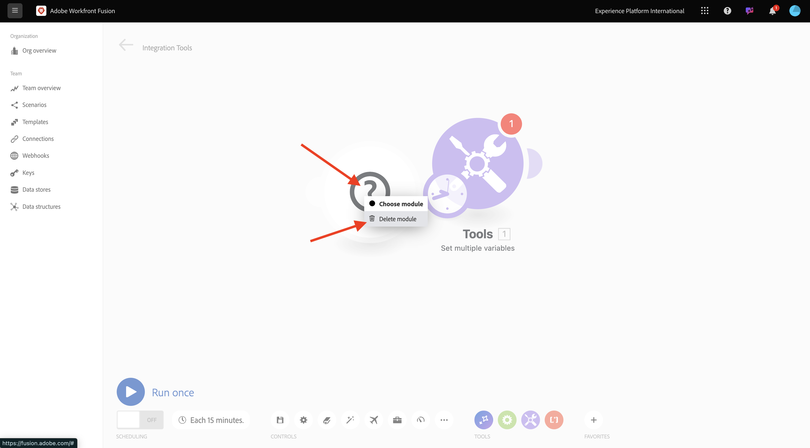
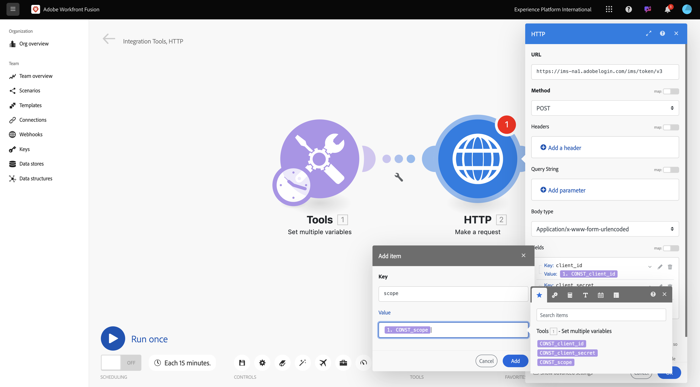

# 1.2.1 Prise en main de Workfront Fusion

Découvrez comment utiliser Workfront Fusion et Adobe I/O pour interroger les API Adobe Firefly Services.

## 1.2.1.1 Créer un nouveau scénario

Accédez à [https://experience.adobe.com/](https://experience.adobe.com/){target="_blank"}. Ouvrez **Workfront Fusion**.

Accédez à **Scénarios**.

Cliquez sur l’icône **+** créer un dossier pour votre travail.

Nommez le dossier `--aepUserLdap--` et sélectionnez **Enregistrer**.

Sélectionnez votre dossier, puis sélectionnez **Créer un scénario**.

Un scénario vide s’affiche, sélectionnez **outils** puis **Définir plusieurs variables**.

Déplacez l’icône **horloge** sur le nouveau composant **Définir plusieurs variables**.

Votre écran devrait ressembler à ceci.

Cliquez avec le bouton droit sur le point d’interrogation et sélectionnez **Supprimer le module**.

Cliquez ensuite avec le bouton droit de la souris sur **Définir plusieurs variables** et sélectionnez **Paramètres**.

## 1.2.1.2 Configurer l’authentification Adobe I/O

Vous devez maintenant configurer les variables nécessaires pour l’authentification sur Adobe I/O. Dans l’exercice précédent, vous avez créé un projet Adobe I/O. Les variables de ce projet Adobe I/O doivent maintenant être définies dans Workfront Fusion.

Les variables suivantes doivent être définies :

| Clé | Valeur |
|:-------------:| :---------------:| 
| `CONST_client_id` | votre identifiant client de projet Adobe I/O ; |
| `CONST_client_secret` | votre secret client de projet Adobe I/O |
| `CONST_scope` | la portée de votre projet Adobe I/O ; |

Recherchez ces variables en accédant à [https://developer.adobe.com/console/projects](https://developer.adobe.com/console/projects){target="_blank"} et en ouvrant votre projet Adobe I/O nommé `--aepUserLdap-- One Adobe tutorial`.

Dans votre projet, sélectionnez **Serveur OAuth** pour afficher les valeurs des clés ci-dessus.

À l’aide des clés et valeurs ci-dessus, vous pouvez configurer l’objet **Définir plusieurs variables**. Sélectionnez **Ajouter un élément**.

Saisissez le **Nom de la variable** : **CONST_client_id** et sa **Valeur de la variable**, puis sélectionnez **Ajouter**.

Sélectionnez **Ajouter un élément**.

Saisissez **Nom de la variable** : **CONST_client_secret** et sa **Valeur de la variable**, sélectionnez **Ajouter**.

Sélectionnez **Ajouter un élément**.

Saisissez **Nom de la variable** : **CONST_scope** et sa **Valeur de la variable**, sélectionnez **Ajouter**.

Sélectionnez **OK**.

Pointez sur **Définir plusieurs variables** et sélectionnez la grande icône **+** pour ajouter un autre module.

Votre écran devrait ressembler à ceci.

Dans la barre de recherche, saisissez **http**. Sélectionnez **HTTP** pour l’ouvrir.

Sélectionnez **Effectuer une requête**.

| Clé | Valeur |
|:-------------:| :---------------:| 
| `URL` | `https://ims-na1.adobelogin.com/ims/token/v3` |
| `Method` | `POST` |
| `Body Type` | `x-www-form-urlencoded` |

Sélectionnez **Ajouter un élément**.

Ajoutez des éléments pour chacune des valeurs ci-dessous :

| Clé | Valeur |
|:-------------:| :---------------:| 
| `client_id` | votre variable prédéfinie pour `CONST_client_id` |
| `client_secret` | votre variable prédéfinie pour `CONST_client_secret` |
| `scope` | votre variable prédéfinie pour `CONST_scope` |
| `grant_type` | `client_credentials` |

Configuration pour `client_id` :

Configuration pour `client_secret`.

Configuration pour `scope`.

Configuration pour `grant_type`.

Faites défiler vers le bas et cochez la case **Analyse de la réponse**. Sélectionnez **OK**.

Votre écran devrait ressembler à ceci. Sélectionnez **Exécuter une fois**.

Une fois le scénario exécuté, l’écran doit se présenter comme suit :

Sélectionnez l’icône **point d’interrogation** sur l’objet **Définir plusieurs variables** pour voir ce qui s’est passé lorsque cet objet s’est exécuté.

Sélectionnez l’icône **point d’interrogation** sur l’objet **HTTP - Effectuer une requête** pour voir ce qui s’est passé lorsque cet objet s’est exécuté. Dans le **OUTPUT**, consultez le **access_token** renvoyé par Adobe I/O.

Pointez sur **HTTP - Effectuez une requête** puis sélectionnez l’icône **+** pour ajouter un autre module.

Dans la barre de recherche, recherchez `tools`. Sélectionnez **Outils**.

Sélectionnez **Définir plusieurs variables**.

Sélectionnez **Ajouter un élément**.

Définissez **Nom de la variable** sur `bearer_token`. Sélectionnez `access_token` comme **valeur de variable** dynamique. Sélectionnez **Ajouter**.

Votre écran devrait ressembler à ceci. Sélectionnez **OK**.

Sélectionnez **Exécuter une fois** à nouveau.

Une fois le scénario exécuté, sélectionnez l’icône **point d’interrogation** sur le dernier objet **Définir plusieurs variables**. Vous devriez voir que le jeton access_token est stocké dans la variable `bearer_token`.

Cliquez ensuite avec le bouton droit de la souris sur le premier objet **Définir plusieurs valeurs** et sélectionnez **Renommer**.

Définissez le nom sur **Initialiser les constantes**. Sélectionnez **OK**.

Renommez le second objet en **Authentifier sur Adobe I/O**. Sélectionnez **OK**.

Renommez le troisième objet en **Définir le jeton du porteur**. Sélectionnez **OK**.

Votre écran doit ressembler à ceci :

Ensuite, remplacez le nom de votre scénario par `--aepUserLdap-- - Adobe I/O Authentication`.

Sélectionnez **Enregistrer**.

## Étapes suivantes

Accédez à [&#x200B; Utilisation des API Adobe dans Workfront Fusion &#x200B;](./ex2.md){target="_blank"}

Revenez à l’automatisation des workflows Creative [avec Workfront Fusion](./automation.md){target="_blank"}

Revenir à [Tous les modules](./../../../overview.md){target="_blank"}
