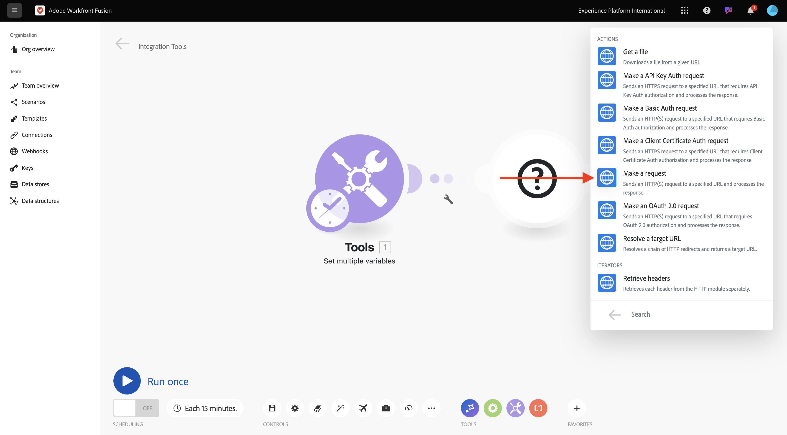
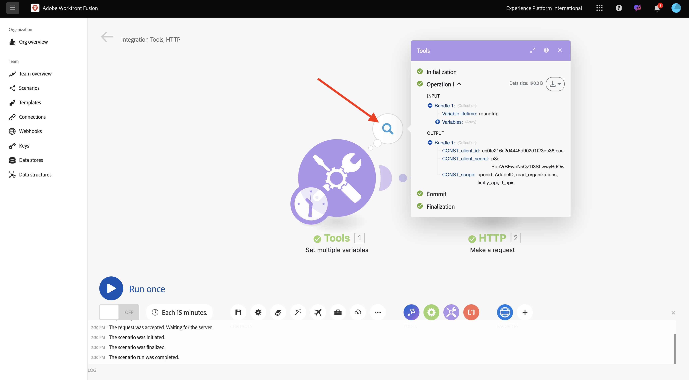
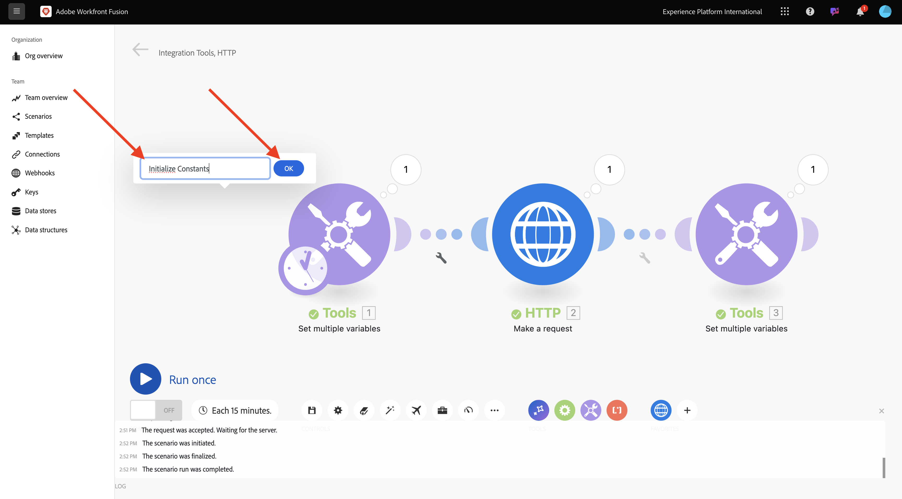

# 1.2.1 Prise en main de Workfront Fusion

Découvrez comment utiliser Workfront Fusion et Adobe I/O pour interroger les API des services Adobe Firefly.

## 1.2.1.1 Créer un nouveau scénario

1. Accédez à [https://experience.adobe.com/](https://experience.adobe.com/). Ouvrez **Workfront Fusion**.

   

1. Accédez à **Scénarios**.

   

1. Sélectionnez **Créer un scénario**.

   

1. Nommez le dossier `--aepUserLdap--` et sélectionnez **Enregistrer**.

   

1. Sélectionnez votre dossier, puis sélectionnez **Créer un scénario**.

   

1. Un scénario vide s’affiche, sélectionnez **outils** puis **Définir plusieurs variables**.

   

1. Déplacez l’icône **horloge** sur le nouveau composant **Définir plusieurs variables**.

   

   Votre écran devrait ressembler à ceci.

   

1. Cliquez avec le bouton droit sur le point d’interrogation et sélectionnez **Supprimer le module**.

   

1. Cliquez ensuite avec le bouton droit de la souris sur **Définir plusieurs variables** et sélectionnez **Paramètres**.

   

## 1.2.1.2 Configurer l’authentification Adobe I/O

Vous devez maintenant configurer les variables nécessaires pour l’authentification sur Adobe I/O. Dans l’exercice précédent, vous avez créé un projet Adobe I/O. Les variables de ce projet Adobe I/O doivent maintenant être définies dans Workfront Fusion.

Les variables suivantes doivent être définies :

| Clé | Valeur |
|:-------------:| :---------------:| 
| `CONST_client_id` | votre identifiant client de projet Adobe I/O ; |
| `CONST_client_secret` | votre secret client de projet Adobe I/O |
| `CONST_scope` | la portée de votre projet Adobe I/O ; |

1. Recherchez ces variables en accédant à [https://developer.adobe.com/console/projects](https://developer.adobe.com/console/projects) et en ouvrant votre projet Adobe I/O nommé `--aepUserLdap-- Firefly`.

   

1. Dans votre projet, sélectionnez **Serveur OAuth** pour afficher les valeurs des clés ci-dessus.

   

1. À l’aide des clés et valeurs ci-dessus, vous pouvez configurer l’objet **Définir plusieurs variables**. Sélectionnez **Ajouter un élément**.

   

1. Saisissez le **Nom de la variable** : **CONST_client_id** et sa **Valeur de la variable**, puis sélectionnez **Ajouter**.

   

1. Sélectionnez **Ajouter un élément**.

   

1. Saisissez **Nom de la variable** : **CONST_client_secret** et sa **Valeur de la variable**, sélectionnez **Ajouter**.

   

1. Sélectionnez **Ajouter un élément**.

   

1. Saisissez **Nom de la variable** : **CONST_scope** et sa **Valeur de la variable**, sélectionnez **Ajouter**.

   

1. Sélectionnez **OK**.

   

1. Pointez sur **Définir plusieurs variables** et sélectionnez la grande icône **+** pour ajouter un autre module.

   

   Votre écran devrait ressembler à ceci.

   

1. Dans la barre de recherche, saisissez **http**. Sélectionnez **HTTP** pour l’ouvrir.

   

1. Sélectionnez **Effectuer une requête**.

   

   | Clé | Valeur |
   |:-------------:| :---------------:| 
   | `URL` | `https://ims-na1.adobelogin.com/ims/token/v3` |
   | `Method` | `POST` |
   | `Body Type` | `x-www-form-urlencoded` |

1. Sélectionnez **Ajouter un élément**.

   

1. Ajoutez des éléments pour chacune des valeurs ci-dessous :

   | Clé | Valeur |
   |:-------------:| :---------------:| 
   | `client_id` | votre variable prédéfinie pour `CONST_client_id` |
   | `client_secret` | votre variable prédéfinie pour `CONST_client_secret` |
   | `scope` | votre variable prédéfinie pour `CONST_scope` |
   | `grant_type` | `client_credentials` |

1. Configuration pour `client_id` :

   

1. Configuration pour `client_secret`.

   

1. Configuration pour `scope`.

   

1. Configuration pour `grant_type`.

   

1. Faites défiler vers le bas et cochez la case **Analyse de la réponse**. Sélectionnez **OK**.

   

1. Votre écran devrait ressembler à ceci. Sélectionnez **Exécuter une fois**.

   

   Une fois le scénario exécuté, l’écran doit se présenter comme suit :

   

1. Sélectionnez l’icône **point d’interrogation** sur l’objet **Définir plusieurs variables** pour voir ce qui s’est passé lorsque cet objet s’est exécuté.

   

1. Sélectionnez l’icône **point d’interrogation** sur l’objet **HTTP - Effectuer une requête** pour voir ce qui s’est passé lorsque cet objet s’est exécuté. Dans le **OUTPUT**, consultez le **access_token** renvoyé par Adobe I/O.

   

1. Pointez sur **HTTP - Effectuez une requête** puis sélectionnez l’icône **+** pour ajouter un autre module.

   

1. Dans la barre de recherche, recherchez `tools`. Sélectionnez **Outils**.

   

1. Sélectionnez **Définir plusieurs variables**.

   

1. Sélectionnez **Ajouter un élément**.

   

1. Définissez **Nom de la variable** sur `bearer_token`. Sélectionnez `access_token` comme **valeur de variable** dynamique. Sélectionnez **Ajouter**.

   

1. Votre écran devrait ressembler à ceci. Sélectionnez **OK**.

   

1. Sélectionnez **Exécuter une fois** à nouveau.

   

1. Une fois le scénario exécuté, sélectionnez l’icône **point d’interrogation** sur le dernier objet **Définir plusieurs variables**. Vous devriez voir que le jeton access_token est stocké dans la variable `bearer_token`.

   

1. Cliquez ensuite avec le bouton droit de la souris sur le premier objet **Définir plusieurs valeurs** et sélectionnez **Renommer**.

   

1. Définissez le nom sur **Initialiser les constantes**. Sélectionnez **OK**.

   

1. Renommez le second objet en **Authentifier sur Adobe I/O**. Sélectionnez **OK**.

   

1. Renommez le troisième objet en **Définir le jeton du porteur**. Sélectionnez **OK**.

   

   Votre écran doit ressembler à ceci :

   

1. Ensuite, remplacez le nom de votre scénario par `--aepUSerLdap-- - Adobe I/O Authentication`.

   

1. Sélectionnez **Enregistrer**.

   

## Étapes suivantes

Accédez à [ Utilisation des API Adobe dans Workfront Fusion ](./ex2.md){target="_blank"}

Revenez à [Automatisation des services Adobe Firefly](./automation.md){target="_blank"}.

Revenir à [Tous les modules](./../../../overview.md){target="_blank"}
