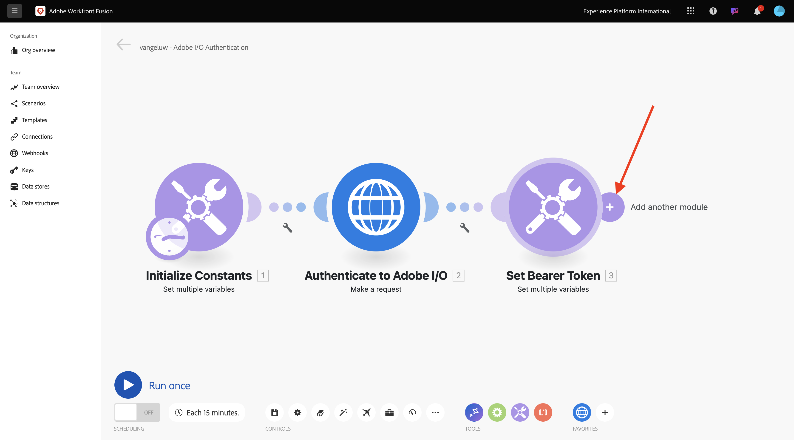
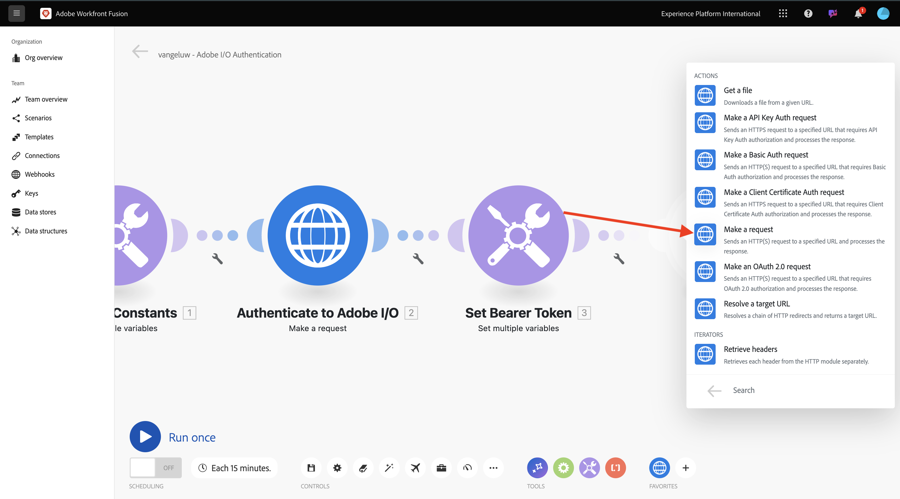
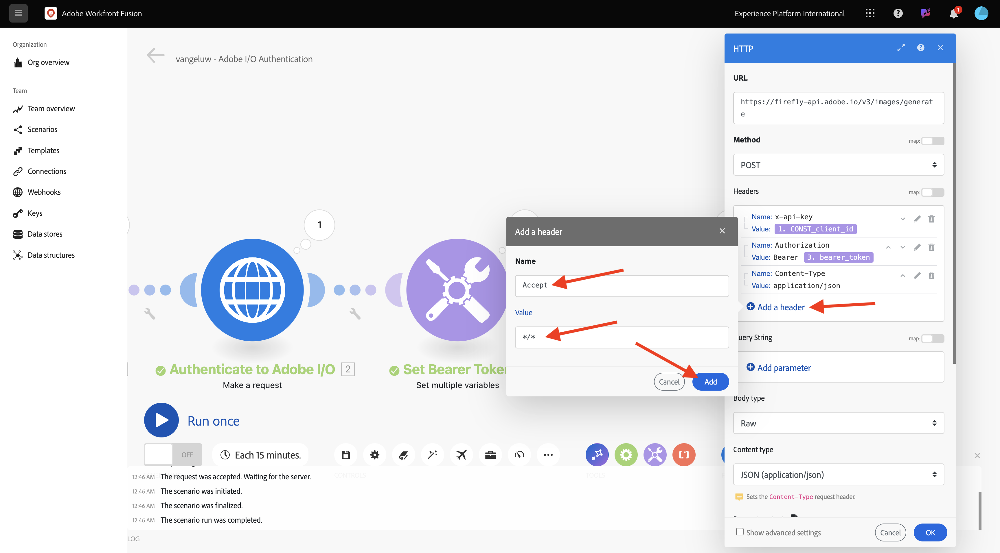
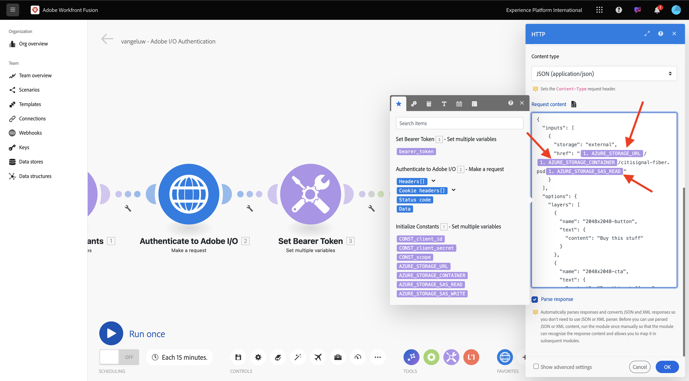
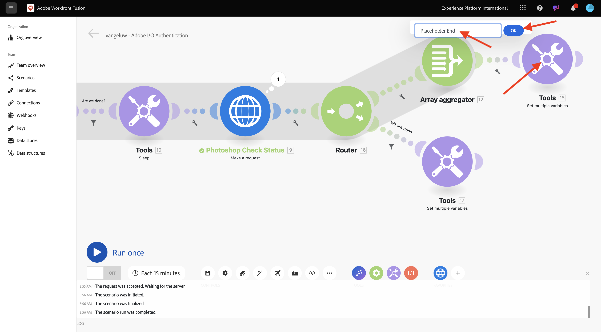

# 1.2.2 Utilisation des API Adobe dans Workfront Fusion

Découvrez comment utiliser les API Adobe dans Workfront Fusion.

## 1.2.2.1 utiliser l’API Firefly Text To Image avec Workfront Fusion

Pointez sur le deuxième nœud **Définir plusieurs variables** et sélectionnez **+** pour ajouter un autre module.



Recherchez **http** et sélectionnez **HTTP**.


Sélectionnez **Effectuer une requête**.



Sélectionnez les variables suivantes :

- **URL** : `https://firefly-api.adobe.io/v3/images/generate`
- **Méthode** : `POST`

Sélectionnez **Ajouter un en-tête**.


Saisissez les en-têtes suivants :

| Clé | Valeur |
|:-------------:| :---------------:| 
| `x-api-key` | votre variable stockée pour `CONST_client_id` |
| `Authorization` | `Bearer ` + votre variable stockée pour `bearer_token` |
| `Content-Type` | `application/json` |
| `Accept` | `*/*` |

Saisissez les détails de la `x-api-key`. Sélectionnez **Ajouter**.


Sélectionnez **Ajouter un en-tête**.


Saisissez les détails de `Authorization`. Sélectionnez **Ajouter**.


Sélectionnez **Ajouter un en-tête**. Saisissez les détails de la `Content-Type`. Sélectionnez **Ajouter**.


Sélectionnez **Ajouter un en-tête**. Saisissez les détails de la `Accept`. Sélectionnez **Ajouter**.



Définissez le type **de** corps sur **Raw**. Pour **Type de** contenu, sélectionnez **JSON (application/json).**


Collez cette payload dans le champ **Demander le contenu**.

```json
{
	"numVariations": 1,
	"size": {
		"width": 2048,
      "height": 2048
    },
    "prompt": "Horses in a field",
    "promptBiasingLocaleCode": "en-US"
}
```

Cochez la case Analyse **de la réponse**. Sélectionnez **OK.**


Sélectionnez **Exécuter une fois**.


Votre écran devrait ressembler à ceci.


Sélectionner le **?** l’icône sur le quatrième nœud, HTTP, pour afficher la réponse. Vous devriez voir un fichier image dans la réponse.


Copiez l’URL de l’image et ouvrez-la dans une fenêtre de navigateur. Votre écran doit ressembler à ceci :


Cliquez avec le bouton droit sur **HTTP** et renommez en **Firefly T2I**.


Sélectionnez **Enregistrer** pour enregistrer vos modifications.


## 1.2.2.2 utiliser l’API Photoshop avec Workfront Fusion

Sélectionnez **clé à molette** entre les nœuds **Définir le jeton du porteur** et **Firefly T2I**. Sélectionnez **Ajouter un routeur**.


Faites un clic droit sur l’objet **Firefly T2I** et sélectionnez **Cloner**.


Faites glisser et déposez l’objet cloné à proximité de l’objet **Router** qui se connecte automatiquement au **Router**. Votre écran doit ressembler à ceci :


Vous disposez désormais d’une copie identique basée sur la requête HTTP T2I **&#x200B;**&#x200B;Firefly. Certains des paramètres de la requête HTTP T2I **&#x200B;**&#x200B;Firefly sont similaires à ce dont vous avez besoin pour interagir avec l’API **Photoshop**, ce qui vous permet de gagner du temps. Désormais, il vous suffit de modifier les variables qui ne sont pas les mêmes, comme l’URL de requête et la payload.

Remplacez **URL** par `https://image.adobe.io/pie/psdService/text`.


Remplacez **Demander du contenu** par la payload ci-dessous :

```json
  {
    "inputs": [
      {
        "storage": "external",
        "href": "{{AZURE_STORAGE_URL}}/{{AZURE_STORAGE_CONTAINER}}/citisignal-fiber.psd{{AZURE_STORAGE_SAS_READ}}"
      }
    ],
    "options": {
      "layers": [
        {
          "name": "2048x2048-button-text",
          "text": {
            "content": "Click here"
          }
        },
        {
          "name": "2048x2048-cta",
          "text": {
            "content": "Buy this stuff"
          }
        }
      ]
    },
    "outputs": [
      {
        "storage": "azure",
        "href": "{{AZURE_STORAGE_URL}}/{{AZURE_STORAGE_CONTAINER}}/citisignal-fiber-changed-text.psd{{AZURE_STORAGE_SAS_WRITE}}",
        "type": "vnd.adobe.photoshop",
        "overwrite": true
      }
    ]
  }
```


Pour que ce **Demander du contenu** fonctionne correctement, certaines variables sont manquantes :

- `AZURE_STORAGE_URL`
- `AZURE_STORAGE_CONTAINER`
- `AZURE_STORAGE_SAS_READ`
- `AZURE_STORAGE_SAS_WRITE`

Revenez à votre premier nœud, sélectionnez **Initialiser les constantes** puis choisissez **Ajouter un élément** pour chacune de ces variables.


| Clé | Exemple de valeur |
|:-------------:| :---------------:| 
| `AZURE_STORAGE_URL` | `https://vangeluw.blob.core.windows.net` |
| `AZURE_STORAGE_CONTAINER` | `vangeluw` |
| `AZURE_STORAGE_SAS_READ` | `?sv=2023-01-03&st=2025-01-13T07%3A36%3A35Z&se=2026-01-14T07%3A36%3A00Z&sr=c&sp=rl&sig=4r%2FcSJLlt%2BSt9HdFdN0VzWURxRK6UqhB8TEvbWkmAag%3D` |
| `AZURE_STORAGE_SAS_WRITE` | `?sv=2023-01-03&st=2025-01-13T17%3A21%3A09Z&se=2025-01-14T17%3A21%3A09Z&sr=c&sp=racwl&sig=FD4m0YyyqUj%2B5T8YyTFJDi55RiTDC9xKtLTgW0CShps%3D` |

Vous pouvez retrouver vos variables en revenant à Postman, puis en ouvrant votre **Variables d’environnement**.


Copiez ces valeurs dans Workfront Fusion et ajoutez un nouvel élément pour chacune de ces 4 variables.

Votre écran devrait ressembler à ceci. Sélectionnez **OK**.


Ensuite, revenez à la requête HTTP clonée pour mettre à jour le **contenu de la requête**. Notez les variables noires dans la **Demander du contenu**, qui sont les variables que vous avez copiées à partir de Postman. Vous devez passer aux variables que vous venez de définir dans Workfront Fusion. Remplacez chaque variable une par une en supprimant le texte noir et en le remplaçant par la variable correcte.


Effectuez ces 3 modifications dans la section **entrées**. Sélectionnez **OK**.



Apportez ces 3 modifications dans la **section des sorties** . Sélectionnez **OK**.


Cliquez avec le bouton droit sur le nœud cloné et choisissez **Renommer**. Remplacez le nom par **Photoshop Modifier le texte**.


Votre écran doit ressembler à ceci :


Sélectionnez **Exécuter une fois**.


Sélectionnez l’icône **de recherche** dans le nœud Photoshop Modifier le  **texte** pour afficher la réponse. Vous devriez avoir une réponse qui ressemble à ceci, avec un lien vers un fichier d’état.


Avant de poursuivre les interactions d’API Photoshop, désactivez l’itinéraire vers le **nœud Firefly T2I** pour ne pas envoyer d’appels d’API inutiles à ce point de terminaison d’API. Sélectionnez l’icône **clé à molette**, puis sélectionnez **Désactiver l’itinéraire**.


Votre écran doit ressembler à celui-ci :


Ajoutez ensuite un autre nœud **Définir plusieurs variables**.


Placez-le après le nœud **Texte de modification de Photoshop**.


Sélectionnez le nœud **Définir plusieurs variables**, puis sélectionnez **Ajouter un élément**. Sélectionnez la valeur de la variable dans la réponse de la requête précédente.

| Nom de la variable | Valeur de variable |
|:-------------:| :---------------:| 
| `psdStatusUrl` | `data > _links > self > href` |

Sélectionnez **Ajouter**.


Sélectionnez **OK**.


Cliquez avec le bouton droit sur le nœud **Modifier le texte de Photoshop** et sélectionnez **Cloner**.


Faites glisser la requête HTTP clonée après le nœud **Définir plusieurs variables** que vous venez de créer.


Cliquez avec le bouton droit sur la requête HTTP clonée, sélectionnez **Renommer** et remplacez le nom par **Statut de vérification de Photoshop**.


Sélectionnez pour ouvrir la requête HTTP. Modifiez l’URL afin qu’elle référence la variable que vous avez créée à l’étape précédente, puis définissez la **Méthode** sur **GET**.


Supprimez le **Corps** en sélectionnant l’option vide.


Sélectionnez **OK**.


Sélectionnez **Exécuter une fois**.


Une réponse contenant le champ **statut**, avec le statut défini sur **en cours** s’affiche. Photoshop a besoin de quelques secondes pour terminer le processus.


Maintenant que vous savez que la réponse a besoin d’un peu plus de temps pour être terminée, il peut être judicieux d’ajouter un minuteur devant cette requête HTTP afin qu’elle ne s’exécute pas immédiatement.

Sélectionnez le nœud **Outils**, puis sélectionnez **Veille**.


Placez le nœud **Sleep** entre **Set multiple variables** et **Photoshop Check Status**. Définissez le paramètre **Délai** sur **5 secondes**. Sélectionnez **OK**.


Votre écran devrait ressembler à ceci. Le problème avec la configuration ci-dessous est que 5 secondes d’attente peuvent être suffisantes, mais peut-être pas suffisantes. En réalité, il serait préférable d’avoir une solution plus intelligente comme une boucle do...while qui vérifie l’état toutes les 5 secondes jusqu’à ce que l’état soit égal à **réussi**. Vous pouvez donc mettre en œuvre une telle tactique dans les étapes suivantes.


Sélectionnez l’icône **clé à molette** entre **Définir plusieurs variables** et **Mettre en veille**. Sélectionnez **Ajouter un module**.


Recherchez `flow` puis sélectionnez **Contrôle de flux**.


Sélectionnez **Répéteur**.


Définissez **les répétitions** sur **20**. Sélectionnez **OK**.


Ensuite, sélectionnez **+** sur le Photoshop vérifier l’état **&#x200B;**&#x200B;pour ajouter un autre module.


Recherchez **flow** et sélectionnez **Flow Control**.


Sélectionnez **Agrégateur de tableaux**.


Définissez **Module Source** sur **Répéteur**. Sélectionnez **OK**.


Votre écran doit ressembler à ceci :


Sélectionnez l’icône **clé à molette** puis **Ajouter un module**.


Recherchez **outils** et sélectionnez **Outils**.


Sélectionnez **Obtenir plusieurs variables**.


Sélectionnez **+ Ajouter un élément** puis définissez le **Nom de variable** sur `done`.


Sélectionnez **OK**.


Sélectionnez le nœud **Définir plusieurs variables** que vous avez configuré précédemment. Pour initialiser la variable **done**, vous devez la définir sur `false` ici. Sélectionnez **+ Ajouter un élément**.


Utilisez `done` pour le **Nom de la variable**

Pour définir le statut, une valeur booléenne est nécessaire. Pour trouver la valeur booléenne, sélectionnez **engrenage** puis sélectionnez `false`. Sélectionnez **Ajouter**.


Sélectionnez **OK**.


Sélectionnez ensuite l’icône **clé à molette** après le nœud **Obtenir plusieurs variables** que vous avez configuré.


Sélectionnez **Configurer un filtre**. Vous devez maintenant vérifier la valeur de la variable **done**. Si cette valeur est définie sur **false**, la partie suivante de la boucle doit être exécutée. Si la valeur est définie sur **true**, cela signifie que le processus s’est déjà terminé avec succès, de sorte qu’il n’est pas nécessaire de poursuivre avec la partie suivante de la boucle.


Pour l’étiquette, utilisez **Avons-nous terminé ?**. Définissez la **Condition** à l’aide de la variable déjà existante **done**, l’opérateur doit être défini sur **Égal à** et la valeur doit être la variable booléenne `false`. Sélectionnez **OK**.


Ensuite, faites de l’espace entre les nœuds **Statut de vérification de Photoshop** et **Agrégateur de tableau**. Sélectionnez ensuite l’icône **clé à molette** et sélectionnez **Ajouter un routeur**. Vous effectuez cette opération, car après avoir vérifié le statut du fichier Photoshop, il doit y avoir 2 chemins d’accès. Si le statut est `succeeded`, la variable de **done** doit être définie sur `true`. Si le statut n’est pas égal à `succeeded`, la boucle doit continuer. Le routeur va permettre de vérifier et de régler cela.


Après avoir ajouté le routeur, sélectionnez l’icône **clé à molette** et sélectionnez **Configurer un filtre**.


Pour l’étiquette, utilisez **Nous avons terminé**. Définissez la **Condition** à l’aide de la réponse du nœud **Statut de la vérification Photoshop** en choisissant le champ de réponse **data.output[].status**. L’opérateur doit être défini sur **Égal à** et la valeur doit être `succeeded`. Sélectionnez **OK**.


Sélectionnez ensuite le nœud vide avec le point d’interrogation et recherchez **outils**. Sélectionnez ensuite **Outils**.


Sélectionnez **Définir plusieurs variables**.


Lorsque cette branche du routeur est utilisée, cela signifie que le statut de la création du fichier Photoshop est terminé avec succès. Cela signifie que la boucle do...while n’a plus besoin de continuer à vérifier le statut dans Photoshop. Vous devez donc définir la variable `done` sur `true`.

Pour le **Nom de variable**, utilisez `done`.

Pour la **Valeur de variable**, vous devez utiliser la valeur booléenne `true`. Sélectionnez l’icône **engrenage** puis sélectionnez `true`. Sélectionnez **Ajouter**.


Sélectionnez **OK**.


Cliquez ensuite avec le bouton droit sur le nœud **Définir plusieurs variables** que vous venez de créer et sélectionnez **Cloner**.


Faites glisser le nœud cloné afin qu’il se connecte à l’**agrégateur de tableau**. Cliquez ensuite avec le bouton droit sur le nœud et sélectionnez **Renommer**, puis remplacez le nom par `Placeholder End`.



Supprimez la variable existante et sélectionnez **+ Ajouter un élément**. Pour l’**Nom de variable**, utilisez `placeholder`. Pour l’**Valeur de variable**, utilisez `end`. Sélectionnez **Ajouter** puis sélectionnez **OK**.


Sélectionnez **Enregistrer** pour enregistrer votre scénario. Sélectionnez ensuite   **Exécuter une fois**.


Votre scénario est ensuite exécuté et doit se terminer correctement. Notez que la boucle do...while que vous avez configurée fonctionne correctement. Dans l’exécution ci-dessous, vous pouvez constater que le **Répéteur** s’est exécuté 20 fois en fonction de la bulle sur le nœud **Outils > Obtenir plusieurs variables**. Après ce nœud, vous avez configuré un filtre qui vérifiait le statut et les nœuds suivants ont été exécutés uniquement si le statut n’était pas égal à **réussi**. Dans cette exécution, la partie suivant le filtre ne s’est exécutée qu’une seule fois, car le statut était déjà **réussi** lors de la première exécution.


Vous pouvez vérifier le statut de la création de votre nouveau fichier Photoshop en cliquant sur la bulle dans la requête HTTP **Vérification du statut de Photoshop** et en accédant au champ **statut**.


Vous avez maintenant configuré la version de base d’un scénario répétable qui automatise un certain nombre d’étapes. Dans l’exercice suivant, vous allez en reparler en ajoutant de la complexité.

## Étapes suivantes

Accédez à [&#x200B; Automatisation des processus avec Workfront Fusion &#x200B;](./ex3.md){target="_blank"}

Revenez à l’automatisation des workflows Creative [avec Workfront Fusion](./automation.md){target="_blank"}

Revenir à [Tous les modules](./../../../overview.md){target="_blank"}
