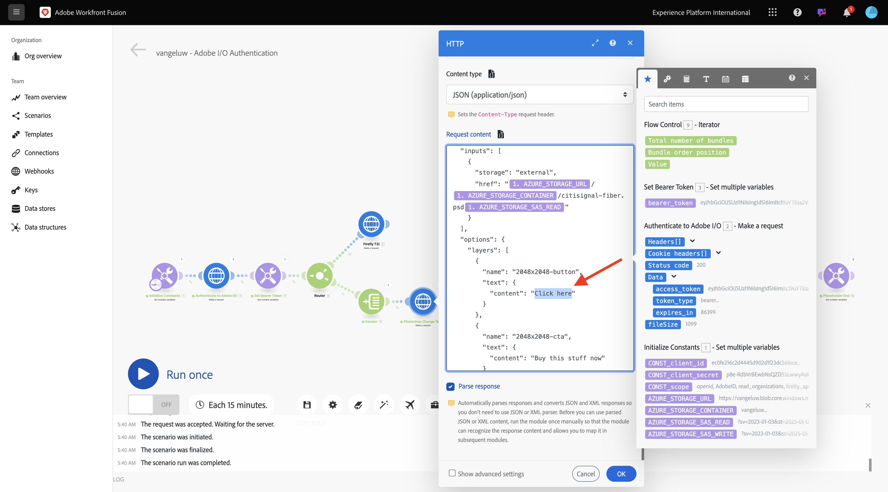
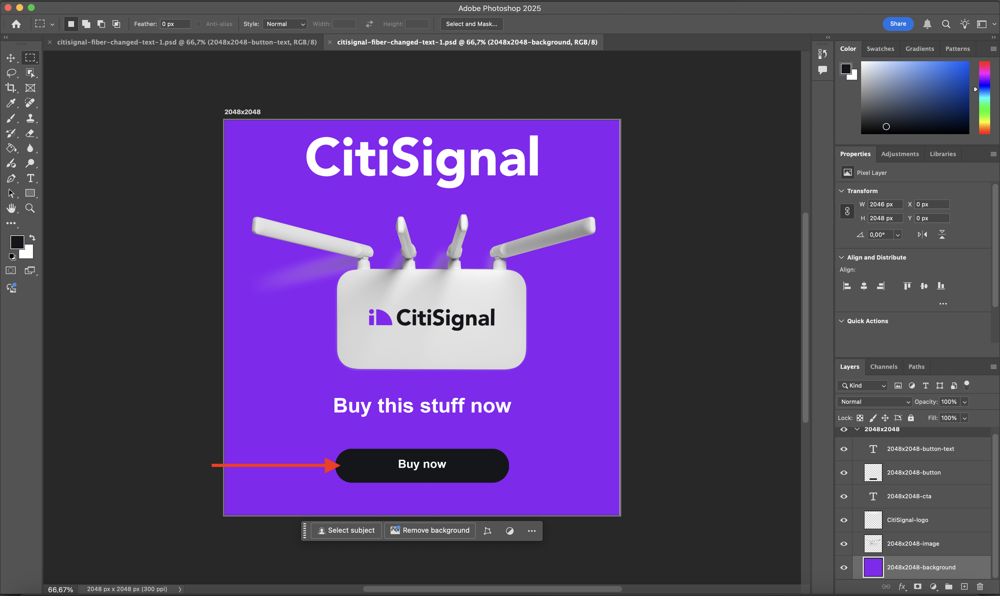
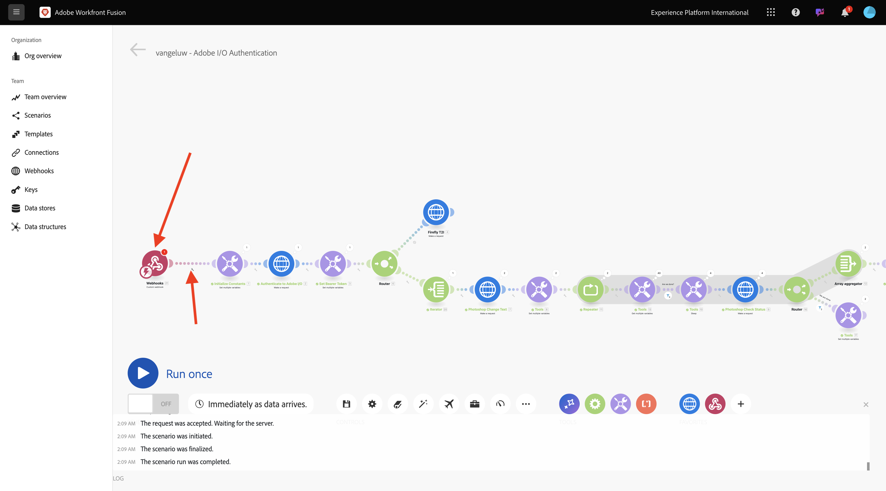

# 1.2.3 Automatisation des processus avec Workfront Fusion

Découvrez comment automatiser les processus avec Workfront Fusion.

## 1.2.3.1 Itération sur plusieurs valeurs

Votre scénario doit se présenter comme suit :


Jusqu’à présent, vous avez modifié le texte d’un fichier Photoshop par une valeur statique. Pour mettre à l’échelle et automatiser vos workflows de création de contenu, il est nécessaire d’effectuer une itération sur une liste de valeurs et d’insérer ces valeurs de manière dynamique dans le fichier Photoshop. Dans les étapes suivantes, vous allez ajouter une méthode pour effectuer une itération sur les valeurs de votre scénario existant.

Entre le nœud **Router** et le nœud **Photoshop Change Text**, sélectionnez l’icône **clé à molette** et sélectionnez **Ajouter un module**.


Recherchez `flow` et sélectionnez **Contrôle de flux**.


Sélectionnez **Itérateur**.


Votre écran doit ressembler à ceci :


Bien qu’il soit possible de lire des fichiers d’entrée tels que des fichiers CSV, vous devez pour l’instant utiliser une version de base d’un fichier CSV en définissant une chaîne de texte et en divisant ce fichier texte.

Vous pouvez trouver la fonction **split** en sélectionnant l’icône **T**, où vous pouvez voir toutes les fonctions disponibles pour manipuler les valeurs de texte. Sélectionnez la fonction **split**, vous devriez voir ceci.


La fonction split exige un tableau de valeurs avant le point-virgule et exige que vous spécifiiez le séparateur après le point-virgule. Pour ce test, vous devez utiliser un tableau simple avec 2 champs, **Acheter maintenant** et **Cliquer ici**, et le séparateur à utiliser est **,**.

Saisissez cette valeur dans le champ **Tableau** en remplaçant la fonction **split** actuellement vide : `{{split("Buy now, Click here "; ",")}}`. Sélectionnez **OK**.


Sélectionnez **Photoshop Modifier le texte** pour ajouter des variables au lieu de valeurs statiques pour les champs d’entrée et de sortie.


Dans **Demander le contenu**, le texte est-il **Cliquez ici**. Ce texte doit être remplacé par les valeurs provenant de votre tableau .



Supprimez le texte **Cliquez ici**, puis remplacez-le en sélectionnant la variable **Valeur** dans le nœud **Itérateur**. Cela permet de s’assurer que le texte du bouton dans votre document Photoshop est mis à jour de manière dynamique.


Vous devez également mettre à jour le nom du fichier utilisé pour écrire le fichier dans votre compte de stockage Azure. Si le nom de fichier est statique, chaque nouvelle itération remplace simplement le fichier précédent et perd donc les fichiers personnalisés. Le nom de fichier statique actuel est **citisignal-fibre-changed-text.psd** et vous devez maintenant le mettre à jour.

Placez le curseur derrière le mot `text`.


Tout d’abord, ajoutez un trait d’`-`, puis sélectionnez la valeur **Position de l’ordre du lot**. Cela permet de s’assurer que pour la première itération, Workfront Fusion ajoute des `-1` au nom du fichier, pour la deuxième itération `-2` et ainsi de suite. Sélectionnez **OK**.


Enregistrez votre scénario, puis sélectionnez **Exécuter une fois**.


Une fois le scénario exécuté, revenez à votre Explorateur de stockage Azure et actualisez le dossier . Vous devriez alors voir les 2 fichiers nouvellement créés.


Téléchargez et ouvrez chaque fichier. Vous devriez différents textes sur les boutons. Il s’agit du fichier `citisignal-fiber-changed-text-1.psd`.



Il s’agit du fichier `citisignal-fiber-changed-text-2.psd`.


## 1.2.3.2 Activer le scénario à l’aide d’un webhook

Jusqu’à présent, vous avez exécuté votre scénario manuellement pour le tester. Mettons maintenant à jour votre scénario avec un webhook, afin qu’il puisse être activé à partir d’un environnement externe.

Sélectionnez **+**, recherchez **webhook** puis sélectionnez **Webhooks**.


Sélectionnez **Webhook personnalisé**.

Faites glisser et connectez le nœud **Custom webhook** afin qu’il se connecte au premier nœud de la zone de travail, appelé **Initialize Constants**.



Sélectionnez le nœud **Webhook personnalisé**. Sélectionnez ensuite **Ajouter**.


Définissez **nom du Webhook** sur `--aepUserLdap-- - Tutorial 1.2`.


Cochez la case **Obtenir les en-têtes de requête**. Sélectionnez **Enregistrer**.


Votre URL webhook est maintenant disponible. Copiez l’URL.


Ouvrez Postman et ajoutez un nouveau dossier dans la collection **FF - Firefly Services Tech Insiders**.


Nommez votre dossier `--aepUserLdap-- - Workfront Fusion`.


Dans le dossier que vous venez de créer, sélectionnez la **de 3 points...** et sélectionnez **Ajouter une requête**.


Définissez le **Type de méthode** sur **POST** et collez l’URL de votre webhook dans la barre d’adresse.


Vous devez envoyer un corps personnalisé, de sorte que les éléments de variable puissent être fournis d’une source externe à votre scénario Workfront Fusion.

Accédez à **Corps** et sélectionnez **brut**.


Collez le texte ci-dessous dans le corps de votre requête. Sélectionnez **Envoyer**.

```json
{
	"psdTemplate": "placeholder",
	"xlsFile": "placeholder"
}
```


De retour dans Workfront Fusion, un message s’affiche sur votre webhook personnalisé et indique : **Déterminé avec succès**.


Sélectionnez **Enregistrer** puis sélectionnez **Exécuter une fois**. Votre scénario est maintenant actif, mais ne s’exécutera pas tant que vous n’aurez pas sélectionné **Envoyer** à nouveau dans Postman.


Dans Postman, sélectionnez à nouveau **Envoyer**.


Votre scénario s’exécute à nouveau et crée les 2 fichiers comme avant.


Remplacez le nom de votre requête Postman par `POST - Send Request to Workfront Fusion Webhook`.


Vous devez maintenant commencer à utiliser la variable **psdTemplate**. Au lieu de coder en dur l’emplacement du fichier d’entrée dans le nœud **Texte de modification de Photoshop**, vous utiliserez la variable entrante de la requête Postman.

Ouvrez le nœud **Texte de modification de Photoshop** et accédez à **Demander du contenu**. Sélectionnez le nom de fichier codé en dur **citisignal-fibre.psd** sous **entrées** et supprimez-le.


Sélectionnez la variable **psdTemplate**. Sélectionnez **OK** puis enregistrez votre scénario.


Sélectionnez **ACTIVÉ** pour activer votre scénario. Votre scénario s’exécute maintenant sans arrêt.


De retour dans Postman, saisissez le `citisignal-fiber.psd` de nom de fichier comme valeur de la variable **psdTemplate** et sélectionnez **Envoyer** pour exécuter à nouveau votre scénario.


En spécifiant le modèle PSD en tant que variable fournie par un système externe, vous avez désormais créé un scénario réutilisable.

Vous avez maintenant terminé cet exercice.

## Étapes suivantes

Accédez à Automatisation [1.2.4 à l’aide de connecteurs](./ex4.md){target="_blank"}

Revenez à l’automatisation des workflows Creative [avec Workfront Fusion](./automation.md){target="_blank"}

Revenir à [Tous les modules](./../../../overview.md){target="_blank"}
