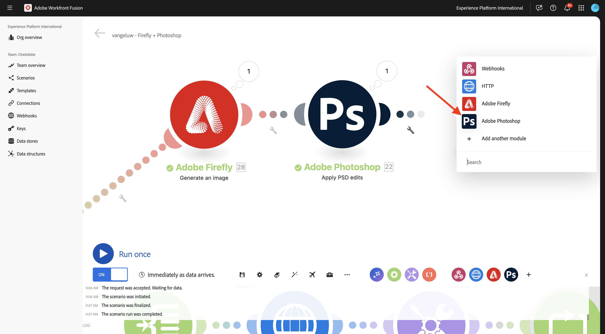

# 1.2.4 Automatisation à l&#39;aide de connecteurs

Vous allez maintenant commencer à utiliser les connecteurs prêts à l’emploi dans Workfront Fusion for Photoshop et vous allez connecter la requête Texte-2-Image de Firefly et les requêtes Photoshop dans un seul scénario.

## 1.2.4.1 Dupliquer et préparer votre scénario

Dans le menu de gauche, accédez à **Scénarios** et sélectionnez votre dossier `--aepUserLdap--`. Vous devriez ensuite voir le scénario que vous avez créé précédemment, qui est nommé `--aepUSerLdap-- - Adobe I/O Authentication`.


Cliquez sur la flèche pour ouvrir le menu déroulant et sélectionnez **Cloner**.


Définissez le **Nom** du scénario cloné sur `--aepUserLdap-- - Firefly + Photoshop` et sélectionnez l’équipe **cible** appropriée. Cliquez sur **Ajouter** pour ajouter un nouveau webhook.


Définissez le **nom du Webhook** sur `--aepUserLdap-- - Firefly + Photoshop Webhook`. Cliquez sur **Enregistrer**.


Vous devriez alors voir ceci. Cliquez sur **Enregistrer**.


Vous devriez alors voir ceci. Cliquez sur le nœud **Webhook**.


Cliquez sur **Copier l’adresse dans le presse-papiers** puis sur **Redéterminer la structure des données**.


Ouvrez Postman. Ajoutez une nouvelle requête dans le même dossier que celui que vous utilisiez auparavant.


Vérifiez que les paramètres suivants sont appliqués :

- Nom de la requête : `POST - Send Request to Workfront Fusion Webhook Firefly + Photoshop`
- Type de demande : `POST`
- URL de requête : collez l’URL que vous avez copiée à partir du webhook de votre scénario Workfront Fusion.

Accédez à **Body** et définissez **Body Type** sur **raw** - **JSON**. Collez la payload suivante dans le **corps**.

```json
{
    "psdTemplate": "citisignal-fiber.psd",
    "xlsFile": "placeholder",
    "prompt":"misty meadows",
    "cta": "Buy this now!",
    "button": "Click here to buy!"
}
```

Cette nouvelle payload garantit que toutes les informations de variable sont fournies depuis l’extérieur du scénario, au lieu d’être codées en dur dans le scénario. Dans un scénario d’entreprise, une organisation a besoin qu’un scénario soit défini de manière réutilisable, ce qui signifie qu’un certain nombre de variables doivent être fournies en tant que variables d’entrée au lieu d’être codées en dur dans le scénario.

Tu devrais avoir ça. Cliquez sur **Envoyer**.


Le webhook Workfront Fusion n’a pas encore été saisi.


Une fois que vous avez cliqué sur **Envoyer**, le message doit passer à **Déterminé avec succès**. Cliquez sur **OK**.


## 1.2.4.2 Mettre à jour le nœud T2I de Firefly

Cliquez sur le nœud **Firefly T2I**. Vous devriez alors voir ceci. L’invite de cette requête était auparavant codée en dur pour **chevaux dans un champ**. Vous allez maintenant supprimer ce texte codé en dur et le remplacer par un champ provenant du webhook.


Supprimez le texte **chevaux dans un champ** et remplacez-le par la variable **prompt** qui se trouve sous les variables **Webhook**. Cliquez sur **OK** pour enregistrer vos modifications.


## 1.2.4.2 Modifier l’arrière-plan du fichier PSD

Vous allez maintenant mettre à jour votre scénario pour le rendre plus intelligent en utilisant des connecteurs prêts à l’emploi. Vous connecterez également la sortie de Firefly à Photoshop, de sorte que l’image d’arrière-plan du fichier PSD change dynamiquement à l’aide de la sortie de l’action Générer une image de Firefly.

Dans l’exercice précédent, vous avez désactivé l’itinéraire T2I **** Firefly. Vous devriez maintenant l&#39;annuler. Cliquez sur l’icône **stop**-icon pour réactiver l’itinéraire.


Vous verrez alors que l’icône **stop** disparaît. Cliquez ensuite sur l’icône **clé à molette** sur l’autre itinéraire vers la configuration de l’exercice précédent et sélectionnez **Désactiver l’itinéraire**.


Vous devriez alors voir ceci. Ensuite, passez la souris sur le nœud T2I **** Firefly et cliquez sur l’icône **+**.


Dans le menu de recherche, saisissez `Photoshop`, puis cliquez sur l’action **Adobe Photoshop**.


Sélectionnez **Appliquer les modifications PSD**.


Vous devriez alors voir ceci. Cliquez sur **Ajouter** pour ajouter une nouvelle connexion à Adobe Photoshop.


Configurez votre connexion comme suit :

- Type de connexion : sélectionnez **Adobe Photoshop (serveur à serveur)**
- Nom de la connexion : saisissez `--aepUserLdap-- - Adobe IO`
- Identifiant client : collez votre identifiant client
- Secret client : collez votre secret client

Cliquez sur **Continuer**.


Pour rechercher votre **ID client** et **Secret client**, accédez à [https://developer.adobe.com/console/home](https://developer.adobe.com/console/home){target="_blank"} puis ouvrez votre projet Adobe I/O, nommé `--aepUserLdap-- One Adobe tutorial`. Accédez à **OAuth de serveur à serveur** pour trouver votre ID client et votre secret client. Copiez ces valeurs et collez-les dans la configuration de la connexion dans Workfront Fusion.


Après avoir cliqué sur **Continuer**, une fenêtre contextuelle s’affiche brièvement pendant la vérification de vos informations d’identification. Une fois cette opération terminée, vous devriez voir ceci.


Vous devez maintenant saisir l’emplacement du fichier PSD que vous souhaitez que Fusion utilise. Pour **Stockage**, sélectionnez **Azure** et pour **Emplacement du fichier**, saisissez `{{1.AZURE_STORAGE_URL}}/{{1.AZURE_STORAGE_CONTAINER}}/{{1.AZURE_STORAGE_SAS_READ}}`. Placez le curseur en regard de la deuxième `/`. Ensuite, examinez les variables disponibles et faites défiler l’écran vers le bas pour trouver la variable **psdTemplate**. Cliquez sur la variable **psdTemplate** pour la sélectionner.


Vous devriez alors voir ceci.


Faites défiler l’écran jusqu’à afficher **Calques**. Cliquez sur **Ajouter un élément**.


Vous devriez alors voir ceci. Vous devez maintenant saisir le nom du calque dans votre modèle Photoshop PSD utilisé pour l’arrière-plan du fichier.


Dans le fichier **citisignal-fibre.psd**, vous trouverez le calque utilisé pour l&#39;arrière-plan. Dans cet exemple, ce calque est nommé **2048x2048-background**.


Collez le nom **2048x2048-background** dans la boîte de dialogue Workfront Fusion.


Faites défiler vers le bas jusqu’à afficher **Entrée**. Vous devez maintenant définir ce qui doit être inséré dans le calque d’arrière-plan. Dans ce cas, vous devez sélectionner la sortie de l’objet Firefly T2I, qui contient l’image générée dynamiquement.

Pour **Storage**, sélectionnez **External**. Pour **Emplacement du fichier**, recherchez et recherchez la variable `data.outputs[].image.url` à partir de la sortie de la requête **Firefly T2I**.


Faites ensuite défiler l’écran vers le bas jusqu’à afficher **Modifier**. Définissez **Modifier** sur **Oui** et **Type** sur **Calque**. Cliquez sur **Ajouter**.


Vous devriez alors voir ceci. Vous devez ensuite définir la sortie de l’action. Cliquez sur **Ajouter un élément** sous **sorties**.


Sélectionnez **Azure** pour **Stockage**, collez ce `{{1.AZURE_STORAGE_URL}}/{{1.AZURE_STORAGE_CONTAINER}}/citisignal-fiber-replacedbg.psd{{1.AZURE_STORAGE_SAS_WRITE}}` sous **Emplacement du fichier** et sélectionnez **vnd.adobe.photoshop** sous **Type**. Cliquez pour activer **Afficher les paramètres avancés**.


Sous **Paramètres avancés**, sélectionnez **Oui** pour remplacer les fichiers portant le même nom.
Cliquez sur **Ajouter**.


Tu devrais avoir ça. Cliquez sur **OK**.


## 1.2.4.3 Modifier les calques de texte du fichier PSD

### Texte De L’Appel À L’Action

Ensuite, passez la souris sur le nœud **Adobe Photoshop - Appliquer les modifications de PSD** et cliquez sur l’icône **+**.


Sélectionnez **Adobe Photoshop**.



Sélectionnez **Modifier les calques de texte**.


Vous devriez alors voir ceci. Tout d’abord, sélectionnez votre connexion Adobe Photoshop déjà configurée, qui doit être nommée `--aepUserLdap-- Adobe IO`.

Vous devez maintenant définir l’emplacement du fichier **Input**, qui est la sortie de l’étape précédente. Sous **Calques**, vous devez saisir le **Nom** du calque de texte à modifier.


Pour le **Fichier d’entrée**, sélectionnez **Azure** pour le **Stockage de fichier d’entrée** et veillez à sélectionner la sortie de la requête précédente, **Adobe Photoshop - Appliquer les modifications de PSD**, que vous pouvez prendre à partir d’ici : `data[]._links.renditions[].href`


Ouvrez le fichier **citisignal-fibre.psd**. Dans le fichier , vous remarquerez que le calque contenant l’appel à l’action est nommé **2048x2048-cta**.


Saisissez le nom **2048x2048-cta** sous **Nom** dans la boîte de dialogue.


Faites défiler vers le bas jusqu’à afficher **Texte** > **Contenu**. Sélectionnez la variable **cta** dans la payload du Webhook.


Faites défiler jusqu’à afficher **Output**. Pour **Stockage**, sélectionnez **Azure**. Pour **Emplacement du fichier**, saisissez l’emplacement ci-dessous. Notez l’ajout de la variable `{{timestamp}}` au nom de fichier. Celle-ci est utilisée pour s’assurer que chaque fichier généré a un nom unique. Définissez également la variable **Type** sur **vnd.adobe.photoshop**. Cliquez sur **OK**.

`{{1.AZURE_STORAGE_URL}}/{{1.AZURE_STORAGE_CONTAINER}}/citisignal-fiber-changed-text-{{timestamp}}.psd{{1.AZURE_STORAGE_SAS_WRITE}}`


### Texte du bouton

Cliquez avec le bouton droit sur le nœud que vous venez de créer et sélectionnez **Cloner**. Cela créera un second objet similaire.


Vous devriez alors voir ceci. Tout d’abord, sélectionnez votre connexion Adobe Photoshop déjà configurée, qui doit être nommée `--aepUserLdap-- Adobe IO`.

Vous devez maintenant définir l’emplacement du fichier **Input**, qui est la sortie de l’étape précédente. Sous **Calques**, vous devez saisir le **Nom** du calque de texte à modifier.


Pour le **fichier d’entrée**, sélectionnez **Azure** pour le **stockage de fichier d’entrée** et veillez à sélectionner la sortie de la requête précédente, **Adobe Photoshop - Modifier les calques de texte**, que vous pouvez prendre à partir d’ici : `data[]._links.renditions[].href`

Ouvrez le fichier **citisignal-fibre.psd**. Dans le fichier , vous remarquerez que le calque contenant l’appel à l’action est nommé **2048x2048-button-text**.


Saisissez le nom **2048x2048-cta** sous **Nom** dans la boîte de dialogue.


Faites défiler vers le bas jusqu’à afficher **Texte** > **Contenu**. Sélectionnez la variable **cta** dans la payload du Webhook.


Faites défiler jusqu’à afficher **Output**. Pour **Stockage**, sélectionnez **Azure**. Pour **Emplacement du fichier**, saisissez l’emplacement ci-dessous. Notez l’ajout de la variable `{{timestamp}}` au nom de fichier. Celle-ci est utilisée pour s’assurer que chaque fichier généré a un nom unique. Définissez également la variable **Type** sur **vnd.adobe.photoshop**. Cliquez sur **OK**.

`{{1.AZURE_STORAGE_URL}}/{{1.AZURE_STORAGE_CONTAINER}}/citisignal-fiber-changed-text-{{timestamp}}.psd{{1.AZURE_STORAGE_SAS_WRITE}}`


Cliquez sur **Enregistrer** pour enregistrer vos modifications.


## 1.2.4.4 la réponse du Webhook

Après avoir appliqué ces modifications à votre fichier Photoshop, vous devez configurer une **réponse Webhook** qui sera renvoyée à l’application qui a activé ce scénario.

Pointez sur le nœud **Adobe Photoshop - Modifier les calques de texte** puis cliquez sur l’icône **+**.


Recherchez **webhook** et sélectionnez **Webhook**.


Sélectionnez **Réponse du Webhook**.


Vous devriez alors voir ceci. Collez la payload ci-dessous dans **Body**.

```json
{
    "newPsdTemplate": ""
}
```


Sélectionnez le chemin d’accès `data[]._links.renditions[].href` à partir de la sortie de la requête précédente. Cochez la case **Afficher les paramètres avancés** puis cliquez sur **Ajouter un élément**.


Dans le champ **Clé**, saisissez `Content-Type`. Dans le champ **Valeur**, saisissez `application/json`. Cliquez sur **Enregistrer**.


Tu devrais avoir ça. Cliquez sur **OK**.


Cliquez sur **Alignement automatique**.


Vous devriez alors voir ceci. Cliquez sur **Exécuter une fois**.


Revenez à Postman et cliquez sur **Envoyer**. L’invite utilisée ici est **prairies brumeuses**.


Le scénario sera alors activé et, au bout d’un certain temps, une réponse contenant l’URL du fichier PSD nouvellement créé s’affichera dans Postman.


Pour rappel : une fois le scénario exécuté dans Workfront Fusion, vous serez en mesure d’afficher des informations sur chaque nœud en cliquant sur la bulle au-dessus de chaque nœud.


À l’aide de l’explorateur de stockage Azure, vous pouvez ensuite rechercher et ouvrir le fichier PSD nouvellement créé en double-cliquant dessus dans l’explorateur de stockage Azure.


Votre fichier doit alors ressembler à ceci, avec l’arrière-plan qui est remplacé par un arrière-plan avec des **prairies brumeuses**.


Si vous exécutez à nouveau votre scénario, puis envoyez une nouvelle requête depuis Postman à l’aide d’une autre invite, vous verrez à quel point votre scénario est devenu facile et réutilisable. Dans cet exemple, la nouvelle invite utilisée est **Sunny Desert**.


Quelques minutes plus tard, un nouveau fichier PSD a été généré avec un nouvel arrière-plan.


## Étapes suivantes

Accédez à [ Résumé et avantages de l’automatisation des services Firefly ](./summary.md){target="_blank"}

Revenez à [Automatisation des services Adobe Firefly](./automation.md){target="_blank"}.

Revenir à [Tous les modules](./../../../overview.md){target="_blank"}
