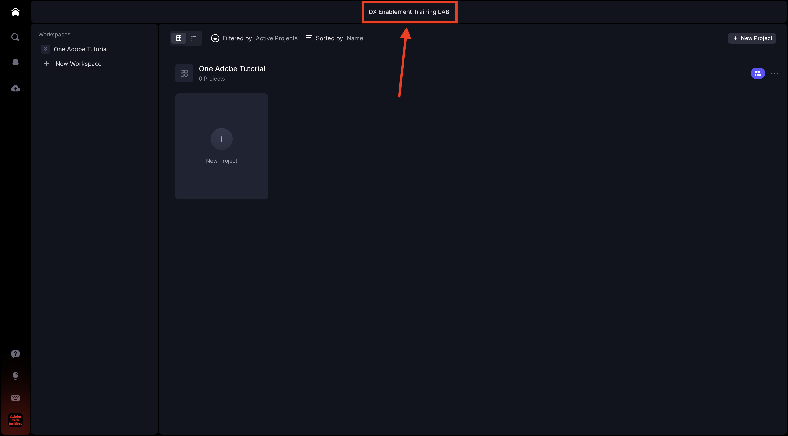
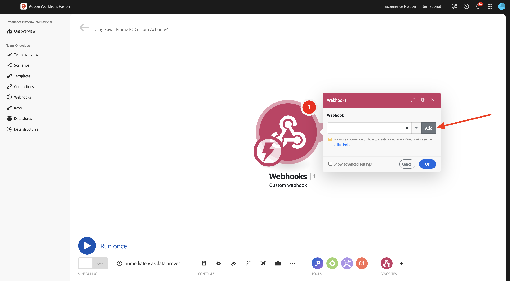
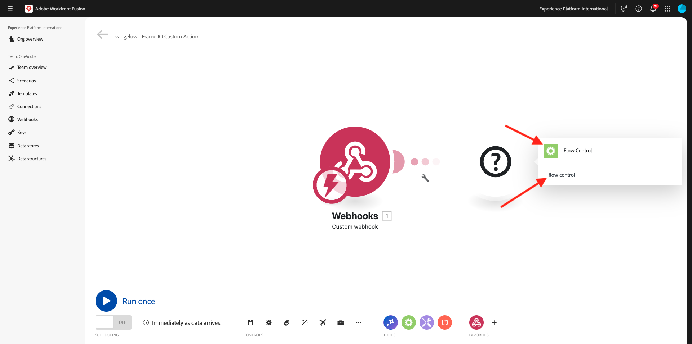
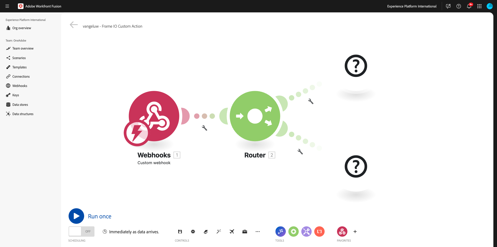
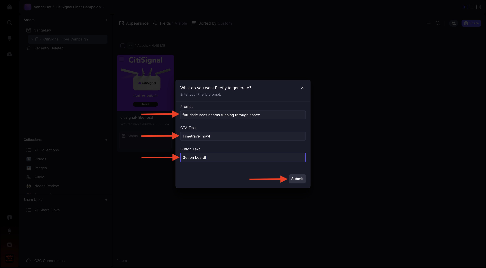
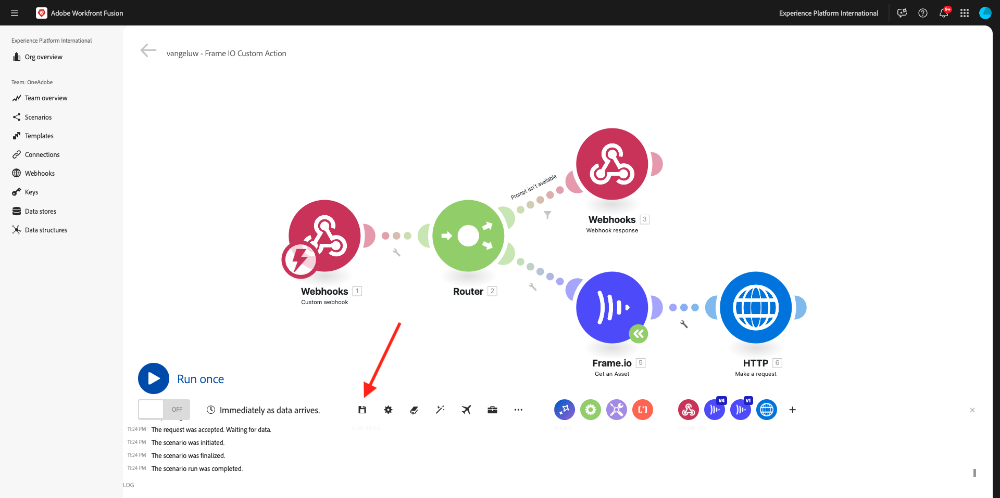
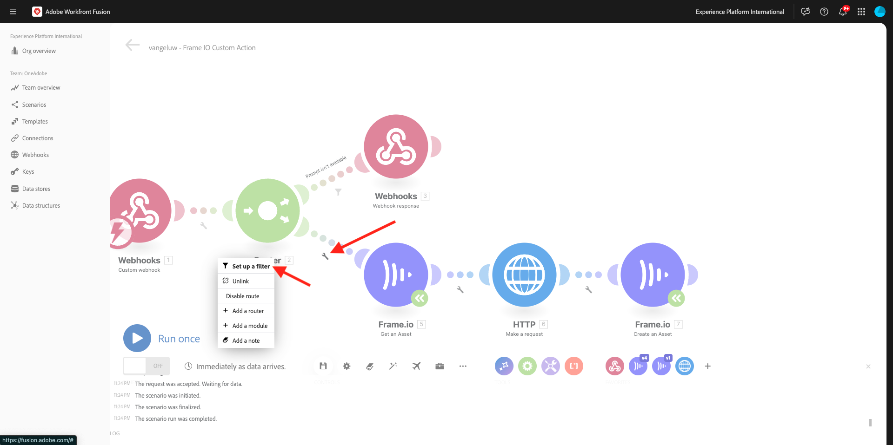
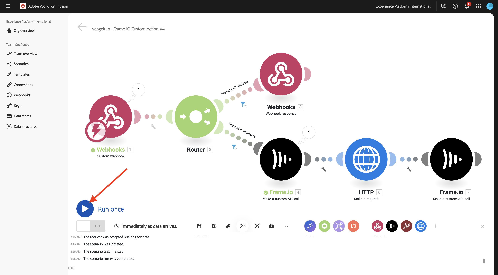

# 1.2.5 Frame.io et Workfront Fusion

Dans l’exercice précédent, vous avez configuré le `--aepUserLdap-- - Firefly + Photoshop` de scénario et configuré un webhook entrant pour déclencher le scénario, ainsi qu’une réponse webhook une fois le scénario terminé avec succès. Vous avez ensuite utilisé Postman pour déclencher ce scénario. Postman est un excellent outil de test, mais dans un scénario d’entreprise réel, les utilisateurs professionnels n’utiliseraient pas Postman pour déclencher un scénario. Au lieu de cela, ils utiliseraient une autre application et s’attendraient à ce que cette autre application active un scénario dans Workfront Fusion. Dans cet exercice, c&#39;est exactement ce que vous allez faire avec Frame.io.

>[!NOTE]
>
>Pour réussir cet exercice, vous devez être un utilisateur administrateur dans votre compte Frame.io. L’exercice ci-dessous a été créé pour Frame.io V3 et sera mis à jour ultérieurement pour Frame.io V4.

## 1.2.5.1 Accès à Frame.io

Accédez à [https://app.frame.io/projects](https://app.frame.io/projects){target="_blank"}.

Cliquez sur l’icône **+** créer votre propre projet dans Frame.io.



Saisissez le nom `--aepUserLdap--` et cliquez sur **Créer un projet**.


Votre projet s’affiche alors dans le menu de gauche.
Dans l’un des exercices précédents, vous avez téléchargé [citisignal-fibre.psd](./../../../assets/ff/citisignal-fiber.psd){target="_blank"} sur votre bureau. Sélectionnez ce fichier, puis faites-le glisser et déposez-le dans le dossier du projet qui vient d’être créé.


## 1.2.5.2 Workfront Fusion et Frame.io

Dans l’exercice précédent, vous avez créé l’`--aepUserLdap-- - Firefly + Photoshop` de scénario, qui a commencé par un webhook personnalisé et s’est terminé par une réponse webhook. L’utilisation des webhooks a ensuite été testée à l’aide de Postman, mais il est évident que le but d’un tel scénario est d’être appelé par une application externe. Comme indiqué précédemment, Frame.io sera cet exercice, mais entre Frame.io et le `--aepUserLdap-- - Firefly + Photoshop`, un autre scénario Workfront Fusion est nécessaire. vous allez à présent configurer ce scénario.

Accédez à [https://experience.adobe.com/](https://experience.adobe.com/){target="_blank"}. Ouvrez **Workfront Fusion**.


Dans le menu de gauche, accédez à **Scénarios** et sélectionnez votre dossier `--aepUserLdap--`. Cliquez sur **Créer un nouveau scénario**.


Utilisez le nom `--aepUserLdap-- - Frame IO Custom Action`.


Cliquez sur l’**objet de point d’interrogation** sur la zone de travail. Saisissez le `webhook` de texte dans la zone de recherche, puis cliquez sur **Webhooks**.


Cliquez sur **Webhook personnalisé**.


Cliquez sur **Ajouter** pour créer une URL webhook.



Pour le **nom du Webhook**, utilisez `--aepUserLdap-- - Frame IO Custom Action Webhook`. Cliquez sur **Enregistrer**.


Vous devriez alors voir ceci. Laissez cet écran ouvert et intact car vous en aurez besoin lors d&#39;une prochaine étape. Vous devrez copier l’URL du webhook à l’étape suivante, en cliquant sur **Copier l’adresse dans le presse-papiers**.


Accédez à [https://developer.frame.io/](https://developer.frame.io/){target="_blank"}. Cliquez sur **OUTILS DE DÉVELOPPEMENT** puis choisissez **Actions personnalisées**.


Cliquez sur **Créer une action personnalisée**.


Saisissez les valeurs suivantes :

- **NAME** : utilisez `--aepUserLdap-- - Frame IO Custom Action Fusion`
- **DESCRIPTION** : utilisez `--aepUserLdap-- - Frame IO Custom Action Fusion`
- **EVENT** : utilisez `fusion.tutorial`.
- **URL** : saisissez l’URL du webhook que vous venez de créer dans Workfront Fusion
- **ÉQUIPE** : sélectionnez l’équipe Frame.io appropriée, dans ce cas, **Un tutoriel Adobe**.

Cliquez sur **Envoyer**.


Vous devriez alors voir ceci.


Revenez à [https://app.frame.io/projects](https://app.frame.io/projects){target="_blank"}. Actualisez la page.


Après avoir actualisé la page, cliquez sur le **de 3 points...** sur la ressource **citisignal-fibre.psd**. L’action personnalisée que vous avez créée précédemment devrait alors apparaître dans le menu qui s’affiche. Cliquez sur le `--aepUserLdap-- - Frame IO Custom Action Fusion` d’action personnalisée.


Vous devriez alors voir un **Succès !Fenêtre contextuelle**. Cette fenêtre contextuelle est le résultat de la communication entre Frame.io et Workfront Fusion.


Redéfinissez l’écran sur Workfront Fusion. Vous devriez maintenant voir **Déterminé avec succès** apparaître dans l’objet Webhook personnalisé. Cliquez sur **OK**.


Cliquez sur **Exécuter une fois** pour activer le mode test, puis testez à nouveau la communication avec Frame.io.


Revenez à Frame.io et cliquez de nouveau sur le `--aepUserLdap-- - Frame IO Custom Action Fusion` d’action personnalisée.


Rebasculez l’écran sur Workfront Fusion. Vous devriez maintenant voir une coche verte et une bulle indiquant **1**. Cliquez sur la bulle pour afficher les détails.


La vue détaillée de la bulle vous montre les données reçues de Frame.io. Vous devriez voir différents ID. Par exemple, le champ **resource.id** affiche l’ID unique dans Frame.io de la ressource **citisignal-fibre.psd**.


Maintenant que la communication a été établie entre Frame.io et Workfront Fusion, vous pouvez continuer votre configuration.

## 1.2.5.3 Fournir une réponse de formulaire personnalisé à Frame.io

Lorsque l’action personnalisée est appelée dans Frame.io, Frame.io s’attend à recevoir une réponse de Workfront Fusion. Si vous repensez au scénario que vous avez créé dans l’exercice précédent, un certain nombre de variables sont nécessaires pour mettre à jour le fichier PSD Photoshop standard. Ces variables sont définies dans la payload que vous avez utilisée :

```json
{
    "psdTemplate": "citisignal-fiber.psd",
    "xlsFile": "placeholder",
    "prompt":"misty meadows",
    "cta": "Buy this now!",
    "button": "Click here to buy!"
}
```

Pour que le `--aepUserLdap-- - Firefly + Photoshop` de scénario s’exécute correctement, des champs tels que **prompt**, **cta**, **button** et **psdTemplate** sont donc nécessaires.

Les 3 premiers champs **invite**, **cta**, **button** nécessitent une entrée utilisateur qui doit être collectée dans Frame.io lorsque l’utilisateur appelle l’action personnalisée. Ainsi, la première chose à faire dans Workfront Fusion est de vérifier si ces variables sont disponibles ou non et, dans le cas contraire, Workfront Fusion doit répondre à Frame.io pour demander la saisie de ces variables. Pour ce faire, utilisez un formulaire dans Frame.io.

Revenez à Workfront Fusion et ouvrez votre `--aepUserLdap-- - Frame IO Custom Action` de scénario. Pointez sur l’objet **Custom webhook** et cliquez sur l’icône **+** pour ajouter un autre module.


Recherchez `Flow Control` et cliquez sur **Contrôle de flux**.



Cliquez pour sélectionner **Router**.


Vous devriez alors voir ceci.



Cliquez sur le **?** objet , puis cliquez pour sélectionner **Webhooks**.


Sélectionnez **Réponse du Webhook**.


Vous devriez alors voir ceci.


Copiez le code JSON ci-dessous et collez-le dans le champ **Corps**.


```json
{
  "title": "What do you want Firefly to generate?",
  "description": "Enter your Firefly prompt.",
  "fields": [
    {
      "type": "text",
      "label": "Prompt",
      "name": "Prompt",
      "value": ""
    },
    {
      "type": "text",
      "label": "CTA Text",
      "name": "CTA Text",
      "value": ""
    },
    {
      "type": "text",
      "label": "Button Text",
      "name": "Button Text",
      "value": ""
    }
  ]
}
```

Cliquez sur l’icône pour nettoyer et embellir le code JSON. Cliquez ensuite sur **OK**.


Cliquez sur **Enregistrer** pour enregistrer vos modifications.


Vous devez ensuite configurer un filtre pour vous assurer que ce chemin d’accès au scénario s’exécute uniquement lorsqu’aucune invite n’est disponible. Cliquez sur l’icône **clé à molette**, puis sélectionnez **Configurer un filtre**.


Configurez les champs suivants :

- **Libellé** : utilisez `Prompt isn't available`.
- **Condition** : utilisez `{{1.data.Prompt}}`.
- **Opérateurs de base** : sélectionnez **N’existe pas**.

>[!NOTE]
>
>Les variables dans Workfront Fusion peuvent être spécifiées manuellement à l’aide de la syntaxe suivante : `{{1.data.Prompt}}`. Le nombre dans la variable fait référence au module dans le scénario. Dans cet exemple, vous pouvez constater que le premier module du scénario est appelé **Webhooks** et qu’il possède un numéro de séquence de **1**. Cela signifie que la variable `{{1.data.Prompt}}` accédera au champ **data.Prompt** à partir du module portant le numéro de séquence 1. Les numéros de séquence peuvent parfois être différents. Faites donc attention lorsque vous copiez/collez de telles variables et vérifiez toujours que le numéro de séquence utilisé est correct.

Cliquez sur **OK**.


Vous devriez alors voir ceci. Cliquez d’abord sur l’icône **Enregistrer**, puis sur **Exécuter une fois** pour tester votre scénario.


Vous devriez alors voir ceci.


Revenez à Frame.io et cliquez de nouveau sur le `--aepUserLdap-- - Frame IO Custom Action Fusion` d’action personnalisée sur la ressource **citisignal-fibre.psd**.


Vous devriez maintenant voir une invite dans Frame.io. Ne remplissez pas encore les champs et ne soumettez pas encore le formulaire. Cette invite s’affiche en fonction de la réponse de Workfront Fusion que vous venez de configurer.


Revenez à Workfront Fusion et cliquez sur la bulle dans le module **Réponse Webhook**. Sous **ENTRÉE**, vous verrez le corps contenant la payload JSON pour le formulaire. Cliquez de nouveau sur **Exécuter**.


Vous devriez alors revoir ceci.


Revenez à Frame.io et remplissez les champs comme indiqué. Cliquez sur **Envoyer**.



Vous devriez alors voir un **Succès !Fenêtre contextuelle**.


Revenez à Workfront Fusion et cliquez sur la bulle dans le module **Custom webhook**. Dans l’opération 1, sous **OUTPUT**, vous pouvez désormais voir un nouvel objet **data** qui contient des champs tels que **Button Text**, **CTA Text** et **Prompt**. Avec ces variables d’entrée utilisateur disponibles dans votre scénario, vous disposez de suffisamment de éléments pour continuer votre configuration.


## 1.2.5.4 Récupérer l&#39;emplacement du fichier à partir de Frame.io

Comme nous l’avons vu précédemment, des champs tels que **prompt**, **cta**, **button** et **psdTemplate** sont nécessaires au fonctionnement de ce scénario. Les 3 premiers champs sont déjà disponibles, mais le **psdTemplate** à utiliser est toujours manquant. Le **psdTemplate** référencera désormais un emplacement Frame.io car le fichier **citisignal-fibre.psd** est hébergé dans Frame.io. Pour récupérer l’emplacement de ce fichier, vous devez configurer et utiliser la connexion Frame.io dans Workfront Fusion.

Revenez à Workfront Fusion et ouvrez votre `--aepUserLdap-- - Frame IO Custom Action` de scénario. Survoler la **?** le module , cliquez sur l’icône **+** pour ajouter un autre module et recherchez des `frame`. Cliquez sur **Frame.io**.


Cliquez sur **Frame.io (hérité)**.


Cliquez sur **Obtenir une ressource**.


Pour utiliser la connexion Frame.io, vous devez d’abord la configurer. Cliquez sur **Ajouter** pour ce faire.


Ouvrez la liste déroulante **Type de connexion**.


Sélectionnez **Clé API Frame.io** et saisissez le nom `--aepUserLdap-- - Frame.io Token`.


Pour obtenir un jeton API, rendez-vous sur [https://developer.frame.io/](https://developer.frame.io/){target="_blank"}. Cliquez sur **OUTILS DE DÉVELOPPEMENT** puis choisissez **Jetons**.


Cliquez sur **Créer un jeton**.


Utilisez l’`--aepUserLdap-- - Frame.io Token` **Description** et cliquez sur **Sélectionner toutes les portées**.


Faites défiler vers le bas et cliquez sur **Envoyer**.


Votre jeton est maintenant créé. Cliquez sur **Copier** pour le copier dans le presse-papiers.


Revenez à votre scénario dans Workfront Fusion. Collez le jeton dans le champ **Votre clé API Frame.io**. Cliquez sur **OK**. Votre connexion sera maintenant testée par Workfront Fusion.


Si la connexion a été testée avec succès, elle s’affiche automatiquement sous **Connexion**. Vous disposez désormais d’une connexion réussie et vous devez terminer la configuration pour obtenir tous les détails de la ressource à partir de Frame.io, y compris l’emplacement du fichier. Pour ce faire, vous devez fournir l’**ID de ressource**.


Le **ID de ressource** est partagé par Frame.io avec Workfront Fusion dans le cadre de la communication initiale **Webhook personnalisé** et se trouve sous le champ **resource.id**. Sélectionnez **resource.id** et cliquez sur **OK**.


Vous devriez maintenant voir ceci. Enregistrez vos modifications, puis cliquez sur **Exécuter une fois** pour tester votre scénario.


Revenez à Frame.io et cliquez de nouveau sur le `--aepUserLdap-- - Frame IO Custom Action Fusion` d’action personnalisée sur la ressource **citisignal-fibre.psd**.


Vous devriez maintenant voir une invite dans Frame.io. Ne remplissez pas encore les champs et ne soumettez pas encore le formulaire. Cette invite s’affiche en fonction de la réponse de Workfront Fusion que vous venez de configurer.


Revenez à Workfront Fusion. Cliquez de nouveau sur **Exécuter**.


Revenez à Frame.io et remplissez les champs comme indiqué. Cliquez sur **Envoyer**.


Revenez à Workfront Fusion et cliquez sur la bulle dans le module **Frame.io - Obtenir une ressource**.


Vous pouvez désormais voir de nombreuses métadonnées sur la ressource spécifique **citisignal-fibre.psd**.


L’information spécifique nécessaire à ce cas d’utilisation est l’URL de l’emplacement du fichier **citisignal-fibre.psd**, que vous pouvez trouver en faisant défiler l’écran jusqu’au champ **Original**.


Vous disposez désormais de tous les champs (**invite**, **cta**, **button** et **psdTemplate**) nécessaires au fonctionnement de ce scénario.

## 1.2.5.5 Appeler le scénario Workfront

Dans l’exercice précédent, vous avez configuré le `--aepUserLdap-- - Firefly + Photoshop` de scénario. Vous devez maintenant apporter une modification mineure à ce scénario.

Ouvrez l’`--aepUserLdap-- - Firefly + Photoshop` du scénario dans un autre onglet et cliquez sur le premier module **Adobe Photoshop - Apply PSD edits**. Vous devriez maintenant voir que le fichier d’entrée est configuré pour utiliser un emplacement dynamique dans Microsoft Azure. Étant donné que pour ce cas d’utilisation, le fichier d’entrée n’est plus stocké dans Microsoft Azure, mais à la place à l’aide du stockage Frame.io, vous devez modifier ces paramètres.


Remplacez **Stockage** par **Externe** et **Emplacement du fichier** pour n’utiliser que la variable **psdTemplate** provenant du module **Custom webhook** entrant. Cliquez sur **OK** puis sur **Enregistrer** pour enregistrer vos modifications.


Cliquez sur le module **Webhook personnalisé**, puis sur **Copier l’adresse dans le presse-papiers**. Vous devez copier l’URL, car vous devrez l’utiliser dans l’autre scénario.


Revenez à votre `--aepUserLdap-- - Frame IO Custom Action` de scénario. Pointez sur le module **Frame.io - Obtenir une ressource** et cliquez sur l’icône **+**.


Saisissez `http`, puis cliquez sur **HTTP**.


Sélectionnez **Effectuer une requête**.


Collez l’URL du webhook personnalisé dans le champ **URL**. Définissez la **Méthode** sur POST**.


Définissez **Type de corps** sur **Brut** et **Type de contenu** sur **JSON (application/json)**.
Collez la payload JSON ci-dessous dans le champ **Demander le contenu** et cochez la case correspondant à **Analyser la réponse**.

```json
{
    "psdTemplate": "citisignal-fiber.psd",
    "xlsFile": "placeholder",
    "prompt":"misty meadows",
    "cta": "Buy this now!",
    "button": "Click here to buy!"
}
```

Une payload statique est désormais configurée, mais elle doit devenir dynamique à l’aide des variables collectées précédemment.


Pour le champ **psdTemplate**, remplacez la variable statique **citisignal-fibre.psd** par la variable **Original**.


Pour les champs **invite**, **cta** et **button**, remplacez les variables statiques par les variables dynamiques qui ont été insérées dans le scénario par la requête webhook entrante de Frame.io, à savoir les champs **data.Prompt**, **data.CTA Text** et **data.Button Text**.

Cliquez sur **OK**.


Cliquez sur **Enregistrer** pour enregistrer vos modifications.



## 1.2.5.6 Enregistrer une nouvelle ressource dans Frame.io

Une fois que l’autre scénario Workfront Fusion a été invoqué, un nouveau modèle Photoshop PSD est disponible. Ce fichier PSD doit être à nouveau stocké dans Frame.io, qui est la dernière étape de ce scénario.

Pointez sur le module **HTTP - Effectuer une requête** et cliquez sur l’icône **+**.


Sélectionnez **Frame.io (hérité)**.


Sélectionnez **Créer une ressource**.


Votre connexion Frame.io sera automatiquement sélectionnée.


Sélectionnez les options suivantes :

- **Identifiant de l’équipe** : sélectionnez l’identifiant de l’équipe approprié, dans ce cas `One Adobe Tutorial`.
- **Identifiant du projet** : utilisez `--aepUserLdap--`.
- **ID de dossier** : utilisez `root`.
- **Type** : utilisez `File`.


Pour le champ **Nom**, vous pouvez utiliser une variable telle que **horodatage** (ou la transformer en quelque chose de plus logique pour vous). La variable prédéfinie **horodatage** se trouve sous l’onglet **Date et heure**.


Pour le champ **URL Source**, utilisez le code JSON ci-dessous.

```json
{{6.data.newPsdTemplate}}
```

>[!NOTE]
>
>Les variables dans Workfront Fusion peuvent être spécifiées manuellement à l’aide de la syntaxe suivante : `{{6.data.newPsdTemplate}}`. Le nombre dans la variable fait référence au module dans le scénario. Dans cet exemple, vous pouvez constater que le sixième module du scénario s’appelle **HTTP - Effectuer une requête** et possède un numéro de séquence de **6**. Cela signifie que la variable `{{6.data.newPsdTemplate}}` accédera au champ **data.newPsdTemplate** à partir du module portant le numéro de séquence 6. Les numéros de séquence peuvent parfois être différents. Faites donc attention lorsque vous copiez/collez de telles variables et vérifiez toujours que le numéro de séquence utilisé est correct.

Cliquez sur **OK**.


Cliquez sur **Enregistrer** pour enregistrer vos modifications.


Enfin, vous devez configurer un filtre pour vous assurer que ce chemin du scénario s’exécute uniquement lorsqu’une invite est disponible. Cliquez sur l’icône **clé à molette**, puis sélectionnez **Configurer un filtre**.



Configurez les champs suivants :

- **Libellé** : utilisez `Prompt is available`.
- **Condition** : utilisez `{{1.data.Prompt}}`.
- **Opérateurs de base** : sélectionnez **existe**.

>[!NOTE]
>
>Les variables dans Workfront Fusion peuvent être spécifiées manuellement à l’aide de la syntaxe suivante : `{{1.data.Prompt}}`. Le nombre dans la variable fait référence au module dans le scénario. Dans cet exemple, vous pouvez constater que le premier module du scénario est appelé **Webhooks** et qu’il possède un numéro de séquence de **1**. Cela signifie que la variable `{{1.data.Prompt}}` accédera au champ **data.Prompt** à partir du module portant le numéro de séquence 1. Les numéros de séquence peuvent parfois être différents. Faites donc attention lorsque vous copiez/collez de telles variables et vérifiez toujours que le numéro de séquence utilisé est correct.

Cliquez sur **OK**.


Cliquez sur **Enregistrer** pour enregistrer vos modifications.


## 1.2.5.7 Tester votre cas d’utilisation de bout en bout

Cliquez sur **Exécuter une fois** dans votre `--aepUserLdap-- - Frame IO Custom Action` de scénario.



Revenez à Frame.io et cliquez de nouveau sur le `--aepUserLdap-- - Frame IO Custom Action Fusion` d’action personnalisée sur la ressource **citisignal-fibre.psd**.


Vous devriez maintenant voir une invite dans Frame.io. Ne remplissez pas encore les champs et ne soumettez pas encore le formulaire. Cette invite s’affiche en fonction de la réponse de Workfront Fusion que vous venez de configurer.


Revenez à Workfront Fusion. Cliquez sur **Exécuter une fois** dans votre `--aepUserLdap-- - Frame IO Custom Action` de scénario.


Dans Workfront Fusion, ouvrez l’`--aepUserLdap-- - Firefly + Photoshop` du scénario et cliquez également sur **Exécuter une fois** dans ce scénario.


Revenez à Frame.io et remplissez les champs comme indiqué. Cliquez sur **Envoyer**.


Après 1 à 2 minutes, une nouvelle ressource devrait apparaître automatiquement dans Frame.io. Double-cliquez sur la nouvelle ressource pour l’ouvrir.


Vous pouvez maintenant voir clairement que toutes les variables d’entrée utilisateur ont été automatiquement appliquées.


Vous avez maintenant terminé cet exercice avec succès.

## Étapes suivantes

Accédez à [1.2.6 Frame.io vers Fusion vers AEM Assets](./ex6.md){target="_blank"}

Revenez à l’automatisation des workflows Creative [avec Workfront Fusion](./automation.md){target="_blank"}

Revenir à [Tous les modules](./../../../overview.md){target="_blank"}

