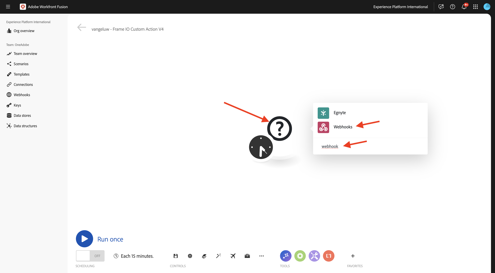

# 1.2.5 Frame I/O et Workfront Fusion

Dans l’exercice précédent, vous avez configuré le `--aepUserLdap-- - Firefly + Photoshop` de scénario et configuré un webhook entrant pour déclencher le scénario, ainsi qu’une réponse webhook une fois le scénario terminé avec succès. Vous avez ensuite utilisé Postman pour déclencher ce scénario. Postman est un excellent outil de test, mais dans un scénario d’entreprise réel, les utilisateurs professionnels n’utiliseraient pas Postman pour déclencher un scénario. Au lieu de cela, ils utiliseraient une autre application et s’attendraient à ce que cette autre application active un scénario dans Workfront Fusion. Dans cet exercice, c’est exactement ce que vous allez faire avec Frame I/O.

## 1.2.5.1 d&#39;accéder à Frame I/O

>[!NOTE]
>
>Pour réussir cet exercice, vous devez être un utilisateur administrateur dans votre compte d’E/S Frame. L’exercice ci-dessous a été créé pour Frame I/O V3 et sera mis à jour ultérieurement pour Frame I/O V4.

Reportez-vous à [https://app.frame.io/projects](https://app.frame.io/projects).

Cliquez sur l’icône **+ pour créer votre propre projet dans Frame** I/O.

Saisissez le nom `--aepUserLdap--` et cliquez sur **Créer un projet**.

Votre projet s’affiche alors dans le menu de gauche.
Dans l’un des exercices précédents, vous avez téléchargé [citisignal-fibre.psd](./../../../assets/ff/citisignal-fiber.psd){target="_blank"} sur votre bureau. Sélectionnez ce fichier, puis faites-le glisser dans le dossier du projet qui vient d’être créé.

## 1.2.5.2 Workfront Fusion et E/S de trame

Dans l’exercice précédent, vous avez créé le scénario `--aepUserLdap-- - Firefly + Photoshop`, qui a commencé par un webhook personnalisé et qui s’est terminé par une réponse webhook. L’utilisation des webhooks a ensuite été testée à l’aide de Postman, mais il est évident que le but d’un tel scénario est d’être appelé par une application externe. Comme indiqué précédemment, Frame I/O sera cet exercice, mais entre Frame I/O et le `--aepUserLdap-- - Firefly + Photoshop`, un autre scénario Workfront Fusion est nécessaire. vous allez à présent configurer ce scénario.

Dans le menu de gauche, accédez à **Scénarios** et sélectionnez votre dossier `--aepUserLdap--`. Cliquez sur **Créer un nouveau scénario**.

Utilisez le nom `--aepUserLdap-- - Frame IO Custom Action`.

Cliquez sur l’**objet de point d’interrogation** sur la zone de travail. Saisissez le `webhook` de texte dans la zone de recherche, puis cliquez sur **Webhooks**.

Cliquez sur **Webhook personnalisé**.

Cliquez sur **Ajouter** pour créer une URL de webhook.

Pour le **nom du Webhook**, utilisez `--aepUserLdap-- - Frame IO Custom Action Webhook`. Cliquez sur **Enregistrer**.

Vous devriez alors voir ceci. Laissez cet écran ouvert et intact car vous en aurez besoin lors d&#39;une prochaine étape. Vous devrez copier l’URL du webhook à l’étape suivante, en cliquant sur **Copier l’adresse dans le presse-papiers**.

Reportez-vous à [https://developer.frame.io/](https://developer.frame.io/). Cliquez sur **OUTILS** DE DÉVELOPPEMENT, puis sélectionnez **Actions personnalisées**.

Cliquez sur **Créer une action** personnalisée.

Saisissez les valeurs suivantes :

- **NAME** : utilisez `vangeluw - Frame IO Custom Action Fusion`
- **DESCRIPTION** : utilisez `vangeluw - Frame IO Custom Action Fusion`
- **EVENT** : utilisez `fusion.tutorial`.
- **URL** : saisissez l’URL du webhook que vous venez de créer dans Workfront Fusion
- **ÉQUIPE** : sélectionnez l’équipe d’E/S de trame appropriée, dans ce cas, **Didacticiel** One Adobe.

Cliquez sur **Envoyer**.

Vous devriez alors voir ceci.

Revenez à [https://app.frame.io/projects](https://app.frame.io/projects). Actualisez la page.

Après avoir actualisé la page, cliquez sur les 3 points **...** sur la citisignal-fiber.psd **de la ressource**. Vous devriez alors voir l’action personnalisée que vous avez créée précédemment apparaître dans le menu qui s’affiche. Cliquez sur l’action `vangeluw - Frame IO Custom Action Fusion`personnalisée .

Vous devriez alors voir un **Succès !Fenêtre contextuelle**. Cette fenêtre contextuelle est le résultat de la communication entre Frame I/O et Workfront Fusion.

Redéfinissez l’écran sur Workfront Fusion. Vous devriez maintenant voir **Déterminé avec succès** apparaître dans l’objet Webhook personnalisé. Cliquez sur **OK**.

Cliquez sur **Exécuter une fois** pour activer le mode test, puis testez à nouveau la communication avec Frame I/O.

Revenez à Frame I/O et cliquez de nouveau sur le `vangeluw - Frame IO Custom Action Fusion` d’action personnalisée.

Rebasculez l’écran sur Workfront Fusion. Vous devriez maintenant voir une coche verte et une bulle indiquant **1**. Cliquez sur la bulle pour afficher les détails.

La vue détaillée de la bulle affiche les données reçues de Frame I/O. Vous devriez voir divers ID. Par exemple, le champ **affiche resource.id** l’ID unique dans les E/S de trame de l’actif **citisignal-fiber.psd**

Maintenant que la communication a été établie entre Frame I/O et Workfront Fusion, vous pouvez continuer votre configuration.

## 1.2.5.3 Fournir une réponse de formulaire personnalisée à Frame I/O.

## Étapes suivantes

Accédez à [1.2.6 Frame I/O vers Fusion vers AEM Assets](./ex6.md){target="_blank"}

Revenir à [Creative Automatisation des workflows avec Workfront Fusion](./automation.md){target="_blank"}

Revenir à [Tous les modules](./../../../overview.md){target="_blank"}

