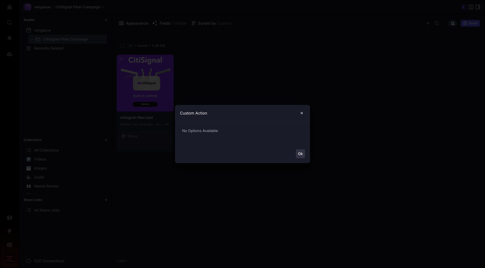
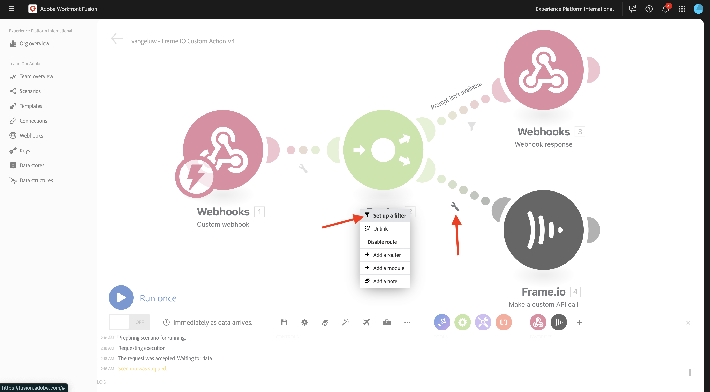

# 1.2.5 Frame.io et Workfront Fusion

Dans l’exercice précédent, vous avez configuré le `--aepUserLdap-- - Firefly + Photoshop` de scénario et configuré un webhook entrant pour déclencher le scénario, ainsi qu’une réponse webhook une fois le scénario terminé avec succès. Vous avez ensuite utilisé Postman pour déclencher ce scénario. Postman est un excellent outil de test, mais dans un scénario d’entreprise réel, les utilisateurs professionnels n’utiliseraient pas Postman pour déclencher un scénario. Au lieu de cela, ils utiliseraient une autre application et s’attendraient à ce que cette autre application active un scénario dans Workfront Fusion. Dans cet exercice, c&#39;est exactement ce que vous allez faire avec Frame.io.

>[!NOTE]
>
>Cet exercice a été créé pour Frame.io V4. Certaines des fonctionnalités ci-dessous utilisées dans l’exercice sont actuellement en version Alpha et ne sont pas encore disponibles pour la plupart.

## Conditions préalables 1.2.5.1

Avant de poursuivre cet exercice, vous devez avoir terminé la configuration de [votre projet Adobe I/O](./../../../modules/getting-started/gettingstarted/ex6.md) y compris l’ajout de l’API **Frame.io** à votre projet Adobe I/O, et vous devez également avoir configuré une application pour interagir avec les API, telles que [Postman](./../../../modules/getting-started/gettingstarted/ex7.md) ou [PostBuster](./../../../modules/getting-started/gettingstarted/ex8.md).

## 1.2.5.2 Accès à Frame.io

Accédez à [https://next.frame.io/](https://next.frame.io/){target="_blank"}.


Vérifiez l’instance à laquelle vous êtes actuellement connecté en cliquant sur l’icône d’instance. Sélectionnez l’instance à laquelle vous avez accès et qui doit être `--aepImsOrgName--`.

Cliquez sur le **+ Nouveau projet** pour créer votre propre projet dans Frame.io.


Sélectionnez le modèle **Vide**, puis saisissez le nom `--aepUserLdap--` votre projet. Cliquez sur **Créer un projet**.


Votre projet s’affiche alors dans le menu de gauche. Cliquez sur l’icône **+**, puis sélectionnez **Nouveau dossier**.


Saisissez le nom `CitiSignal Fiber Campaign`, puis double-cliquez sur le dossier pour l’ouvrir.


Cliquez sur **Télécharger**.


Dans l’un des exercices précédents, vous avez téléchargé [citisignal-fibre.psd](./../../../assets/ff/citisignal-fiber.psd){target="_blank"}. Sélectionnez ce fichier et cliquez sur **Ouvrir**.


Le fichier **citisignal-fibre.psd** sera alors disponible dans le dossier que vous venez de créer.


## 1.2.5.3 Workfront Fusion et Frame.io

Dans l’exercice précédent, vous avez créé l’`--aepUserLdap-- - Firefly + Photoshop` de scénario, qui a commencé par un webhook personnalisé et s’est terminé par une réponse webhook. L’utilisation des webhooks a ensuite été testée à l’aide de Postman, mais il est évident que le but d’un tel scénario est d’être appelé par une application externe. Comme indiqué précédemment, Frame.io sera cet exercice, mais entre Frame.io et le `--aepUserLdap-- - Firefly + Photoshop`, un autre scénario Workfront Fusion est nécessaire. vous allez à présent configurer ce scénario.

Accédez à [https://experience.adobe.com/](https://experience.adobe.com/){target="_blank"}. Ouvrez **Workfront Fusion**.


Dans le menu de gauche, accédez à **Scénarios** et sélectionnez votre dossier `--aepUserLdap--`. Cliquez sur **Créer un nouveau scénario**.


Utilisez le nom `--aepUserLdap-- - Frame IO Custom Action V4`.


Cliquez sur l’**objet de point d’interrogation** sur la zone de travail. Saisissez le `webhook` de texte dans la zone de recherche, puis cliquez sur **Webhooks**.


Cliquez sur **Webhook personnalisé**.


Cliquez sur **Ajouter** pour créer une URL webhook.


Pour le **nom du Webhook**, utilisez `--aepUserLdap-- - Frame IO Custom Action Webhook`. Cliquez sur **Enregistrer**.


Vous devriez alors voir ceci. Laissez cet écran ouvert et intact car vous en aurez besoin lors d&#39;une prochaine étape. Vous devrez copier l’URL du webhook à l’étape suivante, en cliquant sur **Copier l’adresse dans le presse-papiers**.


## API d’actions personnalisées 1.2.5.4 Frame.io V4

Accédez à Postman et ouvrez la requête **POST - Get Access Token** dans la collection **Adobe IO - OAuth**. Vérifiez le champ **portée** sous **Paramètres**. Le champ **portée** doit inclure la portée `frame.s2s.all`. S&#39;il manque, ajoutez-le. Cliquez ensuite sur **Envoyer** pour demander un nouveau **access_token**.


Ouvrez ensuite la requête **GET - Liste des comptes** dans la collection **Frame.io V4 - Tech Insiders**. Cliquez sur **Envoyer**.


Vous devriez alors voir une réponse similaire contenant un ou plusieurs comptes. Vérifiez la réponse et recherchez le champ **id** pour le compte Frame.io V4 que vous utilisez. Le nom du compte figure dans l&#39;interface utilisateur de Frame.io V4 :


Copiez la valeur du champ **id**.


Dans le menu de gauche, accédez à **Environnements** et sélectionnez l’environnement que vous utilisez. Recherchez la variable **`FRAME_IO_ACCOUNT_ID`** et collez l’**id** obtenu à partir de la requête précédente dans les colonnes **Valeur initiale** et **Valeur actuelle**. Cliquez sur **Enregistrer**.


Dans le menu de gauche, revenez à **Collections**. Ouvrez la requête **GET - Liste des espaces de travail** dans la collection **Frame.io V4 - Tech Insiders**. Cliquez sur **Envoyer**.


Vous devriez alors voir une réponse similaire contenant un ou plusieurs comptes. Passez en revue la réponse et recherchez le champ **id** pour le Workspace Frame.io V4 que vous utilisez. Copiez la valeur du champ **id**.


Dans le menu de gauche, accédez à **Environnements** et sélectionnez l’environnement que vous utilisez. Recherchez la variable **`FRAME_IO_WORKSPACE_ID`** et collez l’**id** obtenu à partir de la requête précédente dans les colonnes **Valeur initiale** et **Valeur actuelle**. Cliquez sur **Enregistrer**.


Dans le menu de gauche, revenez à **Collections**. Ouvrez la requête **POST - Création d’une action personnalisée** dans la collection **Frame.io V4 - Insiders techniques**, dans le dossier **Actions personnalisées**.

Accédez au **Corps** de la requête. Remplacez le champ **nom** par `--aepUserLdap--  - Frame.io Custom Action V4`, puis remplacez le champ **url** par la valeur de l’URL Webhook que vous avez copiée à partir de Workfront Fusion.

Cliquez sur **Envoyer**.


Votre action personnalisée Frame.io V4 a maintenant été créée.


Revenez sur [https://next.frame.io/](https://next.frame.io/){target="_blank"} et accédez au dossier **CitiSignal Fiber Campaign** que vous avez créé dans le `--aepUserLdap--` de votre projet. Actualisez la page.


Après avoir actualisé la page, cliquez sur le **de 3 points...** sur la ressource **citisignal-fibre.psd** et ouvrez le menu **Actions personnalisées**. L’action personnalisée que vous avez créée précédemment devrait alors apparaître dans le menu qui s’affiche. Cliquez sur le `--aepUserLdap-- - Frame IO Custom Action Fusion V4` d’action personnalisée.


Une fenêtre contextuelle similaire **Action personnalisée** devrait s’afficher. Cette fenêtre contextuelle est le résultat de la communication entre Frame.io et Workfront Fusion.



Redéfinissez l’écran sur Workfront Fusion. Vous devriez maintenant voir **Déterminé avec succès** apparaître dans l’objet Webhook personnalisé. Cliquez sur **OK**.


Cliquez sur **Exécuter une fois** pour activer le mode test, puis testez à nouveau la communication avec Frame.io.


Revenez à Frame.io et cliquez de nouveau sur le `--aepUserLdap-- - Frame IO Custom Action Fusion V4` d’action personnalisée.


Rebasculez l’écran sur Workfront Fusion. Vous devriez maintenant voir une coche verte et une bulle indiquant **1**. Cliquez sur la bulle pour afficher les détails.


La vue détaillée de la bulle vous montre les données reçues de Frame.io. Vous devriez voir différents ID. Par exemple, le champ **resource.id** affiche l’ID unique dans Frame.io de la ressource **citisignal-fibre.psd**.


Maintenant que la communication a été établie entre Frame.io et Workfront Fusion, vous pouvez continuer votre configuration.

## 1.2.5.5 Fournir une réponse de formulaire personnalisé à Frame.io

Lorsque l’action personnalisée est appelée dans Frame.io, Frame.io s’attend à recevoir une réponse de Workfront Fusion. Si vous repensez au scénario que vous avez créé dans l’exercice précédent, un certain nombre de variables sont nécessaires pour mettre à jour le fichier PSD Photoshop standard. Ces variables sont définies dans la payload que vous avez utilisée :

```json
{
    "psdTemplate": "citisignal-fiber.psd",
    "xlsFile": "placeholder",
    "prompt":"misty meadows",
    "cta": "Buy this now!",
    "button": "Click here to buy!"
}
```

Pour que le `--aepUserLdap-- - Firefly + Photoshop` de scénario s’exécute correctement, des champs tels que **prompt**, **cta**, **button** et **psdTemplate** sont donc nécessaires.

Les 3 premiers champs **invite**, **cta**, **button** nécessitent une entrée utilisateur qui doit être collectée dans Frame.io lorsque l’utilisateur appelle l’action personnalisée. Ainsi, la première chose à faire dans Workfront Fusion est de vérifier si ces variables sont disponibles ou non et, dans le cas contraire, Workfront Fusion doit répondre à Frame.io pour demander la saisie de ces variables. Pour ce faire, utilisez un formulaire dans Frame.io.

Revenez à Workfront Fusion et ouvrez votre `--aepUserLdap-- - Frame IO Custom Action` de scénario. Pointez sur l’objet **Custom webhook** et cliquez sur l’icône **+** pour ajouter un autre module.


Recherchez `Flow Control` et cliquez sur **Contrôle de flux**.


Cliquez pour sélectionner **Router**.


Vous devriez alors voir ceci.


Cliquez sur le **?** objet , puis cliquez pour sélectionner **Webhooks**.


Sélectionnez **Réponse du Webhook**.


Vous devriez alors voir ceci.


Copiez le code JSON ci-dessous et collez-le dans le champ **Corps**.


```json
{
  "title": "What do you want Firefly to generate?",
  "description": "Enter your Firefly prompt.",
  "fields": [
    {
      "type": "text",
      "label": "Prompt",
      "name": "Prompt",
      "value": ""
    },
    {
      "type": "text",
      "label": "CTA Text",
      "name": "CTA Text",
      "value": ""
    },
    {
      "type": "text",
      "label": "Button Text",
      "name": "Button Text",
      "value": ""
    }
  ]
}
```

Cliquez sur l’icône pour nettoyer et embellir le code JSON. Cliquez ensuite sur **OK**.


Cliquez sur **Enregistrer** pour enregistrer vos modifications.


Vous devez ensuite configurer un filtre pour vous assurer que ce chemin d’accès au scénario s’exécute uniquement lorsqu’aucune invite n’est disponible. Cliquez sur l’icône **clé à molette**, puis sélectionnez **Configurer un filtre**.


Configurez les champs suivants :

- **Libellé** : utilisez `Prompt isn't available`.
- **Condition** : utilisez `{{1.data.Prompt}}`.
- **Opérateurs de base** : sélectionnez **N’existe pas**.

>[!NOTE]
>
>Les variables dans Workfront Fusion peuvent être spécifiées manuellement à l’aide de la syntaxe suivante : `{{1.data.Prompt}}`. Le nombre dans la variable fait référence au module dans le scénario. Dans cet exemple, vous pouvez constater que le premier module du scénario est appelé **Webhooks** et qu’il possède un numéro de séquence de **1**. Cela signifie que la variable `{{1.data.Prompt}}` accédera au champ **data.Prompt** à partir du module portant le numéro de séquence 1. Les numéros de séquence peuvent parfois être différents. Faites donc attention lorsque vous copiez/collez de telles variables et vérifiez toujours que le numéro de séquence utilisé est correct.

Cliquez sur **OK**.


Vous devriez alors voir ceci. Cliquez d’abord sur l’icône **Enregistrer**, puis sur **Exécuter une fois** pour tester votre scénario.


Vous devriez alors voir ceci.


Revenez à Frame.io et cliquez de nouveau sur le `--aepUserLdap-- - Frame IO Custom Action Fusion` d’action personnalisée sur la ressource **citisignal-fibre.psd**.


Vous devriez maintenant voir une invite dans Frame.io. Ne remplissez pas encore les champs et ne soumettez pas encore le formulaire. Cette invite s’affiche en fonction de la réponse de Workfront Fusion que vous venez de configurer.


Revenez à Workfront Fusion et cliquez sur la bulle dans le module **Réponse Webhook**. Sous **ENTRÉE**, vous verrez le corps contenant la payload JSON pour le formulaire. Cliquez de nouveau sur **Exécuter**.


Vous devriez alors revoir ceci.


Revenez à Frame.io et remplissez les champs comme indiqué.

- **Prompt** : faisceaux laser futuristes traversant l&#39;espace
- **CTA** : Voyagez dans le temps maintenant !
- **Texte du bouton** : embarquez !

Cliquez sur **Envoyer**.


Vous devriez alors voir une fenêtre contextuelle dans Frame.io qui ressemble à ceci.


Revenez à Workfront Fusion et cliquez sur la bulle dans le module **Custom webhook**. Dans l’opération 1, sous **OUTPUT**, vous pouvez désormais voir un nouvel objet **data** qui contient des champs tels que **Button Text**, **CTA Text** et **Prompt**. Avec ces variables d’entrée utilisateur disponibles dans votre scénario, vous disposez de suffisamment de éléments pour continuer votre configuration.


## 1.2.5.6 Récupérer l&#39;emplacement du fichier à partir de Frame.io

Comme nous l’avons vu précédemment, des champs tels que **prompt**, **cta**, **button** et **psdTemplate** sont nécessaires au fonctionnement de ce scénario. Les 3 premiers champs sont déjà disponibles, mais le **psdTemplate** à utiliser est toujours manquant. Le **psdTemplate** référencera désormais un emplacement Frame.io car le fichier **citisignal-fibre.psd** est hébergé dans Frame.io. Pour récupérer l’emplacement de ce fichier, vous devez configurer et utiliser la connexion Frame.io dans Workfront Fusion.

Revenez à Workfront Fusion et ouvrez votre `--aepUserLdap-- - Frame IO Custom Action V4` de scénario. Survoler la **?** le module , cliquez sur l’icône **+** pour ajouter un autre module et recherchez des `frame`. Cliquez sur **Frame.io**.


Cliquez sur **Frame.io**.


Cliquez sur **Effectuer un appel API personnalisé**.


Pour utiliser la connexion Frame.io, vous devez d’abord la configurer. Cliquez sur **Ajouter** pour ce faire.


Sélectionnez le **Type de connexion** **Serveur IMS à serveur** et saisissez le nom `--aepUserLdap-- - Adobe I/O - Frame.io S2S`.


Ensuite, vous devez saisir l’**ID client** et le **Secret client** du projet Adobe I/O que vous avez configuré dans le cadre du module **Prise en main**. Vous trouverez les **ID client** et **Secret client** de votre projet Adobe I/O [ici](https://developer.adobe.com/console/projects.){target="_blank"}.


Revenez à votre scénario dans Workfront Fusion. Collez les valeurs de **ID client** et **Secret client** dans leurs champs respectifs dans la fenêtre de configuration de la connexion. Cliquez sur **Continuer**. Votre connexion sera maintenant testée par Workfront Fusion.


Si la connexion a été testée avec succès, elle s’affiche automatiquement sous **Connexion**. Vous disposez désormais d’une connexion réussie et vous devez terminer la configuration pour obtenir tous les détails de la ressource à partir de Frame.io, y compris l’emplacement du fichier. Pour ce faire, vous devez utiliser l’**ID de ressource**.


Le champ **Identifiant de ressource** est partagé par Frame.io avec Workfront Fusion dans le cadre de la communication initiale **Webhook personnalisé** et se trouve sous le champ **resource.id**.

Pour configurer le module **Frame.io - Effectuer un appel API personnalisé**, utilisez l’URL : `/v4/accounts/{{1.account_id}}/files/{{1.resource.id}}`.

>[!NOTE]
>
>Les variables dans Workfront Fusion peuvent être spécifiées manuellement à l’aide de la syntaxe suivante : `{{1.account_id}}` et `{{1.resource.id}}`. Le nombre dans la variable fait référence au module dans le scénario. Dans cet exemple, vous pouvez constater que le premier module du scénario est appelé **Webhooks** et qu’il possède un numéro de séquence de **1**. Cela signifie que les variables `{{1.account_id}}` et `{{1.resource.id}}` accéderont à ce champ à partir du module portant le numéro de séquence 1. Les numéros de séquence peuvent parfois être différents. Faites donc attention lorsque vous copiez/collez de telles variables et vérifiez toujours que le numéro de séquence utilisé est correct.

Cliquez ensuite sur **+ Ajouter un élément** sous **Chaîne de requête**.


Saisissez ces valeurs et cliquez sur **Ajouter**.

| Clé | Valeur |
|:-------------:| :---------------:| 
| `include` | `media_links.original` |


Vous devriez maintenant avoir ceci. Cliquez sur **OK**.


Vous devez ensuite configurer un filtre pour vous assurer que ce chemin d’accès au scénario s’exécute uniquement lorsqu’aucune invite n’est disponible. Cliquez sur l’icône **clé à molette**, puis sélectionnez **Configurer un filtre**.



Configurez les champs suivants :

- **Libellé** : utilisez `Prompt is available`.
- **Condition** : utilisez `{{1.data.Prompt}}`.
- **Opérateurs de base** : sélectionnez **Existe**.

>[!NOTE]
>
>Les variables dans Workfront Fusion peuvent être spécifiées manuellement à l’aide de la syntaxe suivante : `{{1.data.Prompt}}`. Le nombre dans la variable fait référence au module dans le scénario. Dans cet exemple, vous pouvez constater que le premier module du scénario est appelé **Webhooks** et qu’il possède un numéro de séquence de **1**. Cela signifie que la variable `{{1.data.Prompt}}` accédera au champ **data.Prompt** à partir du module portant le numéro de séquence 1. Les numéros de séquence peuvent parfois être différents. Faites donc attention lorsque vous copiez/collez de telles variables et vérifiez toujours que le numéro de séquence utilisé est correct.

Cliquez sur **OK**.


Vous devriez maintenant voir ceci. Enregistrez vos modifications, puis cliquez sur **Exécuter une fois** pour tester votre scénario.


Revenez à Frame.io et cliquez de nouveau sur le `--aepUserLdap-- - Frame IO Custom Action Fusion V4` d’action personnalisée sur la ressource **citisignal-fibre.psd**.


Vous devriez maintenant voir une invite dans Frame.io. Ne remplissez pas encore les champs et ne soumettez pas encore le formulaire. Cette invite s’affiche en fonction de la réponse de Workfront Fusion que vous venez de configurer.


Revenez à Workfront Fusion. Cliquez de nouveau sur **Exécuter**.


Revenez à Frame.io et remplissez les champs comme indiqué. Cliquez sur **Envoyer**.

- **Prompt** : faisceaux laser futuristes traversant l&#39;espace
- **CTA** : Voyagez dans le temps maintenant !
- **Texte du bouton** : embarquez !


Revenez à Workfront Fusion et cliquez sur la bulle sur le module **Frame.io - Effectuer un appel API personnalisé**.


Sous **SORTIE** > **Corps** > **données**, vous pouvez désormais voir un grand nombre de métadonnées sur la ressource spécifique **citisignal-fibre.psd**.


L’information spécifique nécessaire à ce cas d’utilisation est l’URL de l’emplacement du fichier **citisignal-fibre.psd**, que vous pouvez trouver en faisant défiler l’écran jusqu’au champ **media_links** > **Original** > **download_url**.


Vous disposez désormais de toutes les informations (**prompt**, **cta**, **button** et **psdTemplate**) nécessaires au fonctionnement de ce cas d’utilisation.

## 1.2.5.7 Appeler le scénario Workfront

Dans l’exercice précédent, vous avez configuré le `--aepUserLdap-- - Firefly + Photoshop` de scénario. Vous devez maintenant apporter une modification mineure à ce scénario.

Ouvrez l’`--aepUserLdap-- - Firefly + Photoshop` du scénario dans un autre onglet et cliquez sur le premier module **Adobe Photoshop - Apply PSD edits**. Vous devriez maintenant voir que le fichier d’entrée est configuré pour utiliser un emplacement dynamique dans Microsoft Azure. Étant donné que pour ce cas d’utilisation, le fichier d’entrée n’est plus stocké dans Microsoft Azure, mais à la place à l’aide du stockage Frame.io, vous devez modifier ces paramètres.


Remplacez **Stockage** par **Externe** et **Emplacement du fichier** pour n’utiliser que la variable **psdTemplate** provenant du module **Custom webhook** entrant. Cliquez sur **OK** puis sur **Enregistrer** pour enregistrer vos modifications.


Cliquez sur le module **Webhook personnalisé**, puis sur **Copier l’adresse dans le presse-papiers**. Vous devez copier l’URL, car vous devrez l’utiliser dans l’autre scénario.


Revenez à votre `--aepUserLdap-- - Frame IO Custom Action V4` de scénario. Pointez sur le module **Frame.io - Effectuez un appel API personnalisé** puis cliquez sur l’icône **+**.


Saisissez `http`, puis cliquez sur **HTTP**.


Sélectionnez **Effectuer une requête**.


Collez l’URL du webhook personnalisé dans le champ **URL**. Définissez la **Méthode** sur **POST**.


Définissez **Type de corps** sur **Brut** et **Type de contenu** sur **JSON (application/json)**.
Collez la payload JSON ci-dessous dans le champ **Demander le contenu** et cochez la case correspondant à **Analyser la réponse**.

```json
{
    "psdTemplate": "citisignal-fiber.psd",
    "xlsFile": "placeholder",
    "prompt":"misty meadows",
    "cta": "Buy this now!",
    "button": "Click here to buy!"
}
```

Une payload statique est désormais configurée, mais elle doit devenir dynamique à l’aide des variables collectées précédemment.


Pour le champ **psdTemplate**, remplacez la variable statique **citisignal-fibre.psd** par la variable **`Body > data > media_links > original > download_url`**.


Pour les champs **invite**, **cta** et **button**, remplacez les variables statiques par les variables dynamiques qui ont été insérées dans le scénario par la requête webhook entrante de Frame.io, à savoir les champs **data.Prompt**, **data.CTA Text** et **data.Button Text**.

Cochez également la case **Analyse de la réponse**.

Cliquez sur **OK**.


Cliquez sur **Enregistrer** pour enregistrer vos modifications.


## 1.2.5.8 Enregistrer une nouvelle ressource dans Frame.io

Une fois que l’autre scénario Workfront Fusion a été invoqué, un nouveau modèle Photoshop PSD est disponible. Ce fichier PSD doit être à nouveau stocké dans Frame.io, qui est la dernière étape de ce scénario.

Pointez sur le module **HTTP - Effectuer une requête** et cliquez sur l’icône **+**.


Sélectionnez **Frame.io**.


Sélectionnez **Effectuer un appel API personnalisé**.


Votre connexion Frame.io sera automatiquement sélectionnée.


Pour configurer le module **Frame.io - Effectuer un appel API personnalisé**, utilisez l’URL : `/v4/accounts/{{1.account_id}}/folders/{{4.body.data.parent_id}}/files/remote_upload`.

>[!NOTE]
>
>Comme indiqué précédemment, les variables dans Workfront Fusion peuvent être spécifiées manuellement à l’aide de la syntaxe suivante : `{{1.account_id}}` et `{{4.body.data.parent_id}}`. Le nombre dans la variable fait référence au module dans le scénario.
>>Dans cet exemple, vous pouvez constater que le premier module du scénario est appelé **Webhooks** et qu’il possède un numéro de séquence de **1**. Cela signifie que la variable `{{1.account_id}}` accédera à ce champ à partir du module portant le numéro de séquence 1.
>>Dans cet exemple, vous pouvez constater que le quatrième module du scénario s’appelle **Frame.io - Effectuer un appel API personnalisé** et possède un numéro de séquence **4**. Cela signifie que la variable `{{4.body.data.parent_id}}` accédera à ce champ à partir du module portant le numéro de séquence 4.
>>Si les numéros de séquence de vos modules sont différents, vous devrez mettre à jour les variables dans l’URL ci-dessus pour être lié au module correct.


Remplacez le champ **Méthode** par **POST**.

Copiez et collez le fragment de code JSON ci-dessous dans le champ **Corps**.

```json
{
  "data": {
    "name": "citisignal-fiber-{{timestamp}}.psd",
    "source_url": "{{6.data.newPsdTemplate}}"
  }
}
```

>[!NOTE]
>
>Les variables dans Workfront Fusion peuvent être spécifiées manuellement à l’aide de la syntaxe suivante : `{{6.data.newPsdTemplate}}`. Le nombre dans la variable fait référence au module dans le scénario. Dans cet exemple, vous pouvez constater que le sixième module du scénario s’appelle **HTTP - Effectuer une requête** et possède un numéro de séquence de **6**. Cela signifie que la variable `{{6.data.newPsdTemplate}}` accédera au champ **data.newPsdTemplate** à partir du module portant le numéro de séquence 6.
>>Si les numéros de séquence de votre module sont différents, vous devrez mettre à jour la variable dans l’URL ci-dessus pour être lié au module correct.

Cliquez sur **OK**.


Cliquez sur **Enregistrer** pour enregistrer vos modifications.


## 1.2.5.9 Tester votre cas d’utilisation de bout en bout

Cliquez sur **Exécuter une fois** dans votre `--aepUserLdap-- - Frame IO Custom Action` de scénario.


Revenez à Frame.io et cliquez de nouveau sur le `--aepUserLdap-- - Frame IO Custom Action Fusion V4` d’action personnalisée sur la ressource **citisignal-fibre.psd**.


Vous devriez maintenant voir une invite dans Frame.io. Ne remplissez pas encore les champs et ne soumettez pas encore le formulaire. Cette invite s’affiche en fonction de la réponse de Workfront Fusion que vous venez de configurer.


Revenez à Workfront Fusion. Cliquez sur **Exécuter une fois** dans votre `--aepUserLdap-- - Frame IO Custom Action V4` de scénario.


Dans Workfront Fusion, ouvrez l’`--aepUserLdap-- - Firefly + Photoshop` du scénario et cliquez également sur **Exécuter une fois** dans ce scénario.


Revenez à Frame.io et remplissez les champs comme indiqué. Cliquez sur **Envoyer**.

- **Prompt** : faisceaux laser futuristes traversant l&#39;espace
- **CTA** : Voyagez dans le temps maintenant !
- **Texte du bouton** : embarquez !


Après 1 à 2 minutes, une nouvelle ressource devrait apparaître automatiquement dans Frame.io. Double-cliquez sur la nouvelle ressource pour l’ouvrir.


Vous pouvez maintenant voir clairement que toutes les variables d’entrée utilisateur ont été automatiquement appliquées.


Vous avez maintenant terminé cet exercice avec succès.

## Étapes suivantes

Accédez à [1.2.6 Frame.io vers Fusion vers AEM Assets](./ex6.md){target="_blank"}

Revenez à l’automatisation des workflows Creative [avec Workfront Fusion](./automation.md){target="_blank"}

Revenir à [Tous les modules](./../../../overview.md){target="_blank"}

