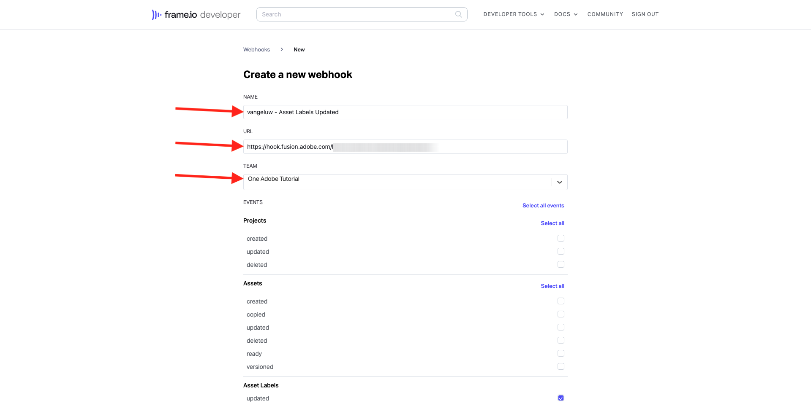
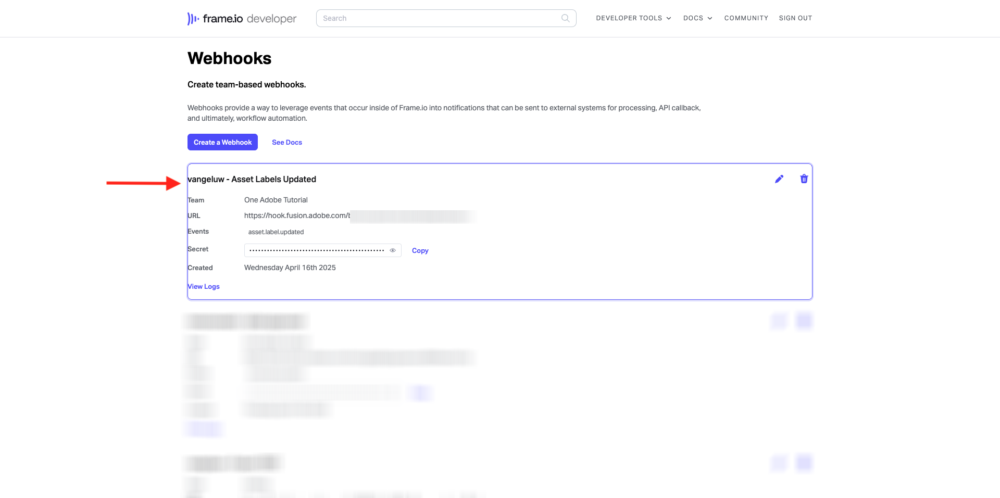
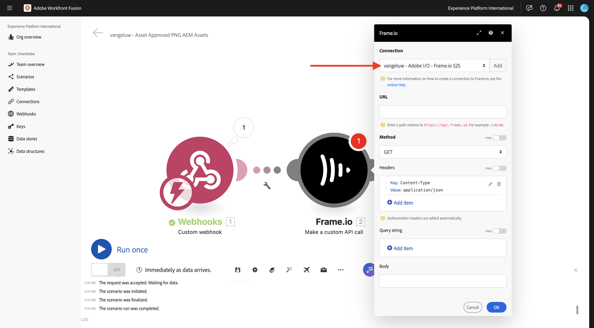
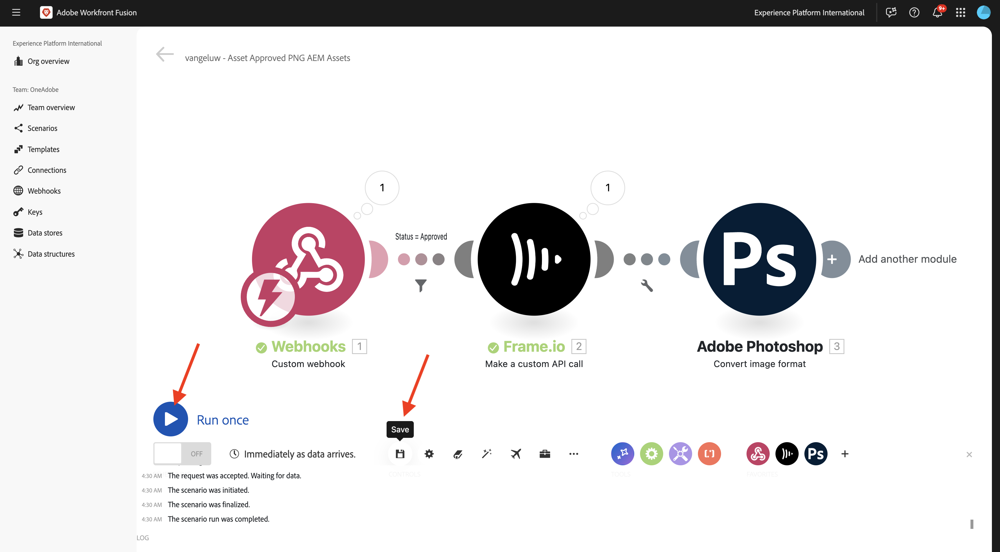
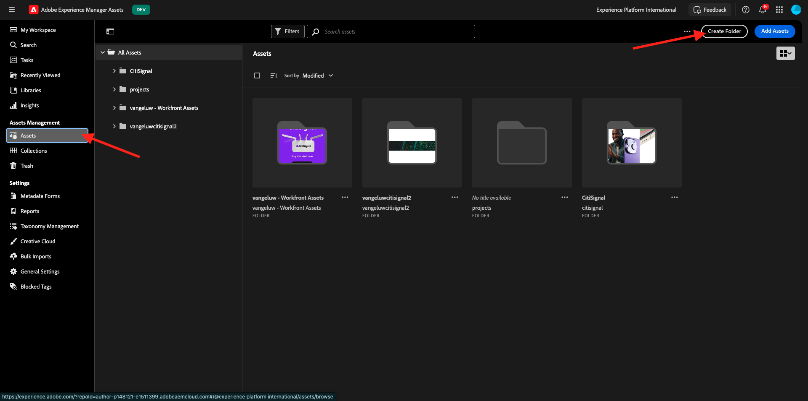

# 1.2.6 Frame I/O vers Workfront Fusion vers AEM Assets

>[!IMPORTANT]
>
>Pour effectuer cet exercice, vous devez avoir accès à un environnement de création AEM Assets CS fonctionnel. Si vous suivez l’exercice [Adobe Experience Manager Cloud Service &amp; Edge Delivery Services](./../../../modules/asset-mgmt/module2.1/aemcs.md){target="_blank"} vous aurez accès à un tel environnement.

>[!IMPORTANT]
>
>Si vous avez précédemment configuré un programme AEM Assets CS avec un environnement de création, il se peut que votre sandbox AEM CS ait été mis en veille. Étant donné que la réactivation d’un tel sandbox prend entre 10 et 15 minutes, il serait judicieux de commencer le processus de réactivation maintenant afin de ne pas se retrouver bloqué ultérieurement.

Dans l’exercice précédent, vous avez configuré un scénario qui génère automatiquement des variantes d’un fichier PSD Adobe Photoshop à l’aide d’Adobe Firefly, des API Photoshop et de Workfront Fusion. La sortie de ce scénario était un nouveau fichier PSD Photoshop.

Toutefois, les équipes commerciales n’ont pas besoin d’un fichier PSD, mais d’un fichier PNG ou d’un fichier JPG. Dans cet exercice, vous allez configurer une nouvelle automatisation qui entraînera la génération d’un fichier PNG une fois que la ressource dans Frame I/O sera approuvée, et ce fichier sera automatiquement stocké dans AEM Assets.

## 1.2.6.1 Créer un nouveau scénario

Accédez à [https://experience.adobe.com/](https://experience.adobe.com/). Ouvrez **Workfront Fusion**.

Dans le menu de gauche, accédez à **Scénarios** et sélectionnez votre dossier `--aepUserLdap--`. Cliquez sur **Créer un nouveau scénario**.

Utilisez le nom `--aepUserLdap-- - Asset Approved PNG AEM Assets`. Cliquez ensuite sur le **?** le module , saisissez le `webhook` du terme de recherche, puis cliquez sur **Webhooks**.

Cliquez sur **Webhook personnalisé**.

Cliquez sur **Ajouter** pour créer un webhook.

Utilisez le nom `--aepUserLdap-- - Frame.io Webhook`. Cliquez sur **Enregistrer**.

Vous devriez alors voir ceci. Cliquez sur **Copier l’adresse dans le presse-papiers**.

## 1.2.6.2 Configurer le Webhook dans Frame.io

Accédez à [https://developer.frame.io/](https://developer.frame.io/). Cliquez sur **OUTILS DE DÉVELOPPEMENT** puis choisissez **Actions personnalisées**.

Cliquez sur **Créer un Webhook**.

Saisissez les valeurs suivantes :

- **NAME** : utilisez `--aepUserLdap-- - Asset Labels Updated`
- **URL** : saisissez l’URL du webhook que vous venez de créer dans Workfront Fusion
- **ÉQUIPE** : sélectionnez l’équipe Frame.io appropriée, dans ce cas, **Un tutoriel Adobe**.

Faites défiler vers le bas et activez la case à cocher en regard de **Étiquettes de ressource - mises à jour**. Cliquez sur **Envoyer**.

Vous devriez alors voir ceci.

Accédez à [https://app.frame.io/projects](https://app.frame.io/projects) puis au dossier que vous avez créé précédemment et qui doit être nommé `--aepUserLdap--`. Double-cliquez pour ouvrir la ressource créée dans l’exercice précédent.

Vous devriez alors voir quelque chose comme ça. Cliquez sur le champ **Aucun statut** et modifiez le statut en **En cours**.

Revenez à Workfront Fusion. Vous devriez maintenant voir que la connexion a été **déterminée avec succès**.

Cliquez sur **Enregistrer** pour enregistrer vos modifications, puis sur **Exécuter une fois** pour effectuer un test rapide.

Revenez à Frame.io et cliquez sur le champ **En cours** et modifiez le statut en **Révision requise**.

Revenez à Workfront Fusion et cliquez sur la bulle dans le module **Custom webhook**.

La vue détaillée de la bulle vous montre les données reçues de Frame.io. Vous devriez voir différents ID. Par exemple, le champ **resource.id** affiche l’ID unique dans Frame.io de la ressource **citisignal-fibre.psd**.

## 1.2.6.3 Obtenir les détails de la ressource à partir de Frame.io

Maintenant que la communication entre Frame.io et Workfront Fusion a été établie via un webhook personnalisé, vous devriez obtenir plus de détails sur la ressource pour laquelle le libellé de statut a été mis à jour. Pour ce faire, vous utiliserez à nouveau le connecteur Frame.io dans Workfront Fusion, comme dans l’exercice précédent.

Cliquez sur le **?** le module et saisissez le `frame` du terme de recherche. Cliquez sur **Frame.io**.

Cliquez sur **Frame.io (Legacy)**.

Cliquez sur **Obtenir une ressource**.

Vérifiez que la connexion est définie sur la même connexion que celle que vous avez créée dans l’exercice précédent, qui doit être nommée `--aepUserLdap-- - Frame.io Token`.

Ensuite, vous devez fournir l’**ID de ressource**. Le **ID de ressource** est partagé par Frame.io avec Workfront Fusion dans le cadre de la communication initiale **Webhook personnalisé** et se trouve sous le champ **resource.id**. Sélectionnez **resource.id** et cliquez sur **OK**.

Cliquez sur **Enregistrer** pour enregistrer vos modifications, puis sur **Exécuter une fois** pour tester votre configuration.

Revenez à Frame.io et cliquez sur le champ **Révision requise** et modifiez le statut en **En cours**.

Revenez à Workfront Fusion et cliquez sur la bulle sur le module **Frame.io - Obtenir une ressource**. Vous devriez alors voir une vue d’ensemble similaire.

Dans les détails de la ressource fournis par Frame.io, vous trouverez un champ appelé **Libellé** qui est défini sur **en_cours**. Vous devrez utiliser ce champ ultérieurement pour configurer un filtre.

## 1.2.6.4 Convertir au format PNG

Pointez sur le module **Frame.io - Obtenir une ressource** et cliquez sur l’icône **+**.

Saisissez le terme de recherche `photoshop`, puis cliquez sur **Adobe Photoshop**.

Cliquez sur **Convertir le format d’image**.

Vérifiez que le champ **Connexion** utilise la connexion que vous avez créée précédemment et qui est nommée `--aepUserLdap-- - Adobe IO`.

Sous **Entrée**, définissez le champ **Stockage** sur **Externe** et définissez **Emplacement du fichier** pour utiliser la variable **Original** renvoyée par le module **Frame.io - Obtenir un asset**.

Cliquez ensuite sur **Ajouter un élément** sous **Sorties**.

Pour la configuration **Sorties**, définissez le champ **Stockage** sur **Stockage interne Fusion** et le **Type** sur **image/png**. Cliquez sur **Enregistrer**.

Cliquez sur **OK**.

Cliquez sur **Enregistrer** pour enregistrer vos modifications.

Ensuite, vous devez configurer un filtre pour vous assurer qu’un fichier PNG est rendu uniquement pour les ressources dont le statut est **Approuvé**. Pour ce faire, cliquez sur l’icône **Clé à molette** entre les modules **Frame.io - Obtenir une ressource** et **Adobe Photoshop - Convertir le format d’image** puis sélectionnez **Configurer un filtre**.

Configurez les champs suivants :

- **Libellé** : utilisez `Is Asset Approved`.
- **Condition** : sélectionnez le champ **Libellé** dans la réponse du module **Frame.io - Obtenir une ressource**.
- **Opérateurs de base** : sélectionnez **Égal à**.
- **Valeur** : `approved`.

Cliquez sur **OK**.

Cliquez sur **Enregistrer** pour enregistrer vos modifications, puis sur **Exécuter une fois** pour tester votre configuration.

Revenez à Frame.io et cliquez sur le champ **En cours** et modifiez le statut en **Approuvé**.

Revenez à Workfront Fusion. Vous devriez maintenant voir que tous les modules de votre scénario ont été exécutés avec succès. Cliquez sur la bulle dans le module **Adobe Photoshop - Convertir le format d’image**.

Dans les détails de l’exécution du module **Adobe Photoshop - Convertir le format d’image**, vous pouvez constater qu’un fichier PNG a été généré. L’étape suivante consiste à stocker ensuite ce fichier dans AEM Assets CS.

## 1.2.6.5 Store PNG in AEM Assets CS

Pointez sur le module **Adobe Photoshop - Convertir le format d’image** et cliquez sur l’icône **+**.

Saisissez le terme de recherche `aem` et sélectionnez **AEM Assets**.

Cliquez sur **Charger une ressource**.

Vous devez maintenant configurer votre connexion à AEM Assets CS. Cliquez sur **Ajouter**.

Utilisez les paramètres suivants :

- **Type de connexion** : **AEM Assets as a Cloud Service**.
- **Nom de la connexion** : `--aepUserLdap-- AEM Assets CS`.
- **URL de l’instance** : copiez l’URL de l’instance de votre environnement de création AEM Assets CS, qui doit se présenter comme suit : `https://author-pXXXXX-eXXXXXXX.adobeaemcloud.com`.
- **Options de remplissage des détails d’accès** : sélectionnez **Fournir un fichier JSON**.

Vous devez maintenant fournir les informations d’identification du compte technique **au format JSON**. Pour ce faire, il existe plusieurs étapes à suivre à l’aide d’AEM Cloud Manager. Pendant ce temps, gardez cet écran ouvert.

Accédez à [https://my.cloudmanager.adobe.com](https://my.cloudmanager.adobe.com){target="_blank"}. L’organisation que vous devez sélectionner est `--aepImsOrgName--`. Vous verrez alors quelque chose comme ceci. Cliquez pour ouvrir votre programme, qui doit être nommé `--aepUserLdap-- - Citi Signal`.

Cliquez sur le **de 3 points...** et sélectionnez **Developer Console**.

Cliquez sur **Se connecter avec Adobe**.

Vous êtes ensuite redirigé vers le **Developer Console**. Cliquez sur **Créer un compte technique**.

Vous devriez alors voir quelque chose comme ça. Copiez la payload JSON complète dans le presse-papiers.

Revenez à Workfront Fusion et collez la payload JSON complète dans le champ **Informations d’identification du compte technique au format JSON**. Cliquez sur **Continuer**.

Votre connexion sera ensuite validée et, en cas de réussite, elle sera automatiquement sélectionnée dans le module AEM Assets. La procédure suivante consiste à configurer un dossier. Dans le cadre de l’exercice, vous devez créer un dossier dédié.

Pour créer un dossier dédié, accédez à [https://experience.adobe.com](https://experience.adobe.com/). Assurez-vous que la bonne instance Experience Cloud est sélectionnée, ce qui doit être `--aepImsOrgName--`. Cliquez ensuite sur **Experience Manager Assets**.

Cliquez sur **Sélectionner** dans votre environnement AEM Assets CS, qui doit être nommé `--aepUserLdap-- - Citi Signal dev`.

Accédez à **Ressources** et cliquez sur **Créer un dossier**.

Saisissez le nom `--aepUserLdap-- - Frame.io PNG` et cliquez sur **Créer**.

Votre dossier est alors créé.

Revenez à Workfront Fusion, cliquez sur **Cliquez ici pour choisir le dossier** puis choisissez le dossier `--aepUserLdap-- - Frame.io PNG`.

Vérifiez que la destination est définie sur `--aepUserLdap-- - Frame.io PNG`. Ensuite, sous **Fichier Source**, sélectionnez **Map**.

Sous **Nom du fichier**, choisissez la variable `{{3.filenames[]}}`.

Sous **Données**, choisissez la variable `{{3.files[]}}`.

>[!NOTE]
>
>Les variables dans Workfront Fusion peuvent être spécifiées manuellement à l’aide de la syntaxe suivante : `{{3.filenames[]}}`. Le nombre dans la variable fait référence au module dans le scénario. Dans cet exemple, vous pouvez constater que le troisième module du scénario s’appelle **Adobe Photoshop - Convertir le format d’image** et possède un numéro de séquence de **3**. Cela signifie que la variable `{{3.filenames[]}}` accédera au champ **noms de fichier[]** à partir du module portant le numéro de séquence 3. Les numéros de séquence peuvent parfois être différents. Faites donc attention lorsque vous copiez/collez de telles variables et vérifiez toujours que le numéro de séquence utilisé est correct.

Cliquez sur **OK**.

Cliquez sur **Enregistrer** pour enregistrer vos modifications.

Vous devez ensuite définir des autorisations spécifiques pour le compte technique que vous venez de créer. Lors de la création du compte dans **Developer Console** dans **Cloud Manager**, des droits d’accès **Lecture** lui ont été accordés, mais pour ce cas d’utilisation, des droits d’accès **Écriture** sont requis. Pour ce faire, accédez à l’environnement de création AEM CS.

Accédez à [https://my.cloudmanager.adobe.com](https://my.cloudmanager.adobe.com){target="_blank"}. L’organisation que vous devez sélectionner est `--aepImsOrgName--`. Cliquez pour ouvrir votre programme, qui doit être nommé `--aepUserLdap-- - Citi Signal`. Vous verrez alors quelque chose comme ceci. Cliquez sur l’URL de création.

Cliquez sur **Se connecter avec Adobe**.

Accédez à **Paramètres** > **Sécurité** > **Utilisateurs**.

Cliquez pour ouvrir le compte d’utilisateur du compte technique.

Accédez à **Groupes** et ajoutez cet utilisateur de compte technique au groupe **DAM-Users**.

Cliquez sur **Enregistrer et fermer**.

Revenez à Workfront Fusion. Cliquez sur **Exécuter une fois** pour tester votre scénario.

Revenez à Frame.io et assurez-vous que le statut de votre ressource est de nouveau modifié en **Approuvé**.

>[!NOTE]
>
>Vous devrez peut-être d’abord la modifier en **En cours** ou **Doit être examiné**, puis la modifier en **Approuvé**.

Votre scénario Workfront Fusion sera alors activé et devrait s’achever correctement. En affichant les informations dans la bulle sur le module **AEM Assets**, vous pouvez déjà voir que le fichier PNG a été correctement stocké dans AEM Assets CS.

Revenez à AEM Assets CS et ouvrez le dossier `--aepUserLdap-- - Frame.io PNG`. Vous devriez maintenant voir le fichier PNG qui a été généré dans le cadre du scénario Workfront Fusion. Double-cliquez sur le fichier pour l’ouvrir.

Vous pouvez maintenant voir plus de détails sur les métadonnées du fichier PNG qui a été généré.

Vous avez maintenant terminé cet exercice avec succès.

## Étapes suivantes

Accédez à [ Résumé et avantages de l’automatisation des workflows Creative avec Workfront Fusion ](./summary.md){target="_blank"}

Revenez à l’automatisation des workflows Creative [avec Workfront Fusion](./automation.md){target="_blank"}

Revenir à [Tous les modules](./../../../overview.md){target="_blank"}
