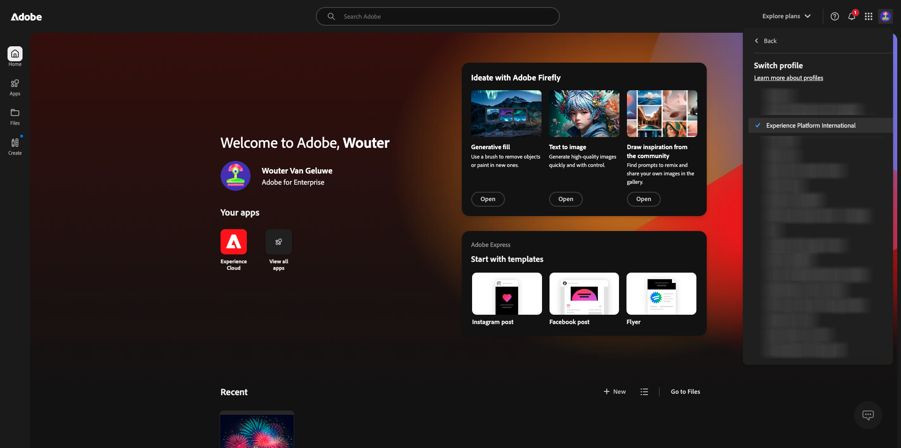
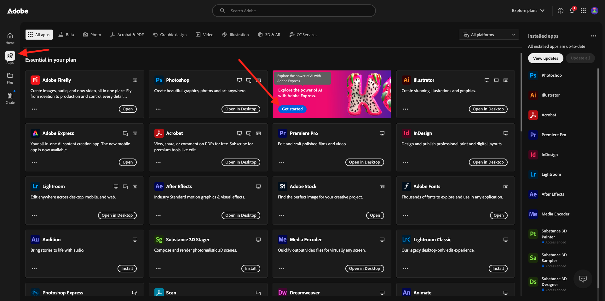
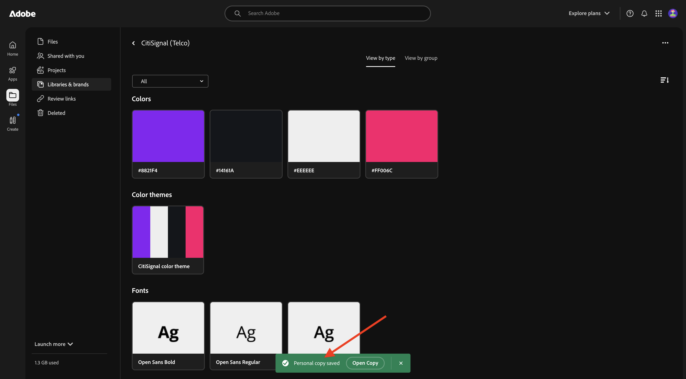
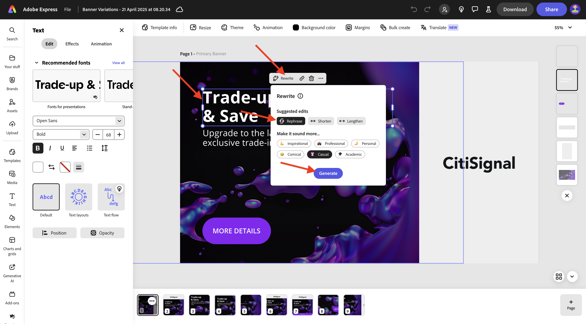
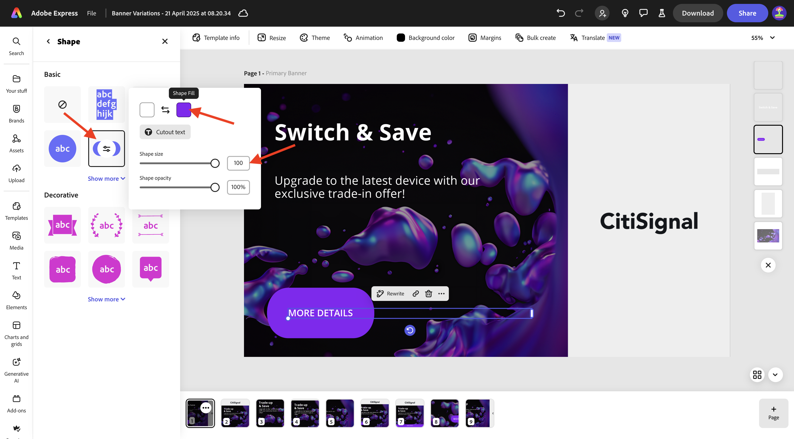
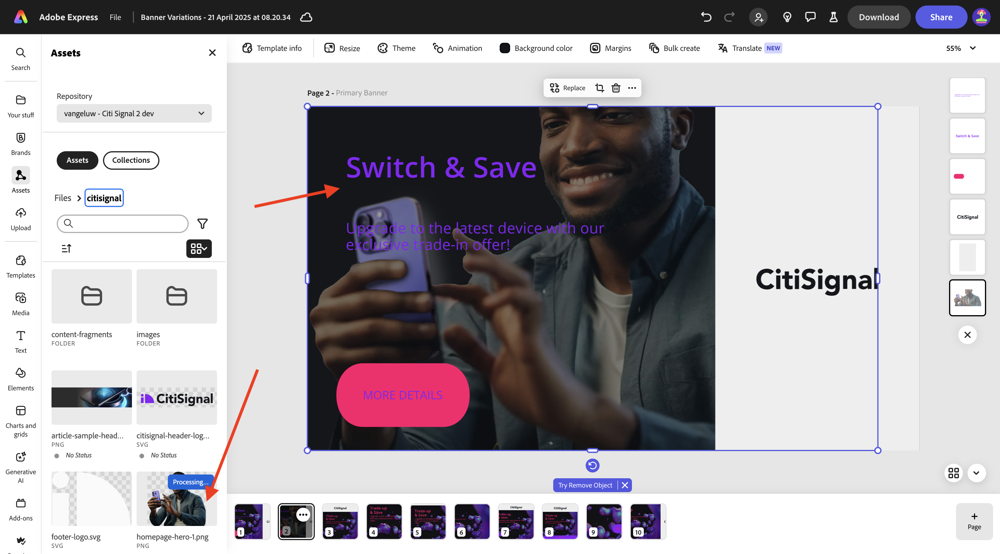
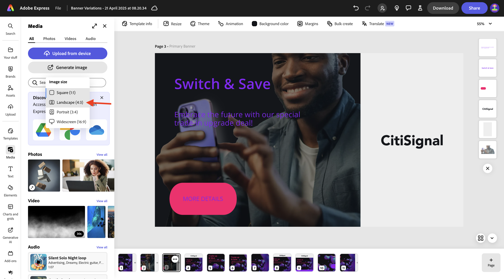

# 1.3.1 Prise en main d’Adobe Express

Ouvrez une nouvelle fenêtre de navigateur en mode privé et accédez à [https://www.adobe.com/home](https://www.adobe.com/home){target="_blank"}. Connectez-vous à l’aide de votre **compte d’entreprise ou d’école** puis sélectionnez le **de compte (aepImsOrgName)**.

Adobe Express est disponible dans le cadre des licences de votre entreprise. Pour vous assurer que vous avez accès à Adobe Express, vous devez vérifier que vous êtes connecté à la bonne organisation. Pour ce faire, cliquez sur l’icône **profil** et vérifiez quel compte est actif. Le compte que vous devez utiliser est nommé `--aepImsOrgName--`.

Cliquez sur **Changer de profil** pour changer de compte.

Sélectionnez le compte approprié dans le menu, dans ce cas **Experience Platform International** (mais il peut s’agir d’une autre organisation).

Une fois le compte approprié activé, accédez à **Applications** et cliquez sur **Commencer** sur la vignette **Adobe Express**.

Vous êtes maintenant connecté à **Adobe Express**.

## 1.3.1.1 Prise en main à partir d’un modèle de marque

Dans Adobe Express, accédez à **Marques**. Votre bibliothèque de modèles de marque est probablement vide pour le moment. CitiSignal a précédemment défini un modèle de marque, et vous devriez maintenant réutiliser ce modèle existant.

Pour ce faire, accédez à [https://www.adobe.com/files/link/1c2f92cf-17bc-4d11-6031-dbd251e6cb57](https://www.adobe.com/files/link/1c2f92cf-17bc-4d11-6031-dbd251e6cb57).

Vous devriez alors voir ceci. Cliquez sur le **de 3 points...**.

Sélectionnez **Faire une copie**.

Au bout d’une minute environ, un message devrait s’afficher pour confirmer que vous avez créé une copie personnelle du modèle de marque.

Revenez à Adobe Express, à **Marques**, puis actualisez la page. Vous devriez maintenant voir le modèle de marque **CitiSignal (Telco)**. Cliquez pour ouvrir le modèle de marque **CitiSignal (Telco)**.

Vous devriez alors voir une bibliothèque de ressources telles que des logos, des polices, des couleurs, des modèles, etc.

Accédez à **Modèles express** et cliquez pour ouvrir le modèle **Variantes de bannière**.

Cliquez sur **Démarrer un nouveau fichier**.

Vous devriez alors voir ceci.

Cliquez sur la zone de texte qui indique **Échange et enregistrement**. Sélectionnez ensuite **Réécrire** et choisissez un style, puis cliquez sur **Générer**.

Choisissez une variation, puis cliquez sur **Remplacer**.

Vous devriez alors voir le texte mis à jour.

Cliquez ensuite sur le texte **PLUS DE DÉTAILS**.

Sélectionnez **Effets**.

Accédez à **Forme** et cliquez sur **Afficher tout**.

Cliquez sur le bouton **finetune**. Modifiez la **Taille de la forme** puis cliquez sur le bouton de couleur.

Modifiez la couleur en choisissant une autre couleur du thème de couleur **CitiSignal**.

Vous devriez alors voir le bouton modifié.

Ensuite, accédez à **Marques**, puis cliquez sur **Appliquer la marque**. Vous devriez alors voir l’apparence de l’image changer.

Notez que vous pouvez également détailler les paramètres **Appliquer la marque** en cliquant sur l’icône **engrenage**.

Cliquez ensuite sur le **de 3 points...** sur l’image sur laquelle vous travaillez, puis cliquez sur **Dupliquer**.

Vous devriez alors voir une nouvelle image identique. Cliquez sur le calque d’arrière-plan sur le côté droit de l’écran.

>[!IMPORTANT]
>
>Pour effectuer cet exercice, vous devez avoir accès à un environnement de création AEM Assets CS fonctionnel. Si vous suivez l’exercice [Adobe Experience Manager Cloud Service &amp; Edge Delivery Services](./../../../modules/asset-mgmt/module2.1/aemcs.md){target="_blank"} vous aurez accès à un tel environnement.

Accédez à **Assets** dans le menu de gauche, sélectionnez votre référentiel AEM Assets CS qui doit être nommé `--aepUserLdap-- - CitiSignal dev`. Accédez ensuite au dossier **citisignal**.

Sélectionnez l’image **homepage-hero-1.png**. Vous devriez alors voir le changement de calque en arrière-plan.

Sélectionnez la zone de texte comme indiqué, puis cliquez sur **Réécrire**. Sélectionnez **Reformuler** puis sélectionnez un style spécifique. Cliquez sur **Générer**.

Sélectionnez une variante et cliquez sur **Remplacer**.

Vous devriez alors voir ceci. Cliquez ensuite sur le **de 3 points...** dans la page en bas de la page, puis cliquez sur **Dupliquer**.

Sur l’image nouvellement créée, accédez à **média** et cliquez sur **Générer une image**.

Sélectionnez **Paysage (4:3)**.

Saisissez le `laser beams running through space` d’invite et cliquez sur **Générer**.

Vous devriez alors voir une image générée par Adobe Firefly. Notez que le calque dans lequel l’image a été générée se trouve jusqu’en haut.

Descendez l’image nouvellement générée et placez-la juste au-dessus du calque d’arrière-plan précédent.

Supprimez l’ancien calque d’arrière-plan en cliquant dessus et en sélectionnant **Supprimer**.

Ajustez l’image de sorte qu’elle couvre toute la zone de travail.

Sélectionnez la zone de texte **Basculer et enregistrer** pour remplacer la couleur de police par **blanc**.

Définissez la couleur de la police sur **blanc**.

Sélectionnez l’autre zone de texte pour modifier également la couleur de la police en **blanc**.

Définissez la couleur de la police sur **blanc**.

Cliquez ensuite sur **Redimensionner** et saisissez une résolution personnalisée de **2600** x **1080**. Assurez-vous que la case **Développer l’image** est cochée. Cliquez sur **Redimensionner**.

Vous devriez alors voir ceci.

Au bout de quelques minutes, vous verrez de nouvelles variantes de l’image. Choisissez-en un, puis cliquez sur **Conserver**.

Vous devriez alors voir ceci.

Déplacez et ajustez l’image afin qu’elle remplisse l’espace disponible.

Cliquez ensuite sur **Traduire**.

Choisissez des langues telles que **français**, **néerlandais** et **espagnol**. Assurez-vous que seule la page spécifique sur laquelle vous travaillez est sélectionnée, dans ce cas **Page 3**. Cliquez sur **Traduire**.

Les traductions seront alors générées.

Vous devriez alors constater qu’un certain nombre de nouvelles pages sont en cours de création. Cliquez sur l’icône **fermer**.

Vérifiez les traductions et modifiez-les si nécessaire, comme dans cet exemple où la traduction n’est pas optimale.

Mettez à jour le texte selon les besoins.

Vos ressources sont maintenant prêtes.

## Étapes suivantes

Accédez à [ Animation et vidéo dans Adobe Express ](./ex2.md){target="_blank"}

Revenir à [Adobe Express et Adobe Experience Cloud](./express.md){target="_blank"}

Revenir à [Tous les modules](./../../../overview.md){target="_blank"}
