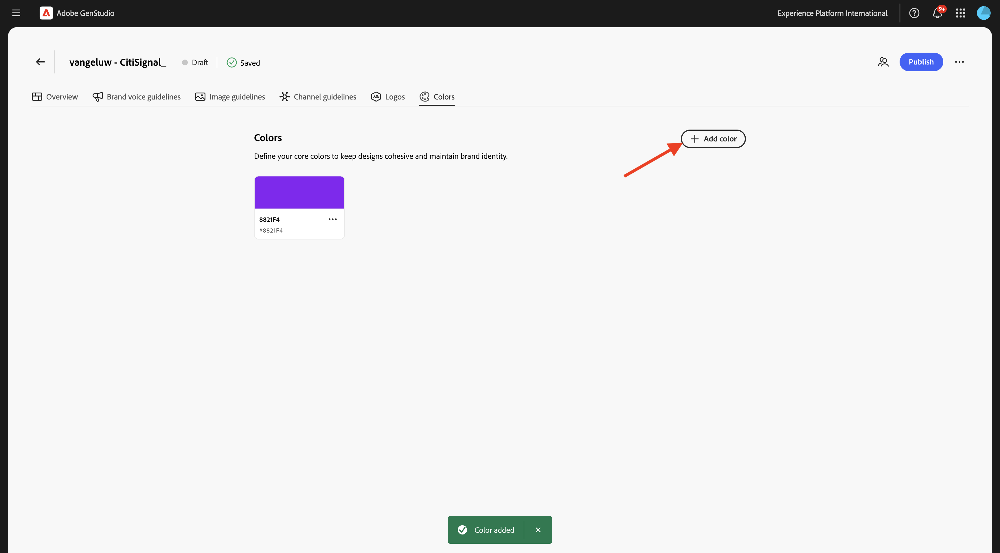
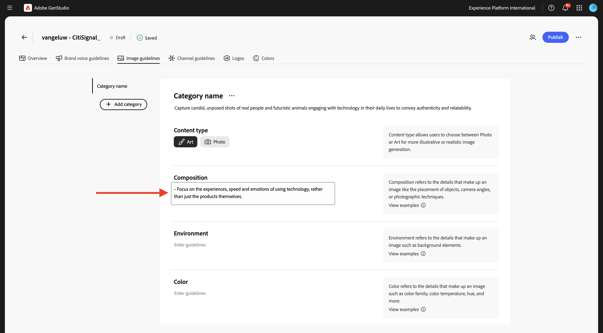
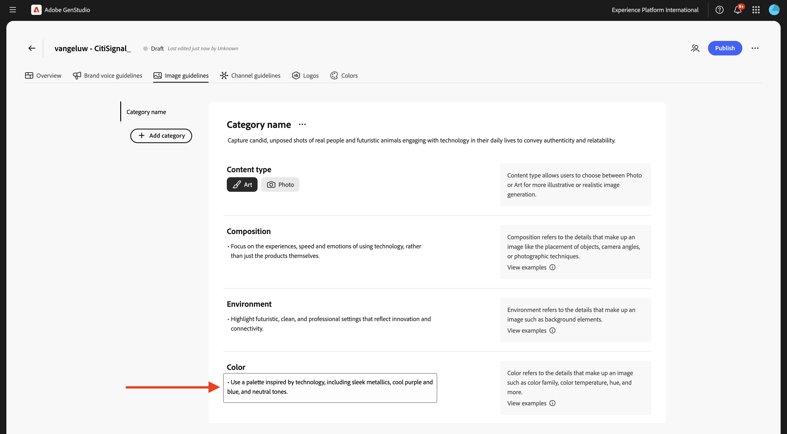

# 1.3.1 Configuration : marque

Accédez à [https://experience.adobe.com/](https://experience.adobe.com/){target="_blank"}. Ouvrez **GenStudio**.


Vous devriez alors voir ceci.


La première chose à faire pour utiliser GenStudio for Performance Marketing est de configurer votre marque. Cliquez sur l’icône **Marques**.


Cliquez sur **+ Ajouter une marque**.


Saisissez le nom `--aepUserLdap-- - CitiSignal` votre marque. Sélectionnez **Ajouter manuellement** puis cliquez sur **Ajouter une marque**.


## 1.3.1.1 Couleurs

Vous devriez alors voir ceci. Cliquez sur **Couleurs**.


Cliquez sur **+ Ajouter une couleur**.


Il y a 4 couleurs différentes à ajouter :

- `#8821F4`
- `#14161A`
- `#EEEEEE`
- `#FF006C`

Saisissez le code hexadécimal du `#8821F4` de couleur. Cliquez sur **Ajouter**.


Cliquez sur **+ Ajouter une couleur**.



Saisissez le code hexadécimal du `#14161A` de couleur. Cliquez sur **Ajouter**.


Cliquez sur **+ Ajouter une couleur**.


Saisissez le code hexadécimal du `#EEEEEE ` de couleur. Cliquez sur **Ajouter**.


Cliquez sur **+ Ajouter une couleur**.


Saisissez le code hexadécimal du `#FF006C ` de couleur. Cliquez sur **Ajouter**.


Vous devriez maintenant avoir ceci.


## 1.3.1.2 Logos

Téléchargez le fichier [CitiSignal-GSPeM-assets.zip](../../../assets/gspem/CitiSignal-GSPeM-assets.zip) sur votre bureau et décompressez-le.


Allez ensuite à **Logos**. Cliquez sur **+ Ajouter un logo**.


Cliquez sur **Parcourir**.


Accédez au dossier **CitiSignal-GSPeM-assets** > **logos** et sélectionnez ces fichiers. Cliquez sur **Ouvrir**.


Tu devrais avoir ça. Cliquez sur **Ajouter des logos**.


Tu devrais avoir ça.


## Instructions relatives à la voix de marque 1.3.1.3

Accédez ensuite à **Instructions vocales de marque**.


Pour **Tone &amp; Voice**, utilisez ce qui suit :

```
• Convey a sense of exploration and adventure
• Be authentic and conversational
• Evoke excitement and curiosity
• Speak honestly and straightforwardly
• Be approachable and relatable
• Use everyday language
```


Pour les **valeurs de marque**, utilisez la méthode suivante :

```
• Inspirational
• Sustainability
• Quality
• Durability
• Functionality
• Reliability
• Community-oriented
• Be inclusive and welcome diversity
• Encourage active lifestyles
• Promote discovery
```


Pour **Instructions éditoriales**, utilisez la commande suivante :

```
• Keep sentences concise and impactful
• Use active voice
• Lists, bullets, and series should be consistent — either they all start with a noun, or they all start with a verb
• Use serial commas
```


Pour les **restrictions éditoriales**, utilisez la commande suivante :

```
• Avoid activity-specific jargon unless it’s widely adopted
• Avoid promoting the skill level or experience level of the user of our outdoor equipment
• Avoid technical language or jargon
```


## Instructions relatives aux images 1.3.1.4

Accédez ensuite à **Instructions relatives aux images**.


Définissez **Type de contenu** sur **Illustration** et pour **Description**, utilisez la commande suivante :

```
Capture candid, unposed shots of real people and futuristic animals engaging with technology in their daily lives to convey authenticity and relatability.
```


Pour **Composition**, utilisez ce qui suit :

```
Focus on the experiences, speed and emotions of using technology, rather than just the products themselves.
```



Pour **Environnement**, utilisez la commande suivante :

```
Highlight futuristic, clean, and professional settings that reflect innovation and connectivity.
```


Pour **Couleur**, utilisez la commande suivante :

```
Use a palette inspired by technology, including sleek metallics, cool purple and blue, and neutral tones.
```



Pour **Éclairage**, utilisez la commande suivante :

```
Utilize bright, natural lighting to create a welcoming and dynamic atmosphere.
```


Pour **Mood**, utilisez la commande suivante :

```
Each image should evoke a feeling of speed, innovation and being part of the future.
```


Pour **Restrictions**, utilisez la commande suivante :

```
Avoid cluttered or busy backgrounds that detract from the main subject.
```


## Instructions relatives aux canaux 1.3.1.4

Accédez ensuite à **Instructions relatives aux canaux**.


Pour **E-mail**, utilisez les valeurs suivantes :

- **Général**

```
• Use simple, short sentences
• Be clear and concise
• Invoke a sense of adventure and exploration
```

- **Objet**

```
• Limit to less than 8 words
• Provide specific details about what’s inside the email
• Use sentence case
• Do not use end punctuation
```

- **Preheader**

```
• Limit to less than 80 characters
• Provide specific details about what’s inside the email
• Use sentence case
• Use ending punctuation
```

- **Titre**

```
• Limit to less than 12 words
• Generate excitement through compelling and exciting statements
• Use sentence case
```

- **Sous-titre** : laisser vide pour l’instant

- **Corps**

```
• Limit to less than 120 words
• Use bullet points for lists containing more than 3 items
• Use between 0 to 4 headings within the body to separate main ideas
• Use sentence case
• Use ending punctuation
```

- **Call-to-action (CTA)**

```
• Limit to between 1 to 3 short words
• Limit to less than 20 characters
• Use an action-oriented verb as the first word and intended action the end-user should take
• Avoid ending punctuation
• Use title case
```


Pour **Méta-publicités**, utilisez les valeurs suivantes :

- **Général**

```
• Use simple, short sentences
• Be clear and concise
• Invoke a sense of adventure and exploration
• Make product names prominent
• Use community-building concepts and language
```

- **Titre**

```
• Limit  to less than 8 words
• Limit to less than 27 characters
• Make it clear what action the reader should take
• Use sentence case
• Avoid ending punctuation
```

- **Corps**

```
• Limit to less than 125 characters
• Use sentence case
• Use ending punctuation
```

- **Sur le texte de l&#39;image** : laisser vide pour l&#39;instant


Pour les **bannières et affichages publicitaires**, utilisez les valeurs suivantes :

- **Général**

```
• Make readers feel inspired, interested, and sure of the next step
• Avoid word repetition
• Make product names prominent
```

- **Titre**

```
• Clearly state the main benefit of the offer
• Use sentence case
• Use ending punctuation
• Limit to less than 60 characters
```

- **Sous-titre** : laisser vide pour l’instant

- **Corps**

```
• Communicate the benefits of clicking into the offer
• Use sentence case
• Use ending punctuation
```

- **Call-to-action (CTA)**

```
• Limit to between 1 to 3 short words
• Limit to less than 20 characters
• Use an action-oriented verb as the first word
• Use title case
• Avoid ending punctuation
```


Pour **LinkedIn**, utilisez les valeurs suivantes :

- **Général** : laisser vide pour l&#39;instant

- **Headline** : laisser vide pour l&#39;instant

- **Description** : laissez ce champ vide pour l’instant.

- **Texte d&#39;introduction** : laisser vide pour l&#39;instant

- **Sur le texte de l&#39;image** : laisser vide pour l&#39;instant


Enfin, accédez à **Présentation**. Vous pouvez maintenant voir un aperçu de tout ce que vous avez configuré. Il y a une dernière chose à faire. Cliquez sur **+ Ajouter** sous **Quand utiliser cette marque**.


Saisissez le texte ci-dessous et cliquez sur **Enregistrer les modifications**.

```
This is the default brand for CitiSignal marketing campaign. Use the CitiSignal brand for all brand and product campaigns that don't require specific guidelines.
```


Cliquez sur **Publier**.


Cliquez de nouveau sur **Publier**.


Votre marque est maintenant publiée et cette marque peut maintenant être utilisée pour créer du contenu de marque. Cliquez sur **Terminé**.


## Étapes suivantes

Accédez à [Configuration : rôles, produits et modèles](./ex2.md){target="_blank"}

Revenir à [GenStudio for Performance Marketing](./genstudio.md){target="_blank"}

Revenir à [Tous les modules](./../../../overview.md){target="_blank"}
