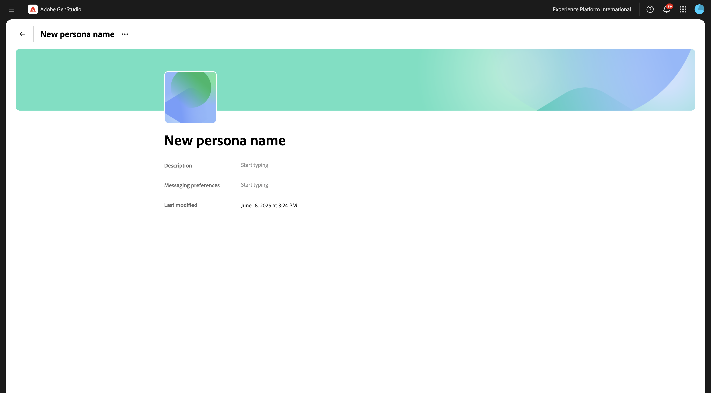
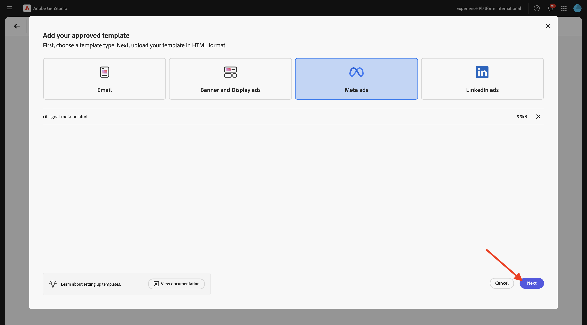
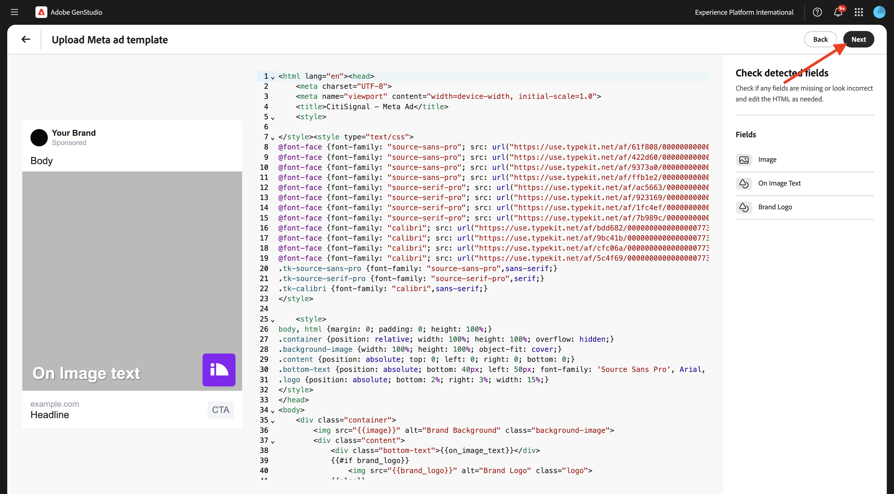
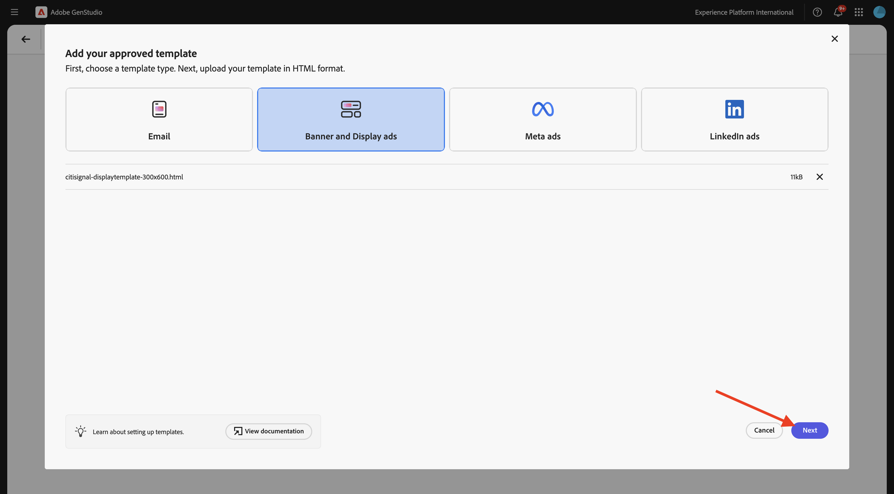
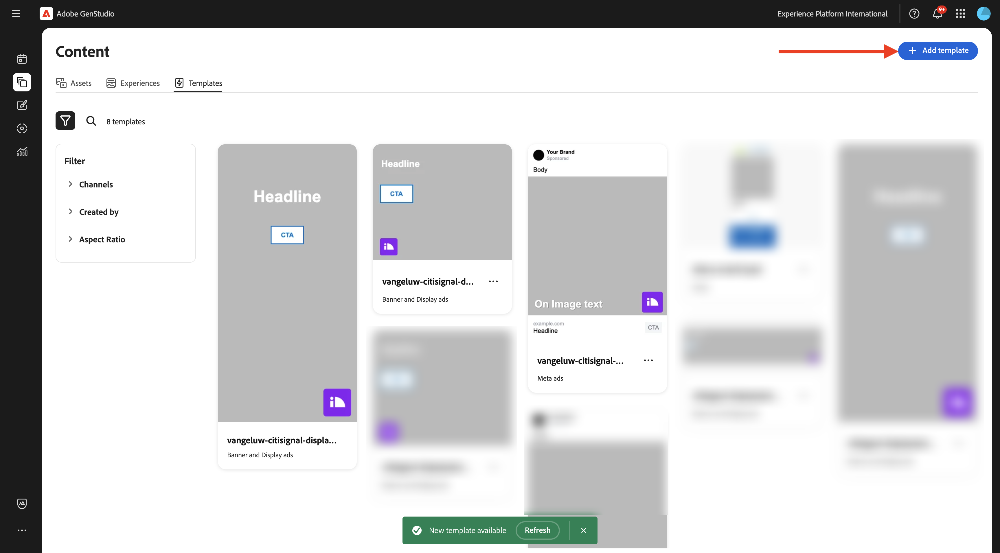

# 1.3.2 Configuration : personnages, produits et modèles

## Produits 1.3.2.1

Cliquez sur le **de 3 points...**, puis sélectionnez **Produits**.


Cliquez sur **+ Ajouter un produit**.


Sélectionnez **Ajouter manuellement** puis cliquez sur **Continuer**.


Vous devriez alors voir ceci.


Pour le nom du produit, utilisez `--aepUserLdap-- - CitiSignal Mobile Flex Plan`.

Pour le champ **Description**, utilisez ce qui suit :

```
CitiSignal Mobile Flex is a next-gen 5G mobile plan that adapts to your lifestyle. Choose from Unlimited, Family Share, or Data Saver tiers, with optional add-ons like international roaming, hotspot tethering, and SmartFamily™ parental controls. All plans include priority access to CitiSignal’s 5G UltraWide network and seamless integration with CitiSignal Fiber for unified billing, shared data pools, and SmartSwitch™ connectivity. 
```

Pour le champ **Proposition de valeur**, utilisez ce qui suit :

```
A mobile plan that flexes with your life—fast, fair, and fully connected to your world.
```

Pour le champ **Préférences de messagerie**, utilisez ce qui suit :

```
Remote Professionals: “Work from anywhere with a mobile plan that’s as flexible as your schedule.”
Online Gamers: “Unlimited 5G. No throttling. Just pure performance—on the go.”
Smart Home Families: “One plan. One bill. One less thing to worry about.”
```

Votre configuration de produit doit maintenant ressembler à ceci. Cliquez sur l’icône **précédent**.


Cliquez sur **+ Ajouter un produit**.


Sélectionnez **Ajouter manuellement** puis cliquez sur **Continuer**.


Vous devriez alors voir ceci.


Pour le nom du produit, utilisez `--aepUserLdap-- - CitiSignal Fiber Max`.

Pour le champ **Description**, utilisez ce qui suit :

```
CitiSignal Fiber Max is our premium residential internet plan, engineered for households that demand uncompromising speed, stability, and coverage. With symmetrical speeds up to 2 Gbps, it’s ideal for remote professionals juggling Zoom calls and cloud apps, gamers chasing millisecond precision, and families running dozens of smart devices. The plan includes a Wi-Fi 6E router, optional mesh extenders for whole-home coverage, and proactive network monitoring. 
```

Pour le champ **Proposition de valeur**, utilisez ce qui suit :

```
Power your work, play, and home with the fastest, most reliable fiber internet—built for the way you live today and tomorrow.
```

Pour le champ **Préférences de messagerie**, utilisez ce qui suit :

```
Remote Professionals: “Stay connected, stay productive—no matter how many meetings or megabytes your day demands.”
Online Gamers: “Zero lag. Zero mercy. Dominate with 2 Gbps fiber and ultra-low ping.”
Smart Home Families: “Every room. Every device. Always on. Welcome to whole-home harmony.”
```

Votre configuration de produit doit maintenant ressembler à ceci. Cliquez sur l’icône **précédent**.


Vous devriez alors voir les 2 produits que vous avez configurés.


## 1.3.2.2 Personas

Cliquez sur le **de 3 points...**, puis sélectionnez **Personnages**.


Cliquez sur **+ Ajouter une persona**.


Sélectionnez **Ajouter manuellement** puis cliquez sur **Continuer**.


Vous devriez alors voir ceci.



Pour le nom du persona, utilisez `--aepUserLdap-- - Smart Home Families`.

Pour le champ **Description**, utilisez ce qui suit :

```
These are tech-forward households with multiple connected devices—smart TVs, thermostats, security systems, voice assistants, and more. They value convenience, automation, and seamless connectivity across the home. They often have children and are concerned about online safety, parental controls, and whole-home coverage.
```

Pour le champ **Préférences de messagerie**, utilisez ce qui suit :

```
Friendly, family-oriented tone
Visuals showing whole-home coverage and device compatibility
Messaging that highlights security, parental controls, and easy setup
Bundled offers (e.g., mesh Wi-Fi, smart home consultations)
How-to content or setup guides for non-tech-savvy users
```

Votre configuration personnelle doit maintenant ressembler à ceci. Cliquez sur l’icône **précédent**.


Cliquez sur **+ Ajouter une persona**.


Sélectionnez **Ajouter manuellement** puis cliquez sur **Continuer**.


Vous devriez alors voir ceci.


Pour le nom du persona, utilisez `--aepUserLdap-- - Online Gamers`.

Pour le champ **Description**, utilisez ce qui suit :

```
This persona includes competitive and casual gamers who demand ultra-fast, low-latency internet. They often stream gameplay, participate in multiplayer matches, and use voice chat platforms. They are highly sensitive to lag, jitter, and packet loss, and they’re vocal about their experiences online. Many are early adopters of new tech and value performance above all else.
```

Pour le champ **Préférences de messagerie**, utilisez ce qui suit :

```
Bold, energetic tone with gaming lingo
Metrics like ping time, jitter, and upload/download speeds
Visuals showing latency improvements or side-by-side comparisons
Endorsements from gaming influencers or esports teams
Promotions tied to gaming platforms or bundles (e.g., free months of Xbox Game Pass)
```

Votre configuration personnelle doit maintenant ressembler à ceci. Cliquez sur l’icône **précédent**.


Cliquez sur **+ Ajouter une persona**.


Sélectionnez **Ajouter manuellement** puis cliquez sur **Continuer**.


Vous devriez alors voir ceci.


Pour le nom du persona, utilisez `--aepUserLdap-- - Remote Professionals`.

Pour le champ **Description**, utilisez ce qui suit :

```
These are knowledge workers, freelancers, consultants, and hybrid employees who rely on a stable, high-speed internet connection to maintain productivity from home. Their workdays are filled with video calls, cloud-based collaboration, and large file transfers. They often use multiple devices simultaneously and expect seamless performance across all of them. Many are tech-savvy and value proactive customer support and service transparency.
```

Pour le champ **Préférences de messagerie**, utilisez ce qui suit :

```
Clear, professional tone with a focus on productivity and reliability
Testimonials or case studies from similar professionals
Visuals like speed comparison charts and uptime guarantees
Emphasis on 24/7 support and service-level agreements
Messaging that highlights “work-from-anywhere” flexibility
```

Votre configuration personnelle doit maintenant ressembler à ceci. Cliquez sur l’icône **précédent**.


Vous devriez alors voir les 3 personnages que vous avez configurés.


## 1.3.2.3 modèles

Dans l’exercice précédent, vous avez téléchargé le fichier [CitiSignal-GSPeM-assets.zip](../../../assets/gspem/CitiSignal-GSPeM-assets.zip) sur votre bureau et l’avez décompressé. Ce dossier contient 4 exemples de modèles que vous devez maintenant importer dans GenStudio.


Accédez à **Contenu** > **Modèles**. Cliquez sur **+ Ajouter un modèle**.


Sélectionnez **Méta-publicités** puis cliquez sur **Parcourir**.


Dans le dossier contenant les fichiers **CitiSignal-GSPeM-assets** téléchargés, accédez au dossier **templates**. Sélectionnez le fichier **citisignal-meta-ad.html** et cliquez sur **Ouvrir**.


Vous devriez alors voir ceci. Cliquez sur **Suivant**.



Cliquez sur **Suivant**.



Utilisez ceci pour le champ **Nom du modèle** :
`--aepUserLdap---citisignal-meta-ad` et définissez les proportions sur **1:1**. Cliquez sur **Publier le modèle**.


Votre modèle a maintenant été enregistré et est disponible dans la bibliothèque de modèles.


Cliquez sur **+ Ajouter un modèle**.


Sélectionnez **Bannière et afficher les publicités** puis cliquez sur **Parcourir**.


Dans le dossier contenant les fichiers **CitiSignal-GSPeM-assets** téléchargés, accédez au dossier **templates**. Sélectionnez le fichier **citisignal-displaytemplate-300x250.html** et cliquez sur **Ouvrir**.


Vous devriez alors voir ceci. Cliquez sur **Suivant**.


Cliquez sur **Suivant**.


Utilisez ceci pour le champ **Nom du modèle** :
`--aepUserLdap---citisignal-displaytemplate-300x250` et définissez les valeurs **Largeur de l’annonce** et **Hauteur de l’annonce** sur 300 x 250 ****. Cliquez sur **Publier le modèle**.


Votre modèle a maintenant été enregistré et est disponible dans la bibliothèque de modèles.


Cliquez sur **+ Ajouter un modèle**.


Sélectionnez **Bannière et afficher les publicités** puis cliquez sur **Parcourir**.


Dans le dossier contenant les fichiers **CitiSignal-GSPeM-assets** téléchargés, accédez au dossier **templates**. Sélectionnez le fichier **citisignal-displaytemplate-300x600.html** et cliquez sur **Ouvrir**.


Vous devriez alors voir ceci. Cliquez sur **Suivant**.



Cliquez sur **Suivant**.


Utilisez ceci pour le champ **Nom du modèle** :
`--aepUserLdap---citisignal-displaytemplate-300x600` et définissez les valeurs **Largeur de l’annonce** et **Hauteur de l’annonce** sur 300 x 600 ****. Cliquez sur **Publier le modèle**.


Votre modèle a maintenant été enregistré et est disponible dans la bibliothèque de modèles.


Cliquez sur **+ Ajouter un modèle**.



Sélectionnez **Bannière et afficher les publicités** puis cliquez sur **Parcourir**.


Dans le dossier contenant les fichiers **CitiSignal-GSPeM-assets** téléchargés, accédez au dossier **templates**. Sélectionnez le fichier **citisignal-displaytemplate-970x250.html** et cliquez sur **Ouvrir**.


Vous devriez alors voir ceci. Cliquez sur **Suivant**.


Cliquez sur **Suivant**.


Utilisez ceci pour le champ **Nom du modèle** :
`--aepUserLdap---citisignal-displaytemplate-970x250` et définissez les valeurs **Largeur de l’annonce** et **Hauteur de l’annonce** sur 970 x 250 ****. Cliquez sur **Publier le modèle**.


Votre modèle a maintenant été enregistré et est disponible dans la bibliothèque de modèles.


Vous avez maintenant configuré les modèles dont vous avez besoin pour l’exercice suivant.

## Étapes suivantes

Accédez à [Activation de Campaign au format Meta](./ex3.md){target="_blank"}

Revenir à [GenStudio for Performance Marketing](./genstudio.md){target="_blank"}

Revenir à [Tous les modules](./../../../overview.md){target="_blank"}
