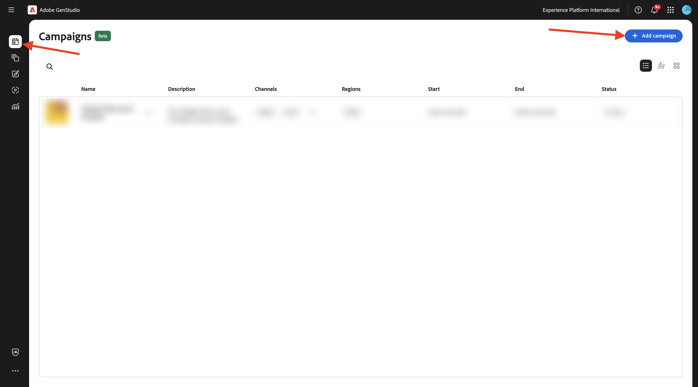
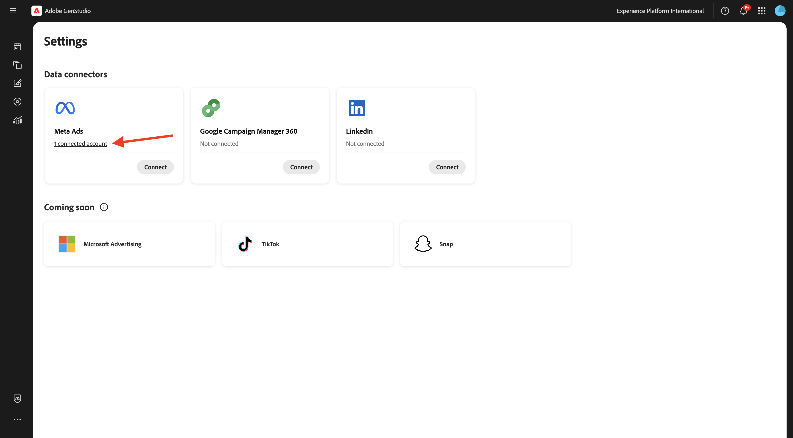
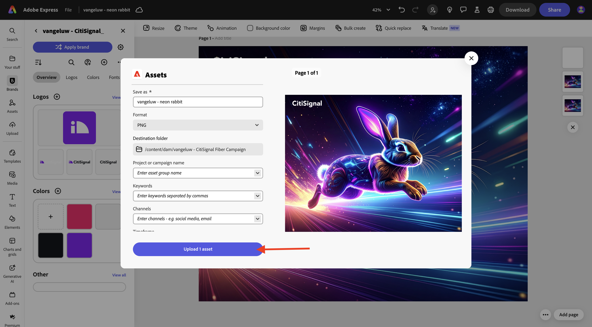
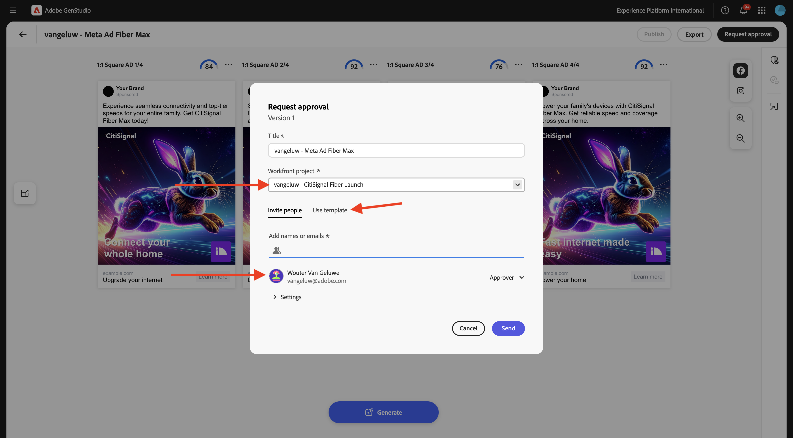
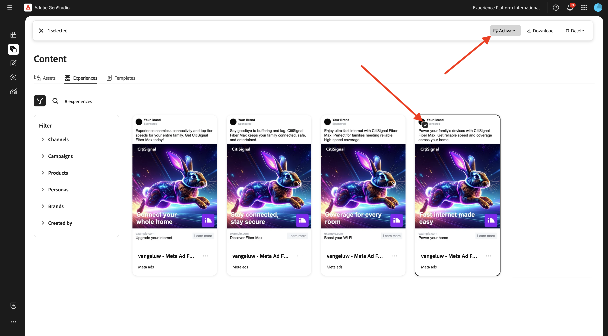

# 1.3.3 Activation de Campaign vers Meta

>[!IMPORTANT]
>
>Pour effectuer cet exercice, vous devez avoir accès à un environnement de création AEM Assets CS fonctionnel dans lequel AEM Assets Content Hub est activé.
>
>Il existe deux options à prendre en compte :
>
>- Si vous participez à l’atelier d’activation technique de GenStudio for CSC, vos instructeurs ont créé pour vous un environnement de création AEM Assets CS. Vérifiez avec eux quel est le nom et comment procéder.
>
>- Si vous suivez le parcours complet du tutoriel One Adobe, passez à l’exercice [Adobe Experience Manager Cloud Service &amp; Edge Delivery Services](./../../../modules/asset-mgmt/module2.1/aemcs.md){target="_blank"}. Suivez les instructions qui s’affichent à cet endroit et vous aurez accès à un tel environnement.

>[!IMPORTANT]
>
>Pour exécuter toutes les étapes de cet exercice, vous devez avoir accès à un environnement Adobe Workfront existant et, dans cet environnement, vous devez avoir créé un projet et un workflow d’approbation. Si vous suivez l’exercice [Gestion des workflows avec Adobe Workfront](./../../../modules/workflow-planning/module1.2/workfront.md){target="_blank"} la configuration requise sera disponible.

>[!IMPORTANT]
>
>Si vous avez précédemment configuré un programme AEM Assets CS avec un environnement de création et AEM Assets, il se peut que votre sandbox AEM CS ait été mis en veille. Étant donné que la réactivation d’un tel sandbox prend entre 10 et 15 minutes, il serait judicieux de lancer le processus de réactivation maintenant afin de ne pas avoir à l’attendre plus tard.

## 1.3.3.1 Créer une campagne

Dans **GenStudio for Performance Marketing**, accédez à **Campagnes** dans le menu de gauche. Cliquez sur **+ Ajouter une campagne**.



Vous devriez alors voir une vue d’ensemble de campagne vide.


Pour le nom du champ, utilisez `--aepUserLdap-- - CitiSignal Fiber Launch Campaign`.

Pour le champ **Description**, utilisez le texte ci-dessous.

```
The CitiSignal Fiber Launch campaign introduces CitiSignal’s flagship fiber internet service—CitiSignal Fiber Max—to key residential markets. This campaign is designed to build awareness, drive sign-ups, and establish CitiSignal as the go-to provider for ultra-fast, reliable, and future-ready internet. The campaign will highlight the product’s benefits for remote professionals, online gamers, and smart home families, using persona-driven messaging across digital and physical channels.
```

Pour le champ **Objectif**, utilisez le texte ci-dessous.

```
Generate brand awareness in target regions
Drive early sign-ups and pre-orders for CitiSignal Fiber Max
Position CitiSignal as a premium, customer-first fiber internet provider
Educate consumers on the benefits of fiber over cable or DSL
```

Pour le champ **Message clé**, utilisez le texte ci-dessous.

```
Supporting Points:
Symmetrical speeds up to 2 Gbps
Whole-home Wi-Fi 6E coverage
99.99% uptime guarantee
24/7 concierge support
No data caps or throttling
 Channels:
Digital Advertising: Google Display, YouTube pre-roll, Meta (Facebook/Instagram), TikTok (for gamers)
Email Marketing: Persona-segmented drip campaigns
Social Media: Organic and paid posts with testimonials, speed demos, and influencer partnerships
Out-of-Home (OOH): Billboards, transit ads in suburban commuter corridors
Local Events: Pop-up booths at tech expos, family festivals, and gaming tournaments
Direct Mail: Personalized flyers with QR codes for early sign-up discounts
 
Target Regions:
Primary Launch Markets:
Denver Metro Area, CO
Austin, TX
Raleigh-Durham, NC
Salt Lake City, UT
Demographic Focus:
Suburban neighborhoods with high remote work density
Areas with high smart home adoption
Zip codes with underserved or dissatisfied cable customers
```

Voici ce que vous devriez avoir :


Faites défiler la page vers le bas pour afficher plus de champs :


Pour le champ **Début**, définissez-le sur la date d’aujourd’hui.

Pour le champ **Fin**, définissez-le sur une date dans 1 mois.

Pour le champ **Statut**, définissez-le sur **Actif**.

Pour le champ **Canaux**, définissez-le sur **Meta**, **E-mail**, **Média payant**, **Affichage**.

Pour le champ **Régions**, sélectionnez une région de votre choix.

Pour le champ Pour le champ **Références** > **Produits** : choisissez le `--aepUserLdap-- - CitiSignal Fiber Max` de produit.

**Références** > **Personnages** : sélectionnez les personnages `--aepUserLdap-- - Remote Professionals`, `--aepUserLdap-- - Online Gamers`, `--aepUserLdap-- - Smart Home Families`

Vous devriez alors voir ceci :


Votre campagne est maintenant prête. Cliquez sur la **flèche** pour revenir en arrière.


Votre campagne apparaît alors dans la liste. Cliquez sur l’icône de vue Calendrier pour remplacer la vue par le calendrier des campagnes.


Vous devriez alors voir un calendrier des campagnes qui donne une idée plus visuelle des campagnes actives à quel moment.


## Connexion de la configuration 1.3.3.2 à Meta

>[!IMPORTANT]
>
>Pour configurer votre connexion à Meta, vous devez disposer d’un compte d’utilisateur Meta et ce compte d’utilisateur doit être ajouté à un compte professionnel Meta.

Pour configurer la connexion à Meta, cliquez sur le **de 3 points...** et sélectionnez **Paramètres**.


Cliquez sur **Connexion** pour **Meta Ads**.


Connectez-vous en utilisant votre compte Meta. Cliquez sur **Continuer**.


Si votre compte est lié à un compte professionnel Meta, vous pourrez sélectionner le portefeuille professionnel qui a été configuré dans Meta.


Une fois la connexion établie, cliquez sur la ligne indiquant **X compte(s) connecté(s)**.



Vous devriez alors voir les détails du compte professionnel Meta connecté à GenStudio for Performance Marketing.


## 1.3.3.3 Créer une ressource

Accédez à [https://firefly.adobe.com/](https://firefly.adobe.com/){target="_blank"}. Saisissez le `a neon rabbit running very fast through space` d’invite et cliquez sur **Générer**.


Plusieurs images sont alors générées. Choisissez l’image qui vous plaît le plus, cliquez sur l’icône **Partager** sur l’image, puis sélectionnez **Ouvrir dans Adobe Express**.


L’image que vous venez de générer est alors disponible pour modification dans Adobe Express. Vous devez maintenant ajouter le logo CitiSignal sur l&#39;image. Pour ce faire, accédez à **Marques**.


Vous devriez alors voir apparaître dans Adobe Express le modèle de marque CitiSignal que vous avez créé dans GenStudio for Performance Marketing. Cliquez pour sélectionner le modèle de votre marque qui doit être nommé `--aepUserLdap-- - CitiSignal`.


Accédez à **Logos** et cliquez sur le logo **blanc** Citisignal pour le déposer sur l’image.


Positionnez le logo CitiSignal en haut de votre image, pas trop loin du milieu.


Cliquez ensuite sur **Partager**.


Sélectionnez **AEM Assets**.


Cliquez sur **Sélectionner un dossier**. Remplacez le nom de la ressource par `--aepUserLdap-- - neon rabbit`.


Sélectionnez votre référentiel CS AEM Assets, qui doit être nommé `--aepUserLdap-- - CitiSignal`, puis sélectionnez le dossier `--aepUserLdap-- - CitiSignal Fiber Campaign`. Cliquez sur **Sélectionner**.


Vous devriez alors voir ceci. Cliquez sur **Charger 1 ressource**. Votre image sera maintenant téléchargée sur AEM Assets CS.



Accédez à [https://experience.adobe.com/](https://experience.adobe.com/){target="_blank"}. Ouvrez **Experience Manager Assets**.


Sélectionnez votre environnement AEM Assets CS, qui doit être nommé `--aepUserLdap-- - CitiSignal dev`.


Accédez à **Assets** puis double-cliquez sur le dossier `--aepUserLdap-- - CitiSignal Fiber Campaign`.


Vous devriez alors voir quelque chose de similaire à ceci. Double-cliquez sur le `--aepUserLdap-- - neon rabbit` d’image.


L’image `--aepUserLdap-- - neon rabbit` s’affiche alors. Remplacez le **Statut** par **Approuvé**, puis cliquez sur **Enregistrer**

>[!IMPORTANT]
>
>Si l’état d’une image n’est pas défini sur **Approuvé**, l’image ne sera pas visible dans GenStudio for Performance Marketing. Seules les ressources approuvées sont accessibles dans GenStudio for Performance Marketing.


Revenez à GenStudio for Performance Marketing. Dans le menu de gauche, accédez à **Assets** et sélectionnez votre référentiel AEM Assets CS, qui doit être nommé `--aepUserLdap-- - CitiSignal`. L’image que vous venez de créer et d’approuver est alors disponible dans GenStudio for Performance Marketing.


## 1.3.3.4 Créer et approuver une publicité Meta

Dans le menu de gauche, accédez à **Créer**. Sélectionnez **Meta**.


Sélectionnez le modèle **Meta ad** que vous avez importé précédemment et qui est nommé `--aepUserLdap---citisignal-meta-ad`. Cliquez sur **Utiliser**.


Vous devriez alors voir ceci. Remplacez le nom de votre publicité par `--aepUserLdap-- - Meta Ad Fiber Max`.

Sous **Paramètres**, sélectionnez les options suivantes :

- **Marque** : `--aepUserLdap-- - CitiSignal`
- **Langue** : `English (US)`
- **Persona** : `--aepUserLdap-- - Smart Home Families`
- **Produit** : `--aepUserLdap-- - CitiSignal Fiber Max`

Cliquez sur **Sélectionner à partir du contenu**.


Sélectionnez l’`--aepUserLdap-- - neon rabbit.png` de la ressource. Cliquez sur **Utiliser**.


Saisissez le `focus on lightning fast internet for big families` d’invite et cliquez sur **Générer**.


Vous devriez alors voir quelque chose comme ça. Vos annonces sont maintenant prêtes à être examinées et approuvées. Pour ce faire, cliquez sur **Demander une approbation**, qui se connectera à Adobe Workfront.


Sélectionnez votre projet Adobe Workfront, qui doit être nommé `--aepUserLdap-- - CitiSignal Fiber Launch`. Saisissez votre propre adresse e-mail sous **Inviter des personnes** et assurez-vous que le rôle est défini sur **Approbateur**.



Vous pouvez également utiliser un workflow d’approbation existant dans Adobe Workfront. Pour ce faire, cliquez sur **Utiliser le modèle** et sélectionnez le modèle `--aepuserLdap-- - Approval Workflow`. Cliquez sur **Envoyer**.


Cliquez sur **Afficher les commentaires dans Workfront**. Vous serez désormais envoyé à l’interface utilisateur de l’épreuve Adobe Workfront.


Dans l’interface utilisateur d’Adobe Workfront Proof, cliquez sur **Prendre une décision**.


Sélectionnez **Approuvé** et cliquez sur **Prendre une décision**.


Cliquez sur **Publier**.


Sélectionnez votre `--aepUserLdap-- - CitiSignal Fiber Launch Campaign` Campaign et cliquez sur **Publier**.


Cliquez sur **Ouvrir dans le contenu**.


Les 4 annonces Meta sont désormais disponibles sous **Contenu** > **Expériences**.


## 1.3.3.5 Publier l’annonce publicitaire sur Meta

Sélectionnez l’une des publicités, puis cliquez sur **Activer**.



Choisissez un **Call to action** à partir de la liste et saisissez un exemple d&#39;URL. Cliquez sur **Suivant**.


Sélectionnez le compte Meta, la page Facebook associée, la campagne Meta et la visionneuse d’annonces Meta.

Donnez un nom à votre ajout, puis utilisez `--aepUserLdap-- Fiber Max Ad`.

Cliquez sur **Suivant**.


Cliquez sur **Publier**.


Cliquez sur **OK**.


Le statut de votre publicité est maintenant défini sur **Publication**, ce qui peut prendre quelques minutes.


Au bout de quelques minutes, le statut de la publicité passe à **Publiée**. Cela signifie que la publicité a été envoyée de GenStudio for Performance Marketing vers Meta. Cela ne signifie pas que la publicité est déjà publiée dans Meta ! Il reste un certain nombre de mesures à prendre dans le compte professionnel Meta pour prendre la publicité et la publier afin qu’elle soit visible par les utilisateurs sur les différentes plateformes de Meta.

Cliquez sur **Afficher les détails**.


Cliquez sur **Ouvrir** pour accéder à votre compte professionnel Meta.

>[!IMPORTANT]
>
>Si vous n’avez pas accès au compte professionnel Meta connecté à votre environnement, vous ne pourrez pas visualiser cette annonce publicitaire dans Meta.


Voici un aperçu de l’annonce que vous venez de créer, mais qui se trouve désormais dans Meta.


Vous avez maintenant terminé cet exercice.

## Étapes suivantes

Accédez à [&#x200B; Résumé et avantages &#x200B;](./summary.md){target="_blank"}

Revenir à [GenStudio for Performance Marketing](./genstudio.md){target="_blank"}

Revenir à [Tous les modules](./../../../overview.md){target="_blank"}
