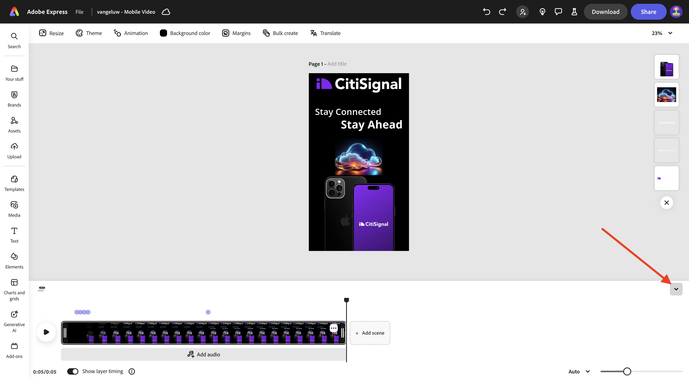
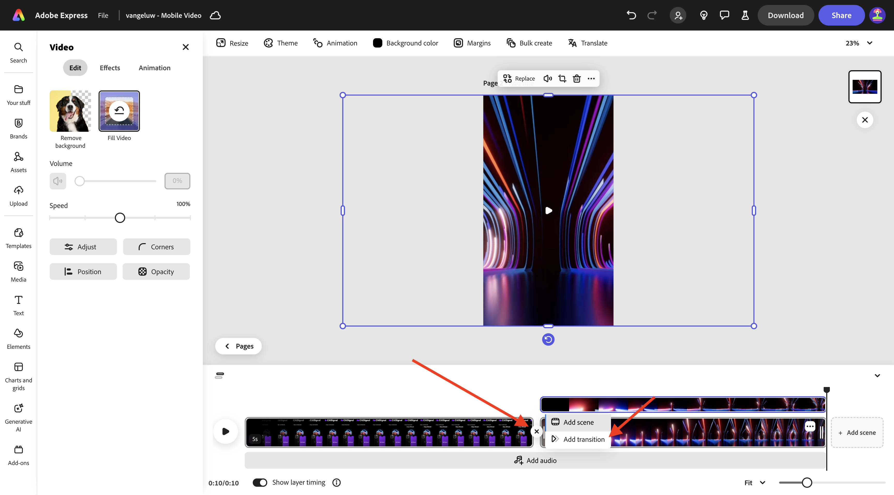
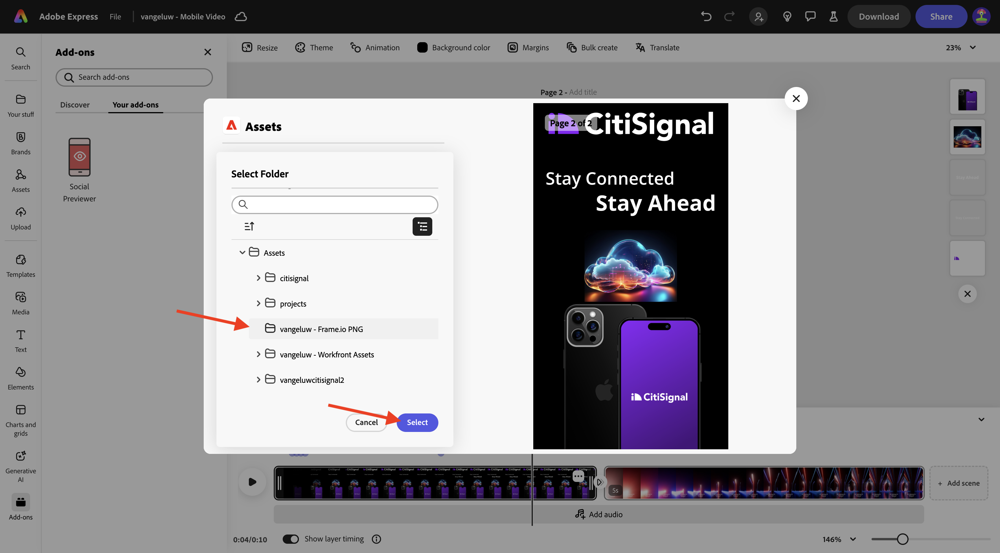

# 1.4.2 Animation et vidéo dans Adobe Express

Avant de commencer cet exercice, téléchargez les ressources requises à partir de [https://one-adobe-tech-insiders.s3.us-west-2.amazonaws.com/one-adobe/Adobe_Express.zip](https://one-adobe-tech-insiders.s3.us-west-2.amazonaws.com/one-adobe/Adobe_Express.zip){target="_blank"} et décompressez-les sur votre bureau.

## 1.4.2.1 Créer une vidéo

Accédez à [https://new.express.adobe.com/](https://new.express.adobe.com/){target="_blank"}. Cliquez sur l’icône **+** pour créer une **image**.

Accédez à **Vidéo** puis sélectionnez **Vidéo mobile**.

Vous devriez alors voir ceci.

Sélectionnez **Couleur d’arrière-plan** puis choisissez **noir**.

Vous devez ensuite ajouter le logo **CitiSignal**. Accédez à **Marques** et sélectionnez le logo CitiSignal blanc. Cliquez sur le **de 3 points...** et sélectionnez **Placer**.

Centrez le logo CitiSignal en haut de l&#39;image.

Accédez à **Texte** puis sélectionnez **Ajouter votre texte**.

Saisissez le `Stay Connected` de texte et placez la zone de texte à un emplacement similaire, comme illustré dans l’image ci-dessous.

Accédez à **Texte** puis sélectionnez **Ajouter votre texte**. Saisissez le `Stay Ahead` de texte.

Placez la zone de texte à un emplacement similaire, comme illustré dans l’image ci-dessous.

Sélectionnez la première zone de texte avec le texte **Restez connecté**. Accédez à **Marques**, à **Polices**. Cliquez sur la **3 points...** sur la 1ère police et cliquez sur **Appliquer**.

Sélectionnez la deuxième zone de texte avec le texte **Rester en avant**. Accédez à **Marques**, à **Polices**. Cliquez sur la **de 3 points...** sur la 3e police et cliquez sur **Appliquer**.

Vous devriez alors voir ceci. Accédez à **Média** et sélectionnez **Générer l’image**.

Saisissez le `futuristic looking transparent cloud on a black background` d’invite et cliquez sur **Générer**.

Sélectionnez **Paysage (4:3)**.

Vous devriez alors voir ceci. Sélectionnez l’une des variations.

Centrer l’image générée. Accédez à **Média** puis cliquez sur **Télécharger à partir de l’appareil**.

Accédez à votre bureau, au dossier **Adobe_Express** qui contient les ressources que vous avez précédemment téléchargées. Sélectionnez le fichier **CitiSignalPhoneLogo.png** et cliquez sur **Ouvrir**.

Vous devriez alors voir ceci.

Faites glisser l’image vers le bas pour qu’elle ressemble à l’image ci-dessous.

Remplacez le nom de votre projet par `--aepUserLdap-- - Mobile Video`.

Accédez à **Animation**, puis cliquez sur l’animation **Diapositive**.

Cliquez sur l’icône **lecture** pour tester votre animation.

Sélectionnez la zone de texte **Rester en tête**.

Réglez le curseur Chronologie de la zone de texte **Rester en avant** afin qu’il commence à mi-chemin.

Sélectionnez le logo **CitiSignal**.

Ouvrez les paramètres détaillés de l’action **Diapositive** et définissez la durée sur 2,5 s.

Cliquez ensuite sur **Télécharger**. Sélectionnez le **Format de fichier** **MP4** et définissez **Résolution vidéo** sur **1 080p**. Cliquez sur **Télécharger**.

Votre fichier vidéo sera alors généré et sera ensuite téléchargé sur votre ordinateur. Votre première vidéo est maintenant prête.

## 1.4.2.2 Ajouter à votre vidéo

Fermez la vue **Chronologie**.

Cliquez sur le **de 3 points...** et sélectionnez **Dupliquer**.

Une nouvelle page sera alors générée. Cliquez sur **Modifier la chronologie** pour commencer à utiliser la nouvelle page.

Cliquez sur **+ Ajouter une scène**.

Vous devriez alors voir une nouvelle scène être ajoutée.

Accédez à votre bureau, au dossier **Adobe_Express** qui contient les ressources que vous avez précédemment téléchargées. Sélectionnez le **`AdobeStock_648887461_trimmed.mp4`** de fichier et cliquez sur **Ouvrir**.

Votre fichier vidéo sera alors ajouté à la nouvelle scène.

Cliquez au milieu entre les 2 scènes, puis sélectionnez **Ajouter une transition**.

Cliquez sur **Plonger dans le noir**.

Remplacez **Durée** par 2 secondes. N’hésitez pas à cliquer sur le bouton **play** pour tester votre transition.

Accédez à **Texte** puis cliquez sur **Ajouter votre texte**.

Saisissez le `with lightning fast speed from CitiSignal` de texte. Centrez le texte en cliquant sur **Aligner au centre**.

Remplacez la taille de police par **60**.

## 1.4.2.3 Utilisation de modules complémentaires dans Adobe Express

Accédez à **Modules complémentaires** et recherchez le module complémentaire **Prévisualisation des réseaux sociaux**.

Cliquez sur **+ Ajouter** pour ajouter le module complémentaire.

Sélectionnez le module complémentaire **Prévisualisation sur les réseaux sociaux** et cliquez sur l’option de prévisualisation **Publication sur Instagram**. Vous pouvez désormais facilement prévisualiser l’aspect de votre publication sur les plateformes de médias sociaux les plus courantes.

## 1.4.2.4 Créer un modèle dans Adobe Express

Cliquez ensuite sur le bouton **Partager**, puis sélectionnez **Créer un modèle**.

Utilisez le nom `--aepUserLdap-- - Mobile Video`, sélectionnez la marque **CitiSignal (Telco)** puis cliquez sur **Enregistrer le modèle**.

Votre modèle vidéo est maintenant enregistré dans votre modèle de marque.

## 1.4.2.5 Enregistrer la vidéo dans AEM Assets CS

Cliquez de nouveau sur **Partager** puis sélectionnez **Enregistrer dans le cloud**. Sélectionnez **AEM Assets**.

Sélectionnez la **Page actuelle**. Utilisez le nom `--aepUserLdap-- - Mobile Video`, puis cliquez sur **Sélectionner un dossier**.

Sélectionnez la **`--aepUserLdap-- - Frame.io PNG`** du dossier et cliquez sur **Sélectionner**.

Cliquez sur **Charger 1 ressource**.

Accédez à [https://experience.adobe.com/](https://experience.adobe.com/){target="_blank"} puis cliquez sur **Experience Manager Assets**.

Sélectionnez votre environnement AEM Assets CS, qui doit être nommé `--aepUserLdap-- - Citi Signal dev`.

Dans **Assets**, accédez au dossier **`--aepUserLdap-- - Frame.io PNG`**. Double-cliquez sur la ressource **`--aepUserLdap-- - Mobile Video`** pour l’ouvrir.

Votre vidéo qui a été créée dans Adobe Express est désormais disponible dans Adobe Experience Manager Assets.

## Étapes suivantes

Accédez à [&#x200B; Création en bloc d’Assets dans Adobe Express &#x200B;](./ex3.md){target="_blank"}

Revenir à [Adobe Express et Adobe Experience Cloud](./express.md){target="_blank"}

Revenir à [Tous les modules](./../../../overview.md){target="_blank"}
