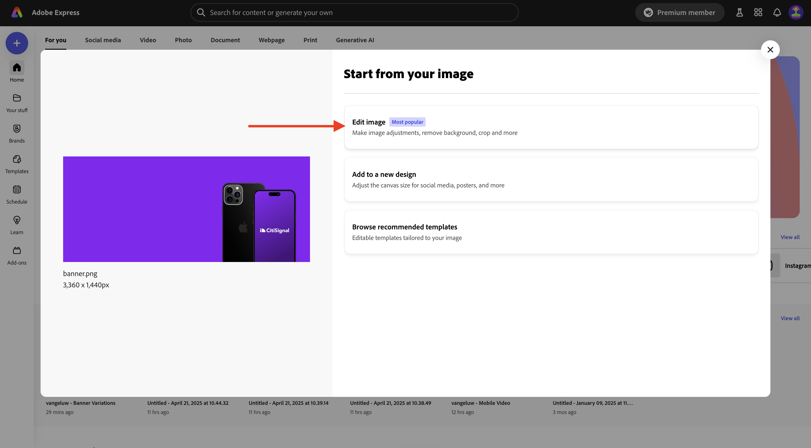
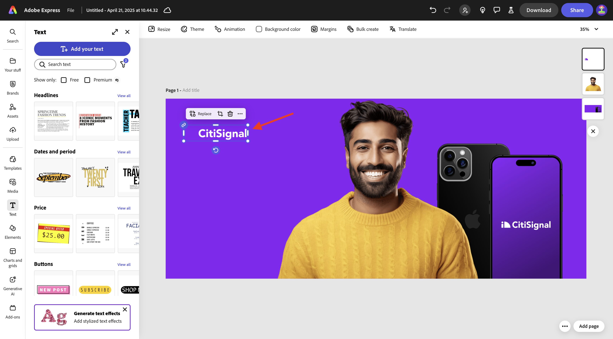
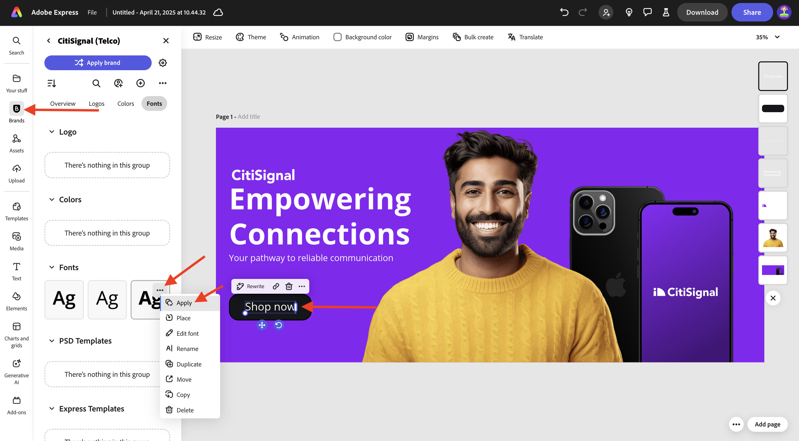
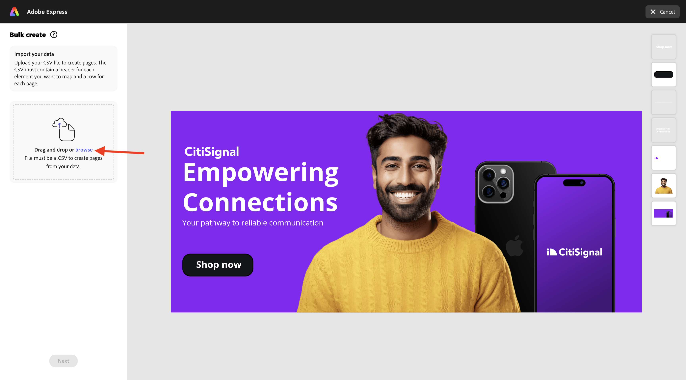
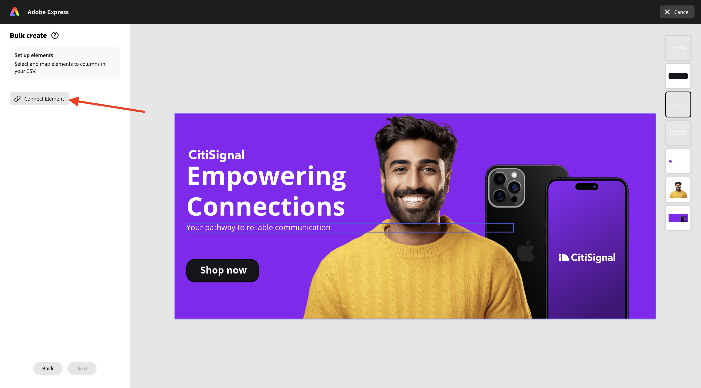
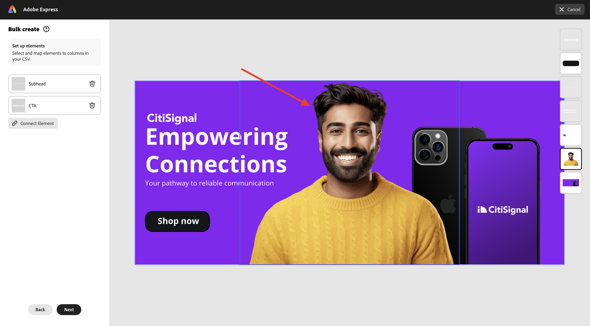

# 1.4.3 Création en bloc d’Assets dans Adobe Express

Avant de commencer cet exercice, téléchargez les ressources requises à partir de [https://one-adobe-tech-insiders.s3.us-west-2.amazonaws.com/one-adobe/Adobe_Express.zip](https://one-adobe-tech-insiders.s3.us-west-2.amazonaws.com/one-adobe/Adobe_Express.zip){target="_blank"} et décompressez-les sur votre bureau.

## 1.4.3.1 Créer une ressource de base

Accédez à [https://new.express.adobe.com/](https://new.express.adobe.com/){target="_blank"}. Cliquez sur l’icône **+** pour créer une **image**.

Sélectionnez **Photo** puis choisissez **Charger un média**.

Accédez à votre bureau, au dossier **Adobe_Express** qui contient les ressources que vous avez précédemment téléchargées. Sélectionnez le fichier **banner.png**, puis cliquez sur **Ouvrir**.

Vous devriez alors voir ceci. Sélectionnez **Modifier l’image**.

Ensuite, accédez à **Média** et sélectionnez **Télécharger l’image**. Accédez à votre bureau, au dossier **Adobe_Express** qui contient les ressources que vous avez précédemment téléchargées. Sélectionnez le fichier **man.png** et cliquez sur **Ouvrir**.

Vous devriez alors voir ceci.

Vous devez ensuite ajouter le logo **CitiSignal**. Accédez à **Marques** et sélectionnez le logo CitiSignal blanc. Cliquez sur le **de 3 points...** et sélectionnez **Placer**.

Ajustez l&#39;emplacement de l&#39;image du logo CitiSignal pour refléter la même position dans l&#39;image ci-dessous.

Accédez à **Texte** et cliquez sur **Ajouter votre texte**.

Dans la nouvelle zone de texte, ajoutez le `Empowering Connections` de texte. Faites glisser la zone de texte vers un emplacement similaire, comme illustré dans l’image ci-dessous. Ensuite, accédez à **Marques**, à **Polices**. Cliquez sur la **de 3 points...** sur la 3e police et cliquez sur **Appliquer**.

Ensuite, définissez la couleur de la police sur **blanc**.

Accédez de nouveau à **Texte**, puis cliquez sur **Ajouter votre texte**.

Dans la nouvelle zone de texte, saisissez le `Your pathway to reliable communication` de texte. Ajustez l’emplacement de la zone de texte pour qu’elle se trouve sous la zone de texte précédente, comme dans l’image ci-dessous.

Accédez à **Marques**, à **Polices**, puis cliquez sur le **3 points...** de la deuxième police. Cliquez ensuite sur **Appliquer**.

Tu devrais avoir ça. Ensuite, accédez à **Éléments**, à **Formes** et cliquez sur la forme rectangle arrondie.

Vous aurez alors une nouvelle forme de rectangle arrondi sur votre image. Ajustez la taille et l’emplacement afin qu’il ressemble à un bouton. Ensuite, modifiez la couleur du rectangle arrondi en **noir**.

Accédez de nouveau à **Texte**, puis cliquez sur **Ajouter votre texte**.

Saisissez le `Shop now` de texte dans la nouvelle zone de texte et modifiez l’emplacement de la zone de texte à centrer sur le bouton. Accédez à **Marques**, à **Polices**, puis cliquez sur les 3 points **...** de la troisième police. Cliquez ensuite sur **Appliquer**.

Vous devriez alors voir ceci.

## Création en bloc de 1.4.3.2 dans Adobe Express

Cliquez ensuite sur **Création en bloc**.

Vous devriez alors voir ceci. Cliquez sur **Parcourir**.

Accédez à votre bureau et au dossier **Création en bloc express** dans le dossier **Adobe_Express** qui contient les ressources que vous avez précédemment téléchargées. Sélectionnez le fichier **CTA-options.csv** et cliquez sur **Ouvrir**.

Vous devriez alors voir ceci. Cliquez sur **Suivant**.

Cliquez sur **Connecter l’élément**.

Sélectionnez la zone de texte qui contient le texte **Votre chemin vers une communication fiable**. Cliquez ensuite sur le bouton **Élément 1** et liez-le à un champ du fichier CSV, dans ce cas, le champ **Sous-titre**.

Sélectionnez ensuite la zone de texte qui contient le texte **Shop now**.

Cliquez ensuite sur le bouton **Élément 1** et liez-le à un champ du fichier CSV, dans ce cas, le champ **CTA**.

Vous devriez alors voir ceci. Cliquez ensuite sur l’image de la personne.

Cliquez sur le bouton **Élément 1**.

Vous verrez alors cette fenêtre contextuelle. Cliquez sur **Parcourir**.

Accédez à votre bureau et au dossier **Création en bloc express** dans le dossier **Adobe_Express** qui contient les ressources que vous avez précédemment téléchargées. Sélectionnez les fichiers image 6-7 et cliquez sur **Ouvrir**.

Tu verras ça. Faites glisser et déposez une image différente vers chaque variation de la ressource. Cliquez sur **Terminé**

Vous verrez ensuite les variantes de l’image générée. Cliquez sur **Créer une ou plusieurs pages**.

Vos variations sont maintenant prêtes et vous pouvez les examiner individuellement pour les examiner et les valider.

Vous avez maintenant terminé cet exercice.

## Étapes suivantes

Accédez à [&#x200B; Résumé et avantages &#x200B;](./summary.md){target="_blank"}

Revenir à [Adobe Express et Adobe Experience Cloud](./express.md){target="_blank"}

Revenir à [Tous les modules](./../../../overview.md){target="_blank"}