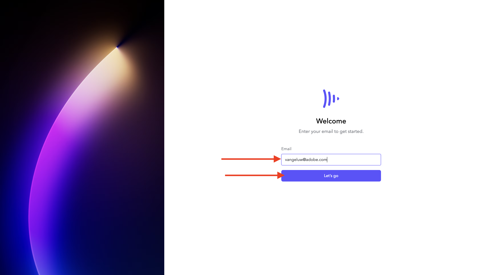
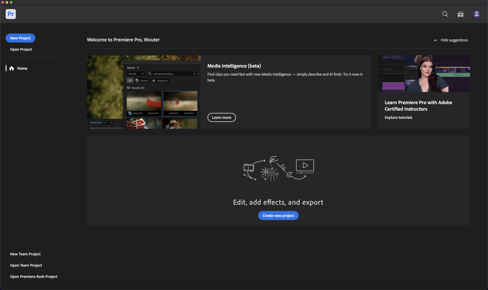

# 1.5.1 Prise en main de Frame.io

>[!NOTE]
>
> La capture d’écran ci-dessous montre un environnement spécifique utilisé. Lorsque vous parcourez ce tutoriel, il est très probable que votre environnement porte un nom différent. Lorsque vous vous êtes inscrit à ce tutoriel, les détails de l’environnement à utiliser vous ont été fournis. Veuillez suivre ces instructions.

Accédez à [https://next.frame.io/](https://next.frame.io/). Assurez-vous d’être connecté au `--aepImsOrgName--` d’environnement.

Si vous n’êtes pas connecté à l’environnement de droite, cliquez sur le logo dans le coin inférieur gauche, puis cliquez pour sélectionner l’environnement à utiliser.

## 1.5.1.1 Créer votre espace de travail et votre projet

Cliquez sur **+ Nouveau Workspace**.

Pour le nom de l’espace de travail, utilisez : `--aepUserLdap--`. Cliquez sur **Enregistrer**.

Votre espace de travail est maintenant créé. Ensuite, vous devez créer un projet. Cliquez sur **+ Nouveau projet**.

Sélectionnez **Vide** et utilisez l’`CitiSignal` Nom. Cliquez sur **Créer un projet**.

Votre projet est maintenant créé. Vous devez maintenant charger des ressources dans votre projet. Cliquez sur **Télécharger**.

Téléchargez ces fichiers : [https://tech-insiders.s3.us-west-2.amazonaws.com/Frame.io_Assets.zip](https://tech-insiders.s3.us-west-2.amazonaws.com/Frame.io_Assets.zip) sur votre bureau et décompressez-les.

Sélectionnez tous les fichiers et cliquez sur **Ouvrir**.

>[!NOTE]
>
>Comme vous pouvez le voir dans la capture d’écran, le dossier **Effets sonores** n’est pas sélectionné pour le moment. En effet, le chargement manuel ne prend pas en charge le chargement de dossiers. Dans quelques minutes, vous installerez l’application de transfert Frame.io, que vous utiliserez pour charger ce dossier et ses fichiers.

Après quelques minutes, vos fichiers seront disponibles sur Frame.io.

Vous avez maintenant téléchargé les fichiers manuellement, mais il existe un moyen plus efficace et plus rapide de télécharger des fichiers vers et depuis Frame.io. La meilleure façon de le faire est d’utiliser l’application de transfert Frame.io.

## 1.5.1.2 Télécharger et configurer l’application de transfert Frame.io

Accédez à [https://frame.io/transfer](https://frame.io/transfer) puis téléchargez la version correspondant à votre ordinateur.

Installez l’application, puis ouvrez-la.

Lorsque l’application s’ouvre, vous devez vous connecter. Cliquez sur **connexion**.

Saisissez l’adresse e-mail de votre compte Adobe et cliquez sur **OK**.

Après une authentification réussie, cliquez sur **Ouvrir l’application de transfert Frame.io**.

Vous devriez alors voir ceci. Pour sélectionner l’environnement approprié, cliquez sur afin d’ouvrir la liste déroulante.

Sélectionnez l’environnement à utiliser pour ce tutoriel, qui est `--aepImsOrgName--`.

Vous devriez alors voir l’espace de travail et le projet que vous avez créés précédemment, ainsi que les fichiers que vous avez chargés manuellement.

Cliquez sur **Télécharger**.

Accédez au dossier que vous avez utilisé précédemment, qui contient les fichiers décompressés que vous avez téléchargés précédemment. Sélectionnez le dossier **Effets sonores** et cliquez sur **Charger**.

Vos fichiers seront ensuite chargés.

Une fois téléchargé, le nouveau dossier devient disponible dans Frame.io.

## 1.5.1.3 Configurer Adobe Premiere Pro Beta

Vous avez déjà installé Adobe Premiere Pro Beta dans le cadre du module Prise en main . Pour utiliser Frame.io en combinaison avec Adobe Premiere Pro Beta, vous pouvez utiliser le plug-in qui a été développé pour cette intégration.

Ouvrez l’application Creative Cloud et recherchez des `frame.io`.

Faites défiler vers le bas les résultats de la recherche pour trouver le plugin **Frame.io V4 Comments**. Cliquez dessus.

Vous devriez alors voir ceci. Cliquez sur **Installer**.

Si Adobe Premiere Pro Beta est ouvert, vous devez d’abord le **Fermer** avant de pouvoir installer le plug-in.

Cliquez sur **OK**. Le plug-in est en cours d’installation.

Une fois le plug-in installé, ouvrez Adobe Premiere Pro Beta sur votre ordinateur.

## Étapes suivantes

Accéder à [-](./ex1.md){target="_blank"}

Revenez à [Rationaliser votre workflow avec Frame.io](./frameio.md){target="_blank"}

Revenir à [Tous les modules](./../../../overview.md){target="_blank"}
