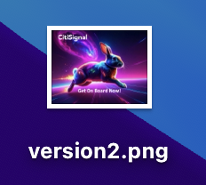

# 1.5.2 Approbations avec Frame.io

>[!NOTE]
>
> La capture d’écran ci-dessous montre un environnement spécifique utilisé. Lorsque vous parcourez ce tutoriel, il est très probable que votre environnement porte un nom différent. Lorsque vous vous êtes inscrit à ce tutoriel, les détails de l’environnement à utiliser vous ont été fournis. Veuillez suivre ces instructions.

Pour parcourir le workflow d’approbation dans Frame.io, vous devez disposer d’une ressource. Dans cet exercice, vous allez commencer par créer cette ressource vous-même à l’aide d’Adobe Firefly et d’Adobe Express. Une fois que vous disposez de la ressource, vous la chargez dans Frame.io, puis la validez.

## 1.5.2.1 Créer une ressource avec Adobe Firefly Services et Adobe Express

Accédez à [https://firefly.adobe.com/](https://firefly.adobe.com/){target="_blank"}. Saisissez le `a neon rabbit running very fast through space` d’invite et cliquez sur **Générer**.

Plusieurs images sont alors générées. Choisissez l’image qui vous plaît le plus, cliquez sur l’icône **Partager** sur l’image, puis sélectionnez **Ouvrir dans Adobe Express**.

L’image que vous venez de générer est alors disponible pour modification dans Adobe Express. Vous devez maintenant ajouter le logo CitiSignal sur l&#39;image. Pour ce faire, accédez à **Marques**.

Vous devriez alors voir un modèle de marque CitiSignal. qui a été créé dans GenStudio for Performance Marketing s’affichent dans Adobe Express. Cliquez pour sélectionner un modèle de marque dont le nom contient `CitiSignal`.

Accédez à **Logos** et cliquez sur le logo **blanc** Citisignal pour le déposer sur l’image.

Positionnez le logo CitiSignal en haut de votre image, pas trop loin du milieu.

Accédez à **Texte**.

Cliquez sur **Ajouter votre texte**.

Saisissez la `Timetravel now!` de texte, modifiez la couleur et la taille de la police, définissez le texte en **Gras** afin d’obtenir une image similaire à celle-ci.

Cliquez ensuite sur **Partager**.

Cliquez sur **... Tout afficher**.

Faites défiler vers le bas et sélectionnez **Télécharger**.

Cliquez sur **Télécharger**.

Vous disposerez alors de votre ressource sur votre ordinateur local.

## 1.5.2.2 Approuver votre ressource dans Frame.io

Accédez à [https://next.frame.io/](https://next.frame.io/). Assurez-vous d’être connecté au `--aepImsOrgName--` d’environnement.

Si vous n’êtes pas connecté à l’environnement de droite, cliquez sur le logo dans le coin inférieur gauche, puis cliquez pour sélectionner l’environnement à utiliser.

Accédez à votre espace de travail, qui doit être nommé `--aepUserLdap--`, puis ouvrez le dossier **CitiSignal**. Cliquez sur l’icône **+**, puis sélectionnez **Nouveau dossier**.

Nommez le dossier `--aepUserLdap-- - Approvals`. Double-cliquez sur le dossier pour l’ouvrir.

Vous allez maintenant charger le fichier que vous avez créé dans l&#39;exercice précédent dans ce dossier. Cliquez sur **Télécharger**.

Sélectionnez le fichier et cliquez sur **Ouvrir**.

Tu devrais avoir ça. Double-cliquez sur le fichier pour l’ouvrir.

Activez l’icône pour laisser un commentaire ancré.

Saisissez un commentaire, tel que `Change CTA to "Get on board now!"`. Cliquez sur l’icône **envoyer** pour partager votre commentaire.

Tu devrais avoir ça. Accédez à **Champs**.

Dans le champ **Statut**, modifiez le statut en **Révision requise**.

Tu devrais avoir ça. Revenez au dossier en cliquant sur la flèche pour revenir en arrière.

Cliquez sur le **de 3 points...** et sélectionnez **Renommer**.

Remplacez le nom du fichier par `version1.png`.

## 1.5.2.3 Apporter des modifications de conception dans Adobe Express

Accédez à [https://new.express.adobe.com/your-stuff/files](https://new.express.adobe.com/your-stuff/files) puis ouvrez à nouveau l’image que vous avez créée précédemment.

Remplacez le texte CTA par `Get On Board Now!`.

Cliquez sur **Partager** puis sélectionnez **Télécharger**.

Cliquez sur **Télécharger**.

Une nouvelle image sera alors téléchargée sur votre ordinateur local. Renommez le fichier en `version2.png`.

## 1.5.2.4 Approuver la version 2 dans Frame.io

Dans votre dossier Frame.io, cliquez sur l’icône **+** et sélectionnez **Charger une ressource**.

Sélectionnez le fichier **version2.png** et cliquez sur **Ouvrir**.

Faites ensuite glisser le fichier **version2.png** au-dessus du fichier **version1.png**. Cette action active l&#39;empilement de versions dans Frame.io.

Vous devriez alors voir ceci.

Cliquez sur le **de 3 points...** sur l’image, puis sélectionnez **Comparer les versions**.

Vous devriez alors voir cette vue de comparaison qui affiche les deux versions du fichier. Accédez à **Champs**.

Remplacez le champ **Statut** par **Approuvé**.

Tu devrais avoir ça. Cliquez sur l’icône de flèche pour revenir à la vue de votre dossier.

Cliquez sur le **3 points...** et sélectionnez **Télécharger** au cas où vous souhaiteriez utiliser ce fichier dans une autre application.

## Étapes suivantes

[1.5.3 Frame.io et Premiere Pro](./ex3.md){target="_blank"}

Revenez à [Rationaliser votre workflow avec Frame.io](./frameio.md){target="_blank"}

Revenir à [Tous les modules](./../../../overview.md){target="_blank"}
