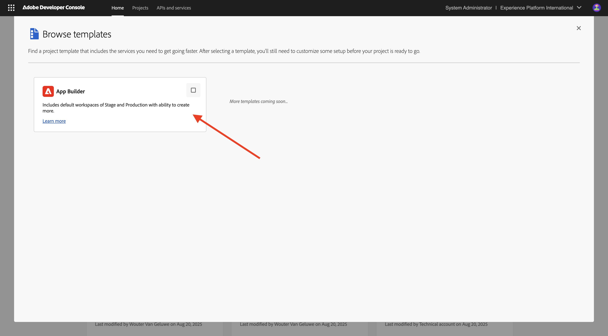
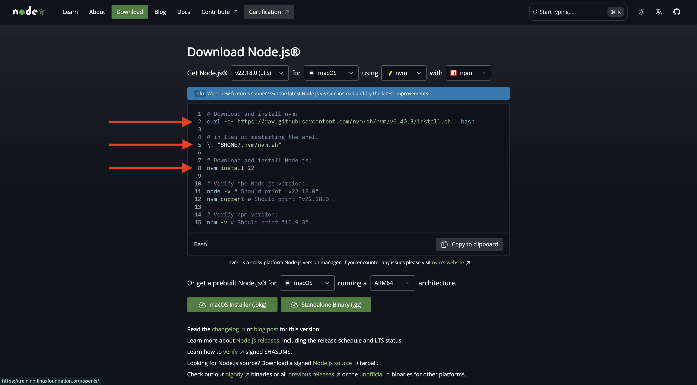
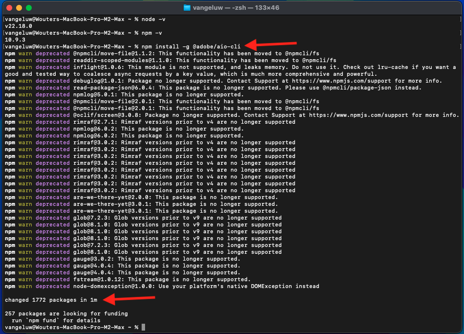

# 1.6.1 Adobe IO et App Builder

## 1.6.1.1 Créer votre projet Adobe I/O

Accédez à [https://developer.adobe.com/console/home](https://developer.adobe.com/console/home){target="_blank"}.

Veillez à sélectionner l’instance appropriée dans le coin supérieur droit de l’écran. Votre instance est `--aepImsOrgName--`.

>[!NOTE]
>
> La capture d’écran ci-dessous montre une organisation spécifique sélectionnée. Lorsque vous parcourez ce tutoriel, il est très probable que votre organisation porte un nom différent. Lorsque vous vous êtes inscrit à ce tutoriel, les détails de l’environnement à utiliser vous ont été fournis. Veuillez suivre ces instructions.

Sélectionnez ensuite **Créer un projet à partir d’un modèle**.

Sélectionnez **App Builder**.

Saisissez le nom `--aepUserLdap-- GSPeM EXT`. Cliquez sur **Enregistrer**.

Vous devriez alors voir quelque chose comme ça.

## 1.6.1.2 Configurer votre environnement de développement

Pour créer, envoyer et déployer votre application extensible, les applications et packages suivants doivent être installés dans votre environnement de développement local sur votre ordinateur :

- Node.js (version 20.x ou ultérieure)
- npm (package avec Node.js)
- Interface de ligne de commande (CLI) Adobe Developer

Si ces applications ou packages ne sont pas encore installés sur votre ordinateur, procédez comme suit.

### Node.js et npm

Accédez à [https://nodejs.org/en/download](https://nodejs.org/en/download). Vous devriez alors le voir, avec un certain nombre de commandes de terminal qui doivent être exécutées pour que Node.js et npm soient installés. Les commandes présentées ici s&#39;appliquent à MacBook.

Tout d’abord, ouvrez une nouvelle fenêtre de terminal. Collez et exécutez la commande mentionnée à la ligne 2 de la capture d’écran :

`curl -o- https://raw.githubusercontent.com/nvm-sh/nvm/v0.40.3/install.sh | bash`

Exécutez ensuite la commande à la ligne 5 de la capture d’écran :

`\. "$HOME/.nvm/nvm.sh"`

Après avoir exécuté les deux commandes avec succès, exécutez cette commande :

`node -v`

Vous devriez voir un numéro de version renvoyé.

Exécutez ensuite la commande suivante :

`npm -v`

Vous devriez voir un numéro de version renvoyé.

Si les 2 dernières commandes ont renvoyé un numéro de version, votre configuration de ces 2 fonctionnalités est réussie.

### Interface de ligne de commande (CLI) Adobe Developer

Pour installer l’interface de ligne de commande (CLI) d’Adobe Developer, exécutez la commande suivante dans une fenêtre de terminal :

`npm install -g @adobe/aio-cli`

L’exécution de cette commande peut prendre quelques minutes, le résultat final devrait être similaire à ceci :

L’interface de ligne de commande (CLI) d’Adobe Developer est désormais installée avec succès.

Vous avez maintenant configuré les éléments de base pour pouvoir exécuter un projet App Builder.

## Étapes suivantes

Accédez à [Création de votre compartiment AWS S3](./ex2.md){target="_blank"}.

Revenir à [GenStudio for Performance Marketing - Extensibilité](./genstudioext.md){target="_blank"}

Revenir à [Tous les modules](./../../../overview.md){target="_blank"}
