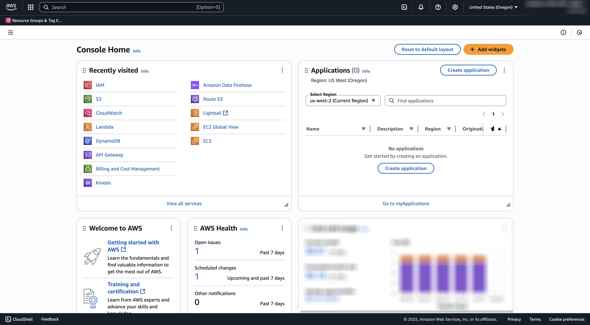

# 1.6.2 Création de votre compartiment AWS S3

## 1.6.2.1 Créer votre compartiment S3

Accédez à [https://console.aws.amazon.com](https://console.aws.amazon.com) et connectez-vous.

>[!NOTE]
>
>Si vous ne disposez pas encore d’un compte AWS, créez un compte AWS à l’aide de votre adresse e-mail personnelle.

Après vous être connecté, vous serez redirigé vers la **console de gestion AWS**.

Dans la barre de recherche, recherchez **s3**. Cliquez sur le premier résultat de la recherche : **S3 - Scalable Storage in the Cloud**.

Vous verrez alors la page d’accueil **Amazon S3**. Cliquez sur **Créer un compartiment**.

Sur l’écran **Créer un compartiment**, utilisez le nom `--aepUserLdap---gspem-dam`.

Gardez tous les autres paramètres par défaut tels quels. Faites défiler vers le bas et cliquez sur **Créer un compartiment**.

Votre compartiment est alors en cours de création et est redirigé vers la page d’accueil S3 d’Amazon.

## Définir les autorisations d’accès à votre compartiment S3

L’étape suivante consiste à configurer l’accès à votre compartiment S3.

Pour ce faire, accédez à [https://console.aws.amazon.com/iam/home](https://console.aws.amazon.com/iam/home).

L’accès aux ressources AWS est contrôlé par Amazon Identity and Access Management (IAM).

Cette page s’affiche maintenant.

Dans le menu de gauche, cliquez sur **Utilisateurs**. L’écran **Utilisateurs** s’affiche alors. Cliquez sur **Créer un utilisateur**.

Configurez ensuite votre utilisateur ou utilisatrice :

- Nom d’utilisateur : utilisez `s3_--aepUserLdap--_gspem_dam`

Cliquez sur **Suivant**.

Cet écran d’autorisations s’affiche alors. Cliquez sur **Joindre directement des politiques**.

Saisissez le terme de recherche **s3** pour afficher toutes les politiques S3 associées. Sélectionnez la politique **AmazonS3FullAccess**. Faites défiler vers le bas et cliquez sur **Suivant**.

Vérifiez votre configuration. Cliquez sur **Créer un utilisateur**.

Tu verras ça. Cliquez sur **Afficher utilisateur**.

Cliquez sur **Informations d’identification de sécurité** puis sur **Créer une clé d’accès**.

Sélectionnez **Application s’exécutant en dehors d’AWS**. Faites défiler vers le bas et cliquez sur **Suivant**.

Cliquez sur **Créer une clé d’accès**

Tu verras ça. Cliquez sur **Afficher** pour afficher votre clé d’accès secrète :

Votre **clé d’accès secrète** s’affiche maintenant.

>[!IMPORTANT]
>
>Stockez vos informations d’identification dans un fichier texte sur votre ordinateur.
>
> - ID de clé d&#39;accès : ...
> - Clé d’accès secrète : ...
>
> Une fois que vous aurez cliqué sur **Terminé** vos informations d’identification ne s’afficheront plus.

Cliquez sur **Terminé**.

Vous avez maintenant créé un compartiment AWS S3 et vous avez créé un utilisateur disposant des autorisations pour accéder à ce compartiment.

## 1.6.2.2 Charger Assets dans votre compartiment S3

Dans la barre de recherche, recherchez **s3**. Cliquez sur le premier résultat de la recherche : **S3 - Scalable Storage in the Cloud**.

Cliquez pour ouvrir le compartiment S3 que vous venez de créer et qui doit être nommé `--aepUserLdap---gspem-dam`.

Cliquez sur **Télécharger**.

Vous devriez alors voir ceci.

Vous pouvez télécharger les fichiers image CitiSignal [ici](./images/package.zip){target="_blank"}.

Exportez les fichiers sur votre bureau.

Cliquez sur **Ajouter un dossier**.

Sélectionnez le dossier **ressources** dans le dossier de téléchargement **package**. Cliquez sur **Télécharger**.

Vous devriez alors voir ceci. Cliquez de nouveau sur **Ajouter un dossier**.

Sélectionnez le dossier **miniatures** dans le dossier de téléchargement **package**. Cliquez sur **Télécharger**.

Vous devriez alors voir ceci. Cliquez sur **Télécharger**.

Votre chargement est maintenant terminé. Cliquez sur **Fermer**.

Vous devriez maintenant avoir cette structure de dossiers dans votre compartiment S3.

## Étapes suivantes

Accédez à [Créer votre application DAM externe](./ex3.md){target="_blank"}

Revenir à [GenStudio for Performance Marketing - Extensibilité](./genstudioext.md){target="_blank"}

Revenir à [Tous les modules](./../../../overview.md){target="_blank"}
