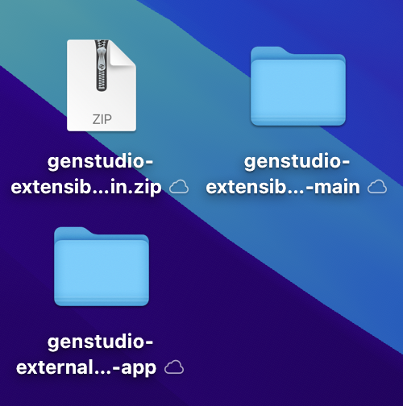

# 1.6.3 Création de votre application de gestion des ressources numériques externe

## 1.6.3.1 Télécharger des fichiers d’exemple d’application

Accédez à [https://github.com/adobe/genstudio-extensibility-examples](https://github.com/adobe/genstudio-extensibility-examples). Cliquez sur **Code** puis sélectionnez **Télécharger le fichier ZIP**.


Décompressez le fichier zip sur votre bureau.


Ouvrez le dossier **genstudio-extensibility-exemples-main**. Plusieurs exemples d’applications s’affichent. Celui qui présente un intérêt pour cet exercice est le **genstudio-external-dam-app**.

Copiez ce répertoire et collez-le sur votre bureau.


Vous devez maintenant disposer de la configuration suivante sur votre bureau :



Pour les exercices suivants, vous n’utiliserez que le dossier **genstudio-external-dam-app**.

## 1.6.3.2 Configuration de l’interface de ligne de commande d’Adobe Developer

Cliquez avec le bouton droit sur le dossier **genstudio-external-dam-app** et sélectionnez **Nouveau terminal dans le dossier**.


Vous devriez alors voir ceci. Saisissez la `aio login` de commande. Cette commande redirige vers votre navigateur et vous demande de vous connecter.


Une fois la connexion établie, vous devriez voir ceci dans le navigateur.


Le navigateur redirige alors vers la fenêtre du terminal. Vous devriez voir un message indiquant **Connexion réussie** et un jeton long renvoyé par le navigateur.


L’étape suivante consiste à configurer l’instance et le projet Adobe IO que vous utiliserez pour l’application DAM externe.

Pour ce faire, vous devez télécharger un fichier à partir du projet Adobe IO que vous avez configuré précédemment.

Accédez à [https://developer.adobe.com/console/home](https://developer.adobe.com/console/home){target="_blank"} puis ouvrez le projet que vous avez créé précédemment et qui est nommé `--aepUserLdap-- GSPeM EXT`. Ouvrez l’espace de travail **de production**.


Cliquez sur **Tout télécharger**. Cette opération télécharge un fichier JSON.


Copiez le fichier JSON de votre répertoire **Downloads** dans le répertoire racine de l’application DAM externe.


Revenez à la fenêtre de votre terminal. Saisissez la `aio app use XXX-YYY-Production.json` de commande.

>[!NOTE]
>
>Vous devez modifier le nom du fichier pour qu’il corresponde au nom de votre fichier .

Une fois la commande exécutée, votre application de gestion des ressources numériques externe est connectée au projet Adobe IO avec App Builder que vous avez créé précédemment.


## 1.6.3.3 Installer le SDK d’extensibilité de GenStudio

Ensuite, vous devez installer le **SDK d’extensibilité de GenStudio**. Vous trouverez plus de détails sur le SDK ici : [https://github.com/adobe/genstudio-extensibility-sdk](https://github.com/adobe/genstudio-extensibility-sdk).

Pour installer SDK, exécutez cette commande dans la fenêtre de votre terminal :

`npm install @adobe/genstudio-extensibility-sdk`


Au bout de quelques minutes, le SDK sera installé.


## 1.6.3.4 Vérifier l’application DAM externe dans Visual Studio Code

Ouvrez Visual Studio Code. Cliquez sur **Ouvrir...** pour ouvrir un dossier.


Sélectionnez le dossier **genstudio-external-dam-app** qui contient l’application que vous avez téléchargée précédemment.


Cliquez pour ouvrir le fichier **.env**.


Le fichier **.env** a été créé à l’aide de la `aio app use` de commande que vous avez exécutée à l’étape précédente et contient les informations nécessaires pour se connecter à votre projet Adobe IO avec App Builder.


Vous devez maintenant créer 2 nouveaux fichiers à la racine de votre dossier :

- `.env.dev`. Cliquez sur le bouton **Nouveau fichier**, puis saisissez le `.env.dev` de nom de fichier.


- `.env.prod`.  Cliquez sur le bouton **Nouveau fichier**, puis saisissez le `.env.prod` de nom de fichier.


Ces fichiers contiennent les informations d’identification nécessaires pour se connecter au compartiment AWS S3 que vous avez créé précédemment.

```
AWS_ACCESS_KEY_ID=
AWS_SECRET_ACCESS_KEY=
AWS_REGION=
AWS_BUCKET_NAME=
```

Le champ **AWS_ACCESS_KEY_ID** et **AWS_SECRET_ACCESS_KEY** étaient disponibles après la création de l’utilisateur IAM dans l’exercice précédent. On vous a demandé de les noter, vous pouvez maintenant copier les valeurs.


Le champ **AWS_REGION** peut être extrait de la vue d’accueil AWS S3, en regard de votre nom de compartiment. Dans cet exemple, la région est **us-west-2**.


Le champ **AWS_BUCKET_NAME** doit être `--aepUserLdap---gspem-dam`.

Ces informations vous permettent de mettre à jour les valeurs de chacune de ces variables.

```
AWS_ACCESS_KEY_ID=XXX
AWS_SECRET_ACCESS_KEY=YYY
AWS_REGION=us-west-2
AWS_BUCKET_NAME=--aepUserLdap---gspem-dam
```

Vous devez maintenant coller ce texte dans les deux fichiers, `.env.dev` et `.env.prod`. N’oubliez pas d’enregistrer vos modifications.


Ensuite, revenez à la fenêtre de votre terminal. Exécutez cette commande :

`export $(grep -v '^#' .env.dev | xargs)`


## 1.6.3.5 Exécuter l’application DAM externe

Dans la fenêtre de votre terminal, exécutez la commande `aio app run`. Vous devriez ensuite voir ceci après 1-2 minutes.


## Étapes suivantes

Accédez à [Déployer votre code et publier votre application en privé](./ex4.md){target="_blank"}

Revenir à [GenStudio for Performance Marketing - Extensibilité](./genstudioext.md){target="_blank"}

Revenir à [Tous les modules](./../../../overview.md){target="_blank"}
