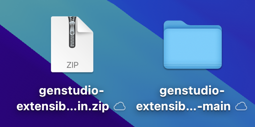
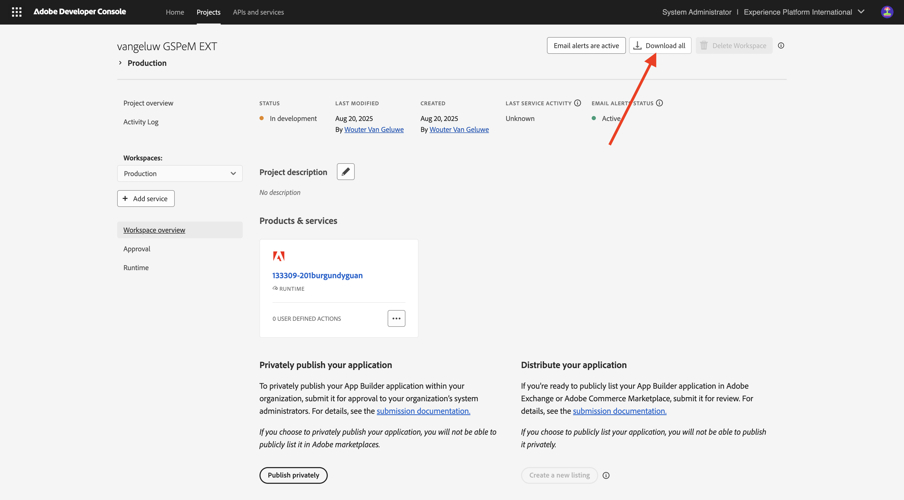
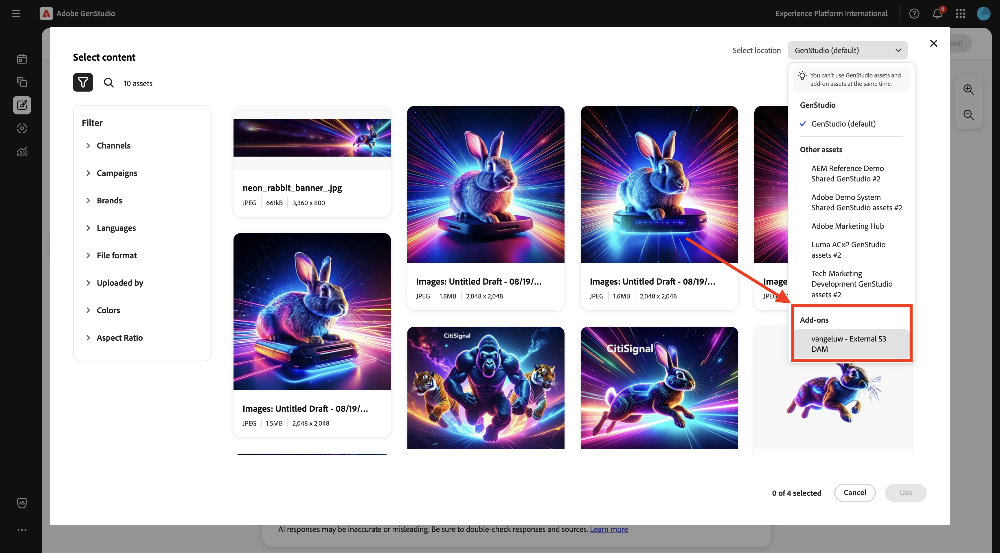
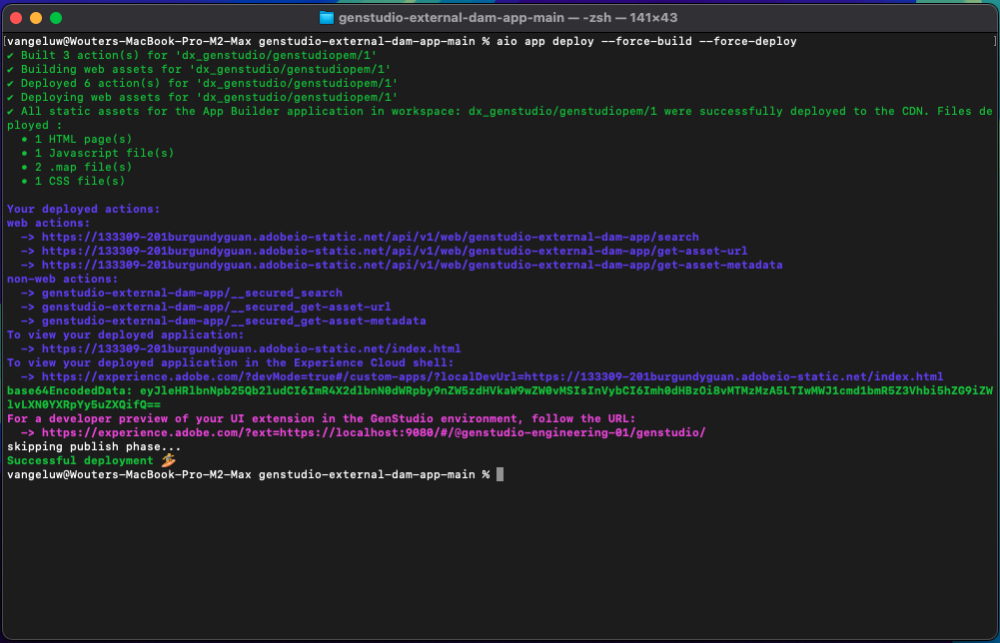

# 1.6.3 Créer et déployer votre application de gestion des ressources numériques externe

## 1.6.3.1 Télécharger des fichiers d’exemple d’application

Accédez à [https://github.com/woutervangeluwe/genstudio-external-dam-app](https://github.com/woutervangeluwe/genstudio-external-dam-app). Cliquez sur **Code** puis sélectionnez **Télécharger le fichier ZIP**.


Décompressez le fichier zip sur votre bureau.



## 1.6.3.2 Configuration de l’interface de ligne de commande d’Adobe Developer

Cliquez avec le bouton droit sur le dossier **genstudio-external-dam-app-main** et sélectionnez **Nouveau terminal dans le dossier**.


Vous devriez alors voir ceci. Saisissez la `aio login` de commande. Cette commande redirige vers votre navigateur et vous demande de vous connecter.


Une fois la connexion établie, vous devriez voir ceci dans le navigateur.


Le navigateur redirige alors vers la fenêtre du terminal. Vous devriez voir un message indiquant **Connexion réussie** et un jeton long renvoyé par le navigateur.


L’étape suivante consiste à configurer l’instance et le projet Adobe IO que vous utiliserez pour l’application DAM externe.

Pour ce faire, vous devez télécharger un fichier à partir du projet Adobe IO que vous avez configuré précédemment.

Accédez à [https://developer.adobe.com/console/home](https://developer.adobe.com/console/home){target="_blank"} puis ouvrez le projet que vous avez créé précédemment et qui est nommé `--aepUserLdap-- GSPeM EXT`. Ouvrez l’espace de travail **de production**.


Cliquez sur **Tout télécharger**. Cette opération télécharge un fichier JSON.



Copiez le fichier JSON de votre répertoire **Downloads** dans le répertoire racine de l’application DAM externe.


Revenez à la fenêtre de votre terminal. Saisissez la `aio app use XXX-YYY-Production.json` de commande.

>[!NOTE]
>
>Vous devez modifier le nom du fichier dans la commande ci-dessus pour qu’il corresponde au nom de votre fichier.

Une fois la commande exécutée, votre application de gestion des ressources numériques externe est connectée au projet Adobe IO avec App Builder que vous avez créé précédemment.


## 1.6.3.3 Installer le SDK d’extensibilité de GenStudio

Ensuite, vous devez installer le **SDK d’extensibilité de GenStudio**. Vous trouverez plus de détails sur le SDK ici : [https://github.com/adobe/genstudio-extensibility-sdk](https://github.com/adobe/genstudio-extensibility-sdk).

Pour installer SDK, exécutez cette commande dans la fenêtre de votre terminal :

`npm install @adobe/genstudio-extensibility-sdk`


Au bout de quelques minutes, le SDK sera installé.


## 1.6.3.4 Vérifier l’application DAM externe dans Visual Studio Code

Ouvrez Visual Studio Code. Cliquez sur **Ouvrir...** pour ouvrir un dossier.


Sélectionnez le dossier **genstudio-external-dam-app-main** qui contient l’application que vous avez téléchargée précédemment. Cliquez sur **Ouvrir**.


Cliquez pour ouvrir le fichier **.env**.


Le fichier **.env** a été créé à l’aide de la `aio app use` de commande que vous avez exécutée à l’étape précédente et contient les informations nécessaires pour se connecter à votre projet Adobe IO avec App Builder.


Vous devez maintenant ajouter les détails suivants au fichier **.env** afin que l’application de gestion des ressources numériques externe puisse se connecter au compartiment AWS S3 que vous avez créé précédemment.

```
AWS_ACCESS_KEY_ID=
AWS_SECRET_ACCESS_KEY=
AWS_REGION=
AWS_BUCKET_NAME=
```

Les **`AWS_ACCESS_KEY_ID`** de champ et les **`AWS_SECRET_ACCESS_KEY`** étaient disponibles après la création de l’utilisateur IAM dans l’exercice précédent. On vous a demandé de les noter, vous pouvez maintenant copier les valeurs.


Le champ **`AWS_REGION`** peut être extrait de la vue d’accueil d’AWS S3, en regard de votre nom de compartiment. Dans cet exemple, la région est **us-west-2**.


Le champ **`AWS_BUCKET_NAME`** doit être `--aepUserLdap---gspem-dam`.

Ces informations vous permettent de mettre à jour les valeurs de chacune de ces variables.

```
AWS_ACCESS_KEY_ID=XXX
AWS_SECRET_ACCESS_KEY=YYY
AWS_REGION=us-west-2
AWS_BUCKET_NAME=--aepUserLdap---gspem-dam
```

Vous devez maintenant coller ce texte dans le fichier `.env`. N’oubliez pas d’enregistrer vos modifications.


Ensuite, revenez à la fenêtre de votre terminal. Exécutez cette commande :

`export $(grep -v '^#' .env | xargs)`


Enfin, vous devez modifier le libellé qui s’affichera dans GenStudio for Performance Marketing, afin de pouvoir distinguer votre application DAM externe des autres intégrations. Pour ce faire, ouvrez le fichier **Constants.ts** que vous pouvez trouver en explorant vers le bas pour **src/genstudiopem > web-src > src**.

La ligne 14 doit être remplacée par

`export const extensionLabel: string = "--aepUserLdap-- - External S3 DAM";`

N’oubliez pas d’enregistrer vos modifications.


## 1.6.3.5 Exécuter l’application DAM externe

Dans la fenêtre de votre terminal, exécutez la commande `aio app run`. Vous devriez ensuite voir ceci après 1-2 minutes.

>[!NOTE]
>
>Lorsque vous exécutez `aio app run` pour la première fois, vous pouvez être redirigé vers le navigateur pour accepter un nouveau certificat. Si cela se produit, acceptez le certificat, puis vous pourrez continuer avec les étapes ci-dessous.


Vous avez maintenant confirmé que votre application est en cours d’exécution. L’étape suivante consiste à le déployer.

Tout d’abord, appuyez sur **Ctrl+C** pour arrêter l’exécution de l’application. Saisissez ensuite la `aio app deploy` de commande. Cette commande déploiera votre code sur Adobe IO.

Par conséquent, vous recevrez une URL similaire pour accéder à votre application déployée :

`https://133309-201burgundyguan.adobeio-static.net/index.html`


À des fins de test, vous pouvez désormais utiliser cette URL comme paramètre de chaîne de requête en ajoutant `?ext=` comme préfixe à l’URL ci-dessus. Vous obtenez ce paramètre de chaîne de requête :

`?ext=https://133309-201burgundyguan.adobeio-static.net/index.html`

Accédez à [https://experience.adobe.com/genstudio/create](https://experience.adobe.com/genstudio/create).


Ajoutez ensuite le paramètre de chaîne de requête juste avant le **#**. Votre nouvelle URL doit se présenter comme suit :

`https://experience.adobe.com/?ext=https://133309-201burgundyguan.adobeio-static.net/index.html#/@experienceplatform/genstudio/create`

La page se charge normalement. Cliquez sur **Bannières** pour commencer à créer une bannière.


Sélectionnez un modèle, puis cliquez sur **Utiliser**.


Cliquez sur **Sélectionner à partir du contenu**.


Vous devriez ensuite pouvoir sélectionner votre gestion des ressources numériques (DAM) externe, qui doit être nommée `--aepUserLdap-- - External S3 DAM` dans la liste déroulante.



Vous devriez alors voir ceci. Sélectionnez l’image **neon_rabbit_banner.jpg** et cliquez sur **Utiliser**.


Vous avez maintenant sélectionné une image à partir de votre gestion des ressources numériques externe s’exécutant dans un compartiment S3. Une fois l’image sélectionnée, vous pouvez suivre le workflow normal, comme indiqué dans l’exercice [1.3.3.4 Créer et approuver une méta-annonce](./../module1.3/ex3.md#create--approve-meta-ad).


Lorsque vous apportez des modifications au code sur votre ordinateur local, vous devez redéployer votre application. Lors du redéploiement, utilisez cette commande de terminal :

`aio app deploy --force-build --force-deploy`



Votre application est maintenant prête à être publiée.

## Étapes suivantes

Accédez à [ Publier votre application en privé ](./ex4.md){target="_blank"}

Revenir à [GenStudio for Performance Marketing - Extensibilité](./genstudioext.md){target="_blank"}

Revenir à [Tous les modules](./../../../overview.md){target="_blank"}
