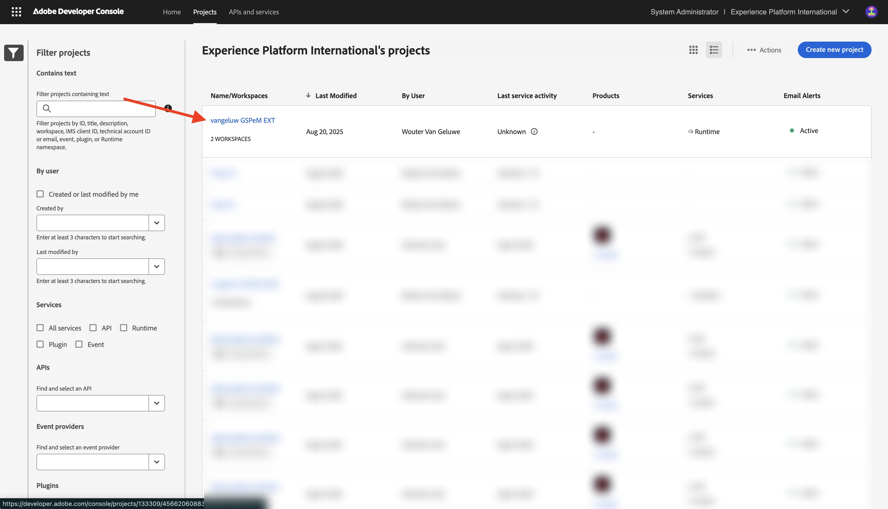
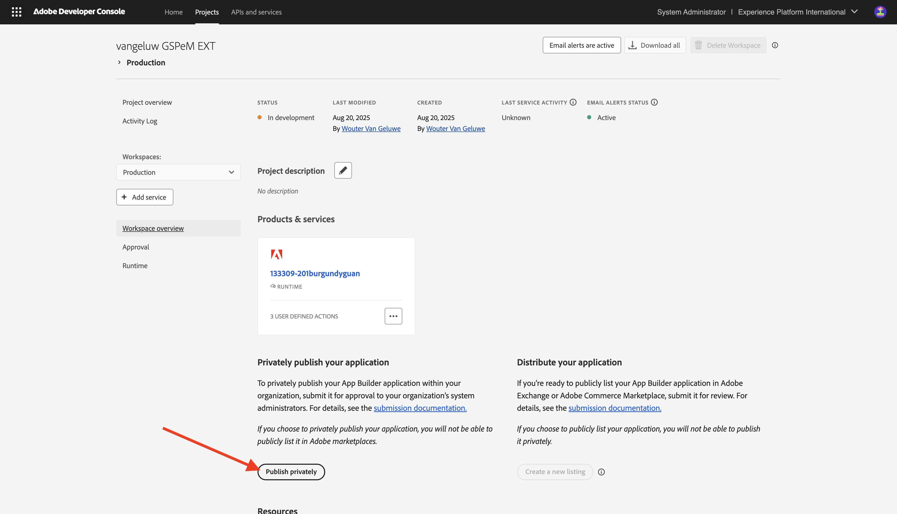
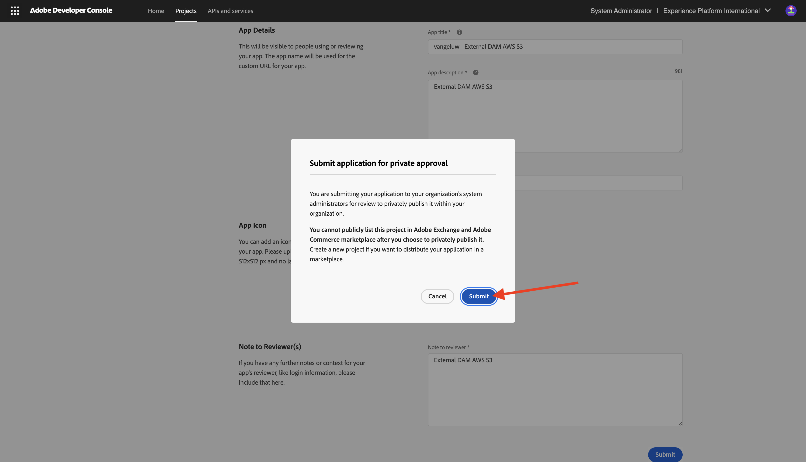

# 1.6.4 Déployer votre code et publier votre application en privé

Une fois votre application publiée en privé, elle est disponible dans GenStudio for Performance Marketing sans avoir à utiliser le paramètre de chaîne de requête.

## 1.6.4.1 Publier votre application

Accédez à [https://developer.adobe.com/console/projects](https://developer.adobe.com/console/projects){target="_blank"}.

>[!NOTE]
>
> La capture d’écran ci-dessous montre une organisation spécifique sélectionnée. Lorsque vous parcourez ce tutoriel, il est très probable que votre organisation porte un nom différent. Lorsque vous vous êtes inscrit à ce tutoriel, les détails de l’environnement à utiliser vous ont été fournis. Veuillez suivre ces instructions.

Ouvrez le projet Adobe IO avec App Builder, qui doit porter le nom `--aepUserLdap-- GSPeM EXT`.

Accédez à **Production**.

Cliquez sur **Publier en privé**.

Vous devez ensuite remplir un certain nombre de champs.

Renseignez les champs suivants comme suit :

- **Titre de l’application** : `--aepUserLdap-- - External DAM AWS S3`.
- **Description de l’application** : `External DAM AWS S3`
- **E-mail du contact** : saisissez votre adresse e-mail
- **Icône de l’application** : téléchargez et utilisez cette image : image [S3](./images/s3.jpeg)
- **Remarque pour le réviseur** : DAM externe AWS S3

Cliquez sur **Envoyer**.

Cliquez sur **Envoyer**.

## 1.6.4.2 Approuver votre application

>[!IMPORTANT]
>
>Cette étape ne peut être exécutée que par les administrateurs système dans Adobe Admin Console. Si vous n&#39;êtes pas administrateur système, vous ne pourrez pas exécuter cette opération. Contactez votre administrateur système pour demander plutôt l’approbation de votre application.

Une fois qu’un développeur envoie une nouvelle application pour publication, les administrateurs système de votre organisation sont avertis et sont invités à la réviser et à l’approuver.

Si vous êtes un administrateur système, vous recevrez cet e-mail, puis vous pourrez cliquer sur **Mon Exchange** pour lancer ce processus.

Dans **Adobe Exchange**, les applications App Builder s&#39;affichent et l&#39;application qui vient d&#39;être envoyée est en attente d&#39;examen. Cliquez sur le bouton **Vérifier** pour l’`--aepUserLdap-- - External DAM AWS S3` de l’application.

Ajoutez un commentaire et cliquez sur **Approuver**.

Votre application est maintenant approuvée et fonctionnera automatiquement dans GenStudio for Performance Marketing, sans avoir à spécifier le paramètre de chaîne de requête.

## Étapes suivantes

Accédez à [ Résumé et avantages ](./summary.md){target="_blank"}

Revenir à [GenStudio for Performance Marketing - Extensibilité](./genstudioext.md){target="_blank"}

Revenir à [Tous les modules](./../../../overview.md){target="_blank"}
