# 1.7.1 Prise en main de Firefly Creative Production for Enterprise

Accédez à . Cliquez sur l’icône de profil dans le coin supérieur droit et vérifiez que vous avez sélectionné l’instance appropriée, qui doit être `--aepImsOrgName--`.

Accédez à **Production**.

Vous devriez alors voir ceci. Cliquez sur **Créer un workflow (version bêta)**.

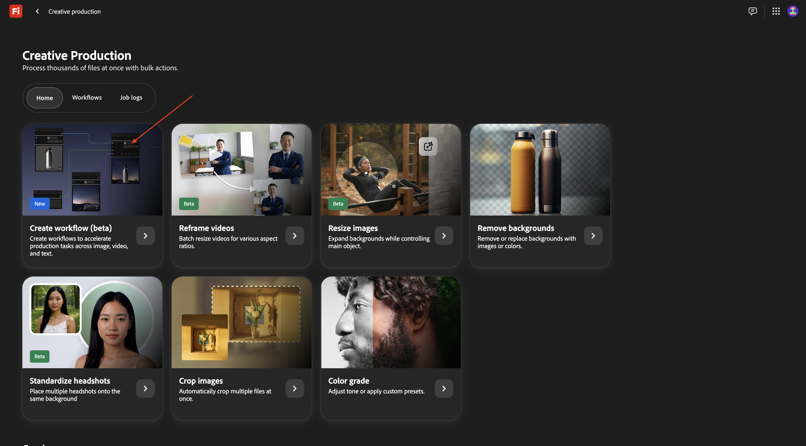

## 1.7.1.1 Supprimer l’arrière-plan

Pour découvrir Firefly Creative Production for Enterprise, vous allez maintenant mettre en œuvre un cas d’utilisation de base axé sur la suppression de l’arrière-plan d’une image spécifique.

Remplacez le nom de votre workflow par `vangeluw - remove background`.

Ouvrez l’**Image**

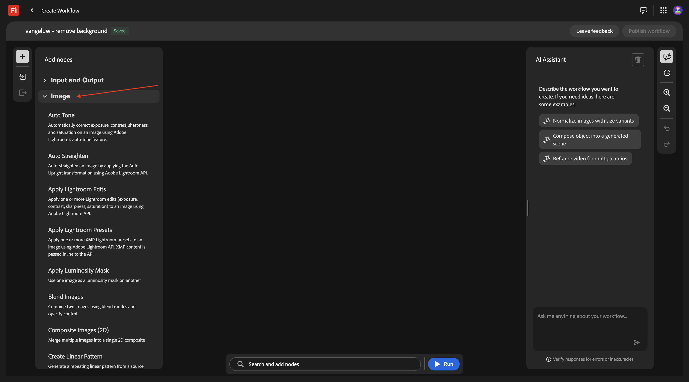

Sélectionnez **Supprimer l’arrière-plan**, puis faites glisser et déposez ce nœud sur la zone de travail.

Vous devez maintenant connecter un nœud d’image d’entrée et un nœud d’image de sortie au **Supprimer l’arrière-plan**.

Faites défiler vers le haut et accédez à **Entrée et Sortie**. Cliquez sur le nœud **Images d’entrée** et faites-le glisser sur la zone de travail.

Tu devrais avoir ça. Connectez le nœud **Images d’entrée** au nœud **Supprimer l’arrière-plan** en pointant sur le point bleu en regard de **Image** sur le nœud **Images d’entrée** et en dessinant une ligne sur le point bleu en regard de **Image d’entrée** sur le nœud **Supprimer l’arrière-plan**.

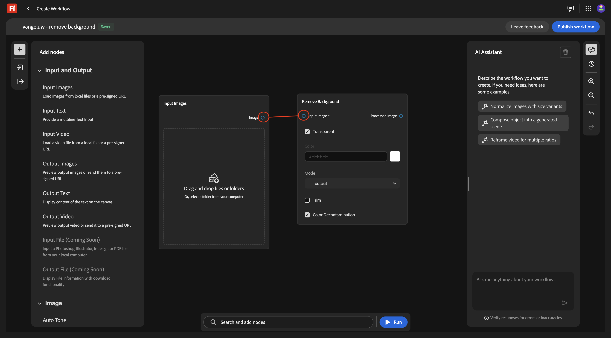

Tu devrais avoir ça. Cliquez ensuite sur le nœud **Images de sortie** et faites-le glisser sur la zone de travail.

Tu devrais avoir ça. Connectez le nœud **Supprimer l’arrière-plan** au nœud **Images de sortie** en pointant sur le point bleu en regard de **Image de sortie** sur le nœud **Supprimer l’arrière-plan** et en dessinant une ligne sur le point bleu en regard de **Image** sur le nœud **Images de sortie**.

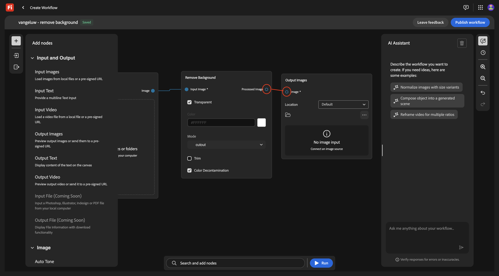

Tu devrais avoir ça.

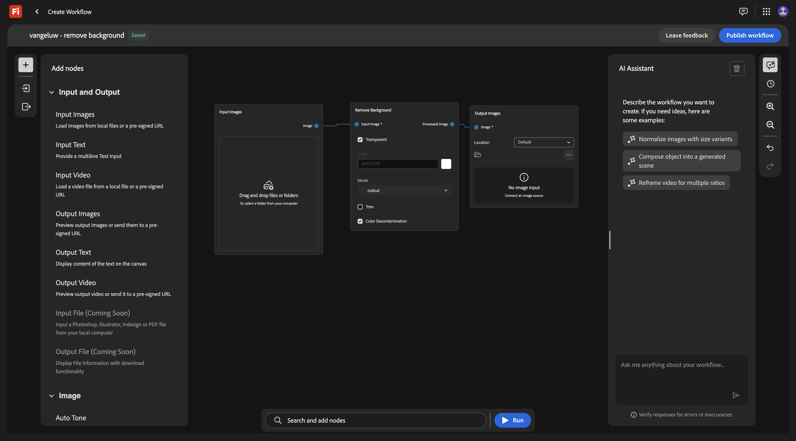

Votre workflow de base est maintenant prêt à être testé. Téléchargez l’image [phone.png](./assets/phone.png) sur votre bureau.

Revenez à votre workflow. Cliquez sur la zone **Glisser-déposer** du nœud **Images d’entrée**.

Sélectionnez le fichier **phone.png**. Cliquez sur **Ouvrir**.

Vous devriez alors voir ceci. Cliquez sur **Exécuter**.

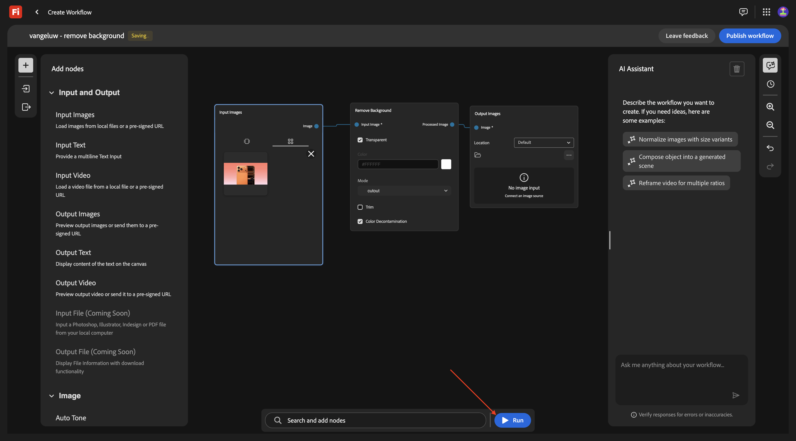

Après 1 à 2 minutes, vous devriez voir ce résultat.

## 1.7.1.2 Supprimer l’arrière-plan + Recadrer

Vous devez maintenant ajouter un nœud **Crop** à la zone de travail. Dans le menu, accédez à **Image** et faites défiler l’écran vers le bas pour trouver **Recadrer**. Faites-le glisser sur la zone de travail.

Placez le nœud **Crop** entre le nœud **Remove Background** et le nœud **Output Image**.

Vous devez maintenant supprimer la connexion entre le nœud **Remove Background** et le nœud **Output Image**. Pour ce faire, double-cliquez sur la ligne entre les deux nœuds.

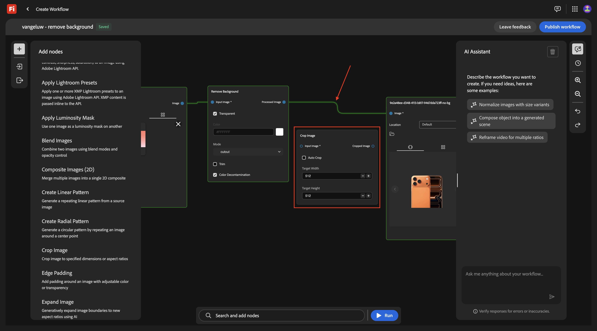

Tu devrais avoir ça. Connectez le nœud **Supprimer l’arrière-plan** au nœud **Recadrer**, puis connectez le nœud **Recadrer** au nœud **Image de sortie**.

Cochez la case **Recadrage automatique**, puis vous pouvez tester votre workflow en cliquant sur **Exécuter**.

Après 1 à 2 minutes, vous devriez voir ceci, qui montre une image avec une résolution différente maintenant.

## 1.7.1.3 Supprimer l’arrière-plan + Recadrer + Image composite

Dans le menu, sous **Image** sélectionnez un nœud **Images composites (2D)** et faites-le glisser sur la zone de travail.

Ajoutez une seconde connexion au nœud **Recadrer** en connectant le point bleu en regard de **Image recadrée** au point bleu en regard de **Image d’entrée** sur le nœud **Images composites (2D)**.

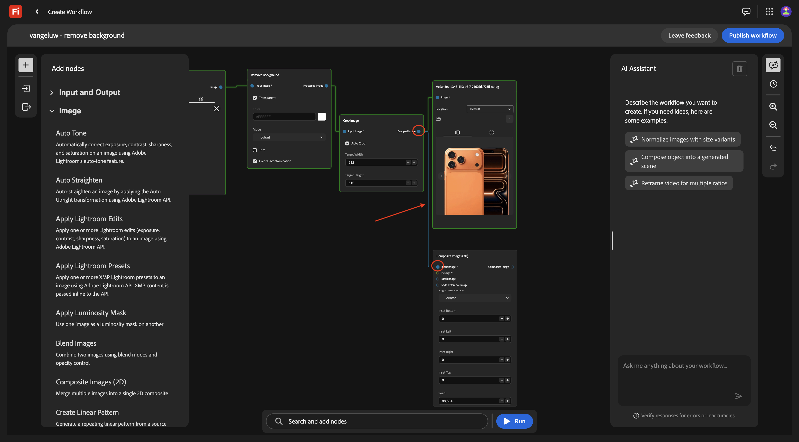

Dans le menu, sous **Entrée et sortie**, sélectionnez un nœud **Texte d’entrée** et faites-le glisser sur la zone de travail.

Connectez le point vert en regard de **Texte** sur le nœud **Texte d’entrée** au point vert en regard de **Invite** sur le nœud **Images composites (2D)**.

Tu devrais avoir ça. Saisissez l’invite ci-dessous dans le nœud **Texte de saisie**.

`magazine quality photo of a phone on a red pedestal with a pink background surrounded by origami style pink paper hearts`

Dans le menu, sous **Entrée et sortie**, sélectionnez un nœud **Images de sortie** et faites-le glisser sur la zone de travail.

Connectez le point bleu en regard de **Image composite** sur le nœud **Images composites (2D)** au point bleu en regard de **Image d’entrée** sur le nœud **Image de sortie**.

Cliquez sur **Exécuter**.

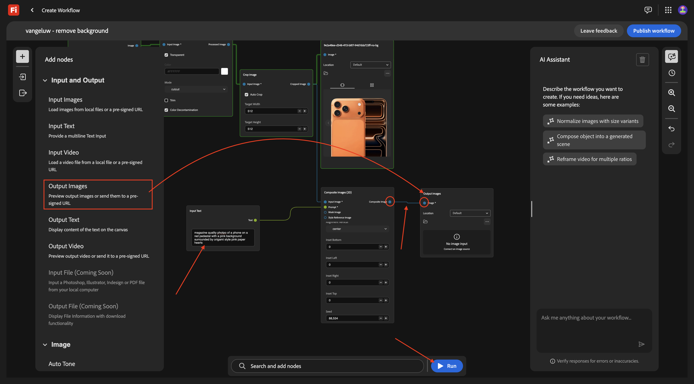

Après quelques minutes, vous devriez voir quelque chose comme ceci, qui montre votre image d’origine dans une composition basée sur l’invite fournie, dans une résolution spécifique.

## 1.7.1.4 Supprimer l’arrière-plan + Recadrer + Image composite + Générer la vidéo

Dans le menu, accédez à **Vidéo**. Sélectionnez le nœud **Générer la vidéo** et faites-le glisser sur la zone de travail.

Connectez le point bleu en regard de **Image composite** du nœud **Images composites (2D)** au point bleu en regard de **Image d’entrée** du nœud **Générer une vidéo**.

Dans le menu, accédez à **Entrée et sortie**. Sélectionnez le nœud **Texte d’entrée** et faites-le glisser sur la zone de travail.

Connectez le point vert en regard de **Texte** sur le nœud **Texte d’entrée** au point vert en regard de **Invite** du nœud **Générer une vidéo**.

Saisissez le `background hearts fluttering` d’invite dans le nœud **Texte de saisie**.

Dans le menu, accédez à **Entrée et sortie**. Sélectionnez le nœud **Vidéo de sortie** et faites-le glisser sur la zone de travail.

Connectez le point violet en regard de **Sortie vidéo** du nœud **Générer la vidéo** au point violet en regard de **Vidéo** sur le nœud **Vidéo de sortie**.

Cliquez sur **Exécuter**.

Après quelques vidéos, vous devriez voir ceci qui montre une vidéo basée sur la combinaison de l’image fournie et de l’invite.

## Échelle de 1.7.1.5

Vous l’avez maintenant fait pour 1 image. Utilisons maintenant ce workflow, mais pour plusieurs images.

Téléchargez ces images sur votre bureau :

- [watch.jpg](./assets/watch.jpg)
- [airpods.jpg](./assets/airpods.jpg)

Dans votre workflow, revenez au premier nœud, **Images d’entrée**. Supprimez l’image actuellement sélectionnée.

Cliquez sur la zone **Glisser-déposer**.

Sélectionnez les 3 images que vous avez téléchargées. Cliquez sur **Ouvrir**.

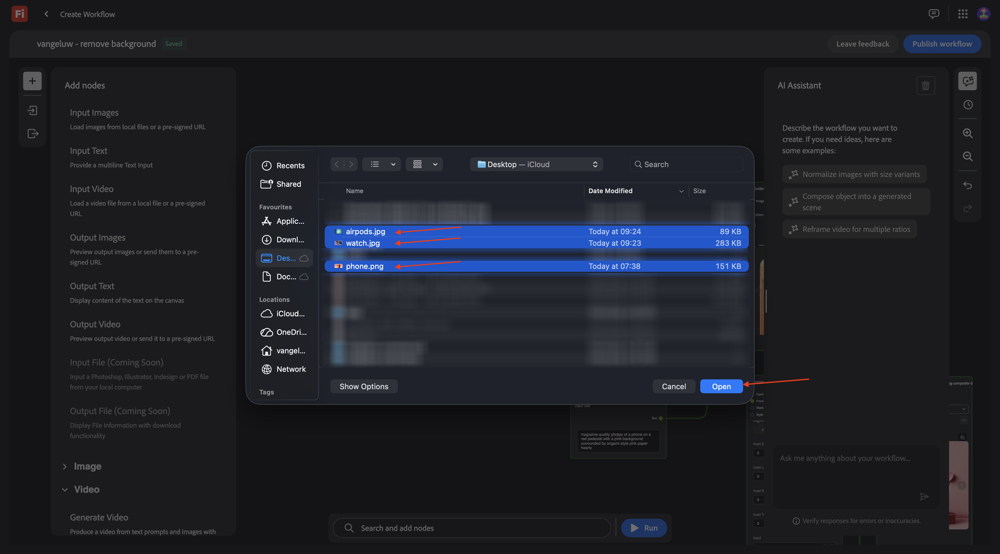

Vous devriez alors voir ceci. cliquez sur **Exécuter**.

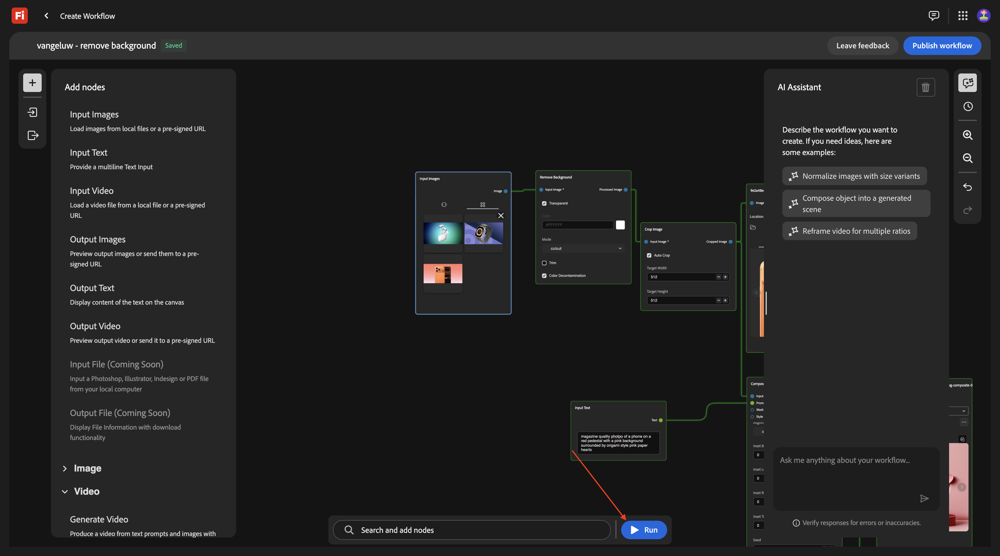

Au bout de quelques minutes, vous devriez voir une sortie similaire, avec 3 images générées et 3 vidéos.

## 1.7.1.5 Store dans AEM Assets CS

Dans cet exercice, vous allez stocker les ressources créées dans le cadre de votre workflow personnalisé dans AEM Assets CS.

Vous devez d’abord créer un dossier dans votre environnement AEM Assets CS.

Pour ce faire, accédez à . Cliquez pour ouvrir ****.

Sélectionnez votre environnement AEM Assets CS, qui doit être nommé `--aepUserLdap-- - CitiSignal AEM + ACCS`.

Accédez à **** puis cliquez sur **Créer un dossier**.

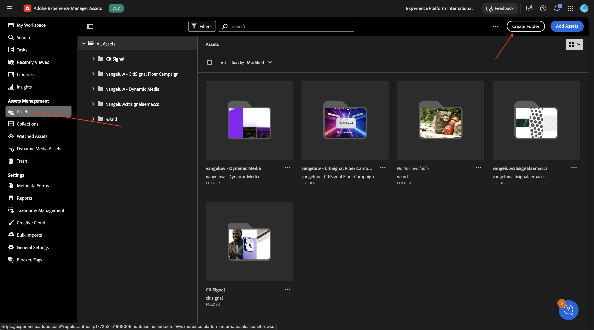

Saisissez le nom : `--aepUserLdap-- - Firefly Creative Production for Enterprise`. Cliquez sur **Créer**.

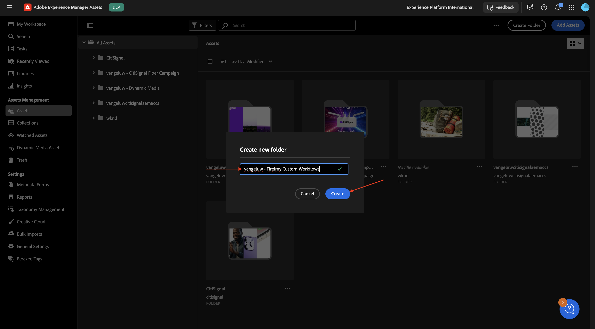

Revenez à votre workflow personnalisé et accédez au nœud **Images de sortie**. Cliquez sur **Par défaut** puis sélectionnez **AEM Assets**.

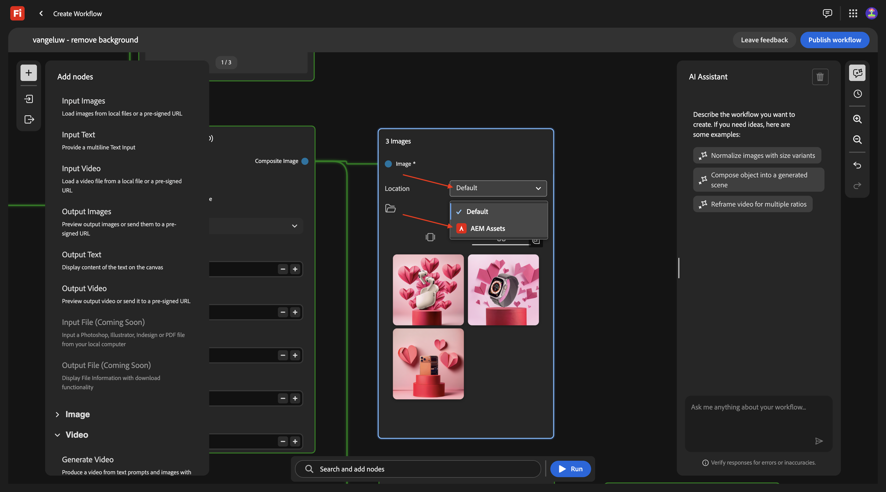

Vous devriez alors voir cette fenêtre contextuelle. Sélectionnez votre référentiel AEM Assets CS, puis sélectionnez le dossier que vous venez de créer et qui doit être nommé : `--aepUserLdap-- - Firefly Creative Production for Enterprise`. Cliquez sur **Sélectionner**.

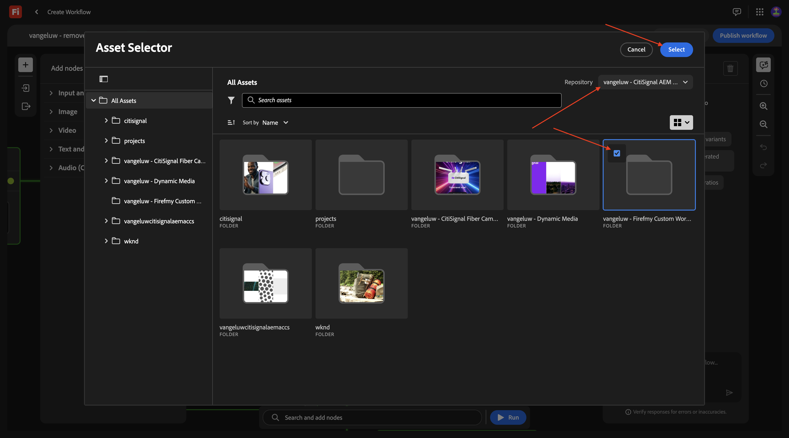

Accédez au nœud **Vidéo de sortie**. Cliquez sur **Par défaut** puis sélectionnez **AEM Assets**.

Vous devriez alors voir cette fenêtre contextuelle. Sélectionnez votre référentiel AEM Assets CS, puis sélectionnez le dossier que vous venez de créer et qui doit être nommé : `--aepUserLdap-- - Firefly Creative Production for Enterprise`. Cliquez sur **Sélectionner**.

Tu devrais avoir ça. Cliquez sur **Exécuter**.

Au bout de quelques minutes, vous devriez voir les ressources créées devenir disponibles dans le dossier dans AEM Assets CS.

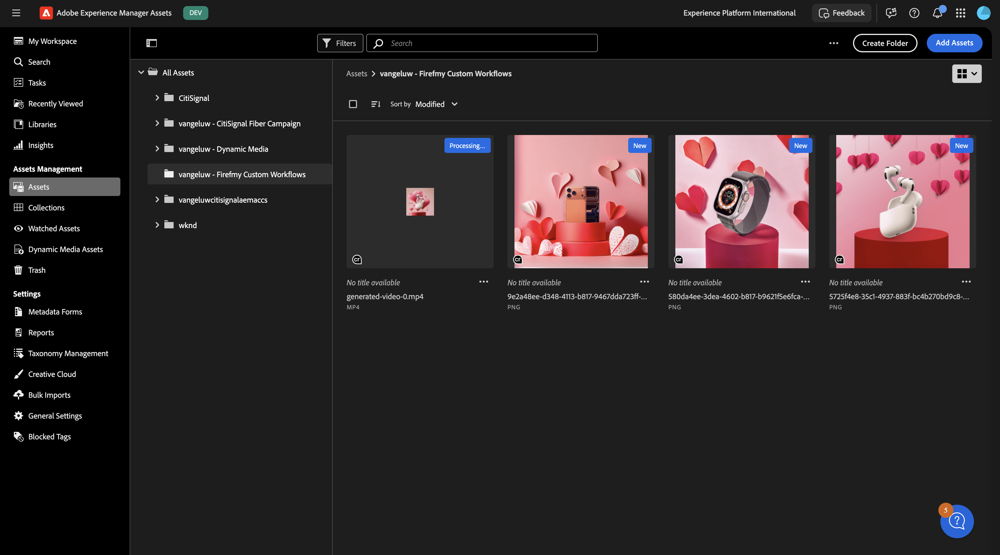

Revenez à votre workflow. Cliquez sur **Publier**.

Vous devriez alors voir ceci.

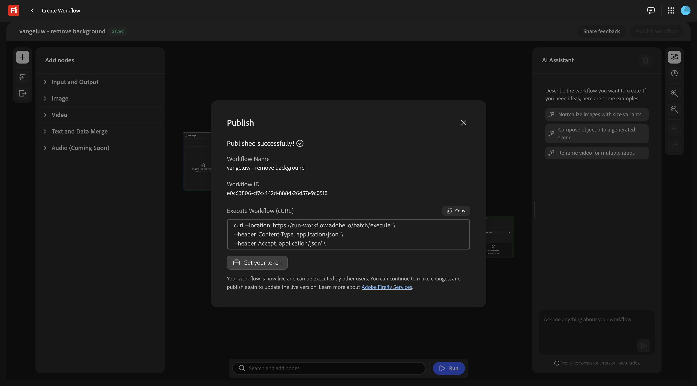

Votre workflow est maintenant publié et peut être exécuté par programmation dans le cadre de l’exercice suivant.

## Étapes suivantes

Accédez à [1.7.2 Exécuter votre workflow personnalisé par programmation](./ex2.md){target="_blank"}

Revenir à {target="_blank"}

Revenir à [Tous les modules](./../../../overview.md){target="_blank"}
