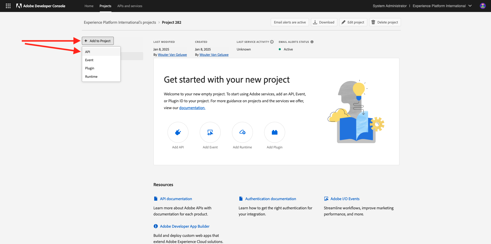
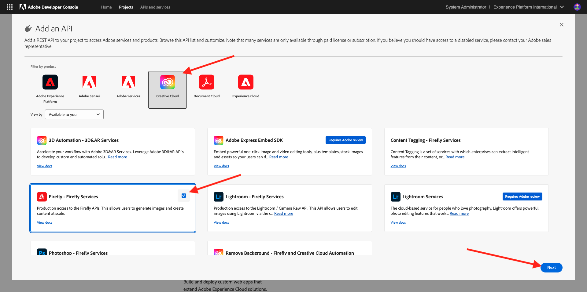

# 1.1.1 Prise en main des services Firefly

Découvrez comment utiliser Postman et Adobe I/O pour interroger les API des services d’Adobe Firefly.

## 1.1.1.2 Configurer votre projet d’Adobe I/O

Dans cet exercice, l’Adobe I/O est utilisé pour effectuer des requêtes sur les API Firefly Services. Pour configurer l’Adobe I/O, procédez comme suit.

1. Accédez à [https://developer.adobe.com/console/home](https://developer.adobe.com/console/home){target="_blank"}.

1. Veillez à sélectionner l’instance appropriée dans le coin supérieur droit de l’écran. Votre instance est `--aepImsOrgName--`. Sélectionnez ensuite **Créer un projet**.

1. Sélectionnez **+ Ajouter au projet** et choisissez **API**.

Votre écran devrait ressembler à ceci.

1. Sélectionnez **Creative Cloud** puis choisissez **Firefly - Services Firefly**, puis sélectionnez **Suivant**.

1. Attribuez un nom à vos informations d’identification : `--aepUserLdap-- - Firefly Services OAuth credential`, puis sélectionnez **Suivant**.

1. Sélectionnez le profil par défaut **Configuration des services de Firefly par défaut** et sélectionnez **Enregistrer l’API configurée**.

Votre intégration Adobe I/O est maintenant prête.

## 1.1.1.3 Télécharger l’environnement Postman

1. Sélectionnez **Télécharger pour Postman**, puis choisissez **OAuth serveur à serveur** pour télécharger un environnement Postman.

1. Sélectionnez le nom du projet.

1. Sélectionnez **Modifier le projet**.

1. Saisissez un nom convivial pour votre intégration : `--aepUserLdap-- Firefly`et sélectionnez **Enregistrer**.

La configuration de votre intégration Adobe I/O est maintenant terminée.

## 1.1.1.4 l’authentification Postman à l’Adobe I/O

>[!IMPORTANT]
>
>Si vous êtes un employé Adobe, veuillez suivre les instructions ici pour utiliser [PostBuster](./../../../postbuster.md).

1. Téléchargez et installez la version de Postman appropriée à votre système d’exploitation sur [Postman Downloads](https://www.postman.com/downloads/){target="_blank"}.

1. Démarrez l’application.

Dans Postman, il existe 2 concepts : Environnements et Collections.

- Le fichier d’environnement contient toutes vos variables d’environnement qui sont plus ou moins cohérentes. Dans l’environnement , vous trouverez des éléments tels que l’IMSOrg de votre environnement d’Adobe, ainsi que des informations d’identification de sécurité telles que votre identifiant client et d’autres. Vous avez téléchargé le fichier d’environnement lors de la configuration d’Adobe I/O précédente et il est nommé **`oauth_server_to_server.postman_environment.json`**.

- La collection contient un certain nombre de requêtes d’API que vous pouvez utiliser. Nous utiliserons 2 collections
   - 1 collection pour l’authentification à l’Adobe I/O
   - 1 Collection pour les exercices de ce module

1. Téléchargez [postman.zip](./../../../assets/postman/postman-ff.zip) sur votre bureau local.

Dans le fichier **postman.zip** se trouvent les fichiers suivants :

    - `Adobe IO - OAuth.postman_collection.json`
    - `FF - Firefly Services Tech Insiders.postman_collection.json`

1. Décompressez **postman-ff.zip** et stockez les 2 fichiers suivants dans un dossier sur votre bureau :
- Adobe IO - OAuth.postman_collection.json
- FF - Insiders techniques des services Firefly.postman_collection.json
- oauth_server_to_server.postman_environment.json

1. Dans Postman, sélectionnez **Importer**.

1. Sélectionnez **Fichiers**.

1. Sélectionnez les trois fichiers dans le dossier, puis sélectionnez **Ouvrir** et **Importer**.

Vous disposez désormais de tout ce dont vous avez besoin dans Postman pour commencer à interagir avec les services de Firefly via les API.

## 1.1.1.5 Demander un jeton d’accès

Ensuite, pour vous assurer que vous êtes correctement authentifié, vous devez demander un jeton d’accès.

1. Assurez-vous que l’environnement approprié est sélectionné avant d’exécuter une requête en vérifiant la liste déroulante Environnement dans le coin supérieur droit. L’environnement sélectionné doit porter un nom similaire à celui-ci, `--aepUserLdap-- Firefly Services OAuth Credential`.

L’environnement sélectionné doit porter un nom similaire à celui-ci, `--aepUserLdap-- Firefly Services OAuth Credential`.

Maintenant que votre environnement et vos collections Postman sont configurés et fonctionnent, vous pouvez vous authentifier de Postman à Adobe I/O.

1. Dans la collection **Adobe IO - OAuth**, sélectionnez la requête nommée **POST - Obtenir le jeton d’accès** et sélectionnez **Envoyer**.

Notez que sous **Paramètres de requête**, deux variables sont référencées : `API_KEY` et `CLIENT_SECRET`. Ces variables sont extraites de l’environnement sélectionné, `--aepUserLdap-- Firefly Services OAuth Credential`.

En cas de réussite, une réponse contenant un jeton porteur, un jeton d’accès et une fenêtre d’expiration s’affiche dans la section **Corps** de Postman.

Vous devriez voir une réponse similaire contenant les informations suivantes :

| Clé | Valeur |
|:-------------:| :---------------:| 
| token_type | **porteur** |
| access_token | **eyJhbGciOiJSU..** |
| expires_in | **86399** |

L’Adobe I/O **bearer-token** a une valeur spécifique (le très long access_token) et une fenêtre d’expiration et est désormais valide pendant 24 heures. Cela signifie qu’au bout de 24 heures, si vous souhaitez utiliser Postman pour vous authentifier sur Adobe I/O, vous devrez générer un nouveau jeton en exécutant à nouveau cette requête.

## API 1.1.1.6 Firefly Services, image Texte 2

Vous êtes maintenant prêt à envoyer votre première requête aux API des services de Firefly.

1. Sélectionnez la requête nommée **POST - Firefly - T2I V3** dans la collection **FF - Services de Firefly Tech Insiders**.

1. Copiez l’URL de l’image à partir de la réponse et ouvrez-la dans votre navigateur web pour afficher l’image.

Vous devriez voir une belle image représentant `horses in a field`.

N’hésitez pas à lire la requête API avant de passer à l’exercice suivant.

## Étapes suivantes

Accédez à [Optimiser le processus de votre Firefly à l’aide de Microsoft Azure et des URL prédéfinies](./ex2.md){target="_blank"}

Revenir à [Présentation des services d’Adobe Firefly ](./firefly-services.md){target="_blank"}

Revenir à [Tous les modules](./../../../overview.md){target="_blank"}
