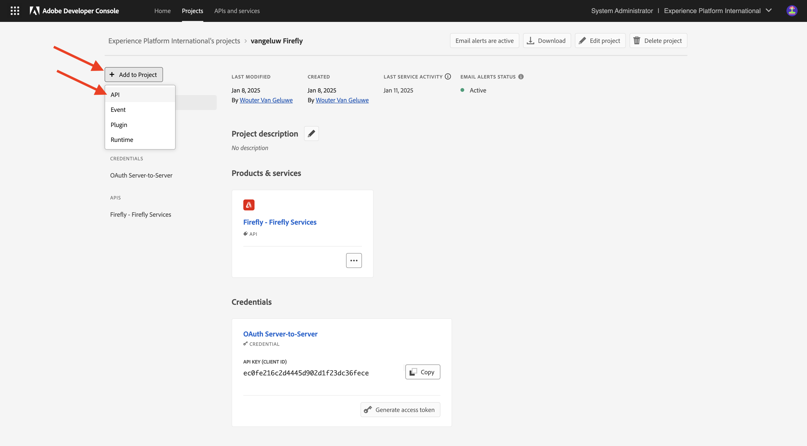
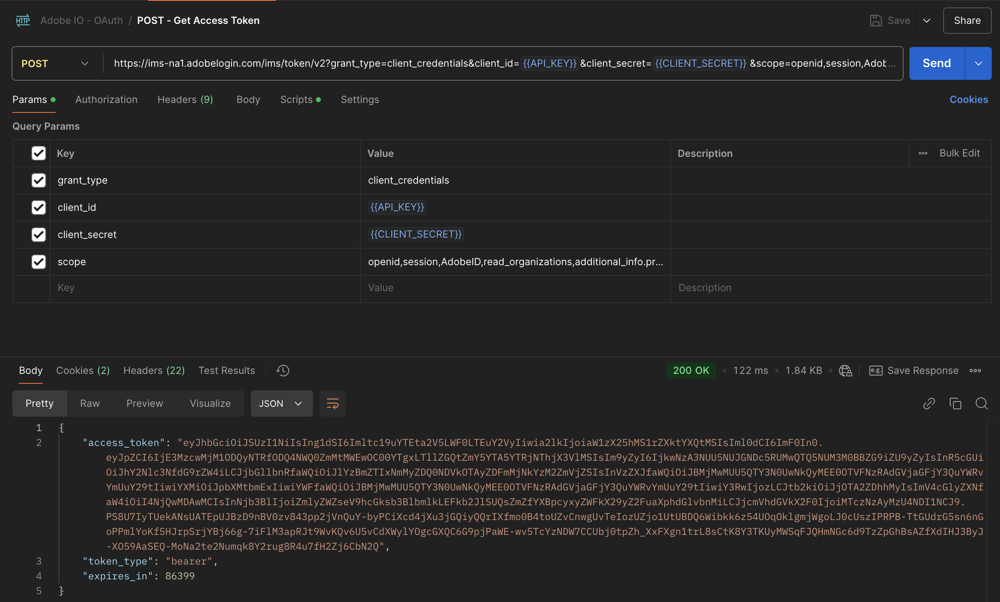
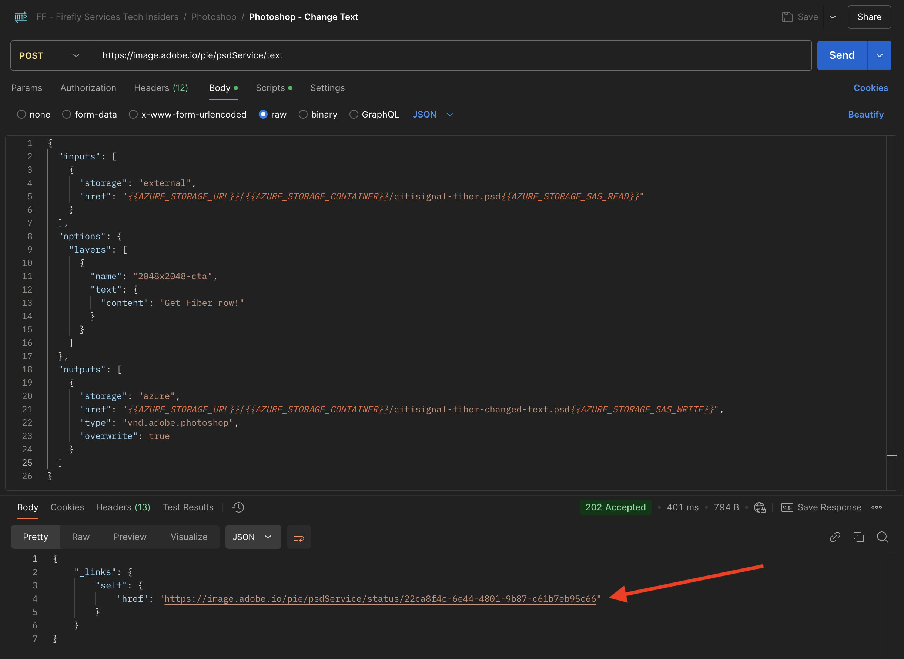

# 1.1.3 Utilisation des API Photoshop

## 1.1.3.1 Mettre à jour votre intégration Adobe I/O

Accédez à [https://developer.adobe.com/console/home](https://developer.adobe.com/console/home).


Accédez à **Projets** et cliquez pour ouvrir le projet que vous avez créé dans l’exercice précédent, qui s’appelle `--aepUserLdap-- Firefly`.


Cliquez sur **+ Ajouter au projet** puis sur **API**.



Sélectionnez **Creative Cloud** puis cliquez sur **Photoshop - Services de Firefly**. Cliquez sur **Suivant**.


Cliquez sur **Suivant**.


Ensuite, vous devez sélectionner un profil de produit qui définira les autorisations disponibles pour cette intégration.

Sélectionnez le profil **Configuration des services de Firefly par défaut** et **Configuration des services d’automatisation du Creative Cloud par défaut**.

Cliquez sur **Enregistrer l’API configurée**.


Votre projet Adobe I/O est maintenant mis à jour pour fonctionner avec les API Photoshop et Firefly Services.


## 1.1.3.2 Interagir par programmation avec un fichier de PSD

Téléchargez le fichier Accédez à [citisignal-fibre.psd](./../../../assets/ff/citisignal-fiber.psd) sur votre bureau.

Ouvrez le fichier **citisignal-fibre.psd** dans Photoshop. Tu devrais avoir ça.


Dans le volet **Calques**, vous verrez que le concepteur du fichier a donné un nom unique à chaque calque. Vous pouvez afficher les informations sur le calque en ouvrant le fichier de PSD dans Photoshop, mais vous pouvez également le faire par programmation.

Envoyons votre première requête d’API aux API Photoshop.

Accédez à Postman. Avant d’envoyer des requêtes d’API à Photoshop, vous devez vous authentifier sur Adobe I/O. Ouvrez la requête que vous avez utilisée précédemment avec le nom **POST - Obtenir le jeton d’accès**.

Accédez à **Params** et vérifiez que le paramètre **Scope** est correctement défini. La **Valeur** pour **Portée** doit se présenter comme suit :

`openid,session,AdobeID,read_organizations,additional_info.projectedProductContext, ff_apis, firefly_api`

Cliquez ensuite sur **Envoyer**.


Vous disposez alors d’un jeton d’accès valide pour interagir avec les API Photoshop.



### API Photoshop 1.1.3.2.1 - Bonjour le monde

Ensuite, disons bonjour aux API Photoshop pour tester si toutes les autorisations et tous les accès sont correctement définis. Dans la collection **Photoshop**, ouvrez la requête nommée **Photoshop Hello (Test d’authentification).**. Cliquez sur **Envoyer**.


Vous devriez alors recevoir la réponse suivante : **Bienvenue dans l’API Photoshop !**.


Ensuite, pour interagir par programmation avec le fichier de PSD **citisignal-fibre.psd**, vous devez le charger sur votre compte de stockage . Vous pouvez le faire manuellement, en le faisant glisser et en le déposant dans votre conteneur à l’aide de l’explorateur de stockage Azure, mais cette fois, vous devez le faire via l’API.

### 1.1.3.2.2 Charger le PSD sur Azure

Dans Postman, ouvrez la requête **Charger le PSD sur le compte de stockage Azure**. Dans l’exercice précédent, vous avez configuré ces variables d’environnement dans Postman, que vous allez maintenant utiliser :

- `AZURE_STORAGE_URL`
- `AZURE_STORAGE_CONTAINER`
- `AZURE_STORAGE_SAS_READ`
- `AZURE_STORAGE_SAS_WRITE`

Comme vous pouvez le voir dans la requête **Charger le PSD vers le compte de stockage Azure**, l’URL est configurée pour utiliser ces variables.


Dans **Body**, vous devez maintenant ajouter et sélectionner le fichier **citisignal-fibre.psd**.


Tu devrais avoir ça. Cliquez sur **Envoyer**.


Vous devriez ensuite obtenir cette réponse vide d’Azure, ce qui signifie que votre fichier est stocké dans votre conteneur dans votre compte de stockage Azure.


Si vous utilisez Azure Storage Explorer pour jeter un coup d’œil, votre fichier s’affichera après l’actualisation de votre dossier.


### API Photoshop 1.1.3.2.3 - Obtenir le manifeste

Ensuite, vous devez obtenir le fichier manifeste de votre fichier de PSD. Dans Postman, ouvrez la requête **Photoshop - Obtenir le manifeste de PSD**. Accédez à **Corps**.

Le corps doit ressembler à ceci :

```json
{
  "inputs": [
    {
      "storage": "external",
      "href": "{{AZURE_STORAGE_URL}}/{{AZURE_STORAGE_CONTAINER}}/citisignal-fiber.psd{{AZURE_STORAGE_SAS_READ}}"
    }
  ],
  "options": {
    "thumbnails": {
      "type": "image/jpeg"
    }
  }
}
```

Cliquez sur **Envoyer**.

Un lien s’affiche désormais dans la réponse. Les opérations dans Photoshop pouvant parfois prendre un certain temps, Photoshop fournit un fichier de statut en réponse à la plupart des requêtes entrantes. Pour comprendre ce qui se passe avec votre requête, vous devez lire le fichier de statut.


Pour lire le fichier de statut, ouvrez la requête **Photoshop - Obtenir le statut PS**. Vous constatez ensuite que cette requête utilise une variable comme URL, qui est une variable définie par la requête précédente que vous avez envoyée, **Photoshop - Get PSD Manifest**. Les variables sont définies dans les **Scripts** de chaque requête.

Cliquez sur **Envoyer**.


Vous devriez alors voir ceci. Actuellement, le statut est défini sur **en attente**, ce qui signifie que le processus n’est pas encore terminé.


Vous pouvez cliquer sur Envoyer plusieurs fois de plus dans la requête **Photoshop - Obtenir le statut PS**, jusqu&#39;à ce que le statut passe à **réussi**. Cela peut prendre quelques minutes.

Lorsque la réponse est disponible, un fichier json contenant des informations sur tous les calques du fichier de PSD s’affiche. Il s’agit d’informations utiles, car des éléments tels que le nom ou l’identifiant du calque sont visibles ici.


Par exemple, recherchez le `2048x2048-cta` de texte . Vous devriez alors voir ceci.


### API Photoshop 1.1.3.2.4 - Modifier le texte

Vous devez ensuite modifier le texte de l’appel à l’action à l’aide des API. Dans Postman, ouvrez la requête **Photoshop - Modifier le texte** et accédez à **Corps**.

Vous devriez alors voir ceci. Vous pouvez constater que :

- tout d&#39;abord, un fichier d&#39;entrée est spécifié : `citisignal-fiber.psd`
- ensuite, le calque à modifier est spécifié, avec le texte à modifier
- troisièmement, un fichier de sortie est spécifié : `citisignal-fiber-changed-text.psd`

```json
{
  "inputs": [
    {
      "storage": "external",
      "href": "{{AZURE_STORAGE_URL}}/{{AZURE_STORAGE_CONTAINER}}/citisignal-fiber.psd{{AZURE_STORAGE_SAS_READ}}"
    }
  ],
  "options": {
    "layers": [
      {
        "name": "2048x2048-cta",
        "text": {
          "content": "Get Fiber now!"
        }
      }
    ]
  },
  "outputs": [
    {
      "storage": "azure",
      "href": "{{AZURE_STORAGE_URL}}/{{AZURE_STORAGE_CONTAINER}}/citisignal-fiber-changed-text.psd{{AZURE_STORAGE_SAS_WRITE}}",
      "type": "vnd.adobe.photoshop",
      "overwrite": true
    }
  ]
}
```

Le fichier de sortie porte un nom différent, car vous ne souhaitez pas remplacer le fichier d’entrée d’origine.

Cliquez sur **Envoyer**.


Comme auparavant, la réponse contient un lien pointant vers le fichier de statut qui effectue le suivi de la progression.



Pour lire le fichier de statut, ouvrez la requête **Photoshop - Get PS Status** de nouveau et cliquez sur **Send**. Si le statut n’est pas défini sur **réussi** attendez immédiatement quelques secondes, puis cliquez de nouveau sur **Envoyer**.

Une fois le statut défini sur **réussi**, vous devriez voir ceci. Dans le chemin d’accès `outputs[0]._links.renditions[0].href`, vous devriez voir l’URL du fichier de sortie qui a été créé par Photoshop et qui contient le texte modifié.

Cliquez sur l’URL pour télécharger le fichier de sortie.


Le fichier **citisignal-fibre-changed-text.psd** sera alors téléchargé sur votre ordinateur, après quoi vous pourrez l&#39;ouvrir. Vous devriez alors constater que l’espace réservé pour l’appel à l’action a été remplacé par le texte **Get Fiber now !**.


Enfin, vous pouvez également voir ce fichier dans votre conteneur à l’aide de l’explorateur de stockage Azure.


Vous avez maintenant terminé cet exercice.

Étape suivante : [Résumé et avantages](./summary.md)

[Retour au module 1.1](./firefly-services.md)

[Revenir à tous les modules](./../../../overview.md)
