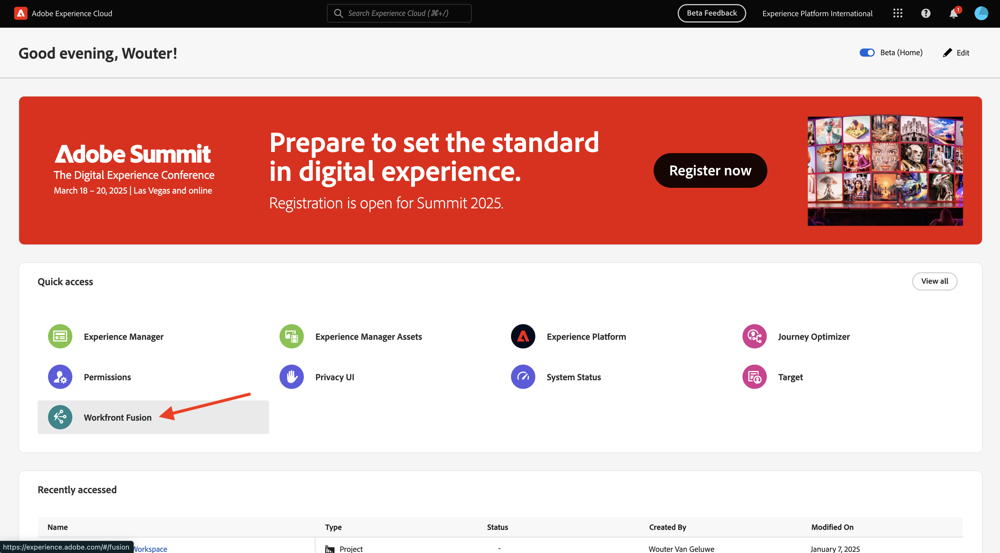
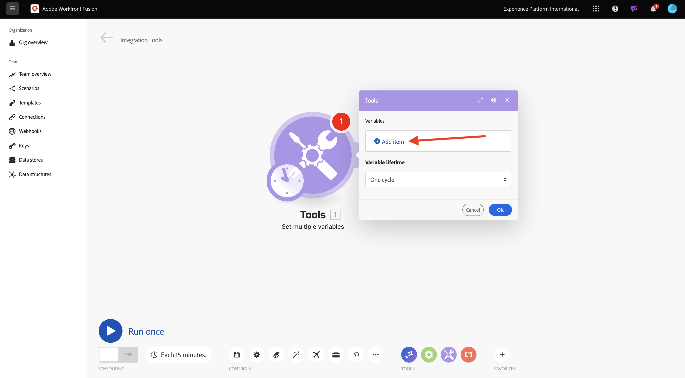

# 1.2.1 Prise en main de Workfront Fusion

Dans cet exercice, vous allez utiliser Workfront Fusion et Adobe I/O pour interroger les API Adobe Firefly Services.

## 1.2.1.1 Créer un nouveau scénario

Accédez à [https://experience.adobe.com/](https://experience.adobe.com/). Cliquez pour ouvrir **Workfront Fusion**.

Vous devriez alors voir ceci. Accédez à **Scénarios**.

Cliquez sur l’icône **+** pour créer un dossier.

Pour le nom du dossier, utilisez : `--aepUserLdap--`. Cliquez sur **Enregistrer**.

Sélectionnez votre dossier, puis cliquez sur **Créer un nouveau scénario**.

Un scénario vide s’affiche alors. Cliquez sur l’icône **outils** et sélectionnez **Définir plusieurs variables**.

Vous devez maintenant déplacer l’icône **horloge** sur le nouveau **Définir plusieurs variables** ajouté.

Tu verras ça.

Cliquez ensuite avec le bouton droit sur le point d’interrogation et sélectionnez **Supprimer le module**.

Cliquez ensuite avec le bouton droit de la souris sur l’objet **Définir plusieurs variables** et sélectionnez **Paramètres**.

## 1.2.1.2 Configurer l’authentification d’Adobe I/O

Vous devez maintenant configurer les variables nécessaires pour vous authentifier en cas d’Adobe I/O. Dans l’exercice précédent, vous avez créé un projet Adobe I/O. Les variables de ce projet d’Adobe I/O doivent maintenant être définies dans Workfront Fusion.

Les variables suivantes doivent être définies :

| Clé | Valeur |
|:-------------:| :---------------:| 
| `CONST_client_id` | l’identifiant client de votre projet Adobe I/O ; |
| `CONST_client_secret` | votre secret client de projet Adobe I/O |
| `CONST_scope` | votre projet d’Adobe I/O Portée |

Vous pouvez retrouver ces variables en accédant à [https://developer.adobe.com/console/projects](https://developer.adobe.com/console/projects) et en ouvrant votre projet d’Adobe I/O nommé `--aepUserLdap-- Firefly`.

Dans votre projet, cliquez sur **Serveur OAuth** pour afficher les valeurs des clés ci-dessus.

Avec les clés et valeurs ci-dessus, vous pouvez configurer l’objet **Définir plusieurs variables**. Cliquez sur **Ajouter un élément**.

Saisissez le **Nom de la variable** : **CONST_client_id** et sa **Valeur de la variable**, puis cliquez sur **Ajouter**.

Cliquez sur **Ajouter un élément**.

Saisissez le **Nom de la variable** : **CONST_client_secret** et sa **Valeur de la variable**, puis cliquez sur **Ajouter**.

Cliquez sur **Ajouter un élément**.

Saisissez le **Nom de la variable** : **CONST_scope** et sa **Valeur de la variable**, puis cliquez sur **Ajouter**.

Cliquez sur **OK**.

Pointez sur votre objet **Définir plusieurs variables** et cliquez sur la grande icône **+** pour ajouter un autre module.

Vous devriez alors voir ceci.

Dans la barre de recherche, saisissez **http**. Sélectionnez **HTTP** pour l’ouvrir.

puis sélectionnez **Effectuer une requête**.

| Clé | Valeur |
|:-------------:| :---------------:| 
| `URL` | `https://ims-na1.adobelogin.com/ims/token/v3` |
| `Method` | `POST` |
| `Body Type` | `x-www-form-urlencoded` |

Cliquez sur **Ajouter un élément**.

Ajoutez des éléments pour chacune des valeurs ci-dessous :

| Clé | Valeur |
|:-------------:| :---------------:| 
| `client_id` | votre variable prédéfinie pour `CONST_client_id` |
| `client_secret` | votre variable prédéfinie pour `CONST_client_secret` |
| `scope` | votre variable prédéfinie pour `CONST_scope` |
| `grant_type` | `client_credentials` |

Configuration pour `client_id`.

Configuration pour `client_secret`.

Configuration pour `scope`.

Configuration pour `grant_type`.

Présentation de la configuration. Faites défiler vers le bas et cochez la case **Analyser la réponse**. Cliquez sur **OK**.

Vous devriez alors voir ceci. Cliquez sur **Exécuter une fois**.

Une fois le scénario exécuté, vous devriez voir ceci.

Cliquez sur l’icône **point d’interrogation** de l’objet **Définir plusieurs variables** pour voir ce qui s’est passé lorsque cet objet a été exécuté.

Cliquez sur l’icône **point d’interrogation** de l’objet **HTTP - Effectuer une requête** pour voir ce qui s’est passé lorsque cet objet a été exécuté. Dans l’**OUTPUT**, le **access_token** est renvoyé par Adobe I/O.

Pointez sur l’objet **HTTP - Effectuer une requête** et cliquez sur l’icône **+** pour ajouter un autre module.

Dans la barre de recherche, recherchez `tools`. Sélectionnez **Outils**.

Sélectionnez **Définir plusieurs variables**.

Sélectionnez **Ajouter un élément**.

Définissez le **Nom de variable** sur `bearer_token`. Sélectionnez `access_token` comme **valeur de variable** dynamique. Cliquez sur **Ajouter**.

Tu devrais avoir ça. Cliquez sur **OK**.

Cliquez de nouveau sur **Exécuter**.

Une fois le scénario exécuté, cliquez sur l’icône **point d’interrogation** sur le dernier objet **Définir plusieurs variables**. Vous devriez alors voir que le jeton access_token est stocké dans la variable `bearer_token`.

Cliquez ensuite avec le bouton droit de la souris sur le premier objet **Définir plusieurs valeurs** et sélectionnez **Renommer**.

Définissez le nom sur **Initialiser les constantes**. Cliquez sur **OK**.

Renommez le second objet et définissez son nom sur **Authentification en Adobe I/O**. Cliquez sur **OK**.

Renommez le troisième objet et définissez le nom en **Définir le jeton du porteur**. Cliquez sur **OK**.

Tu devrais avoir ça.

Ensuite, remplacez le nom de votre scénario par `--aepUSerLdap-- - Adobe I/O Authentication`.

Cliquez sur **Enregistrer**.

Étape suivante : [1.2.2 Utilisation d’API Adobes dans Workfront Fusion](./ex2.md)

[Retour au module 1.2](./automation.md)

[Revenir à tous les modules](./../../../overview.md)
