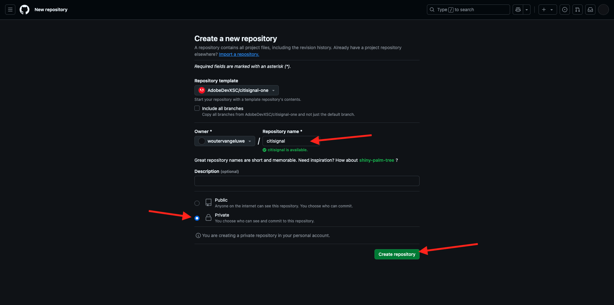
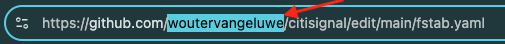
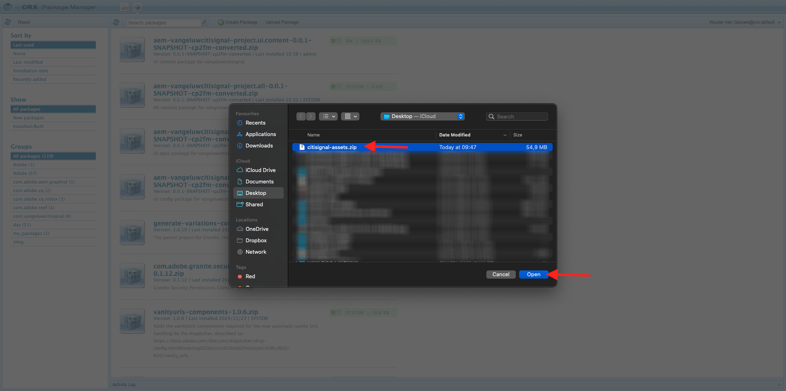
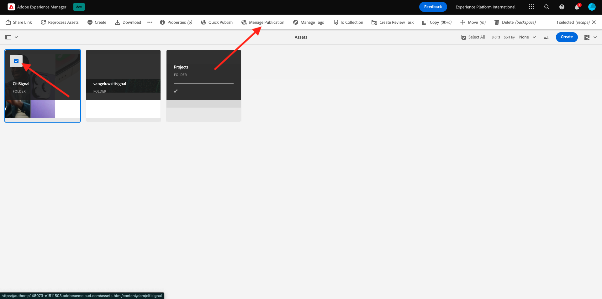
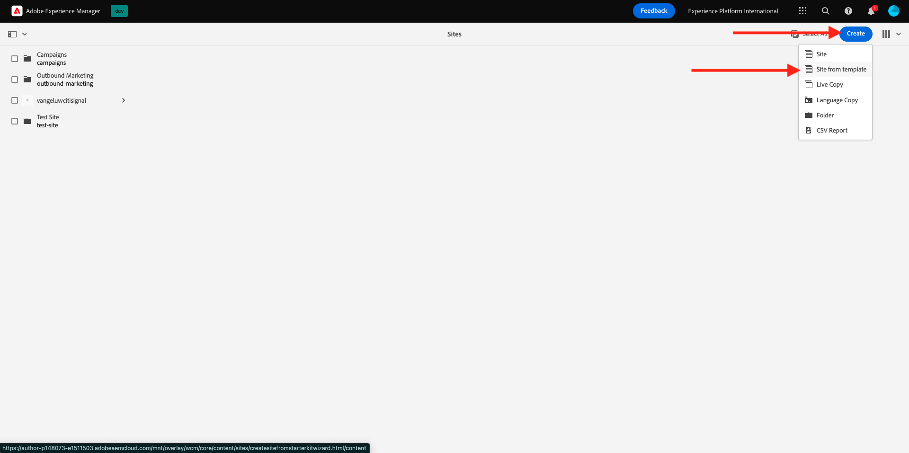
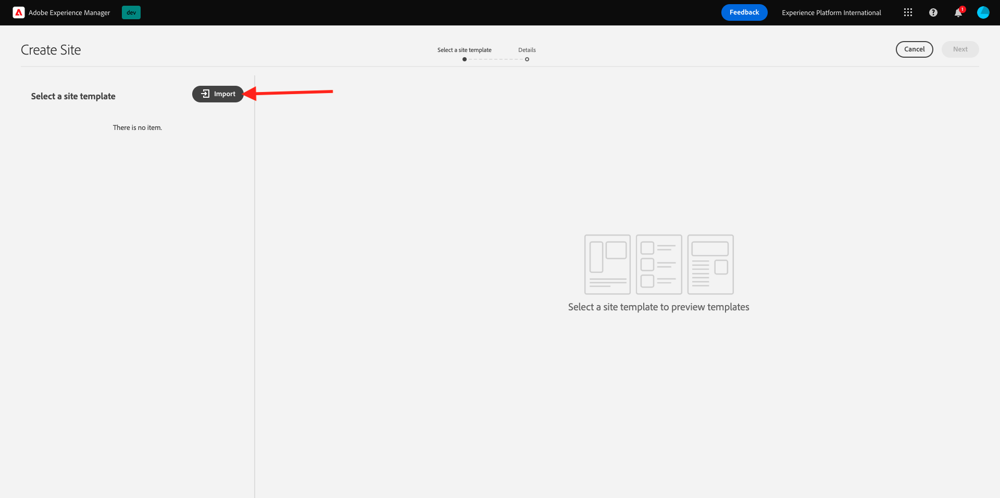
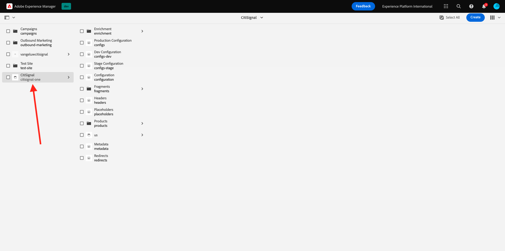

# 2.1.2 Configuration de votre environnement AEM CS

## 2.1.2.1 Configurer votre référentiel GitHub

Accédez à [https://github.com](https://github.com). Cliquez sur **Se connecter**.

Saisissez vos informations d’identification. Cliquez sur **Se connecter**.

Une fois connecté, votre tableau de bord GitHub s’affiche.

Accédez à [https://github.com/AdobeDevXSC/citisignal-one](https://github.com/AdobeDevXSC/citisignal-one). Tu verras ça. Cliquez sur **Utiliser ce modèle** puis sur **Créer un référentiel**.

Pour le **Nom du référentiel**, utilisez `citisignal`. Définissez la visibilité sur **Privé**. Cliquez sur **Créer un référentiel**.

Au bout de quelques secondes, votre référentiel sera alors créé.

Ensuite, accédez à [https://github.com/apps/aem-code-sync](https://github.com/apps/aem-code-sync). Cliquez sur **Configurer**.

Cliquez sur votre compte GitHub.

Cliquez sur **Sélectionner uniquement les référentiels** puis ajoutez le référentiel que vous venez de créer. Cliquez ensuite sur **Installer**.

Vous obtiendrez alors cette confirmation.

## 2.1.2.2 Mettre à jour le fichier fstab.yaml

Dans votre référentiel GitHub, cliquez sur pour ouvrir le fichier `fstab.yaml`.

Cliquez sur l’icône **modifier**.

Vous devez maintenant mettre à jour la valeur du champ **url** à la ligne 4.

Vous devez remplacer la valeur actuelle par l’URL de votre environnement AEM CS spécifique, en combinaison avec les paramètres de votre référentiel GitHub.

Il s’agit de la valeur actuelle de l’URL : `https://author-p131639-e1282833.adobeaemcloud.com/bin/franklin.delivery/adobedevxsc/citisignal-one/main`.

3 parties de l’URL doivent être mises à jour

`https://XXX/bin/franklin.delivery/YYY/ZZZ/main`

XXX doit être remplacé par l’URL de votre environnement de création AEM CS.

Vous devriez être remplacé par votre compte utilisateur GitHub.

ZZZ doit être remplacé par le nom du référentiel GitHub que vous avez utilisé dans l’exercice précédent.

Vous trouverez l’URL de votre environnement de création AEM CS à l’adresse [https://my.cloudmanager.adobe.com](https://my.cloudmanager.adobe.com). Cliquez sur votre **Programme** pour l’ouvrir.

Cliquez ensuite sur le **de 3 points...** dans l’onglet **Environnements** et cliquez sur **Afficher les détails**.

Vous verrez ensuite les détails de votre environnement, y compris l’URL de votre environnement **de création**. Copiez l’URL.

XXX = `author-p148073-e1511503.adobeaemcloud.com`

Pour le nom de compte d’utilisateur GitHub, vous pouvez facilement le trouver dans l’URL de votre navigateur. Dans cet exemple, le nom du compte utilisateur est `woutervangeluwe`.

AAAA = `woutervangeluwe`

Pour le nom du référentiel GitHub, vous pouvez également le trouver dans la fenêtre du navigateur que vous avez ouverte dans GitHub. Dans ce cas, le nom du référentiel est `citisignal`.

ZZZ = `citisignal`

La combinaison de ces 3 valeurs entraîne la création de cette nouvelle URL qui doit être configurée dans le `fstab.yaml` de fichiers.

`https://author-p148073-e1511503.adobeaemcloud.com/bin/franklin.delivery/woutervangeluwe/citisignal/main`

Cliquez sur **Valider les modifications...**.

Cliquez sur **Valider les modifications**.

Le fichier `fstab.yaml` a été mis à jour.

## 2.1.2.3 Charger des ressources CitiSignal

Accédez à [https://my.cloudmanager.adobe.com](https://my.cloudmanager.adobe.com). Cliquez sur votre **Programme** pour l’ouvrir.

Cliquez ensuite sur l’URL de votre environnement de création.

Cliquez sur **Se connecter avec Adobe**.

Votre environnement de création s’affiche alors.

Votre URL ressemblera à ceci : `https://author-p148073-e1511503.adobeaemcloud.com/ui#/aem/aem/start.html?appId=aemshell`

Vous devez maintenant accéder à l’environnement **Gestionnaire de packages CRX** d’AEM. Pour ce faire, supprimez `ui#/aem/aem/start.html?appId=aemshell` de l’URL et remplacez-la par `crx/packmgr`, ce qui signifie que votre URL doit maintenant ressembler à ceci :
`https://author-p148073-e1511503.adobeaemcloud.com/crx/packmgr`.
Appuyez sur **Entrée** pour charger l’environnement du gestionnaire de packages.

Cliquez ensuite sur **Télécharger le package**.

Cliquez sur **Parcourir** pour localiser le package à charger.

Le package à charger est appelé **citisignal-assets.zip** et peut être téléchargé ici : [https://tech-insiders.s3.us-west-2.amazonaws.com/one-adobe/citisignal-assets.zip](https://tech-insiders.s3.us-west-2.amazonaws.com/one-adobe/citisignal-assets.zip).

Sélectionnez le package et cliquez sur **Ouvrir**.

Cliquez ensuite sur **OK**.

Le package sera ensuite chargé.

Cliquez ensuite sur **Installer** sur le package que vous venez de télécharger.

Cliquez sur **Installer**.

Au bout de quelques minutes, votre package sera alors installé.

Vous pouvez maintenant fermer cette fenêtre.

## 2.1.2.4 de ressources CitiSignal Publish

Accédez à [https://my.cloudmanager.adobe.com](https://my.cloudmanager.adobe.com). Cliquez sur votre **Programme** pour l’ouvrir.

Cliquez ensuite sur l’URL de votre environnement de création.

Cliquez sur **Se connecter avec Adobe**.

Votre environnement de création s’affiche alors. Cliquez sur **Sites**.

Cliquez sur **Fichiers**.

Cliquez pour sélectionner le dossier **CitiSignal**, puis cliquez sur **Gérer la publication**.

Cliquez sur **Suivant**.

Cliquez sur **Publier**.

Vos ressources ont maintenant été publiées.

## 2.1.2.5 Créer un site web CitiSignal

Accédez à [https://my.cloudmanager.adobe.com](https://my.cloudmanager.adobe.com). Cliquez sur votre **Programme** pour l’ouvrir.

Cliquez ensuite sur l’URL de votre environnement de création.

Cliquez sur **Se connecter avec Adobe**.

Votre environnement de création s’affiche alors. Cliquez sur **Sites**.

Cliquez sur **Créer** puis sur **Site à partir d’un modèle**.

Cliquez sur **Importer**.

Vous devez maintenant importer un modèle préconfiguré pour votre site. Vous pouvez télécharger le modèle [ici](./../../../assets/aem/citisignal-edge-delivery-services-template-0.0.4.zip). Enregistrez le fichier sur votre bureau.

Sélectionnez ensuite le `citisignal-edge-delivery-services-template-0.0.4.zip` de fichier et cliquez sur **Ouvrir**.

Tu verras ça. Cliquez pour sélectionner le modèle que vous venez de charger, puis cliquez sur **Suivant**.

Vous devez maintenant renseigner certains détails.

- Titre du site : utiliser **CitiSignal**
- Nom du site : utilisez **citisignal-one**
- URL GitHub : copiez l’URL du référentiel GitHub que vous utilisiez précédemment

Tu auras alors ceci. Cliquez sur **Créer**.

Votre site est en cours de création. Cela peut prendre quelques minutes. Cliquez sur **OK**.

Actualisez votre écran au bout de quelques minutes, vous verrez alors votre nouveau site CitiSignal.

## Site web 2.1.2.6 Publish CitiSignal

Ensuite, cliquez sur la case à cocher devant **CitiSignal**. Cliquez ensuite sur **Gérer la publication**.

Cliquez sur **Suivant**.

Cliquez sur **Inclure les paramètres enfants**.

Cochez la case **Inclure les enfants**, puis cliquez pour désélectionner les autres cases. Cliquez sur **OK**.

Cliquez sur **Publier**.

On vous renverra ensuite ici. Accédez à **CitiSignal** > **us** > **fr**. Cochez la case en regard de **index**, puis cliquez sur **Modifier**.

Votre site web s’ouvre alors dans l’**éditeur universel**.

Vous pourrez désormais accéder à votre site web en accédant à `main--citisignal--XXX.aem.page/us/en` et/ou `main--citisignal--XXX.aem.live/us/en`, après avoir remplacé XXX par votre compte utilisateur GitHub, qui est `woutervangeluwe` dans cet exemple.

Dans cet exemple, l’URL complète devient :
`https://main--citisignal--woutervangeluwe.aem.page/us/en` et/ou `https://main--citisignal--woutervangeluwe.aem.live/us/en`

Cela peut prendre un certain temps avant que toutes les ressources ne s’affichent correctement, car elles doivent d’abord être publiées.

Vous verrez alors ceci :

Au bout de quelques minutes, les ressources se chargeront toutes correctement.

## Performances de la page de test 2.1.2.7

Accédez à [https://pagespeed.web.dev/](https://pagespeed.web.dev/). Saisissez votre URL et cliquez sur **Analyser**.

Votre site web obtient un score élevé dans les visualisations pour appareils mobiles et pour ordinateurs de bureau :

**Mobile** :

**Ordinateur de bureau** :

Étape suivante : [2.1.3 Configurer un bloc personnalisé](./ex3.md)

[Retour au module 2.1](./aemcs.md)

[Revenir à tous les modules](./../../../overview.md)
