# 2.1.4 Développement d’un bloc personnalisé de base

## 2.1.4.1 Configurer votre environnement de développement local

Accédez à [https://desktop.github.com/download/](https://desktop.github.com/download/){target="_blank"}, téléchargez et installez **Github Desktop**.


Une fois Github Desktop installé, accédez au référentiel GitHub que vous avez créé dans l’exercice précédent. Cliquez sur **&lt;> Code** puis sur **Ouvrir avec GitHub Desktop**.


Votre référentiel GitHub sera alors ouvert dans le bureau GitHub. N’hésitez pas à modifier le **Chemin local**. Cliquez sur **Cloner**.


Un dossier local va maintenant être créé.


Ouvrez Visual Studio Code. Accédez à **Fichier** > **Ouvrir le dossier**.


Sélectionnez le dossier utilisé par votre configuration GitHub pour **citisignal**.

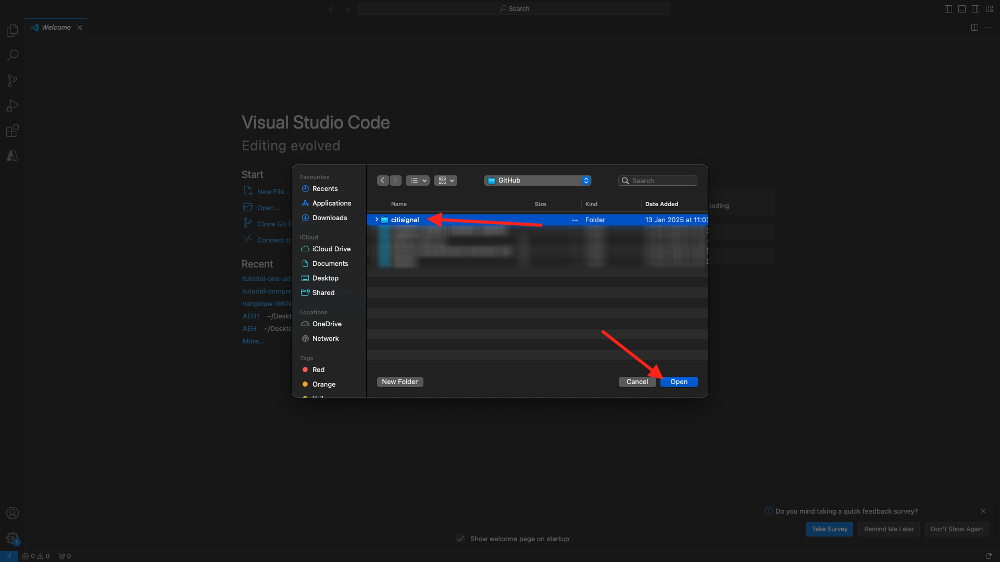

Ce dossier est maintenant ouvert dans Visual Studio Code. Vous êtes maintenant prêt à créer un nouveau bloc.


## 2.1.4.2 Créer un bloc personnalisé de base

Adobe vous recommande de développer des blocs selon une approche en trois phases :

- Créez la définition et le modèle du bloc, examinez-les et mettez-les en production.
- Créez du contenu avec le nouveau bloc.
- Mettez en œuvre la décoration et les styles pour le nouveau bloc.

### component-definition.json

Dans Visual Studio Code, ouvrez le fichier **component-definition.json**.

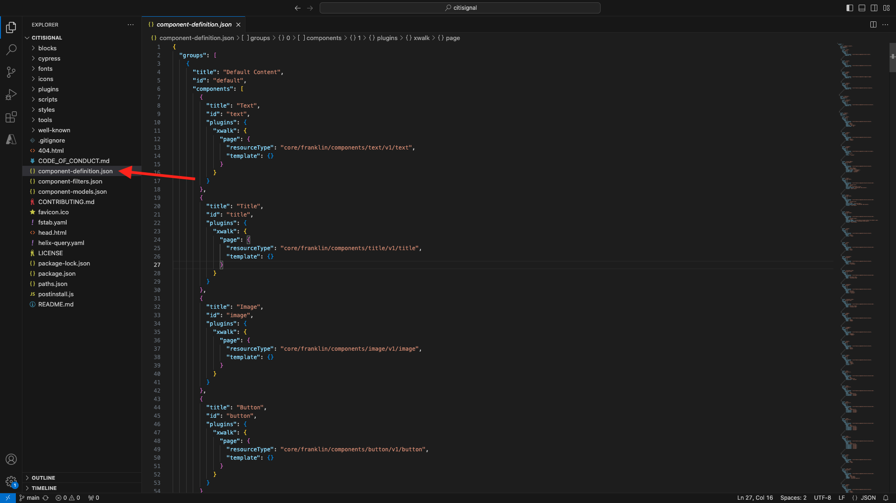

Faites défiler jusqu’à afficher le composant **Citation**. Placez le curseur en regard du crochet fermant du dernier composant.


Collez ce code et saisissez une virgule **,** après le bloc de code :

```json
{
  "title": "FiberOffer",
  "id": "fiberoffer",
  "plugins": {
    "xwalk": {
      "page": {
        "resourceType": "core/franklin/components/block/v1/block",
        "template": {
          "name": "FiberOffer",
          "model": "fiberoffer",
          "offerText": "<p>Fiber will soon be available in your region!</p>",
          "offerCallToAction": "Get your offer now!",
          "offerImage": ""
        }
      }
    }
  }
}
```

Enregistrez vos modifications.


### component-models.json

Dans Visual Studio Code, ouvrez le fichier **component-models.json**.

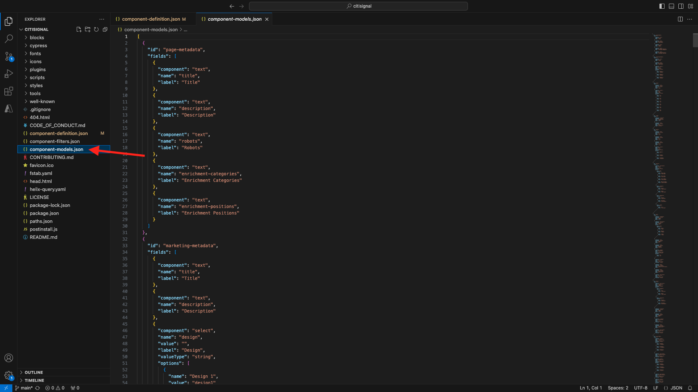

Faites défiler vers le bas jusqu’à ce que le dernier élément s’affiche. Placez le curseur en regard du crochet fermant du dernier composant.

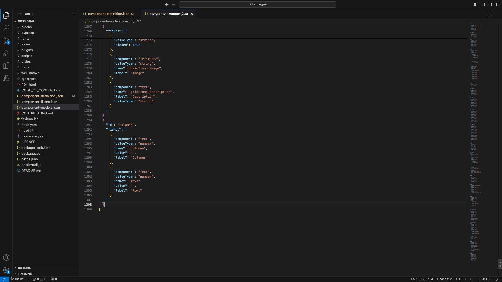

Saisissez une virgule **,**, puis appuyez sur Entrée et, sur la ligne suivante, collez ce code :

```json
{
  "id": "fiberoffer",
  "fields": [
     {
       "component": "richtext",
       "name": "offerText",
       "value": "",
       "label": "Offer Text",
       "valueType": "string"
     },
     {
       "component": "richtext",
       "valueType": "string",
       "name": "offerCallToAction",
       "label": "Offer CTA",
       "value": ""
     },
     {
       "component": "reference",
       "valueType": "string",
       "name": "offerImage",
       "label": "Offer Image",
        "multi": false
     }
   ]
}
```

Enregistrez vos modifications.

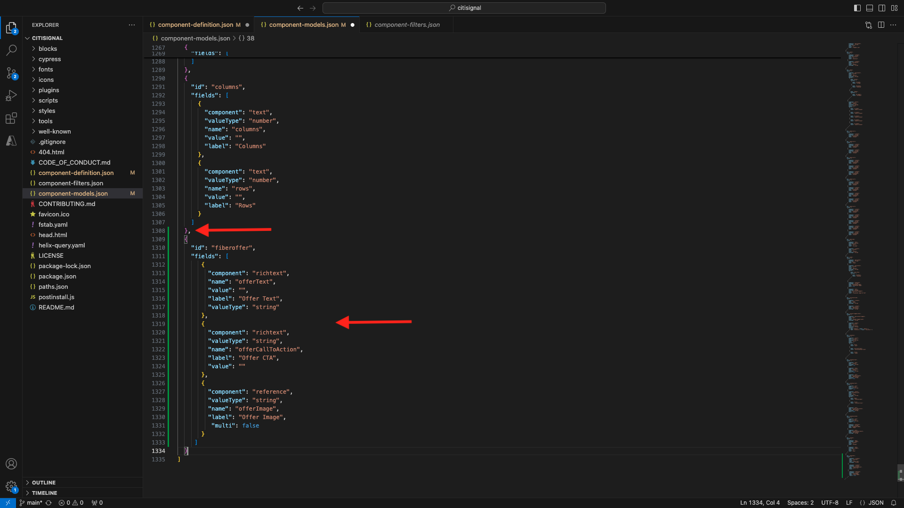

### component-filters.json

Dans Visual Studio Code, ouvrez le fichier **component-filters.json**.

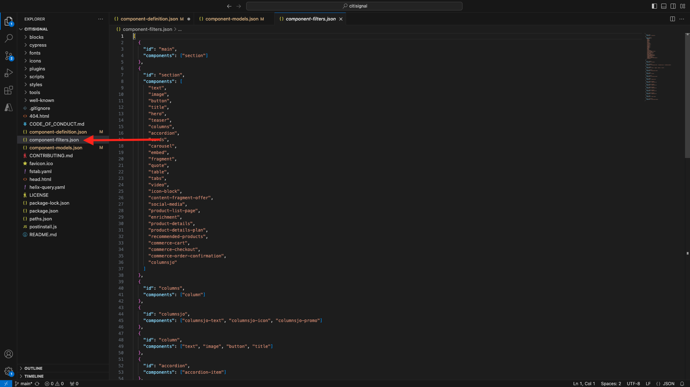

Sous **section**, saisissez une virgule **,** et l’identifiant de votre composant **fiberoffer** après la dernière ligne active.

Enregistrez vos modifications.


## 2.1.4.3 Valider vos modifications

Vous avez apporté plusieurs modifications à votre projet qui doivent être validées dans votre référentiel GitHub. Pour ce faire, ouvrez **GitHub Desktop**.

Vous devriez alors voir les 3 fichiers que vous venez de modifier sous **Modifications**. Vérifiez vos modifications.


Saisissez un nom pour votre requête de tirage, `Fiber Offer custom block`. Cliquez sur **Valider dans la ressource principale**.

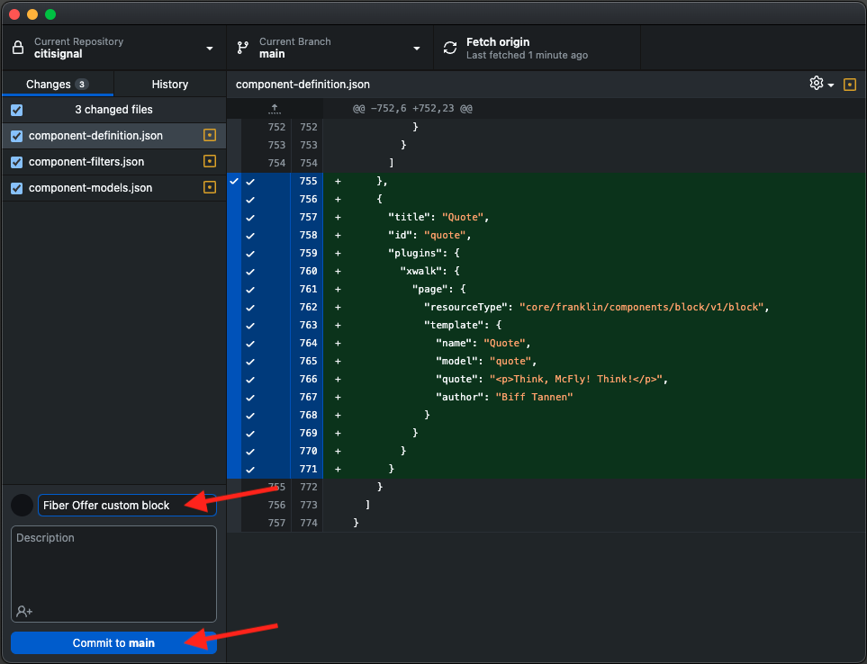

Vous devriez alors voir ceci. Cliquez sur **Push origin**.


Au bout de quelques secondes, vos modifications ont été transmises à votre référentiel GitHub.

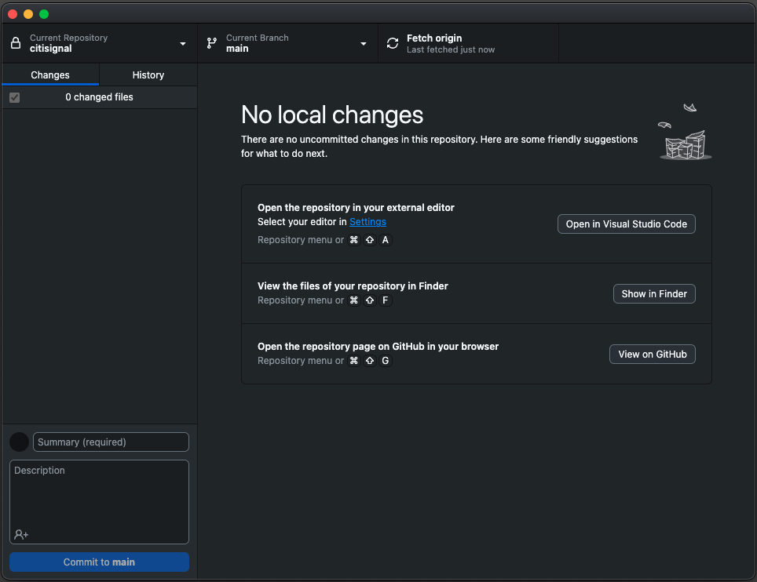

Dans votre navigateur, accédez à votre compte GitHub et au référentiel que vous avez créé pour CitiSignal. Vous devriez ensuite voir un élément similaire, montrant que vos modifications ont été reçues.

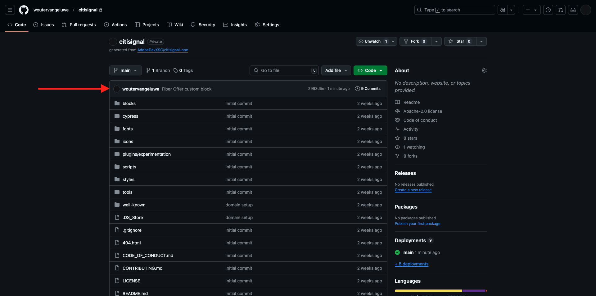

## 2.1.4.4 Ajouter votre bloc à une page

Maintenant que votre bloc de devis de base est défini et validé dans le projet CitiSignal, vous pouvez ajouter un bloc **fiberoffer** à une page existante.

Accédez à [https://my.cloudmanager.adobe.com](https://my.cloudmanager.adobe.com){target="_blank"}. Cliquez sur votre **Programme** pour l’ouvrir.


Cliquez ensuite sur le **de 3 points...** dans l’onglet **Environnements** et cliquez sur **Afficher les détails**.


Vous verrez ensuite les détails de votre environnement. Cliquez sur l’URL de votre environnement de **création**.

>[!NOTE]
>
>Il est possible que votre environnement soit mis en veille. Si c’est le cas, vous devrez d’abord réactiver votre environnement.

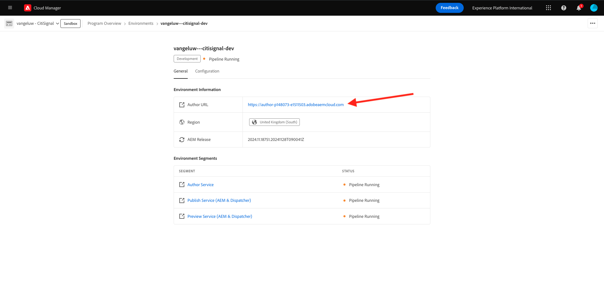

Vous devriez alors voir votre environnement de création AEM. Accédez à **Sites**.


Accédez à **CitiSignal** > **us** > **fr**.


Cliquez sur **Créer** puis sélectionnez **Page**.


Sélectionnez **Page** et cliquez sur **Suivant**.


Saisissez les valeurs suivantes :

- Titre : **CitiSignal Fiber**
- Nom : **citisignal-fibre**
- Titre de la page : **CitiSignal Fiber**

Cliquez sur **Créer**.


Vous devriez alors voir ceci.


Cliquez dans la zone vierge pour sélectionner le composant **section**. Cliquez ensuite sur l’icône plus **+** dans le menu de droite.


Votre bloc personnalisé doit alors s’afficher dans la liste des blocs disponibles. Cliquez pour le sélectionner.


Des champs tels que **Texte de l’offre**, **CTA de l’offre** et **Image de l’offre** sont alors ajoutés à l’éditeur. Cliquez sur **+ Ajouter** dans le champ **Image de l’offre** pour sélectionner une image.


Vous devriez alors voir ceci. Cliquez pour ouvrir le dossier **citisignal**.


Sélectionnez l’image **product-enrichment-1.png**. Cliquez sur **Sélectionner**.


Tu devrais avoir ça. Cliquez sur **Publier**.


Cliquez de nouveau sur **Publish**.


Votre nouvelle page a été publiée.

## 2.1.4.5 Ajouter votre nouvelle page au menu de navigation

Dans votre présentation AEM Sites, accédez à **CitiSignal** > **Fragments** et cochez la case correspondant à **En-tête**. Cliquez sur **Modifier**.


Ajoutez une option de menu au menu de navigation avec le `Fiber` texte. Sélectionnez le texte **Fibre** et cliquez sur l’icône **lien**.


Saisissez ceci pour le `/us/en/citisignal-fiber` **URL** et cliquez sur l’icône **V** pour confirmer.


Tu devrais avoir ça. Cliquez sur **Publier**.


Cliquez de nouveau sur **Publish**.


Vous pourrez désormais afficher les modifications apportées à votre site web en accédant à `main--citisignal--XXX.aem.page/us/en` et/ou `main--citisignal--XXX.aem.live/us/en`, après avoir remplacé XXX par votre compte utilisateur GitHub, ce qui est `woutervangeluwe` dans cet exemple.

Dans cet exemple, l’URL complète devient :
`https://main--citisignal--woutervangeluwe.aem.page/us/en` et/ou `https://main--citisignal--woutervangeluwe.aem.live/us/en`

Vous devriez alors voir ceci. Cliquez sur **Fibre**.

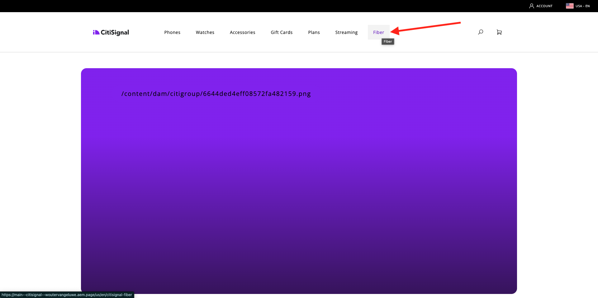

Voici votre bloc personnalisé de base, mais désormais rendu sur le site web.


Étape Suivante : Bloc Personnalisé Avancé [2.1.5](./ex5.md){target="_blank"}

[Retour au module 2.1](./aemcs.md){target="_blank"}

[Revenir à tous les modules](./../../../overview.md){target="_blank"}
