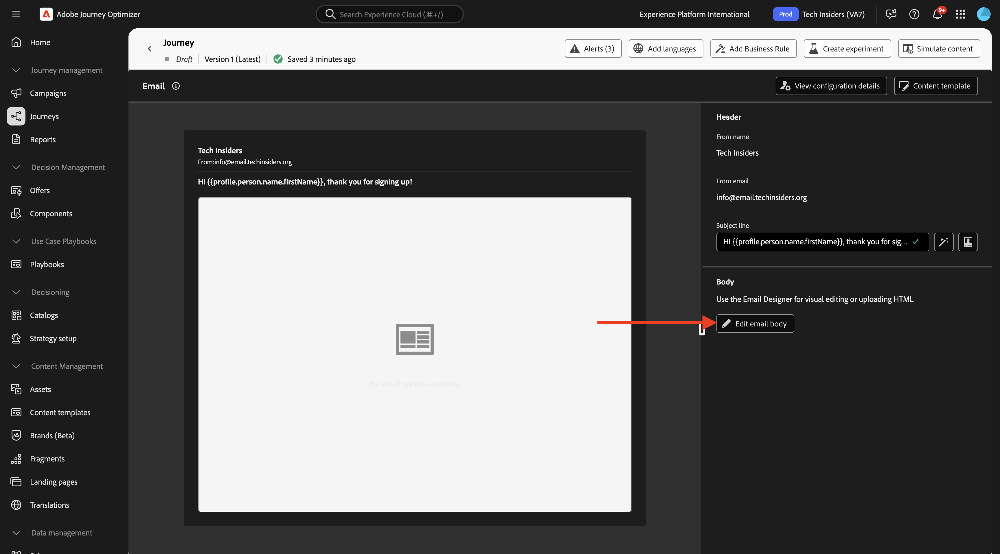
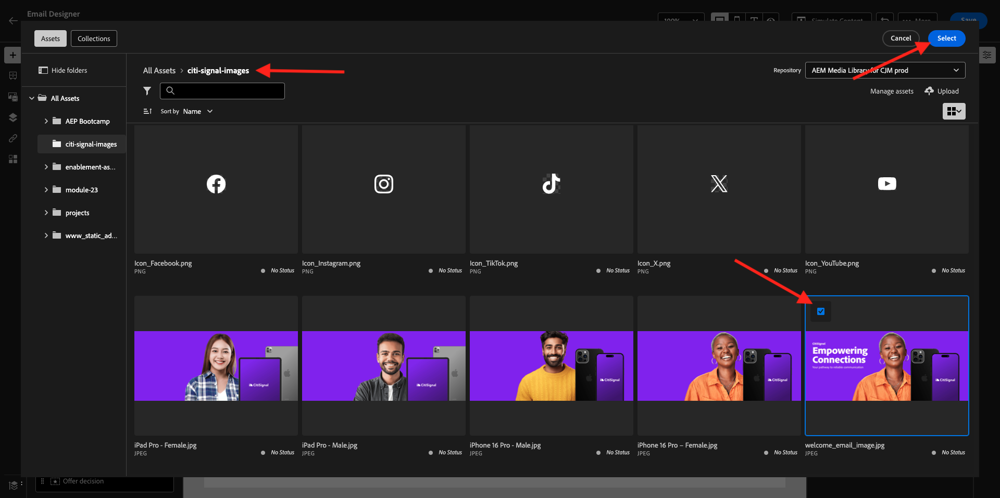

# 3.1.3 Création de votre parcours et de votre e-mail

Dans cet exercice, vous allez configurer le parcours et le message qui doit être déclenché lorsqu’une personne crée un compte sur le site web de démonstration.

Connectez-vous à Adobe Journey Optimizer en allant sur [Adobe Experience Cloud](https://experience.adobe.com?lang=fr). Cliquez sur **Journey Optimizer**.


Vous serez redirigé vers la vue **Accueil** dans Journey Optimizer. Tout d’abord, assurez-vous d’utiliser le bon sandbox. Le sandbox à utiliser est appelé `--aepSandboxName--`.


## 3.1.3.1 Créer votre Parcours

Dans le menu de gauche, cliquez sur **Parcours**. Cliquez ensuite sur **Créer un Parcours** pour créer un parcours.


Un écran de parcours vide s’affiche alors.


Dans l’exercice précédent, vous avez créé un **Événement**. Vous l&#39;avez nommé comme ceci `--aepUserLdap--AccountCreationEvent`. Résultat de la création de l’événement :


Vous devez maintenant prendre cet événement comme point de départ de ce Parcours. Pour ce faire, accédez au côté gauche de l’écran et recherchez l’événement dans la liste des événements.


Sélectionnez votre événement, faites-le glisser et déposez-le sur la zone de travail du parcours. Votre parcours ressemble désormais à ceci :


Comme deuxième étape du parcours, vous devez ajouter une courte étape **Attente**. Accédez à la section **Orchestration** située dans la partie gauche de l’écran. Vous utiliserez les attributs de profil et devrez vous assurer qu’ils sont renseignés dans le profil client en temps réel.


Votre parcours ressemble maintenant à ceci. Dans la partie droite de l’écran, vous devez configurer le temps d’attente. Réglez-le sur 1 minute. Vous aurez ainsi suffisamment de temps pour que les attributs de profil soient disponibles après le déclenchement de l’événement . Cliquez sur **Enregistrer** pour enregistrer vos modifications.


Comme troisième étape du parcours, vous devez ajouter une action **E-mail**. Accédez à la partie gauche de l’écran pour **Actions**, sélectionnez l’action **E-mail**, puis faites-la glisser sur le deuxième nœud du parcours. Vous voyez maintenant ceci.


Définissez la **Catégorie** sur **Marketing** et sélectionnez une configuration d’e-mail qui vous permet d’envoyer un e-mail. Dans ce cas, la configuration d’e-mail à sélectionner est **Email-TI**.


## 3.1.3.2 Créer votre message

Pour créer votre message, cliquez sur **Modifier le contenu**.


Vous voyez maintenant ceci.


Cliquez sur l’icône **Ouvrir la boîte de dialogue de personnalisation**.


Rédigez le texte `Hi `. Vous devez ensuite importer le jeton de personnalisation pour le champ **Prénom** qui est stocké sous `profile.person.name.firstName`. Dans le menu de gauche, accédez au champ **Personne > Nom complet > Prénom** et cliquez sur l’icône **+**. Le jeton de personnalisation apparaît alors dans le champ de texte.


Ajoutez ensuite le texte **, merci de vous être inscrit !**. Cliquez sur **Enregistrer**.


Vous pouvez maintenant commencer à configurer le corps de votre e-mail. Cliquez sur **Modifier le corps de l’e-mail**.



Avant de commencer à créer le contenu du message lui-même, il est préférable de réfléchir au contenu du message. Une partie du contenu du message est propre au message lui-même, mais d’autres parties sont des composants standard qui seront probablement les mêmes pour chaque e-mail que vous enverrez aux clients.

Dans l’exercice précédent, vous avez déjà créé ces composants standard sous la forme de fragments dans Journey Optimizer, que vous pouvez maintenant référencer dans ce message et dans tous les autres messages que vous allez créer à l’avenir.

Dans l’écran suivant, vous êtes invité à fournir le contenu de l’e-mail selon 3 méthodes différentes :

- **Créer en partant de zéro** : commencez avec une zone de travail vierge et utilisez le WYSIWYG-editor pour faire glisser et déposer la structure et les composants de contenu afin de créer visuellement le contenu de l’e-mail.
- **Coder le vôtre** : créez votre propre modèle d’e-mail en le codant à l’aide d’HTML
- **Importer HTML** : importez un modèle HTML existant, que vous pourrez modifier.

Cliquez sur **Créer en partant de zéro**.


Dans le menu de gauche, vous trouverez les composants de structure que vous pouvez utiliser pour définir la structure de l’e-mail (lignes et colonnes).


Vous trouverez également **Fragments** dans le menu de gauche, où vous verrez les fragments que vous avez créés précédemment.


Avant de pouvoir ajouter l’en-tête et le pied de page sur la zone de travail, vous devez ajouter 2 structures à l’e-mail. Cliquez sur l’icône **+** dans le menu de gauche, puis faites glisser 2 composants **1:1 colonne** sur la zone de travail.


Dans le menu de gauche, revenez à **Fragments**. Faites glisser et déposez le fragment d’en-tête dans le premier composant et le fragment de pied de page dans le deuxième composant. Tu verras ça.


Cliquez sur l’icône **+** dans le menu de gauche et effectuez un glisser-déposer de 2 autres composants **colonne 1:1** sur la zone de travail, entre l’en-tête et le pied de page.


Effectuez un glisser-déposer d’un composant **Image** dans le premier composant **colonne 1:1**. Cliquez sur **Parcourir**.


Dans le dossier **citi-signal-images**. Sélectionnez la **`welcome_email_image.png`** de l’image et cliquez sur **Sélectionner**.



Voici ce que vous obtiendrez :


Ensuite, accédez à **Contenu** et faites glisser et déposez un composant **Texte** dans le composant de structure sur la quatrième ligne.


Sélectionnez le texte par défaut **Veuillez saisir votre texte ici.** comme avec n’importe quel éditeur de texte. Écrivez **Bienvenue dans la famille** à la place. Dans la barre d’outils, cliquez sur l’icône **Ajouter une personnalisation**.


Ensuite, vous devez apporter le jeton de personnalisation **Prénom** stocké sous `profile.person.name.firstName`. Dans le menu, recherchez l’élément **Personne**, accédez à l’élément **Nom complet**, puis cliquez sur l’icône **+** pour ajouter le champ Prénom à l’éditeur d’expression.

Cliquez sur **Enregistrer**.


Vous remarquerez maintenant comment le champ de personnalisation a été ajouté à votre texte.


Dans le même champ de texte, appuyez deux fois sur **Entrée** pour ajouter deux lignes, puis copiez et collez le texte suivant :

```
Welcome aboard! We're thrilled to have you join the CitiSignal family. 
As a valued member of our community, you're now poised to experience top-notch telecommunications services that cater to your every need.

At CitiSignal, we understand that staying connected is more than just a convenience - it's a necessity. Whether you're browsing the web, streaming your favourite content, or keeping in touch with loved ones, we're here to ensure you have the best tools and resources at your fingertips.
```


Définissez l’**Alignement du texte** pour qu’il soit centré, et n’hésitez pas à ajuster l’aspect du message pour répondre à vos propres besoins. Lorsque vous avez terminé, cliquez sur **Enregistrer**.


La dernière vérification à effectuer pour vous assurer que votre e-mail est prêt consiste à le prévisualiser, puis à cliquer sur le bouton **Simuler du contenu**.


Avant de pouvoir simuler l’e-mail, vous devez ajouter un profil de test. Cliquez sur **Gérer les profils de test**.


Sélectionnez l’espace de noms **e-mail** en cliquant sur l’icône en regard du champ **Saisir un espace de noms d’identité**.

Dans la liste des espaces de noms d&#39;identité, sélectionnez l&#39;espace de noms **E-mail**. Dans le champ **Valeur d’identité**, saisissez l’adresse e-mail d’un profil précédent que vous avez utilisé au cours d’un exercice précédent et qui est déjà stocké dans Adobe Experience Platform. Cliquez sur **Ajouter un profil**. Revenez à l’écran précédent.


Votre e-mail s’affiche alors, désormais simulé pour ce profil client. Vous pouvez maintenant valider la personnalisation dans l’objet et le corps et envoyer un e-mail de BAT si vous le souhaitez.

Cliquez sur **Fermer** pour fermer l’aperçu.


Cliquez sur **Enregistrer** pour enregistrer votre message et revenez au tableau de bord des messages en cliquant sur la **flèche** en regard du texte de l’objet dans le coin supérieur gauche.


Cliquez sur la **flèche** pour revenir à votre parcours.


## 3.1.3.3 Publier votre parcours

Cliquez sur **Enregistrer**.


Vous devez encore donner un nom à votre parcours. Pour ce faire, cliquez sur l’icône **Propriétés** en haut à droite de l’écran.


Vous pouvez ensuite saisir le nom du parcours ici. Veuillez utiliser `--aepUserLdap-- - Registration Journey`. Cliquez sur **Enregistrer**.


Vous pouvez maintenant publier votre parcours en cliquant sur **Publier**.


Cliquez de nouveau sur **Publier**.


Au bout de quelques minutes, le statut de votre parcours passera à **En ligne** et vous verrez un tableau de bord en temps réel des performances de votre parcours.


Vous avez maintenant terminé cet exercice.

## Étapes suivantes

Accédez à [3.1.4 Mettre à jour la propriété Collecte de données et tester le parcours ](./ex4.md){target="_blank"}

Revenez à [Adobe Journey Optimizer : Orchestration](./journey-orchestration-create-account.md){target="_blank"}

Revenir à [Tous les modules](./../../../../overview.md){target="_blank"}
