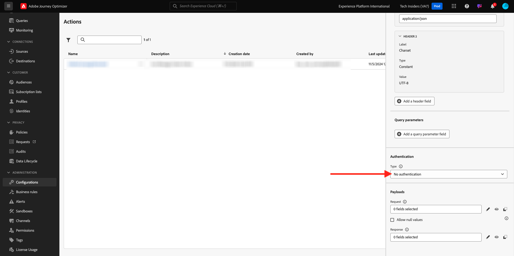
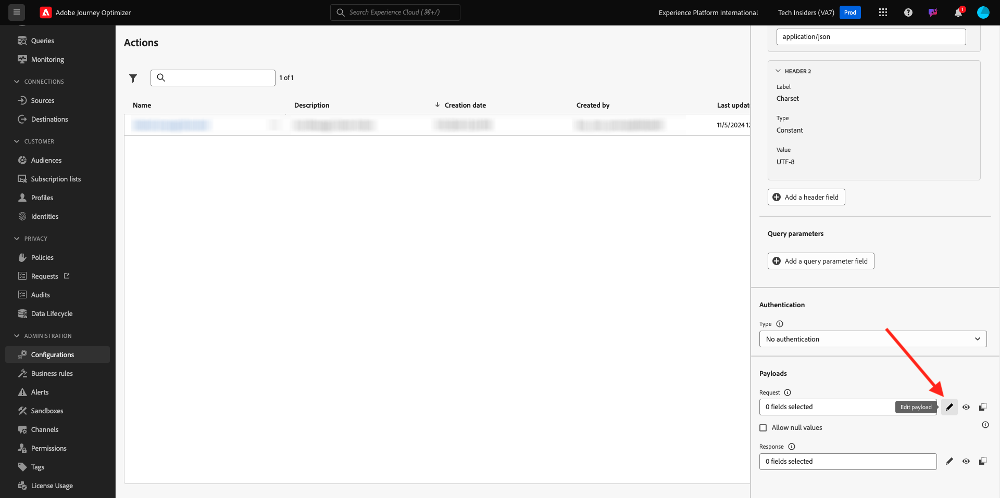
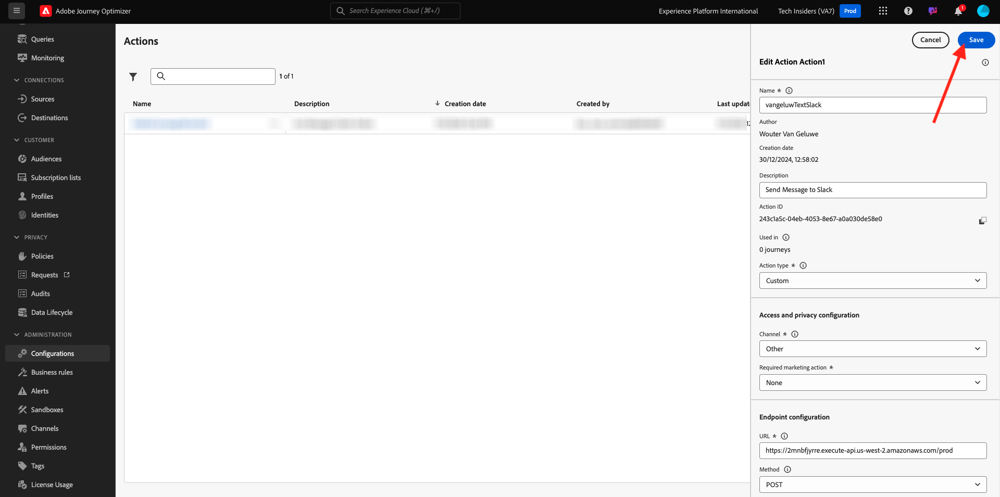

# 3.2.3 Définition d’une action personnalisée

Dans cet exercice, vous allez créer une action personnalisée pour envoyer un message à un canal Slack.

Connectez-vous à Adobe Journey Optimizer en allant sur [Adobe Experience Cloud](https://experience.adobe.com?lang=fr). Cliquez sur **Journey Optimizer**.


Vous serez redirigé vers la vue **Accueil** dans Journey Optimizer. Tout d’abord, assurez-vous d’utiliser le bon sandbox. Le sandbox à utiliser est appelé `--aepSandboxName--`. Vous serez alors dans la vue **Accueil** de votre `--aepSandboxName--` sandbox.


Vous allez maintenant utiliser un canal Slack existant et envoyer des messages à ce canal Slack. Slack dispose d’une API facile à utiliser et vous utiliserez Adobe Journey Optimizer pour déclencher son API.


Dans le menu de gauche, faites défiler l’écran vers le bas et cliquez sur **Configurations**. Cliquez ensuite sur le bouton **Gérer** sous **Actions**.


La liste **Actions** s’affiche alors. Cliquez sur **Créer une action**.


Une fenêtre contextuelle Action vide s’affiche.


Comme nom pour l’action, utilisez `--aepUserLdap--TextSlack`.

Définissez Description sur : `Send Message to Slack`.

Pour la **Configuration de l’URL**, utilisez ce qui suit :

- URL : `https://2mnbfjyrre.execute-api.us-west-2.amazonaws.com/prod`
- Méthode : **POST**

>[!NOTE]
>
>L’URL ci-dessus fait référence à une fonction AWS Lambda qui transmettra ensuite votre requête au canal Slack comme mentionné ci-dessus. Cela permet de protéger l’accès à un canal Slack détenu par Adobe. Si vous disposez de votre propre canal Slack, vous devez créer une application Slack via [https://api.slack.com/](https://api.slack.com/), puis créer un Webhook entrant dans cette application Slack, puis remplacer l’URL ci-dessus par votre URL Webhook entrant.


**Authentification** doit être défini sur **Aucune authentification**.



Sous **Payloads**, vous devez définir les champs à envoyer vers Slack. Logiquement, vous souhaitez que Adobe Journey Optimizer et Adobe Experience Platform soient le cerveau de la personnalisation. Par conséquent, le texte à envoyer à Slack doit être défini par Adobe Journey Optimizer, puis envoyé à Slack pour exécution.

Pour l’**Requête**, cliquez sur l’icône **Modifier la payload**.



Une fenêtre contextuelle vide s’affiche alors.


Copiez le texte ci-dessous et collez-le dans la fenêtre contextuelle vide.

```json
{
 "text": {
  "toBeMapped": true,
  "dataType": "string",
  "label": "textToSlack"
 }
}
```

Tu verras ça. Cliquez sur **Enregistrer**.


Faites défiler vers le haut et cliquez une fois de plus sur **Enregistrer** pour enregistrer votre action.



Votre action personnalisée fait maintenant partie de la liste **Actions**.


Vous avez défini des événements, ainsi que des sources de données et des actions externes. Ensuite, vous allez regrouper tout cela dans un seul parcours.

## Étapes suivantes

Accédez à [3.2.4 Création de votre parcours et de vos messages](./ex4.md){target="_blank"}

Revenez à [Adobe Journey Optimizer : sources de données externes et actions personnalisées](journey-orchestration-external-weather-api-sms.md){target="_blank"}

Revenir à [Tous les modules](./../../../../overview.md){target="_blank"}
