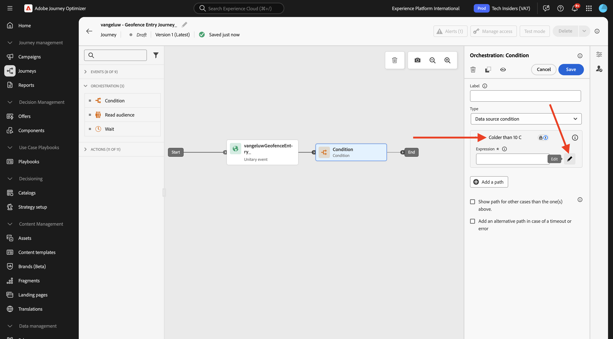
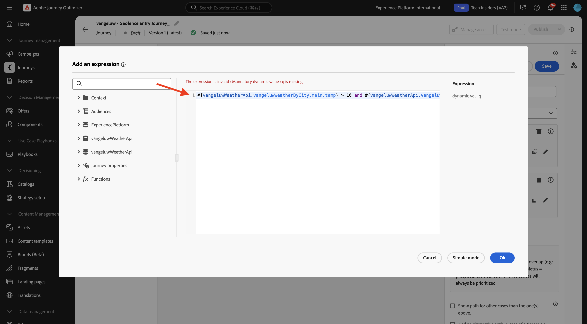
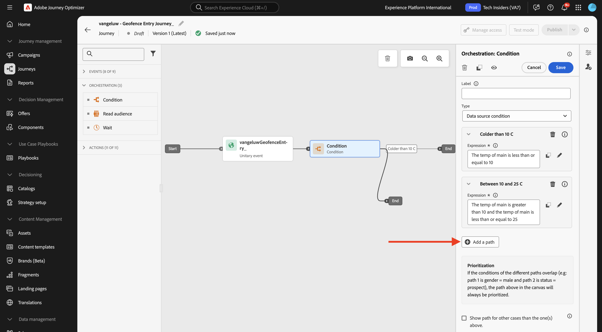

# 3.2.4 Création de parcours et de messages

Dans cet exercice, vous allez créer un parcours et plusieurs messages texte à l&#39;aide de Adobe Journey Optimizer.

Pour ce cas d’utilisation, l’objectif est d’envoyer différents messages en fonction des conditions météorologiques de l’emplacement de votre client. 3 scénarios ont été définis :

- Plus froid que 10 °C
- Entre 10 et 25 °C
- Plus chaud que 25 °C

Pour ces 3 conditions, vous devez définir 3 messages dans Adobe Journey Optimizer.

## 3.2.4.1 Créer votre parcours

Connectez-vous à Adobe Journey Optimizer en allant sur [Adobe Experience Cloud](https://experience.adobe.com?lang=fr). Cliquez sur **Journey Optimizer**.


Vous serez redirigé vers la vue **Accueil** dans Journey Optimizer. Tout d’abord, assurez-vous d’utiliser le bon sandbox. Le sandbox à utiliser est appelé `--aepSandboxName--`. Vous serez alors dans la vue **Accueil** de votre `--aepSandboxName--` sandbox.


Dans le menu de gauche, accédez à **Parcours** puis cliquez sur **Créer un Parcours** pour commencer à créer votre Parcours.


Vous devriez donner un prénom à votre parcours.

Comme nom pour le parcours, utilisez `--aepUserLdap-- - Geofence Entry Journey`. Aucune autre valeur ne doit être définie pour le moment. Cliquez sur **Enregistrer**.


Sur le côté gauche de l’écran, regardez **Événements**. Vous devriez voir votre événement créé précédemment dans cette liste, qui est nommée `--aepUserLdap--GeofenceEntry`. Sélectionnez-la, puis faites-la glisser et déposez-la sur la zone de travail du parcours. Votre parcours ressemble alors à ceci.


Cliquez ensuite sur **Orchestration**. Les fonctionnalités **Orchestration** disponibles s’affichent à présent. Sélectionnez **Condition**, puis faites-la glisser et déposez-la sur la zone de travail du Parcours.


Vous devez maintenant configurer trois chemins pour cette condition :

- Il fait plus froid que 10° Celsius
- C&#39;est entre 10 et 25 degrés Celsius
- Il fait plus chaud que 25 degrés Celsius

Définissons la première condition.

### Condition 1 : plus froid que 10 °C

Cliquez sur la **Condition**.  Cliquez sur **Path1** et modifiez le nom du chemin en **Plus froid que 10 C**. Cliquez sur l’icône **Modifier** pour l’expression de Path1.



Un écran **Éditeur simple** vide s’affiche alors. Votre requête sera un peu plus avancée, vous aurez donc besoin du **Mode avancé**. Cliquez sur **Mode avancé**.


Vous verrez ensuite l’**Éditeur avancé** qui permet la saisie de code.


Sélectionnez le code ci-dessous et collez-le dans l’**Éditeur avancé**.

`#{--aepUserLdap--WeatherApi.--aepUserLdap--WeatherByCity.main.temp} <= 10`

Tu verras ça.


Pour récupérer la température dans le cadre de cette condition, vous devez indiquer la ville dans laquelle se trouve actuellement le client.
Le **City** doit être lié au `q` de paramètres dynamique, comme vous l’avez vu précédemment dans la documentation de l’API Open Weather.

Cliquez sur le champ **val dynamique : q** comme indiqué dans la capture d’écran.


Vous devez ensuite trouver le champ qui contient la ville actuelle du client dans l’une des sources de données disponibles. Dans ce cas, vous devez le trouver sous **Contexte**.


Vous pouvez trouver le champ en accédant à `--aepUserLdap--GeofenceEntry.placeContext.geo.city`.

En cliquant sur ce champ ou sur **+**, il sera ajouté comme valeur dynamique pour le paramètre `q`. Ce champ est renseigné, par exemple, par le service de géolocalisation que vous avez implémenté dans votre application mobile. Dans ce cas, vous allez simuler cette opération à l’aide de la propriété de collecte de données du site web de démonstration. Cliquez sur **OK**.


### Condition 2 : entre 10° et 25° Celsius

Après avoir ajouté la première condition, vous verrez cet écran. Cliquez sur **Ajouter un chemin**.


Double-cliquez sur **Chemin1** et modifiez le nom du chemin en **Entre 10 et 25 C**. Cliquez sur l’icône **Modifier** correspondant à l’expression de ce chemin d’accès.


Un écran **Éditeur simple** vide s’affiche alors. Votre requête sera un peu plus avancée, vous aurez donc besoin du **Mode avancé**. Cliquez sur **Mode avancé**.


Vous verrez ensuite l’**Éditeur avancé** qui permet la saisie de code.


Sélectionnez le code ci-dessous et collez-le dans l’**Éditeur avancé**.

`#{--aepUserLdap--WeatherApi.--aepUserLdap--WeatherByCity.main.temp} > 10 and #{--aepUserLdap--WeatherApi.--aepUserLdap--WeatherByCity.main.temp} <= 25`

Tu verras ça.



Pour récupérer la température dans le cadre de cette condition, vous devez indiquer la ville dans laquelle se trouve actuellement le client.
Le paramètre **City** doit être lié au paramètre dynamique **q**, comme vous l’avez vu précédemment dans la documentation de l’API Open Weather.

Cliquez sur le champ **val dynamique : q** comme indiqué dans la capture d’écran.


Vous devez ensuite trouver le champ qui contient la ville actuelle du client dans l’une des sources de données disponibles.


Vous pouvez trouver le champ en accédant à `--aepUserLdap--GeofenceEntry.placeContext.geo.city`. En cliquant sur ce champ, il est ajouté comme valeur dynamique pour le paramètre **q**. Ce champ est renseigné, par exemple, par le service de géolocalisation que vous avez implémenté dans votre application mobile. Dans ce cas, vous allez simuler cette opération à l’aide de la propriété de collecte de données du site web de démonstration. Cliquez sur **OK**.


Ensuite, vous allez ajouter la troisième condition.

### Condition 3 : plus chaud que 25 °C

Après avoir ajouté la deuxième condition, vous verrez cet écran. Cliquez sur **Ajouter un chemin**.



Double-cliquez sur Path1 pour remplacer le nom par **Plus chaud que 25 C**.
Cliquez ensuite sur l’icône **Modifier** correspondant à l’expression de ce chemin d’accès.


Un écran **Éditeur simple** vide s’affiche alors. Votre requête sera un peu plus avancée, vous aurez donc besoin du **Mode avancé**. Cliquez sur **Mode avancé**.


Vous verrez ensuite l’**Éditeur avancé** qui permet la saisie de code.


Sélectionnez le code ci-dessous et collez-le dans l’**Éditeur avancé**.

`#{--aepUserLdap--WeatherApi.--aepUserLdap--WeatherByCity.main.temp} > 25`

Tu verras ça.


Pour récupérer la température dans le cadre de cette condition, vous devez indiquer la ville dans laquelle se trouve actuellement le client.
Le paramètre **City** doit être lié au paramètre dynamique **q**, comme vous l’avez vu précédemment dans la documentation de l’API Open Weather.

Cliquez sur le champ **val dynamique : q** comme indiqué dans la capture d’écran.


Vous devez ensuite trouver le champ qui contient la ville actuelle du client dans l’une des sources de données disponibles.


Vous pouvez trouver le champ en accédant à ```--aepUserLdap--GeofenceEntry.placeContext.geo.city```. En cliquant sur ce champ, il est ajouté comme valeur dynamique pour le paramètre **q**. Ce champ est renseigné, par exemple, par le service de géolocalisation que vous avez implémenté dans votre application mobile. Dans ce cas, vous allez simuler cette opération à l’aide de la propriété de collecte de données du site web de démonstration. Cliquez sur **OK**.


Vous disposez désormais de trois chemins configurés. Cliquez sur **Enregistrer**.


Comme il s’agit d’un parcours à des fins d’apprentissage, vous allez maintenant configurer quelques actions pour présenter la variété des options dont disposent désormais les professionnels du marketing pour diffuser des messages.

## 3.2.4.2 Envoyer des messages pour le chemin : moins de 10° Celsius

Pour chacun des contextes de température, vous tenterez d&#39;envoyer un message texte à un client. Pour cet exercice, vous allez envoyer un message réel à un canal Slack plutôt qu’à un numéro de téléphone mobile.

Concentrons-nous sur le chemin **plus froid que 10°C**.


Dans le menu de gauche, revenez à **Actions**, sélectionnez l’`--aepUserLdap--TextSlack` Action, puis faites-la glisser après l’action **Message**.


Faites défiler jusqu’à **Paramètres de requête** et cliquez sur l’icône **Modifier** pour le `textToSlack` de paramètre.


Dans la fenêtre contextuelle, cliquez sur **Mode avancé**.


Sélectionnez le code ci-dessous, copiez-le et collez-le dans l’**Éditeur de mode avancé**. Cliquez sur **OK**.

`"Brrrr..." + #{ExperiencePlatform.ProfileFieldGroup.profile.person.name.firstName} + ",  it's cold and freezing outside. Get comfortable at home with a 20% discount on a Disney+ subscription!"`


L’action terminée s’affiche. Faites défiler vers le haut et cliquez sur **Enregistrer**.


Ce chemin d’accès du parcours est maintenant prêt.

## 3.2.4.3 Envoyer des messages pour le chemin : entre 10° et 25° Celsius

Pour chacun des contextes de température, vous tenterez d&#39;envoyer un message à votre client. Pour cet exercice, vous allez envoyer un message réel à un canal Slack plutôt qu’à un numéro de téléphone mobile.

Concentrons-nous sur le chemin **entre 10 et 25 C**.


Dans le menu de gauche, revenez à **Actions**, sélectionnez l’`--aepUserLdap--TextSlack` Action, puis faites-la glisser après l’action **Message**.


Faites défiler jusqu’à **Paramètres de requête** et cliquez sur l’icône **Modifier** pour le `textToSlack` de paramètre.


Dans la fenêtre contextuelle, cliquez sur **Mode avancé**.


Sélectionnez le code ci-dessous, copiez-le et collez-le dans l’**Éditeur de mode avancé**. Cliquez sur **OK**.

`"What nice weather for the time of year, " + #{ExperiencePlatform.ProfileFieldGroup.profile.person.name.firstName} + " 20% discount on Apple AirPods so you can go for a walk and listen to your favorite podcast!"`


L’action terminée s’affiche. Faites défiler vers le haut et cliquez sur **Enregistrer**.


Ce chemin d’accès du parcours est maintenant prêt.

## 3.2.4.4 Envoyer des messages pour le chemin : plus chaud que 25° Celsius

Pour chacun des contextes de température, vous tenterez d&#39;envoyer un message à votre client. Pour cet exercice, vous allez envoyer un message réel à un canal Slack plutôt qu’à un numéro de téléphone mobile.

Concentrons-nous sur le chemin **plus chaud que 25 C**.


Dans le menu de gauche, revenez à **Actions**, sélectionnez l’`--aepUserLdap--TextSlack` Action, puis faites-la glisser après l’action **Messages**.


Faites défiler jusqu’à **Paramètres de requête** et cliquez sur l’icône **Modifier** pour le `textToSlack` de paramètre.


Dans la fenêtre contextuelle, cliquez sur **Mode avancé**.


Sélectionnez le code ci-dessous, copiez-le et collez-le dans l’**Éditeur de mode avancé**. Cliquez sur **OK**.

`"So warm, " + #{ExperiencePlatform.ProfileFieldGroup.profile.person.name.firstName} + "! 20% discount on adding 10GB of extra data so you can get online at the beach!"`


L’action terminée s’affiche. Cliquez sur **Enregistrer**.


Ce chemin d’accès du parcours est maintenant prêt.

## 3.2.4.5 Publier votre parcours

Votre parcours est maintenant entièrement configuré. Cliquez sur **Publier**.


Cliquez de nouveau sur **Publier**.


Votre parcours est maintenant publié.


## Étapes suivantes

Accédez à [3.2.5 Déclencher votre parcours ](./ex5.md){target="_blank"}

Revenez à [Adobe Journey Optimizer : sources de données externes et actions personnalisées](journey-orchestration-external-weather-api-sms.md){target="_blank"}

Revenir à [Tous les modules](./../../../../overview.md){target="_blank"}
