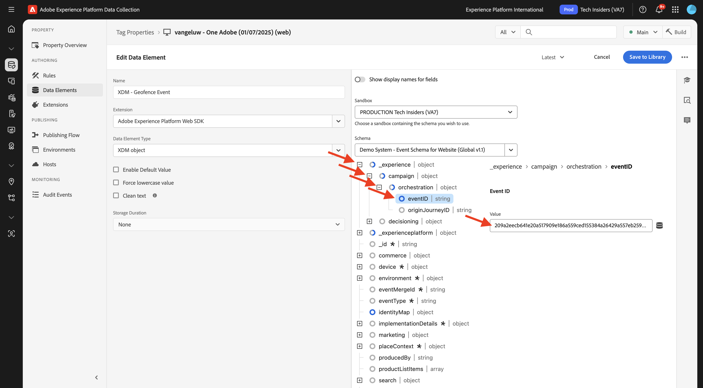
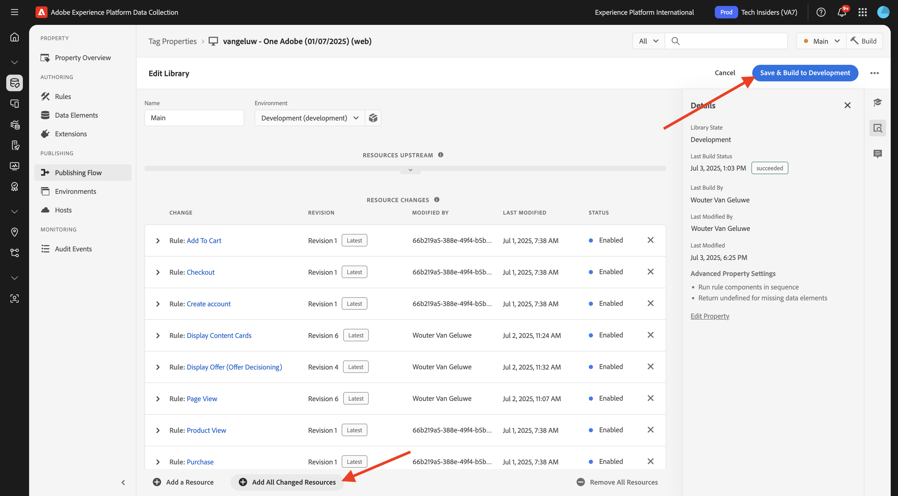

# 3.2.5 Déclenchement du parcours

Dans cet exercice, vous allez tester et déclencher le parcours que vous avez configuré dans ce module.

## 3.2.5.1 Mettre à jour la configuration de l’événement de limite géographique

Accédez à [Collecte de données Adobe Experience Platform](https://experience.adobe.com/launch/) puis sélectionnez **Balises**.

Il s’agit de la page Propriétés de la collecte de données Adobe Experience Platform que vous avez déjà vue.

Dans **Prise en main**, le système de démonstration a créé deux propriétés client pour vous : une pour le site web et une pour l’application mobile. Recherchez-les en `--aepUserLdap--` dans la zone **[!UICONTROL Rechercher]**. Cliquez pour ouvrir la propriété **Web**.

Tu verras ça.

Dans le menu de gauche, accédez à **Règles** et recherchez la règle **Événement de limite géographique**. Cliquez sur la règle **Événement de limite géographique** pour l’ouvrir.

Vous verrez alors les détails de cette règle. Cliquez pour ouvrir l’action **Adobe Experience Platform Web SDK - Envoyer l’événement**.

Vous constaterez ensuite que lorsque cette action est déclenchée, un élément de données spécifique est utilisé pour définir la structure de données XDM. Vous devez mettre à jour cet élément de données et définir l’**identifiant d’événement** de l’événement que vous avez configuré dans [Exercice 3.2.1](./ex1.md).

Vous devez maintenant mettre à jour l’élément de données **XDM - Événement de limite géographique**. Pour ce faire, accédez à **Éléments de données**. Recherchez **XDM - Événement de limite géographique** et cliquez pour ouvrir cet élément de données.

Vous verrez alors ceci :

Accédez au `_experience.campaign.orchestration.eventID` de champs . Supprimez la valeur actuelle et collez-y votre eventID.

Pour rappel, l’identifiant d’événement se trouve dans Adobe Journey Optimizer sous **Configurations > Événements** et vous trouverez l’identifiant d’événement dans l’exemple de payload de votre événement, qui se présente comme suit : `"eventID": "4df8dc10731eba7b0c37af83a9db38d4de7aa6aebcce38196d9d47929b9c598e"`.

Définissez ensuite votre ville dans cet élément de données. Accédez à **placeContext > geo > city** et saisissez la ville de votre choix. Cliquez ensuite sur **Enregistrer** ou **Enregistrer dans la bibliothèque**.

Enfin, vous devez publier vos modifications. Accédez à **Flux de publication** dans le menu de gauche, puis cliquez sur **Man** pour ouvrir votre bibliothèque.

Cliquez sur **Ajouter toutes les ressources modifiées** puis sur **Enregistrer et créer dans le développement**.

## 3.2.5.2 Déclencher votre parcours

Accédez à [https://dsn.adobe.com](https://dsn.adobe.com). Après vous être connecté avec votre Adobe ID, voici ce que vous verrez. Cliquez sur le **de 3 points...** sur le projet de votre site web, puis cliquez sur **Exécuter** pour l’ouvrir.

Vous verrez ensuite votre site web de démonstration s’ouvrir. Sélectionnez l’URL et copiez-la dans le presse-papiers.

Ouvrez une nouvelle fenêtre de navigateur en mode privé.

Collez l’URL de votre site web de démonstration, que vous avez copiée à l’étape précédente. Il vous sera ensuite demandé de vous connecter à l’aide de votre Adobe ID.

Sélectionnez votre type de compte et terminez le processus de connexion.

Votre site web est alors chargé dans une fenêtre de navigateur en mode privé. Pour chaque exercice, vous devrez utiliser une nouvelle fenêtre de navigateur en mode privé pour charger l’URL de votre site web de démonstration.

Cliquez sur l’icône du logo Adobe dans le coin supérieur gauche de l’écran pour ouvrir la visionneuse de profils.

Ouvrez le panneau Visionneuse de profils et accédez au profil client en temps réel. Dans le panneau Visionneuse de profil, toutes vos données personnelles doivent s’afficher, comme vos nouveaux identifiants d’e-mail et de téléphone ajoutés.

Dans le panneau Visionneuse de profils, cliquez sur **UTILITAIRES**. Saisissez `geofenceevent` et cliquez sur **Envoyer**.

>[!NOTE]
>
>Si vous ne disposez pas de la possibilité d’envoyer un événement d’appel direct dans le panneau de la visionneuse de profil, vous pouvez en envoyer un manuellement en ouvrant la vue Développeur de votre navigateur et en accédant à **Console**, puis coller et envoyer cette commande : `_satellite.track('geofenceevent')`.

Quelques secondes plus tard, le message de Adobe Journey Optimizer s’affichera dans le canal Slack.

## Étapes suivantes

Accédez à [ Résumé et avantages ](./summary.md){target="_blank"}

Revenez à [Adobe Journey Optimizer : sources de données externes et actions personnalisées](journey-orchestration-external-weather-api-sms.md){target="_blank"}

Revenir à [Tous les modules](./../../../../overview.md){target="_blank"}
