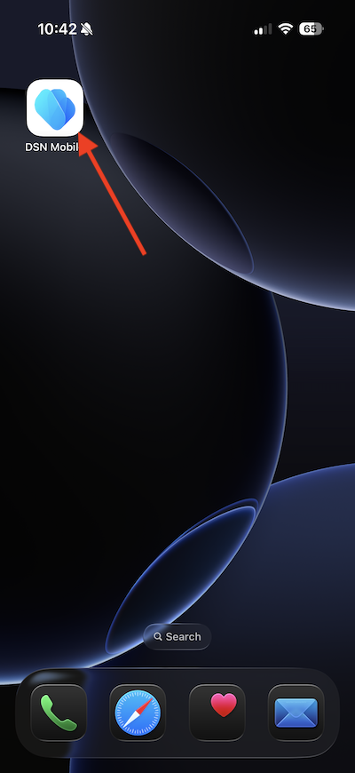
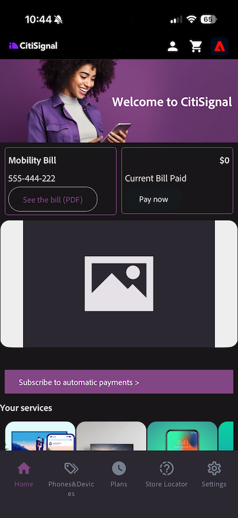

# 3.3.1 Prise en main des notifications push

Pour utiliser les notifications push avec Adobe Journey Optimizer, il existe un certain nombre de paramètres à vérifier et à connaître.

Voici tous les paramètres à vérifier :

- Jeux de données et schémas dans Adobe Experience Platform
- Flux de données pour mobile
- Propriété de collecte de données pour mobile
- Surface d’application pour les certificats push
- Tester votre configuration push à l&#39;aide d&#39;AEP Assurance

Examinons-les une par une.

Connectez-vous à Adobe Journey Optimizer en allant sur [Adobe Experience Cloud](https://experience.adobe.com?lang=fr). Cliquez sur **Journey Optimizer**.

Vous serez redirigé vers la vue **Accueil** dans Journey Optimizer. Tout d’abord, assurez-vous d’utiliser le bon sandbox. Le sandbox à utiliser est appelé `--aepSandboxName--`. Vous serez alors dans la vue **Accueil** de votre `--aepSandboxName--` sandbox.

## Jeu de données de notification push 3.3.1.1

Adobe Journey Optimizer utilise des jeux de données pour stocker des éléments tels que les jetons push des appareils mobiles ou les interactions avec les messages push (comme : message envoyé, message ouvert, etc.) dans un jeu de données dans Adobe Journey Optimizer.

Vous pouvez trouver ces jeux de données en accédant à **Jeux de données** dans le menu sur le côté gauche de l’écran. Pour afficher les jeux de données système, cliquez sur l’icône **Activer les filtres**.

Activez l’option pour **Système** et recherchez **AJO**. Les jeux de données utilisés pour les notifications push s’affichent ensuite.

## Flux de données 3.3.1.2 pour Mobile

Accédez à [https://experience.adobe.com/#/data-collection/](https://experience.adobe.com/#/data-collection/).

Dans le menu de gauche, accédez à **Flux de données** et recherchez le flux de données que vous avez créé dans [Prise en main](./../../../../modules/getting-started/gettingstarted/ex2.md), qui est nommé `--aepUserLdap-- - One Adobe Datastream (Mobile)`. Cliquez pour l’ouvrir.

Cliquez sur **Modifier** sur le service **Adobe Experience Platform**.

Vous verrez ensuite les paramètres de train de données qui ont été définis et dans quels jeux de données les événements et les attributs de profil seront stockés.

Vous devez également activer les options suivantes si elles ne sont pas encore activées :

- **Offer Decisioning**
- **Destinations de personnalisation**
- **Adobe Journey Optimizer**

Cliquez sur **Enregistrer**.

## 3.3.1.3 votre propriété de collecte de données pour Mobile

Accédez à [https://experience.adobe.com/#/data-collection/](https://experience.adobe.com/#/data-collection/), à **Balises**. Dans le cadre du module [Prise en main](./../../../../modules/getting-started/gettingstarted/ex1.md), les propriétés des balises de collecte de données ont été créées.

Vous utilisez déjà ces propriétés de balises de collecte de données dans le cadre de modules précédents.

Cliquez pour ouvrir la propriété Collecte de données pour les appareils mobiles.

Dans votre propriété Collecte de données, accédez à **Extensions**. Vous verrez ensuite les différentes extensions nécessaires pour l’application mobile. Cliquez pour sélectionner l’extension **Adobe Experience Platform Edge Network** puis sélectionnez **Configurer**.

Vous verrez alors que votre flux de données pour mobile est lié ici. Cliquez ensuite sur **Annuler** pour revenir à la présentation des extensions.

Tu reviendras ensuite ici. L’extension s’affiche pour **AEP Assurance**. AEP Assurance vous permet de contrôler, de tester, de simuler et de valider la manière dont vous collectez les données ou dont les expériences sont diffusées dans votre application mobile. Vous pouvez en savoir plus sur AEP Assurance ici : [https://experienceleague.adobe.com/fr/docs/experience-platform/assurance/home](https://experienceleague.adobe.com/fr/docs/experience-platform/assurance/home).

Cliquez ensuite sur **Configurer** pour ouvrir l’extension **Adobe Journey Optimizer**. Cette extension active les notifications push et les mesures pour Adobe Journey Optimizer.

Vous verrez ensuite que c’est là que le jeu de données pour le suivi des événements push est lié. Il n’est pas nécessaire d’apporter des modifications à votre propriété de collecte de données. Cliquez sur **Annuler** pour revenir à l’écran précédent.

## 3.3.1.4 Vérifier la configuration de votre Surface d’application

Accédez à [https://experience.adobe.com/#/data-collection/](https://experience.adobe.com/#/data-collection/). Dans le menu de gauche, accédez à **Surfaces de l’application** et ouvrez la Surface de l’application pour **DX Demo App APNS**.

Vous verrez ensuite la surface d’application configurée pour iOS et Android.

## 3.3.1.5 Testez la configuration des notifications push à l’aide d’AEP Assurance.

Vous avez déjà installé l’application mobile **DX Demo** dans le cadre du module **Prise en main**. Une fois l&#39;application installée, vous la trouverez sur l&#39;écran d&#39;accueil de votre appareil. Cliquez sur l’icône pour ouvrir l’application.

Après vous être connecté, une notification s’affichera pour vous demander l’autorisation d’envoyer des notifications. Nous enverrons des notifications dans le cadre du tutoriel. Cliquez donc sur **Autoriser**.

Vous verrez alors la page d’accueil de l’application. Accédez à **Paramètres**.

Dans les paramètres, vous verrez qu’un **Projet public** est actuellement chargé dans l’application. Cliquez sur **Projet personnalisé**.

Vous pouvez désormais charger un projet personnalisé. Cliquez sur le code QR pour charger facilement votre projet.

Après avoir parcouru la section **Prise en main**, vous avez obtenu le résultat suivant. Cliquez pour ouvrir le **Projet de vente au détail mobile** qui a été créé pour vous.

Si vous avez fermé accidentellement la fenêtre de votre navigateur ou pour des sessions de démonstration ou d’activation ultérieures, vous pouvez également accéder à votre projet de site web en accédant à [https://dsn.adobe.com/projects](https://dsn.adobe.com/projects). Après vous être connecté avec votre Adobe ID, voici ce que vous verrez. Cliquez sur votre projet d’application mobile pour l’ouvrir.

Cliquez ensuite sur **Exécuter**.

Vous verrez ensuite cette fenêtre contextuelle, qui contient un code QR. Scannez ce code QR à partir de l’application mobile.

Votre ID de projet s’affiche alors dans l’application, après quoi vous pouvez cliquer sur **Basculer**.

Votre application est maintenant prête à être utilisée.

Vous devez maintenant scanner un code QR pour connecter votre appareil mobile à votre session Assurance.

Pour démarrer une session AEP Assurance, accédez à [https://experience.adobe.com/#/data-collection/](https://experience.adobe.com/#/data-collection/). Cliquez sur **Assurance** dans le menu de gauche. Cliquez ensuite sur **Créer une session**.

Sélectionnez **Connexion de lien profond** puis cliquez sur **Démarrer**.

Renseignez les valeurs :

- Nom de la session : `--aepUserLdap-- - Push Debugging`
- URL de base : `dxdemo://default`

Cliquez sur **Suivant**.

Un code QR s’affiche alors à l’écran, que vous devez numériser avec votre appareil iOS.

Sur votre appareil mobile, ouvrez l’application de caméra et numérisez le code QR affiché par Assurance.

Vous verrez alors un écran contextuel, vous demandant de saisir le code PIN. Copiez le code PIN de l’écran AEP Assurance, puis cliquez sur **Connexion**.

Tu verras ça.

Dans Assurance, vous verrez désormais qu’un appareil client est connecté à la session Assurance. Cliquez ensuite sur **Configurer**.

Faites défiler jusqu’à **Push Debug**. Cliquez sur l’icône **+**, puis sur **Enregistrer**.

Accédez à **Push Debug**. Tu devrais voir ça.

Quelques explications :

- La première colonne, **Client**, affiche les identifiants disponibles sur votre appareil iOS. Un ECID et un jeton push s’affichent.
- La 2e colonne affiche les **informations d’identification et configuration App Store**
- La deuxième colonne affiche des informations **Profil**, avec des informations supplémentaires sur la plateforme sur laquelle réside le jeton push (APNS ou APNSSandbox). Si vous cliquez sur le bouton **Inspecter le profil**, vous accédez à Adobe Experience Platform et le profil client en temps réel complet s’affiche.

Pour tester votre configuration push, cliquez sur le bouton **Envoyer la configuration push de test**. Cliquez sur **Envoyer une notification push de test**

Vous devez vous assurer que l’application **DX Demo** n’est pas ouverte au moment où vous cliquez sur le bouton **Envoyer une notification push**. Si l&#39;application est ouverte, la notification push peut être reçue en arrière-plan et ne pas être visible.

Une notification push comme celle-ci s’affiche alors sur votre appareil mobile.

Si vous avez reçu la notification push, cela signifie que votre configuration est correcte et qu’elle fonctionne correctement. Vous pouvez désormais créer un parcours réel qui se traduira par l’envoi d’un message push depuis Journey Optimizer.

## Étapes suivantes

Accédez à [3.3.2 Configuration d’un parcours avec des messages push](./ex2.md){target="_blank"}

Revenez à [Adobe Journey Optimizer : messages push et in-app](ajopushinapp.md){target="_blank"}

Revenir à [Tous les modules](./../../../../overview.md){target="_blank"}
