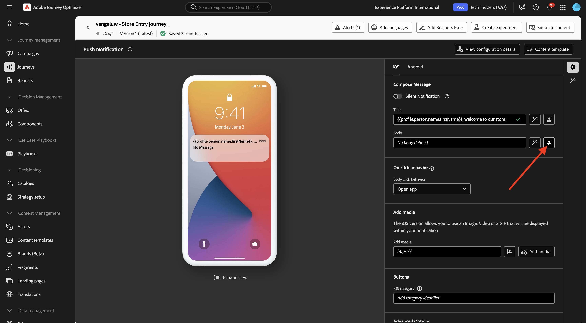

# 3.3.2 Configuration d’un parcours avec des messages push

## 3.4.4.6 Créer un événement

Accédez à **Journey Optimizer**. Dans le menu de gauche, accédez à **Configurations**, puis cliquez sur **Gérer** sous **Événements**.

Sur l’écran **Événements**, une vue similaire à celle-ci s’affiche. Cliquez sur **Créer un événement**.

Une configuration d’événement vide s’affiche alors.
Tout d’abord, donnez à votre Événement un Nom comme celui-ci : `--aepUserLdap--StoreEntryEvent` et définissez la description sur `Store Entry Event`.
La sélection suivante est **Type d’événement**. Sélectionnez **Unitaire**.
La sélection suivante est **Type d’identifiant d’événement**. Sélectionnez **Système généré**.

Vient ensuite la sélection du schéma . Un schéma a été préparé pour cet exercice. Veuillez utiliser le `Demo System - Event Schema for Mobile App (Global v1.1) v.1` de schéma.

Après avoir sélectionné le schéma, vous verrez un certain nombre de champs sélectionnés dans la section **Payload**. Votre événement est maintenant entièrement configuré.

Cliquez sur **Enregistrer**.

Votre événement est maintenant configuré et enregistré. Cliquez à nouveau sur votre événement pour ouvrir à nouveau l’écran **Modifier l’événement**.

Pointez sur le champ **Payload** et cliquez sur l’icône **Afficher la payload**.

Un exemple de la payload attendue s’affiche maintenant.

Votre événement possède un eventID d’orchestration unique, que vous pouvez trouver en faisant défiler cette payload jusqu’à ce que vous voyiez `_experience.campaign.orchestration.eventID`.

L’identifiant d’événement est ce qui doit être envoyé à Adobe Experience Platform afin de déclencher le Parcours que vous allez créer à l’étape suivante. Notez cet eventID, car vous en aurez besoin à l’étape suivante.
`"eventID": "89acd341ec2b7d1130c9a73535029debf2ac35f486bc99236b1a5091d6f4bc68"`

Cliquez sur **Ok**, puis sur **Annuler**.

## 3.4.4.7 Créer un parcours

Dans le menu, accédez à **Parcours** puis cliquez sur **Créer un Parcours**.

Tu verras ça. Donnez un nom à votre parcours. Utilisez `--aepUserLdap-- - Store Entry journey`. Cliquez sur **Enregistrer**.

Tout d’abord, vous devez ajouter votre événement comme point de départ de votre parcours. Recherchez le `--aepUserLdap--StoreEntryEvent` de votre événement et glissez-déposez-le sur la zone de travail. Cliquez sur **Enregistrer**.

Ensuite, sous **Actions**, recherchez l’action **Push**. Faites glisser et déposez l’action **Push** sur la zone de travail.

Définissez la **Catégorie** sur **Marketing** et sélectionnez une surface push qui vous permet d’envoyer des notifications push. Dans ce cas, la surface d’email à sélectionner est **Push-iOS-Android**.

>[!NOTE]
>
>Un canal dans Journey Optimizer utilisant la **surface d’application** comme vérifié précédemment doit exister.

L’étape suivante consiste à créer votre message. Pour ce faire, cliquez sur **Modifier le contenu**.

Tu verras ça. Cliquez sur l’icône **personnalisation** pour le champ **Titre**.

Tu verras ça. Vous pouvez désormais sélectionner directement n’importe quel attribut de profil du profil client en temps réel.

Recherchez le champ **Prénom**, puis cliquez sur l’icône **+** en regard du champ **Prénom**. Le jeton de personnalisation du prénom ajouté s’affiche alors : **{{profile.person.name.firstName}}**.

Ensuite, ajoutez le texte **, bienvenue dans notre boutique !** derrière **{{profile.person.name.firstName}}**.

Cliquez sur **Enregistrer**.

Vous l&#39;avez maintenant. Cliquez sur l’icône **personnalisation** du champ **Corps**.

Entrez ce texte **Cliquez ici pour obtenir une réduction de 10 % lorsque vous achetez aujourd&#39;hui !** et cliquez sur **Enregistrer**.

Tu auras alors ceci. Cliquez sur la flèche dans le coin supérieur gauche pour revenir au parcours.

Cliquez sur **Enregistrer** pour fermer votre action push.

Cliquez sur **Publier**.

Cliquez de nouveau sur **Publier**.

Votre parcours est maintenant publié.

## 3.4.4.8 Tester votre parcours et votre message push

Dans votre application mobile DX Demo 2.0, accédez à l’écran **Paramètres**. Cliquez sur le bouton **Entrée de la boutique**.

>[!NOTE]
>
>Le bouton **Entrée de magasin** est en cours d’implémentation. Vous ne le trouverez pas encore dans l’application.

Veillez à fermer l’application immédiatement après avoir cliqué sur l’icône **Entrée de la boutique**, sinon le message push ne s’affichera pas.

Au bout de quelques secondes, le message s’affiche.

Vous avez terminé cet exercice.

## Étapes suivantes

Accédez à [3.3.3 Configuration d’une campagne avec des messages in-app](./ex3.md){target="_blank"}

Revenez à [Adobe Journey Optimizer : messages push et in-app](ajopushinapp.md){target="_blank"}

Revenir à [Tous les modules](./../../../../overview.md){target="_blank"}
