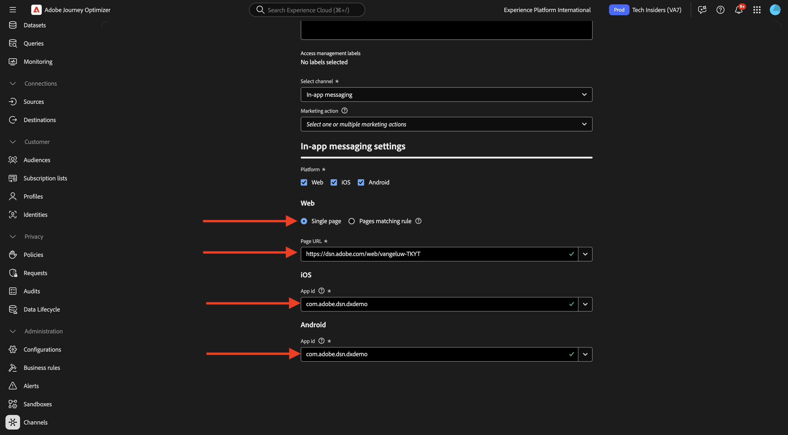

# 3.3.3 Configurer une campagne avec des messages in-app

Connectez-vous à Adobe Journey Optimizer en allant sur [Adobe Experience Cloud](https://experience.adobe.com?lang=fr). Cliquez sur **Journey Optimizer**.

Vous serez redirigé vers la vue **Accueil** dans Journey Optimizer. Tout d’abord, assurez-vous d’utiliser le bon sandbox. Le sandbox à utiliser est appelé `--aepSandboxName--`. Vous serez alors dans la vue **Accueil** de votre `--aepSandboxName--` sandbox.

## Configuration 3.3.3.1 canal de messages in-app

Dans le menu de gauche, accédez à **Canaux** puis sélectionnez **Configurations de canal**. Cliquez sur **Créer une configuration de canal**.

Saisissez le nom : `--aepUserLdap--_In-app_Messages`, sélectionnez le canal **Messagerie in-app** puis activez les plateformes **Web**, **iOS** et **Android**.

Faites défiler l’écran vers le bas, vous devriez voir ceci.

Assurez-vous que l’option **Une seule page** est activée.

Pour **Web**, saisissez l&#39;URL du site Web qui a été créé précédemment dans le cadre du module **Prise en main**, qui se présente comme suit : `https://dsn.adobe.com/web/--aepUserLdap---XXXX`. N’oubliez pas de remplacer le **XXXX** par le code unique de votre site web.

Pour **iOS** et **Android**, saisissez `com.adobe.dsn.dxdemo`.

Faites défiler vers le haut et cliquez sur **Envoyer**.

Votre configuration de canal est maintenant prête à être utilisée.

## 3.3.3.2 Configurer une campagne planifiée pour les messages in-app

Dans le menu de gauche, accédez à **Campagnes** puis cliquez sur **Créer une campagne**.

Sélectionnez **Planifié - Marketing** puis cliquez sur **Créer**.

Saisissez le nom `--aepUserLdap-- - CitiSignal Fiber Max`, puis cliquez sur **Actions**.

Cliquez sur **+ Ajouter une action** puis sélectionnez **Message in-app**.

Sélectionnez la configuration de canal de message in-app que vous avez créée à l’étape précédente, et qui est nommée : `--aepUserLdap--_In-app_Messages`. Cliquez sur **Modifier le contenu**.

Vous devriez alors voir ceci. Cliquez sur **Modal**.

Cliquez sur **Modifier la disposition**.

Cliquez sur l’icône **URL Media** pour sélectionner une ressource dans AEM Assets.

Accédez au dossier **citisignal-images** et sélectionnez le fichier image **neon-rabbit.jpg**. Cliquez sur **Sélectionner**.

Pour le texte **En-tête**, utilisez : `CitiSignal Fiber Max`.
Pour le texte **Body**, utilisez : `Conquer lag with Fiber Max`.

Définissez le **texte de #1 du bouton** sur : `Go to Plans`.
Définissez la **cible** sur `com.adobe.dsn.dxdemo://plans`.

Cliquez sur **Vérifier pour activer**.

Cliquez sur **Activer**.

Le statut de votre campagne est maintenant défini sur **Activation**. La diffusion de la campagne peut prendre quelques minutes.

Une fois que le statut est passé à **Actif**, vous pouvez tester votre campagne.

## 3.3.3.3 Tester votre campagne de messagerie in-app sur mobile

Sur votre appareil mobile, ouvrez l’application . Le nouveau message in-app doit alors apparaître après le lancement de l’application. Cliquez sur le bouton **Accéder aux plans**.

Vous serez ensuite redirigé vers la page **Plans**.

## Étapes suivantes

Revenez à [Adobe Journey Optimizer : messages push et in-app](ajopushinapp.md){target="_blank"}

Revenir à [Tous les modules](./../../../../overview.md){target="_blank"}
