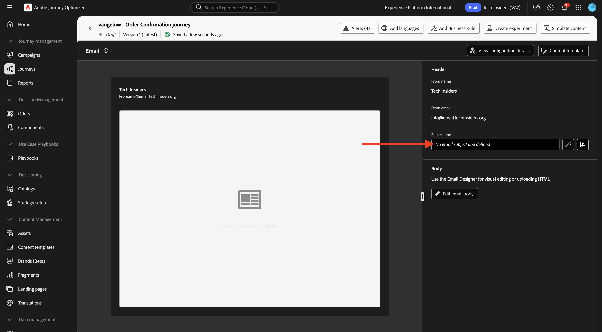
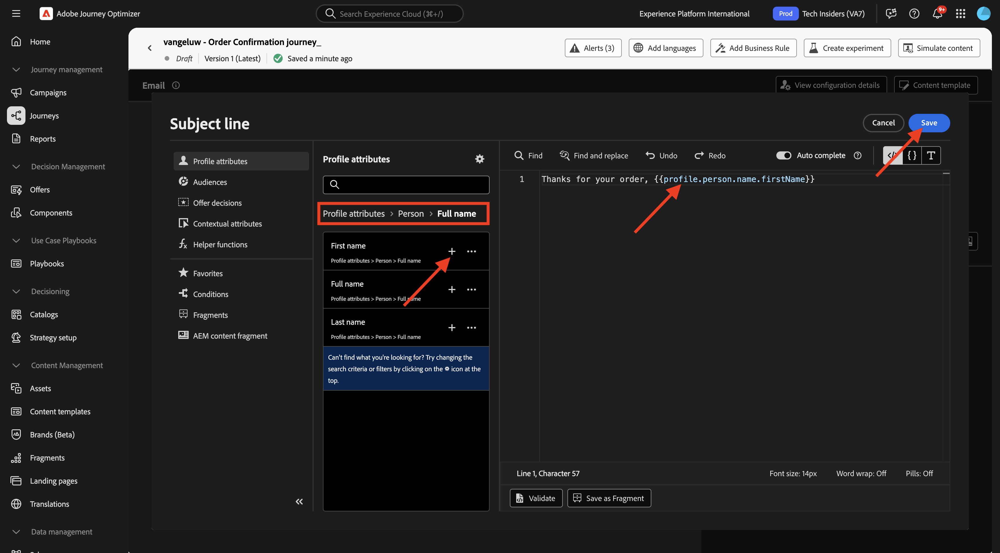
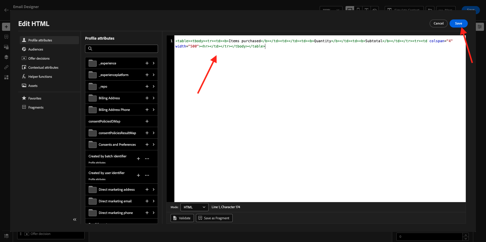
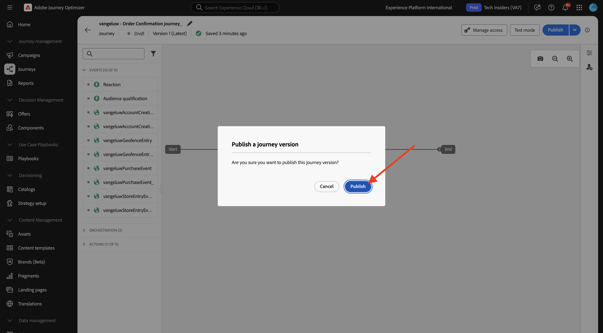
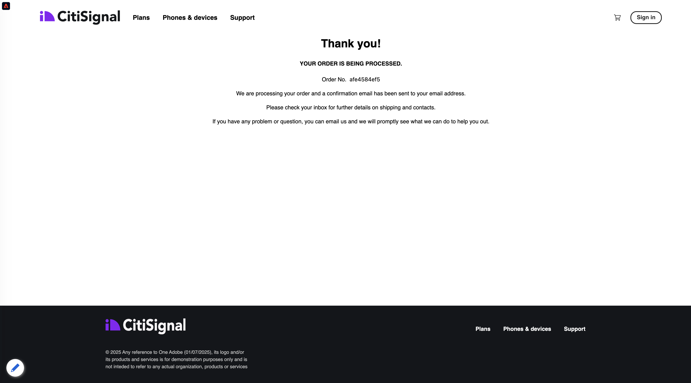

# 3.4.1 Configuration d’un parcours basé sur un déclencheur - Confirmation de commande

Connectez-vous à Adobe Journey Optimizer en allant sur [Adobe Experience Cloud](https://experience.adobe.com?lang=fr). Cliquez sur **Journey Optimizer**.


Vous serez redirigé vers la vue **Accueil** dans Journey Optimizer. Tout d’abord, assurez-vous d’utiliser le bon sandbox. Le sandbox à utiliser est appelé `--aepSandboxName--`. Vous serez alors dans la vue **Accueil** de votre `--aepSandboxName--` sandbox.


## 3.4.1.1 Créer votre événement

Dans le menu, accédez à **Configurations** et cliquez sur **Gérer** sous **Événements**.


Sur l’écran **Événements**, une vue similaire à celle-ci s’affiche. Cliquez sur **Créer un événement**.


Une configuration d’événement vide s’affiche alors.

Tout d’abord, attribuez un Nom comme celui-ci à votre Événement : `--aepUserLdap--PurchaseEvent`, puis ajoutez une description comme celle-ci : `Purchase Event`.

Pour **Type**, sélectionnez **Unitaire**.
Pour **Type d’identifiant d’événement**, sélectionnez **Généré par le système**.


Vient ensuite la sélection du schéma . Un schéma a été préparé pour cet exercice. Veuillez utiliser le `Demo System - Event Schema for Website (Global v1.1) v.1` de schéma.

Après avoir sélectionné le schéma, vous verrez un certain nombre de champs sélectionnés dans la section **Payload**. Cliquez sur l’icône **Modifier/Crayon** pour ajouter des champs supplémentaires à cet événement.


Vous verrez alors cette fenêtre contextuelle. Vous devez maintenant cocher des cases supplémentaires pour accéder à des données supplémentaires lorsque cet événement est déclenché.


Tout d&#39;abord, cochez la case sur la ligne `--aepTenantId--`.


Ensuite, faites défiler vers le bas et cochez la case du `commerce` de ligne.


Ensuite, faites défiler vers le bas et cochez la case du `productListItems` de ligne. Cliquez sur **OK**.


Des champs supplémentaires ont ensuite été ajoutés à l’événement. Cliquez sur **Enregistrer**.


Votre nouvel événement est alors enregistré et vous verrez votre événement dans la liste des événements disponibles maintenant.

Cliquez à nouveau sur votre événement pour ouvrir à nouveau l’écran **Modifier l’événement**.
Pointez à nouveau sur le champ **Payload** pour afficher à nouveau les 3 icônes. Cliquez sur l’icône **Afficher la payload**.


Un exemple de la payload attendue s’affiche maintenant. Votre événement possède un eventID d’orchestration unique, que vous pouvez trouver en faisant défiler cette payload jusqu’à ce que vous voyiez `_experience.campaign.orchestration.eventID`.


L’identifiant d’événement est ce qui doit être envoyé à Adobe Journey Optimizer afin de déclencher le parcours que vous allez créer à l’étape suivante. Notez cet eventID, car vous en aurez besoin lors de l’une des étapes suivantes.
`"eventID": "1c8148a8ab1993537d0ba4e6ac293dd4f2a88d80b2ca7be6293c3b28d4ff5ae6"`

Cliquez sur **Ok**, puis sur **Annuler**.

Votre événement est maintenant configuré et prêt à être utilisé.

## 3.4.1.2 Créer votre parcours

Dans le menu, accédez à **Parcours** puis cliquez sur **Créer un Parcours**.


Tu verras ça. Donnez un nom à votre parcours. Utilisez `--aepUserLdap-- - Order Confirmation journey`. Cliquez sur **Enregistrer**.


Tout d’abord, vous devez ajouter votre événement comme point de départ de votre parcours. Recherchez le `--aepUserLdap--PurchaseEvent` de votre événement et glissez-déposez-le sur la zone de travail. Cliquez sur **Enregistrer**.


Ensuite, sous **Actions**, recherchez l’action **E-mail** et ajoutez-la à la zone de travail.


Définissez la **Catégorie** sur **Marketing** et sélectionnez une surface d’e-mail qui vous permet d’envoyer un e-mail. Dans ce cas, la surface d’e-mail à sélectionner est **Email**. Assurez-vous que les cases à cocher **Clics sur l’e-mail** et **Ouvertures d’e-mail** sont activées.


L’étape suivante consiste à créer votre message. Pour ce faire, cliquez sur **Modifier le contenu**.


Vous voyez maintenant ceci. Cliquez sur le champ de texte **Objet**.



Dans la zone de texte, commencez à écrire **Merci pour votre commande** puis cliquez sur l’icône **Personalization**.


L’objet n’est pas encore terminé. Vous devez ensuite importer le jeton de personnalisation pour le champ **Prénom** qui est stocké sous `profile.person.name.firstName`. Dans le menu de gauche, faites défiler l’écran vers le bas pour trouver le champ **Personne** > **Nom complet** > **Prénom**, puis cliquez sur l’icône **+** pour ajouter le jeton de personnalisation à la ligne d’objet. Cliquez sur **Enregistrer**.



Tu seras de retour ici. Cliquez sur **Modifier le corps de l’e-mail** pour créer le contenu de l’e-mail.


Dans l’écran suivant, cliquez sur **Créer en partant de zéro**.


Dans le menu de gauche, vous trouverez les composants de structure que vous pouvez utiliser pour définir la structure de l’e-mail (lignes et colonnes).

Effectuez un glisser-déposer 8 fois par colonne **1:1** sur la zone de travail, ce qui devrait vous donner ceci :


Dans le menu de gauche, accédez à **Fragments**. Faites glisser l’en-tête que vous avez créé précédemment dans le 3.1.2.1[&#128279;](./../ajob2c-1/ex2.md) [exercice) sur le premier composant de la zone de travail. Faites glisser le pied de page que vous avez créé précédemment dans le 3.1.2.2](./../ajob2c-1/ex2.md) exercice) sur le dernier composant de la zone de travail.


Cliquez sur l’icône **+** dans le menu de gauche. Accédez à **Contenu** pour commencer à ajouter du contenu sur la zone de travail.


Accédez à **Contenu** et effectuez un glisser-déposer d’un composant **Image** sur la deuxième ligne. Cliquez sur **Parcourir**.


Ouvrez le dossier **citi-signal-images**, cliquez pour sélectionner l’image **citisignal-preparation.png**, puis cliquez sur **Sélectionner**.


Sous **Styles**, définissez la largeur sur **40 %**.


Ensuite, accédez à **Contenu** et effectuez un glisser-déposer d’un composant **Texte** sur la troisième ligne.


Sélectionnez le texte par défaut dans ce composant **Veuillez saisir votre texte ici.**-le et remplacez-le par le texte suivant :

```javascript
You’re one step closer!

Hi 

We've received your order details!

We will also send you a separate email containing your VAT Invoice.

We'll be back in touch with you as soon as we've finished packing your package. Please read carefully the Order Information detailed below.
```


Placez le curseur en regard du texte **Hi** et cliquez sur **Add Personalization**.


Accédez au champ **Personne** > **Nom complet** > **Prénom** et cliquez sur l’icône **+** pour ajouter le jeton de personnalisation à l’objet. Cliquez sur **Enregistrer**.


Vous verrez alors ceci :


Ensuite, accédez à **Contenu** et effectuez un glisser-déposer d’un composant **Texte** sur la quatrième ligne.


Sélectionnez le texte par défaut dans ce composant **Veuillez saisir votre texte ici.**-le et remplacez-le par le texte suivant :

`Order Information`

Remplacez la taille de police par **26px** et centrez le texte dans cette cellule. Voici ce que vous obtiendrez :


Ensuite, accédez à **Contenu** et effectuez un glisser-déposer d’un composant **HTML** sur la cinquième ligne. Cliquez sur le composant HTML, puis sur **Afficher le code source**.


Dans la fenêtre contextuelle **Modifier HTML**, collez cette HTML :

```<table><tbody><tr><td><b>Items purchased</b></td><td></td><td><b>Quantity</b></td><td><b>Subtotal</b></td></tr><tr><td colspan="4" width="500"><hr></td></tr></tbody></table>```

Cliquez sur **Enregistrer**.



Tu auras alors ceci. Cliquez sur **Enregistrer** pour enregistrer votre progression.


Accédez à **Contenu** et effectuez un glisser-déposer d’un composant **HTML** sur la sixième ligne. Cliquez sur le composant HTML, puis sur **Afficher le code source**.


Dans la fenêtre contextuelle **Modifier HTML**, collez cette HTML :

```{{#each xxx as |item|}}<table width="500"><tbody><tr><td></td><td><table><tbody><tr><td><b>{{item.name}}</b><br>{{item.--aepTenantId--.core.subCategory}}<br><b>{{item.priceTotal}}</b><br>&nbsp;<br>Article no: {{item.SKU}}</td></tr></tbody></table></td><td>{{item.quantity}}</td><td><b>{{item.priceTotal}}</b></td></tr></tbody></table>{{/each}}```

Voici ce que vous obtiendrez :


Vous devez maintenant remplacer **xxx** par une référence à l’objet productListItems qui fait partie de l’événement qui déclenche le parcours.


Tout d’abord, supprimez **xxx** dans votre code HTML.


Dans le menu de gauche, cliquez sur **Attributs contextuels**. Ce contexte est transmis au message à partir du parcours.

Tu verras ça. Cliquez sur la flèche à côté de **Journey Orchestration** pour approfondir l&#39;analyse.


Cliquez sur la flèche en regard de **Événements** pour approfondir l’analyse.


Cliquez sur la flèche en regard de `--aepUserLdap--PurchaseEvent` pour approfondir l’analyse.


Cliquez sur la flèche en regard de **productListItems** pour approfondir l’analyse.


Cliquez sur l’icône **+** en regard de **Nom** pour l’ajouter à la zone de travail. Tu auras alors ceci. Vous devez maintenant sélectionner **.name** comme indiqué dans la capture d’écran ci-dessous, puis supprimer **.name**.


Tu auras alors ceci. Cliquez sur **Enregistrer**.


Vous êtes de retour dans le Designer des e-mails. Cliquez sur **Enregistrer** pour enregistrer votre progression.


Ensuite, accédez à **Contenu** et effectuez un glisser-déposer d’un composant **HTML** sur la septième ligne. Cliquez sur le composant HTML, puis sur **Afficher le code source**.


Dans la fenêtre contextuelle **Modifier HTML**, collez cette HTML :

```<table><tbody><tr><td><b>Subtotal</b><br>Delivery charge (included)</td><td align="right"><b>xxx</b><br><b>5</b></td></tr><tr><td colspan="2" width="500"><hr></td></tr><tr><td><b>Total including VAT</b></td><td align="right"><b>xxx</b></td></tr></tbody></table>```

Il existe 2 références de **xxx** dans ce code HTML. Vous devez maintenant remplacer chaque **xxx** par une référence à l’objet productListItems qui fait partie de l’événement qui déclenche le parcours.


Supprimez tout d’abord la première **xxx** de votre code HTML.


Dans le menu de gauche, cliquez sur **Attributs contextuels**.
Cliquez sur la flèche à côté de **Journey Orchestration** pour approfondir l&#39;analyse.


Cliquez sur la flèche en regard de **Événements** pour approfondir l’analyse.


Cliquez sur la flèche en regard de `--aepUserLdap--PurchaseEvent` pour approfondir l’analyse.


Cliquez sur la flèche à côté de **Commerce** pour approfondir l&#39;analyse.


Cliquez sur la flèche en regard de **Commande** pour approfondir l’analyse.


Cliquez sur l’icône **+** en regard de **Prix total** pour l’ajouter à la zone de travail.


Tu auras alors ceci. Supprimez maintenant le deuxième **xxx** dans votre code HTML.


Cliquez à nouveau sur l’icône **+** en regard de **Prix total** pour l’ajouter à la zone de travail.
Vous pouvez également ajouter le champ **Devise** à partir de l’objet **Order** sur la zone de travail, comme vous pouvez le voir ici.
Une fois que vous avez terminé, cliquez sur **Enregistrer** pour enregistrer vos modifications.


Vous serez alors de retour dans le Designer Email. Cliquez de nouveau sur **Enregistrer**.


Revenez au tableau de bord des messages en cliquant sur la **flèche** en regard du texte de l’objet dans le coin supérieur gauche.


Cliquez sur la flèche dans le coin supérieur gauche pour revenir au parcours.


Cliquez sur **Enregistrer** pour fermer l’action d’e-mail.


Cliquez sur **Publier** pour publier votre parcours.


Cliquez de nouveau sur **Publier**.



Votre parcours est maintenant publié.


## 3.4.1.5 Mettre à jour la propriété Client de collecte de données Adobe Experience Platform

Accédez à [Collecte de données Adobe Experience Platform](https://experience.adobe.com/launch/) puis sélectionnez **Balises**.

Il s’agit de la page Propriétés de la collecte de données Adobe Experience Platform que vous avez déjà vue.


Dans **Prise en main**, le système de démonstration a créé deux propriétés client pour vous : une pour le site web et une pour l’application mobile. Recherchez-les en `--aepUserLdap--` dans la zone **[!UICONTROL Rechercher]**. Cliquez pour ouvrir la propriété **Web**.


Accédez à **Éléments de données**. Recherchez et ouvrez l’élément de données **XDM - Achat**.


Tu verras ça. Accédez au champ **_experience.campaign.orchestration.eventID** et renseignez votre eventID ici. L’eventID à renseigner ici est l’eventID que vous avez créé dans le cadre de l’exercice 3.4.1.1 Cliquez sur **Enregistrer** ou **Enregistrer dans la bibliothèque**.


Enregistrez les modifications apportées à votre propriété, puis publiez-les en mettant à jour votre bibliothèque de développement.


Vos modifications sont maintenant déployées et peuvent être testées.

## 3.4.1.6 Testez l’e-mail de confirmation de commande sur le site web de démonstration

Testons le parcours mis à jour en achetant un produit sur le site web de démonstration.

Accédez à [https://dsn.adobe.com](https://dsn.adobe.com). Après vous être connecté avec votre Adobe ID, voici ce que vous verrez. Cliquez sur le **de 3 points...** sur le projet de votre site web, puis cliquez sur **Exécuter** pour l’ouvrir.


Vous verrez ensuite votre site web de démonstration s’ouvrir. Sélectionnez l’URL et copiez-la dans le presse-papiers.


Ouvrez une nouvelle fenêtre de navigateur en mode privé.


Collez l’URL de votre site web de démonstration, que vous avez copiée à l’étape précédente. Il vous sera ensuite demandé de vous connecter à l’aide de votre Adobe ID.


Sélectionnez votre type de compte et terminez le processus de connexion.


Votre site web est alors chargé dans une fenêtre de navigateur en mode privé. Pour chaque exercice, vous devrez utiliser une nouvelle fenêtre de navigateur en mode privé pour charger l’URL de votre site web de démonstration.


Affichez le panneau Visionneuse de profils et le profil client en temps réel avec l’Experience Cloud ID **&#x200B;**&#x200B;comme identifiant principal pour ce client actuellement inconnu.


Accédez à la page Enregistrement/Connexion . Cliquez sur **CRÉER UN COMPTE**.


Renseignez vos informations et cliquez sur **S’inscrire** après quoi vous serez redirigé vers la page précédente.


Ajouter un produit au panier


Accédez à la page **Panier**. Cliquez sur **Extraire**.


Ensuite, vérifiez les champs et renseignez-les si nécessaire. Cliquez sur **Continuer**.


Cliquez sur **Confirmer la commande**.


Votre commande est maintenant confirmée.



Vous recevrez ensuite un e-mail de confirmation de commande dans les secondes qui suivent.


Vous avez terminé cet exercice.

## Étapes suivantes

Accédez à [3.4.2 Configuration d’un parcours de newsletter par lots](./ex2.md){target="_blank"}

Revenir à [Adobe Journey Optimizer](journeyoptimizer.md){target="_blank"}

Revenir à [Tous les modules](./../../../../overview.md){target="_blank"}
