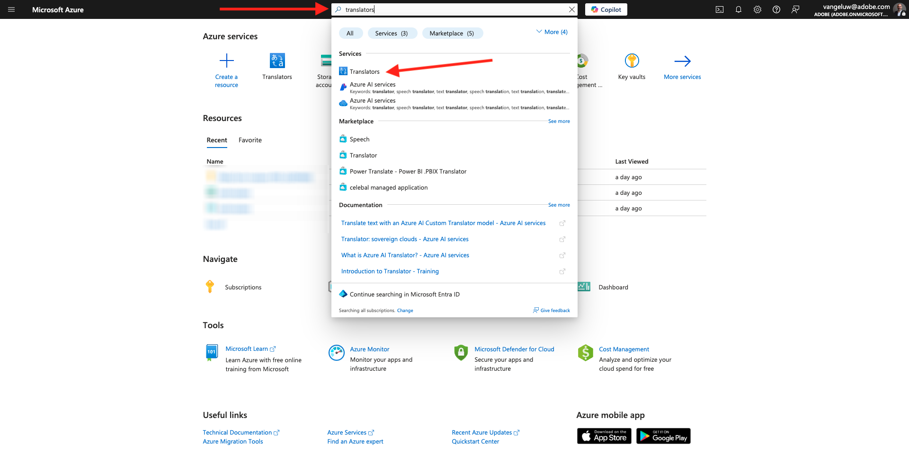
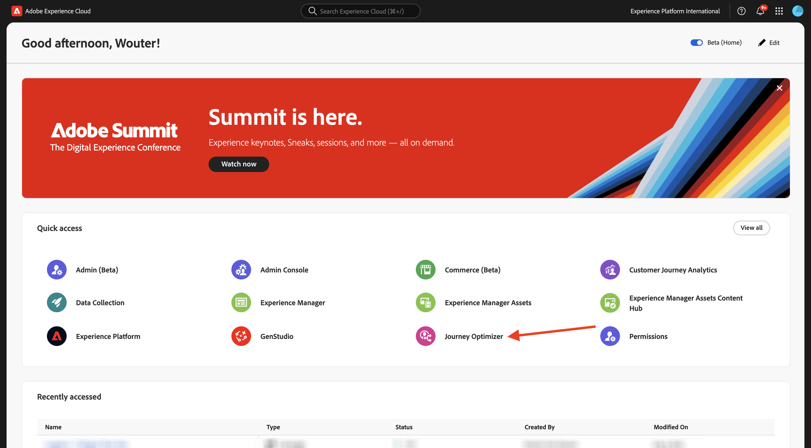
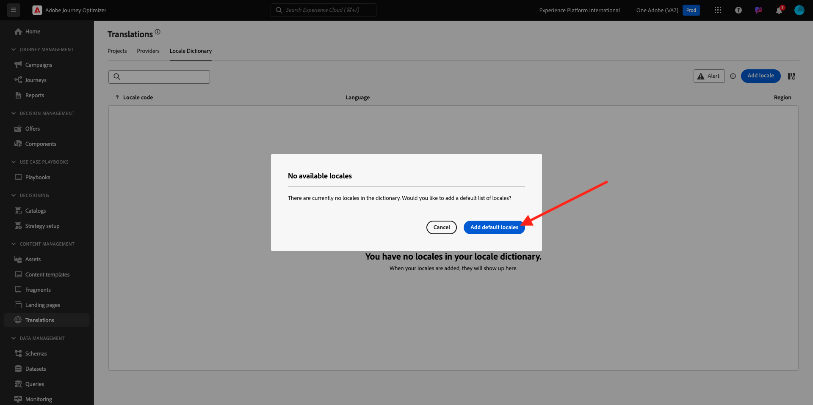
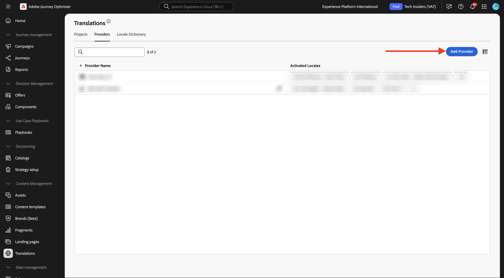

# 3.5.1 Fournisseur De Traductions

## 3.5.1.1 Configurer Microsoft Azure Translator

Accédez à [https://portal.azure.com/#home](https://portal.azure.com/#home).

Dans la barre de recherche, saisissez `translators`. Cliquez ensuite sur **+ Créer**.

Sélectionnez **Créer un traducteur**.

Choisissez votre **ID d’abonnement** et **Groupe de ressources**.
Définissez **Region** sur **Global**.
Définissez **Pricing Tier** sur **Free F0**.

Sélectionnez **Réviser + créer**.

Sélectionnez **Créer**.

Sélectionnez **Accéder à la ressource**.

Dans le menu de gauche, accédez à **Gestion des ressources** > **Clés et point d’entrée**. Cliquez pour copier votre clé.

## Dictionnaire de paramètres régionaux 3.5.1.2

Accédez à [https://experience.adobe.com/](https://experience.adobe.com/). Cliquez sur **Journey Optimizer**.

Dans le menu de gauche, accédez à **Traductions** puis à **Dictionnaire des paramètres régionaux**. Si ce message s’affiche, cliquez sur **Ajouter des paramètres régionaux par défaut**.

Vous devriez alors voir ceci.

## 3.5.1.3 Configurer le fournisseur de traductions dans AJO

Accédez à [https://experience.adobe.com/](https://experience.adobe.com/). Cliquez sur **Journey Optimizer**.

Dans le menu de gauche, accédez à **Traductions** puis à **Fournisseurs**. Cliquez sur **Ajouter un fournisseur**.

Sous **Fournisseurs**, sélectionnez **Traducteur Microsoft**. Cochez la case pour activer l’utilisation du fournisseur de traduction. Collez la clé que vous avez copiée à partir de Microsoft Azure Translators. Cliquez ensuite sur **Valider les informations d’identification**.

Vos informations d’identification doivent ensuite être validées avec succès. Si elles le sont, faites défiler la page vers le bas pour sélectionner les langues à traduire.

Veillez à sélectionner `[en-US] English`, `[es] Spanish`, `[fr] French`, `[nl] Dutch`.

Faites défiler vers le haut et cliquez sur **Enregistrer**.

Votre **fournisseur de traduction** est maintenant prêt à être utilisé.

## 3.5.1.4 Configurer Le Projet De Traduction

Accédez à [https://experience.adobe.com/](https://experience.adobe.com/). Cliquez sur **Journey Optimizer**.

Dans le menu de gauche, accédez à **Traductions** puis à **Dictionnaire des paramètres régionaux**. Si ce message s’affiche, cliquez sur **Créer un projet**.

Saisissez le nom `--aepUserLdap-- - Translations`, définissez les **paramètres régionaux Source** sur `[en-US] English - United States` et cochez les cases pour activer **Publier automatiquement les traductions approuvées** et **Activer le workflow de révision**. Cliquez ensuite sur **+ Ajouter un paramètre régional**.

Recherchez `fr`, activez la case à cocher pour `[fr] French`, puis activez la case à cocher pour **Microsoft Translator**. Cliquez sur **+ Ajouter un paramètre régional**.

Recherchez `es`, activez la case à cocher pour `[es] Spanish`, puis activez la case à cocher pour **Microsoft Translator**. Cliquez sur **+ Ajouter un paramètre régional**.

Recherchez `nl`, activez la case à cocher pour `[nl] Spanish`, puis activez la case à cocher pour **Microsoft Translator**. Cliquez sur **+ Ajouter un paramètre régional**.

Cliquez sur **Enregistrer**.

Votre projet **Traductions** est maintenant prêt à être utilisé.

## 3.5.1.5 Configurer Les Paramètres De Langue

Accédez à **Canaux** > **Paramètres généraux** > **Paramètres de langue**. Cliquez sur **Créer des paramètres de langue**.

Utilisez le nom `--aepUserLdap--_translations`. Sélectionnez **Projet de traduction**. Cliquez ensuite sur l’icône **modifier**.

Sélectionnez le projet de traduction que vous avez créé à l’étape précédente. Cliquez sur **Sélectionner**.

Vous devriez alors voir ceci. Définissez la **préférence de secours** sur **Anglais - États-Unis**. Cliquez pour sélectionner **Sélectionner l’attribut de langue de profil préféré**, qui décidera du champ du profil client à utiliser pour charger les traductions. Cliquez ensuite sur l’icône **modifier** pour sélectionner le champ à utiliser.

Saisissez **langue préférée** dans la barre de recherche, puis sélectionnez le champ **Langue préférée**.

Cliquez sur l’icône **edit** pour **Anglais - États-Unis** et **Néerlandais** pour en vérifier la configuration.

Voici la configuration pour **Anglais - États-Unis**. Cliquez sur **Annuler**.

Cliquez pour voir la configuration pour **Néerlandais**. Cliquez sur **Annuler**.

Faites défiler vers le haut et cliquez sur **Envoyer**.

Vos paramètres de langue sont maintenant configurés.

Vous avez terminé cet exercice.

## Étapes suivantes

Accédez à [3.5.2 Création de votre campagne](./ex2.md)

Revenez à [Adobe Journey Optimizer : Services de traduction](./ajotranslationsvcs.md){target="_blank"}

Revenir à [Tous les modules](./../../../../overview.md){target="_blank"}
