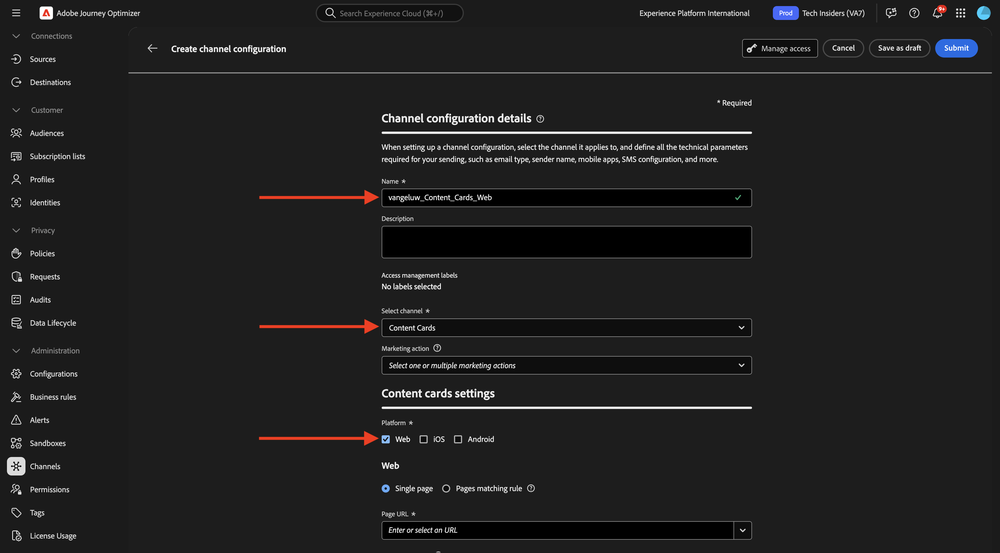
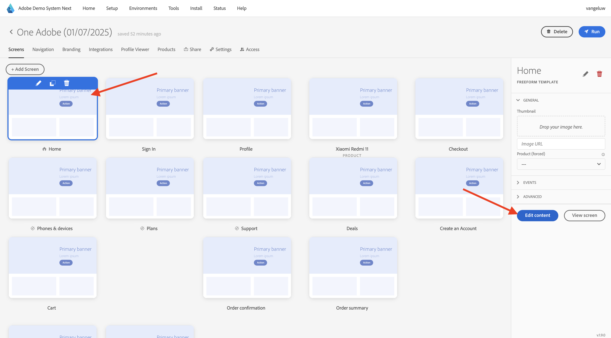

# 3.6.1 Cartes de contenu

Connectez-vous à Adobe Journey Optimizer en allant sur [Adobe Experience Cloud](https://experience.adobe.com?lang=fr). Cliquez sur **Journey Optimizer**.


Vous serez redirigé vers la vue **Accueil** dans Journey Optimizer. Tout d’abord, assurez-vous d’utiliser le bon sandbox. Le sandbox à utiliser est appelé `--aepSandboxName--`. Vous serez alors dans la vue **Accueil** de votre `--aepSandboxName--` sandbox.


## Configuration du canal des cartes de contenu 3.6.1.1

Dans le menu de gauche, accédez à **Canaux** puis sélectionnez **Configurations de canal**. Cliquez sur **Créer une configuration de canal**.


Saisissez le nom : `--aepUserLdap--_Content_Cards_Web`, sélectionnez le canal **Cartes de contenu** puis activez la plateforme **Web**.



Faites défiler vers le bas et assurez-vous que l’option **Une seule page** est activée.

Saisissez l’URL du site web qui a été créé précédemment dans le cadre du module **Prise en main**, qui se présente comme suit : `https://dsn.adobe.com/web/--aepUserLdap---XXXX`. N’oubliez pas de remplacer le **XXXX** par le code unique de votre site web.

>[!IMPORTANT]
>
>La référence ci-dessus à l&#39;URL de votre site web de démonstration CitiSignal `https://dsn.adobe.com/web/--aepUserLdap---XXXX` doit être remplacée par votre URL réelle. Vous pouvez trouver l’URL en accédant à votre projet de site web sur [https://dsn.adobe.com/](https://dsn.adobe.com/).

Définissez le champ **Emplacement sur la page** sur `CitiSignalContentCardContainer`.


Faites défiler vers le haut et cliquez sur **Envoyer**.


Votre configuration de canal est maintenant prête à être utilisée.


## 3.6.1.2 Configurer une campagne planifiée pour les cartes de contenu

Dans le menu de gauche, accédez à **Campagnes** puis cliquez sur **Créer une campagne**.


Sélectionnez **Planifié - Marketing** puis cliquez sur **Créer**.


Saisissez le nom `--aepUserLdap-- - CitiSignal Fiber Max Content Cards`, puis cliquez sur **Actions**.


Cliquez sur **+ Ajouter une action** puis sélectionnez **Carte de contenu**.


Sélectionnez la configuration de canal des cartes de contenu que vous avez créée à l’étape précédente, qui est nommée : `--aepUserLdap--_Content_Cards_Web`.

Cliquez ensuite sur **Modifier les règles**.


Cliquez sur le **X** pour supprimer la règle actuelle.


Cliquez sur **+ Ajouter une condition**.


Sélectionnez la condition **Données envoyées à Platform**. Cliquez sur **Terminé**


Vous devriez alors voir ceci. Cliquez sur **Modifier le contenu**.


Vous devriez alors voir ceci.


Configurez les paramètres suivants :

- **Titre** : `CitiSignal Fiber Max`
- **Corps** : `Lightning speed for gamers`
- **URL cible** : `https://dsn.adobe.com/web/--aepUserLdap---XXXX/plans`

>[!IMPORTANT]
>
>La référence ci-dessus à l&#39;URL de votre site web de démonstration CitiSignal `https://dsn.adobe.com/web/--aepUserLdap---XXXX/plans` doit être remplacée par votre URL réelle. Vous pouvez trouver l’URL en accédant à votre projet de site web sur [https://dsn.adobe.com/](https://dsn.adobe.com/).

Cliquez sur l’icône pour modifier l’URL en sélectionnant une ressource dans AEM Assets.


Accédez au dossier **citisignal-images** et sélectionnez le fichier **`neon_rabbit_banner.jpg`**. Cliquez sur **Sélectionner**.


Tu devrais avoir ça. Cliquez sur le bouton **+ Ajouter**.


Configurez les paramètres suivants pour le bouton :

- **Titre du bouton** : `Upgrade now!`
- **Événement d&#39;interaction** : `click`
- **Cible** : `https://dsn.adobe.com/web/--aepUserLdap---XXXX/plans`

>[!IMPORTANT]
>
>La référence ci-dessus à l&#39;URL de votre site web de démonstration CitiSignal `https://dsn.adobe.com/web/--aepUserLdap---XXXX/plans` doit être remplacée par votre URL réelle. Vous pouvez trouver l’URL en accédant à votre projet de site web sur [https://dsn.adobe.com/](https://dsn.adobe.com/).

Cliquez sur **Vérifier pour activer**.


Cliquez sur **Activer**.


Votre campagne sera alors activée, ce qui peut prendre quelques minutes.


Au bout de quelques minutes, votre campagne sera en ligne.


## 3.6.1.3 Mettre à jour votre site Web DSN

Pour afficher la carte de contenu sur le site Web, vous devez apporter une modification à la conception de la page d&#39;accueil de votre site Web de démonstration CitiSignal.

Accédez à [https://dsn.adobe.com/](https://dsn.adobe.com/). Cliquez sur les points **3** sur votre site web, puis cliquez sur **Modifier**.


Cliquez pour sélectionner la page **Accueil**. Cliquez sur **Modifier le contenu**.



Pointez sur l’image principale, puis cliquez sur le bouton **+**.


Accédez à **Général**, sélectionnez **Bannière** puis cliquez sur **Ajouter**.


Cliquez pour sélectionner la bannière que vous venez de créer. Accédez à **Style** et saisissez `CitiSignalContentCardContainer` dans le champ **Classes CSS personnalisées**.


Accédez à **Alignement**. Définissez le champ **Alignement** sur `left` et le champ **Alignement vertical** sur `middle`.

Cliquez sur l’icône **X** pour fermer la boîte de dialogue.


Les modifications apportées à la conception de votre site web sont maintenant terminées.

Si vous ouvrez maintenant votre site dans une nouvelle fenêtre de navigateur, il devrait ressembler à ceci. la zone grise est la bannière nouvellement créée, mais elle n’a pas encore de contenu.


Pour que le contenu soit chargé dynamiquement dans la bannière nouvellement créée, une modification est nécessaire dans votre propriété Balises de collecte de données.

## 3.6.1.4 Mettre à jour la propriété Balises de la collecte de données

Accédez à [https://experience.adobe.com/#/data-collection/](https://experience.adobe.com/#/data-collection/), à **Balises**. Dans le cadre du module [Prise en main](./../../../../modules/getting-started/gettingstarted/ex1.md), les propriétés des balises de collecte de données ont été créées.

Vous utilisez déjà ces propriétés de balises de collecte de données dans le cadre de modules précédents.

Cliquez pour ouvrir la propriété Collecte de données pour le Web.


Dans le menu de gauche, accédez à **Règles** et cliquez pour ouvrir la règle **Page vue**.


Cliquez sur l’action **Envoyer un événement d’expérience « Page vue »**.


Dans le cadre de la règle **Page vue**, il est nécessaire de demander les instructions de personnalisation à l’Edge pour une surface spécifique. La surface est la bannière que vous avez configurée à l’étape précédente. Pour ce faire, faites défiler l’écran jusqu’à **Personalization** et saisissez `web://dsn.adobe.com/web/--aepUserLdap---XXXX#CitiSignalContentCardContainer` sous **Surfaces**.

>[!IMPORTANT]
>
>La référence ci-dessus à l&#39;URL de votre site web de démonstration CitiSignal `web://dsn.adobe.com/web/--aepUserLdap---XXXX#CitiSignalContentCardContainer` doit être remplacée par votre URL réelle. Vous pouvez trouver l’URL en accédant à votre projet de site web sur [https://dsn.adobe.com/](https://dsn.adobe.com/).

Cliquez sur **Conserver les modifications**.


Cliquez sur **Enregistrer** ou **Enregistrer dans la bibliothèque**.


Dans le menu de gauche, accédez à **Règles** et cliquez sur **Ajouter une règle**.


Saisissez le nom : `Display AJO Content Cards`. Cliquez sur **+ Ajouter** pour ajouter un nouvel événement.


Sélectionnez l’**extension** : **Adobe Experience Platform Web SDK**, puis sélectionnez le **type d’événement** : **abonner les éléments du jeu de règles**.

Sous **Schémas**, sélectionnez **Carte de contenu**.

Sous **Surfaces**, saisissez `web://dsn.adobe.com/web/--aepUserLdap---XXXX#CitiSignalContentCardContainer`

>[!IMPORTANT]
>
>La référence ci-dessus à l&#39;URL de votre site web de démonstration CitiSignal `web://dsn.adobe.com/web/--aepUserLdap---XXXX#CitiSignalContentCardContainer` doit être remplacée par votre URL réelle. Vous pouvez trouver l’URL en accédant à votre projet de site web sur [https://dsn.adobe.com/](https://dsn.adobe.com/).

Cliquez sur **Conserver les modifications**.


Vous devriez alors voir ceci. Cliquez sur **+ Ajouter** pour ajouter une nouvelle action.


Sélectionnez l’**Extension** : **Core**, puis sélectionnez l’**Type d’action** : **Code personnalisé**.

Activez la case à cocher correspondant à **Langue** : **JavaScript** puis cliquez sur **Ouvrir l’éditeur**.


Une fenêtre d’éditeur vide devrait alors s’afficher.


Collez le code ci-dessous dans l’éditeur, puis cliquez sur **Enregistrer**.

```javascript
if (!Array.isArray(event.propositions)) {
  console.log("No personalization content");
  return;
}

console.log(">>> Content Card response from Edge: ", event.propositions);

event.propositions.forEach(function (payload) {
  payload.items.forEach(function (item) {
    if (!item.data || !item.data.content || item.data.content === "undefined") {
      return;
    }
    console.log(">>> Content Card response from Edge: ", item);
    const { content } = item.data;
    const { title, body, image, buttons } = content;
    const titleValue = title.content;
    const description = body.content;
    const imageUrl = image.url;
    const buttonLabel = buttons[0]?.text.content;
    const buttonLink = buttons[0]?.actionUrl;
    const html = `<div  class="Banner Banner--alignment-left Banner--verticalAlignment-left hero-banner ContentCardContainer"  oxygen-component-id="cmp-0"  oxygen-component="Banner"  role="presentation"  style="color: rgb(255, 255, 255); height: 60%;">  <div class="Image" role="presentation">      </div>  <div class="Banner__content">    <div class="Title Title--alignment-left Title--textAlignment-left">      <div class="Title__content" role="presentation">        <strong class="Title__pretitle">${titleValue}</strong>        <h2>${description}</h2>      </div>    </div>    <div class="Button Button--alignment-left Button--variant-cta">              <button          class="Dniwja_spectrum-Button Dniwja_spectrum-BaseButton Dniwja_i18nFontFamily Dniwja_spectrum-FocusRing Dniwja_spectrum-FocusRing-ring"          type="button"          data-variant="accent"          data-style="fill"          onclick="window.open('${buttonLink}')"       style="color:#FFFFFF;padding: 12px 28px;font-size: 24px;font-family: adobe-clean;font-weight: bolder;" >          <span            id="react-aria5848951631-49"            class="Dniwja_spectrum-Button-label"            >${buttonLabel}</span          >        </button>            </div>  </div></div>`;
    if (document.querySelector(".CitiSignalContentCardContainer")) {
      const contentCardContainer = document.querySelector(
        ".CitiSignalContentCardContainer"
      );
      contentCardContainer.innerHTML = html;
      contentCardContainer.style.height = "60%";
    }
  });
});
```


Cliquez sur **Conserver les modifications**.


Cliquez sur **Enregistrer** ou **Enregistrer dans la bibliothèque**.


Dans le menu de gauche, accédez à **Flux de publication**, puis cliquez pour ouvrir la bibliothèque **Principal**.


Cliquez sur **Ajouter toutes les ressources modifiées** puis sur **Enregistrer et créer dans le développement**.


## 3.6.1.5 Testez votre carte de contenu sur votre site web

Accédez à [https://dsn.adobe.com](https://dsn.adobe.com). Après vous être connecté avec votre Adobe ID, voici ce que vous verrez. Cliquez sur le **de 3 points...** sur le projet de votre site web, puis cliquez sur **Exécuter** pour l’ouvrir.


Vous verrez ensuite votre site web de démonstration s’ouvrir. Sélectionnez l’URL et copiez-la dans le presse-papiers.


Ouvrez une nouvelle fenêtre de navigateur en mode privé.


Collez l’URL de votre site web de démonstration, que vous avez copiée à l’étape précédente. Il vous sera ensuite demandé de vous connecter à l’aide de votre Adobe ID.


Sélectionnez votre type de compte et terminez le processus de connexion.


Vous devriez maintenant charger le site Web CitiSignal, et la carte de contenu que vous avez configurée devrait maintenant s&#39;afficher au lieu de la zone grise vide que vous aviez là auparavant.


## Étapes suivantes

Accédez aux pages de destination [3.6.2](./ex2.md)

Revenez à [Adobe Journey Optimizer : Gestion de contenu](./ajocontent.md){target="_blank"}

Revenir à [Tous les modules](./../../../../overview.md){target="_blank"}
