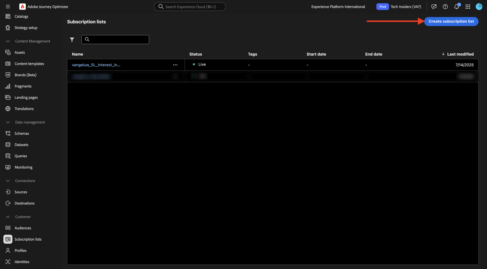
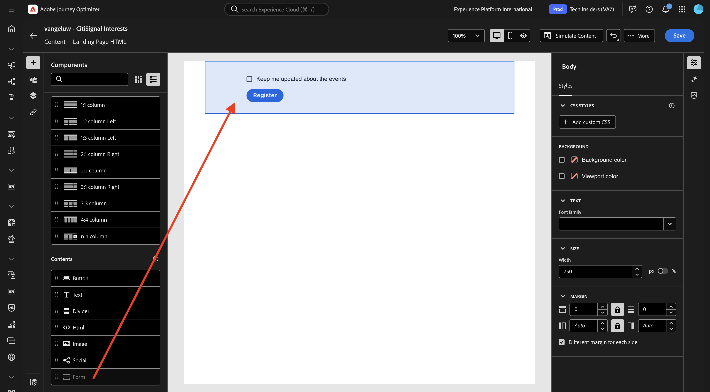
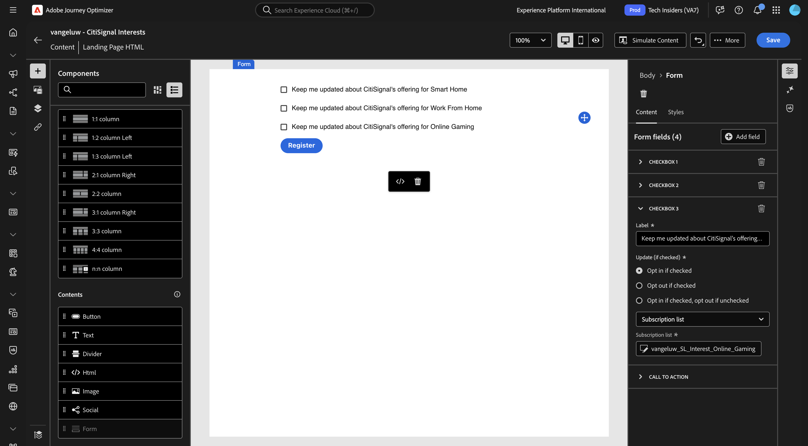
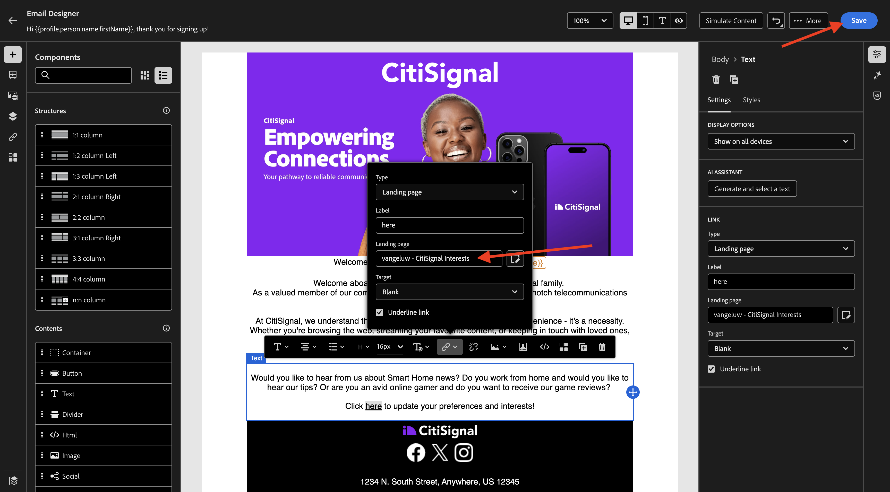
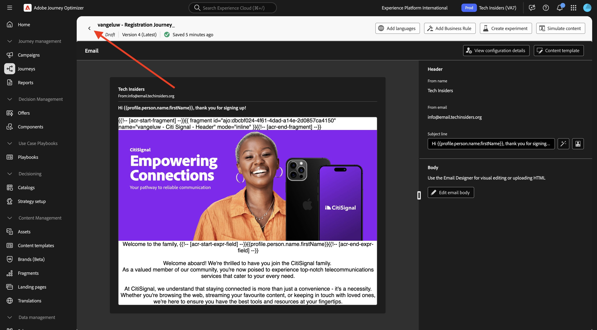

# 3.6.2 Pages de destination

Connectez-vous à Adobe Journey Optimizer en allant sur [Adobe Experience Cloud](https://experience.adobe.com?lang=fr). Cliquez sur **Journey Optimizer**.

Vous serez redirigé vers la vue **Accueil** dans Journey Optimizer. Tout d’abord, assurez-vous d’utiliser le bon sandbox. Le sandbox à utiliser est appelé `--aepSandboxName--`. Vous serez alors dans la vue **Accueil** de votre `--aepSandboxName--` sandbox.

## Listes d’abonnements 3.6.2.1

Les landing pages de Adobe Journey Optimizer fonctionnent conjointement avec les **listes d’abonnements**. Pour configurer des pages de destination, vous devez d’abord configurer des **listes d’abonnements**.

CitiSignal souhaite interroger ses clients sur leur intérêt pour les domaines suivants :

- Smart Home
- Travailler à partir de la maison
- Jeux en ligne

Une fois qu’un client a indiqué son intérêt pour l’un de ces domaines, il doit être ajouté à une liste spécifique afin de pouvoir être ciblé avec un contenu spécifique par la suite dans le cadre des campagnes à venir.

Vous allez maintenant créer 3 listes d’abonnements.

Dans le menu de gauche, accédez à **Listes d’abonnements**. Cliquez sur **Créer une liste d’abonnements**.

Pour **Titre**, utilisez : `--aepUserLdap--_SL_Interest_in_Smart_Home`.
Pour **Description**, utilisez : `Interest in Smart Home`.

Cliquez sur **Envoyer**.

Cliquez sur **Créer une liste d’abonnements** pour créer une autre liste.

Pour **Titre**, utilisez : `--aepUserLdap--_SL_Interest_WFH`.
Pour **Description**, utilisez : `Interest in Work From Home`.

Cliquez sur **Envoyer**.

Cliquez sur **Créer une liste d’abonnements** pour créer une autre liste.

Pour **Titre**, utilisez : `--aepUserLdap--_SL_Interest_Online_Gaming`.
Pour **Description**, utilisez : `Interest in Online Gaming`.

Cliquez sur **Envoyer**.

Vous avez maintenant créé les 3 listes dont vous avez besoin.

## Préréglage De La Page De Destination 3.6.2.2

Pour utiliser les pages de destination dans Adobe Journey Optimizer, un préréglage doit être créé.

Dans le menu de gauche, accédez à **Administration** > **Canaux** puis sélectionnez **Préréglages de page de destination**.

Cliquez sur **Créer un préréglage de page de destination**.

Pour le champ **Nom**, utilisez : `--aepUserLdap-- - CitiSignal LP` et sélectionnez le sous-domaine disponible dans votre instance.

>[!NOTE]
>
>Si vous ne voyez pas de sous-domaine dans votre instance, contactez votre administrateur AJO pour en ajouter un.

Cliquez sur **Envoyer**.

Votre préréglage de page de destination a maintenant été créé.

## Page de destination 3.6.2.3

Vous pouvez maintenant créer votre page de destination. Dans le menu de gauche, accédez à **Gestion de contenu** > **Pages de destination**.

Cliquez sur **Créer une page de destination**.

Pour le champ **Titre**, utilisez : `vangeluw - CitiSignal Interests`. Sélectionnez ensuite le **préréglage de la page de destination** que vous avez configuré à l’étape précédente.

Cliquez sur **Créer**.

Vous devriez alors voir ceci.

Remplacez le champ **Nom de la page** par `--aepUserLdap-- - CitiSignal Interests`.

Saisissez ce nom personnalisé sous **Paramètres d’accès** : `--aepUserLdap---citisignal-interests`.

Cliquez sur **Ouvrir Designer**.

Sélectionnez **Créer en partant de zéro**.

Vous devriez alors voir ceci.

Ajoutez un composant de structure **colonne 1:1** à la zone de travail.

Ajoutez un composant de contenu **Formulaire** à la zone de travail.

Remplacez le champ **Libellé** de **Case à cocher 1** par `Keep me updated about CitiSignal's offering for Smart Home`.

Assurez-vous que la case à cocher **Opt-in si cochée** est activée et que **Liste d’abonnements** est sélectionnée.

Cliquez ensuite sur **Sélectionner une liste d’abonnements**.

Sélectionnez ensuite le `--aepUserLdap--_SL_Interest_in_Smart_Home` de liste et cliquez sur **Sélectionner**.

Cliquez sur **+ Ajouter un champ** puis sélectionnez **Case à cocher**.

Vous devriez alors voir ceci.

Remplacez le champ **Libellé** de **Case à cocher 2** par `Keep me updated about CitiSignal's offering for Work From Home`.

Assurez-vous que la case à cocher **Opt-in si cochée** est activée et que **Liste d’abonnements** est sélectionnée.

Cliquez ensuite sur **Sélectionner une liste d’abonnements**.

Sélectionnez ensuite le `--aepUserLdap--_SL_Interest_WFH` de liste et cliquez sur **Sélectionner**.

Cliquez sur **+ Ajouter un champ** puis sélectionnez **Case à cocher**.

Vous devriez alors voir ceci.

Remplacez le champ **Libellé** de **Case à cocher 3** par `Keep me updated about CitiSignal's offering for Online Gaming`.

Assurez-vous que la case à cocher **Opt-in si cochée** est activée et que **Liste d’abonnements** est sélectionnée.

Cliquez ensuite sur **Sélectionner une liste d’abonnements**.

Sélectionnez ensuite le `--aepUserLdap--_SL_Interest_Online_Gaming` de liste et cliquez sur **Sélectionner**.

Vous devriez alors voir ceci.

Accédez au champ de formulaire **CALL TO ACTION**.

Mettez à jour les champs suivants :

- **Texte** - Libellé du bouton : `Save`.
- **Action de confirmation** : sélectionnez **Texte de confirmation**.
- **Texte de confirmation** : utilisez : `Thanks for updating your preferences!`.
- **Action d’erreur** : sélectionnez **Texte d’erreur**.
- **Texte d’erreur** : utilisez : `There was an error updating your preferences.`

Cliquez sur **Enregistrer** puis sur la flèche dans le coin supérieur gauche pour revenir à l’écran précédent.

Cliquez sur **Publier**.

Cliquez de nouveau sur **Publier**.

Votre page de destination est maintenant publiée et peut être utilisée dans un e-mail.

## 3.6.2.4 inclure la page de destination dans l’e-mail

Dans l’exercice 3.1, vous avez créé un parcours appelé `--aepUserLdap-- - Registration Journey`.

Vous devez maintenant mettre à jour l’e-mail dans ce parcours pour inclure le lien vers la page de destination.

Dans le menu de gauche, accédez à **Parcours** puis cliquez pour ouvrir le `--aepUserLdap-- - Registration Journey` de parcours.

Cliquez sur **Plus...**, puis sélectionnez **Créer une version**.

Cliquez sur **Créer une version**.

Cliquez pour sélectionner l’action **E-mail**, puis sélectionnez **Modifier le contenu**.

Cliquez sur **Modifier le corps de l’e-mail**.

Vous devriez alors voir quelque chose comme ça. Ajoutez un nouveau composant de structure **colonne 1:1** à la zone de travail.

Ajoutez un nouveau composant de contenu **Texte** dans le composant de structure nouvellement créé.

Collez le texte suivant dans le composant de contenu **Texte**.

`Would you like to hear from us about Smart Home news? Do you work from home and would you like to hear our tips? Or are you an avid online gamer and do you want to receive our game reviews? Click here to update your preferences and interests!`

Appliquez un style à votre texte pour qu’il ressemble à ceci, puis sélectionnez le mot `here`. Cliquez sur l’icône **lien**.

Définissez le **Type** du lien sur **Page de destination** et définissez le champ **Cible** sur **Vide**.

Cliquez sur l’icône **modifier** pour sélectionner la page de destination à lier.

Sélectionnez l’`--aepUserLdap-- - CitiSignal Interests` de la page de destination. Cliquez sur **Sélectionner**.

Vous devriez alors voir ceci. Cliquez sur **Enregistrer**.

Cliquez sur la flèche située dans le coin supérieur gauche pour revenir à l’écran précédent.

Cliquez sur la flèche dans le coin supérieur gauche pour revenir à l’écran précédent.

Cliquez sur **Enregistrer**.

Cliquez sur **Publier**.

Cliquez de nouveau sur **Publier**.

Vos modifications ont maintenant été publiées et vous pouvez tester votre parcours.

## 3.6.2.5 Tester le parcours et la page de destination

Accédez à [https://dsn.adobe.com](https://dsn.adobe.com). Après vous être connecté avec votre Adobe ID, voici ce que vous verrez. Cliquez sur le **de 3 points...** sur le projet de votre site web, puis cliquez sur **Exécuter** pour l’ouvrir.

Vous verrez ensuite votre site web de démonstration s’ouvrir. Sélectionnez l’URL et copiez-la dans le presse-papiers.

Ouvrez une nouvelle fenêtre de navigateur en mode privé.

Collez l’URL de votre site web de démonstration, que vous avez copiée à l’étape précédente. Il vous sera ensuite demandé de vous connecter à l’aide de votre Adobe ID.

Sélectionnez votre type de compte et terminez le processus de connexion.

Votre site web est alors chargé dans une fenêtre de navigateur en mode privé. Pour chaque exercice, vous devrez utiliser une nouvelle fenêtre de navigateur en mode privé pour charger l’URL de votre site web de démonstration. Accédez à **Se connecter**

Cliquez sur **CRÉER UN COMPTE**. Renseignez vos informations et cliquez sur **S’inscrire**.

Vous serez maintenant redirigé vers la page d’accueil. Ouvrez le panneau Visionneuse de profils et accédez au profil client en temps réel. Dans le panneau Visionneuse de profil, toutes vos données personnelles doivent s’afficher, comme vos nouveaux identifiants d’e-mail et de téléphone ajoutés.

1 minute après la création de votre compte, vous recevrez un e-mail de création de compte de Adobe Journey Optimizer.

Cliquez sur le lien contenu dans l’e-mail pour mettre à jour vos préférences.

Vous devriez alors voir le formulaire que vous avez créé. Cochez certaines cases et cliquez sur **Enregistrer**.

Un message de confirmation s’affiche alors.

## 3.6.2.6 rapports de liste d’abonnements

Pour afficher les rapports disponibles sur les listes d’abonnements, accédez à **Listes d’abonnements** dans le menu de gauche, puis cliquez pour ouvrir l’une des listes d’abonnements que vous avez configurées précédemment.

Cliquez sur **Rapport**.

Vous devriez alors voir l’aperçu de la liste, avec le nombre de personnes qui se sont inscrites ou désinscrites.

## Étapes suivantes

Accédez à [3.6.3 AJO et GenStudio for Performance Marketing](./ex3.md)

Revenez à [Adobe Journey Optimizer : Gestion de contenu](./ajocontent.md){target="_blank"}

Revenir à [Tous les modules](./../../../../overview.md){target="_blank"}
