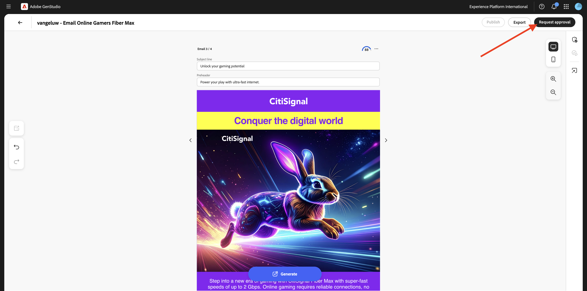
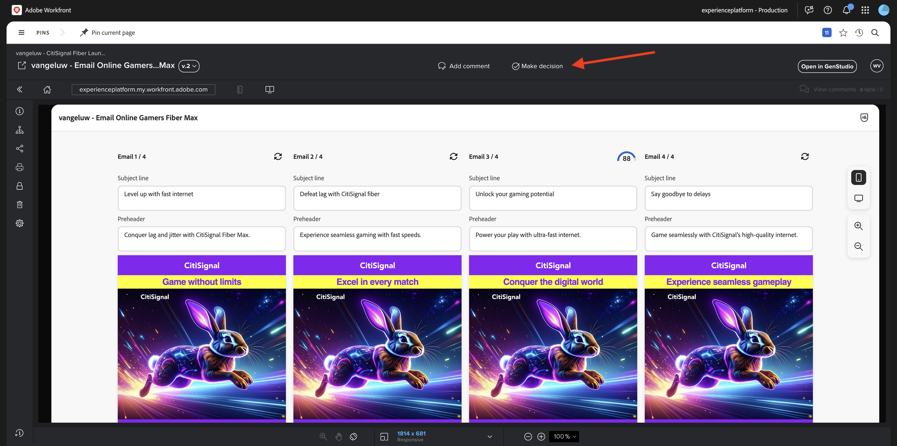
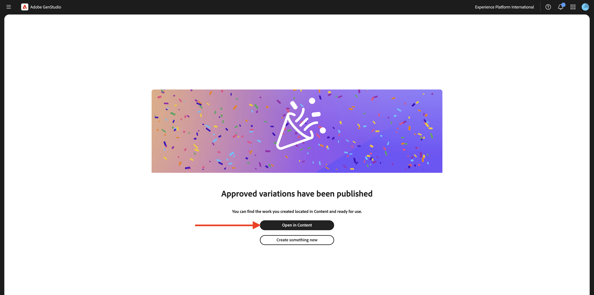

# 3.6.3 AJO et GenStudio for Performance Marketing

>[!IMPORTANT]
>
>Pour effectuer cet exercice, vous devez avoir accès à un environnement Adobe Journey Optimizer configuré pour l’intégration à GenStudio for Performance Marketing, qui est actuellement en version bêta.

>[!IMPORTANT]
>
>Pour effectuer cet exercice, vous devez avoir accès à une instance configurée pour Adobe GenStudio for Performance Marketing.

>[!IMPORTANT]
>
>Pour exécuter toutes les étapes de cet exercice, vous devez avoir accès à un environnement Adobe Workfront existant et, dans cet environnement, vous devez avoir créé un projet et un workflow d’approbation. Si vous suivez l’exercice [Gestion des workflows avec Adobe Workfront](./../../../../modules/workflow-planning/module1.2/workfront.md){target="_blank"} la configuration requise sera disponible.

## 1.3.4.1 Créer et approuver une expérience d’e-mail dans Adobe GenStudio

Accédez à [https://experience.adobe.com/](https://experience.adobe.com/){target="_blank"}. Ouvrez **GenStudio**.


Vous devriez alors voir ceci. Dans le menu de gauche, accédez à **Créer**. Sélectionnez **E-mail**.


Sélectionnez le modèle **E-mail** que vous avez importé précédemment et qui est nommé `--aepUserLdap---citisignal-email-template`. Cliquez sur **Utiliser**.


Vous devriez alors voir ceci. Remplacez le nom de votre publicité par `--aepUserLdap-- - Email Online Gamers Fiber Max`.


Sous **Paramètres**, sélectionnez les options suivantes :

- **Marque** : `--aepUserLdap-- - CitiSignal`
- **Langue** : `English (US)`
- **Persona** : `--aepUserLdap-- - Smart Home Families`
- **Produit** : `--aepUserLdap-- - CitiSignal Fiber Max`

Cliquez sur **Sélectionner à partir du contenu**.


Sélectionnez l’`--aepUserLdap-- - neon rabbit.png` de la ressource. Cliquez sur **Utiliser**.


Saisissez le `convince online gamers to start playing online multiplayer games using CitiSignal internet` d’invite et cliquez sur **Générer**.


Vous devriez alors voir un élément similaire, avec 4 variations d’e-mail générées. La vue par défaut affiche la vue **mobile**. Vous pouvez basculer vers la vue Bureau en cliquant sur l’icône **ordinateur**.


Un score de conformité est automatiquement calculé pour chaque e-mail. Cliquez sur le score pour afficher plus de détails.


Cliquez sur **Afficher et résoudre les problèmes**.


Vous pouvez ensuite afficher plus de détails sur les mesures à prendre pour optimiser le score de complicance.


Cliquez ensuite sur **Demander l’approbation** pour vous connecter à Adobe Workfront.



Sélectionnez votre projet Adobe Workfront, qui doit être nommé `--aepUserLdap-- - CitiSignal Fiber Launch`. Saisissez votre propre adresse e-mail sous **Inviter des personnes** et assurez-vous que le rôle est défini sur **Approbateur**.


Vous pouvez également utiliser un workflow d’approbation existant dans Adobe Workfront. Pour ce faire, cliquez sur **Utiliser le modèle** et sélectionnez le modèle `--aepuserLdap-- - Approval Workflow`. Cliquez sur **Envoyer**.


Cliquez sur **Afficher les commentaires dans Workfront**. Vous serez désormais envoyé à l’interface utilisateur de l’épreuve Adobe Workfront.


Dans l’interface utilisateur d’Adobe Workfront Proof, cliquez sur **Prendre une décision**.



Sélectionnez **Approuvé** et cliquez sur **Prendre une décision**.


Cliquez sur **Publier**.


Sélectionnez votre `--aepUserLdap-- - CitiSignal Fiber Launch Campaign` Campaign et cliquez sur **Publier**.


Cliquez sur **Ouvrir dans le contenu**.



Les 4 expériences d’e-mail sont désormais disponibles sous **Contenu** > **Expériences**.


## 1.3.4.2 Création d’une campagne dans AJO

Connectez-vous à Adobe Journey Optimizer en allant sur [Adobe Experience Cloud](https://experience.adobe.com?lang=fr). Cliquez sur **Journey Optimizer**.


Vous serez redirigé vers la vue **Accueil** dans Journey Optimizer. Tout d’abord, assurez-vous d’utiliser le bon sandbox. Le sandbox à utiliser est appelé `--aepSandboxName--`. Vous serez alors dans la vue **Accueil** de votre `--aepSandboxName--` sandbox.


Vous allez maintenant créer une campagne. Contrairement au parcours basé sur un événement de l’exercice précédent, qui repose sur les événements d’expérience entrants, les entrées ou les sorties d’audience pour déclencher un parcours pour un client spécifique, les campagnes ciblent une audience entière une fois avec du contenu unique tel que des newsletters, des promotions ponctuelles ou des informations génériques, ou périodiquement avec du contenu similaire envoyé régulièrement, par exemple des campagnes d’anniversaire et des rappels.

Dans le menu, accédez à **Campagnes** et cliquez sur **Créer une campagne**.


Sélectionnez **Planifié - Marketing** et cliquez sur **Créer**.


Dans l’écran de création de la campagne, configurez les éléments suivants :

- **Nom** : `--aepUserLdap--  - Online Gamers CitiSignal Fiber Max`.
- **Description** : Campagne Fibre pour les joueurs en ligne

Cliquez sur **Actions**.


Cliquez sur **+ Ajouter une action** puis sélectionnez **E-mail**.


Sélectionnez ensuite une **configuration d’e-mail** existante, puis cliquez sur **Modifier le contenu**.


Tu verras ça. Pour la **ligne d’objet**, utilisez la commande suivante :

```
{{profile.person.name.firstName}}, say goodbye to delays!
```

Cliquez ensuite sur **Modifier le contenu**.


Cliquez sur **Importer HTML**.


Cliquez ensuite sur le bouton pour **Adobe GenStudio for Performance Marketing**.


Vous devriez alors voir une fenêtre contextuelle qui affiche toutes les expériences d’e-mail publiées dans GenStudio for Performance Marketing. Sélectionnez l’une des expériences d’e-mail disponibles et cliquez sur **Utiliser**.


Sélectionnez votre propre référentiel AEM Assets CS, qui doit être nommé `--aepUserLdap-- - CitiSignal dev`, puis cliquez sur **Importer**.


Vous devriez alors voir ceci. Sélectionnez le bouton d’image manquant et cliquez sur **Sélectionner une ressource**.


Accédez au dossier qui ressemble à celui-ci, en commençant par **GenStudio.zip.....** et sélectionnez le `--aepUserLdap-- - neon rabbit.png` d’image. Cliquez sur **Sélectionner**


Vous devriez alors voir ceci.


Faites défiler l’écran jusqu’au pied de page, sélectionnez le mot **Se désabonner** et cliquez sur l’icône **lien**.


Définissez le **Type** sur **Désinscription/opt-out externe** et définissez l’URL sur `https://techinsiders.org/unsubscribe.html` (le lien de désinscription ne peut pas contenir d’URL vide).

Cliquez sur **Enregistrer** puis sur la **flèche** dans le coin supérieur gauche de l’écran pour revenir à la configuration de la campagne.


Accédez à **Audience**.


Cliquez sur **Sélectionner une audience**.


Sélectionnez l&#39;audience de la liste d&#39;abonnement pour les joueurs en ligne, qui doit être nommé `--aepUserLdap--_SL_Interest_Online_Gaming`. Cliquez sur **Enregistrer**.


Cliquez sur **Vérifier pour activer**.


Si votre configuration de campagne ne comporte aucun problème, vous pourrez cliquer sur **Activer**.


Votre campagne sera alors activée, ce qui prend quelques minutes.


Au bout de quelques minutes, la campagne est active et l’e-mail est envoyé à la liste d’abonnements que vous avez sélectionnée.


Vous avez maintenant terminé cet exercice.

## Étapes suivantes

Accédez à [ Résumé et avantages ](./summary.md)

Revenez à [Adobe Journey Optimizer : Gestion de contenu](./ajocontent.md){target="_blank"}

Revenir à [Tous les modules](./../../../../overview.md){target="_blank"}
