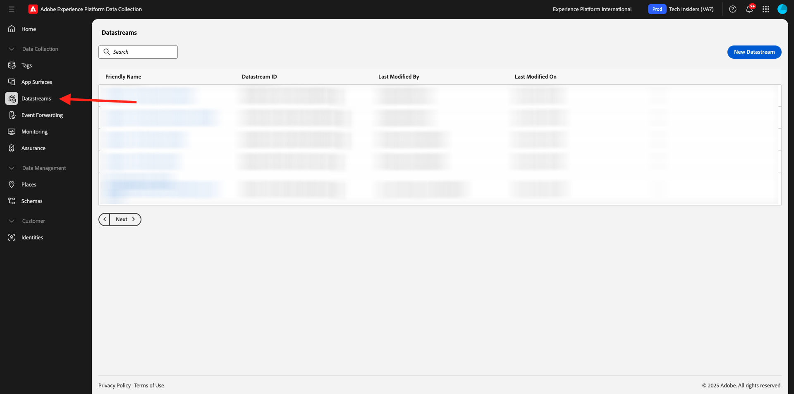

# 1.1.2 Edge Network, flux de données et collecte de données côté serveur

## Contexte

Dans cet exercice, vous allez créer un **flux de données**. Un **flux de données** indique aux serveurs du réseau Edge d’Adobe où envoyer les données une fois qu’elles ont été collectées par Web SDK. Par exemple, souhaitez-vous envoyer les données à Adobe Experience Platform ? ADOBE ANALYTICS ? ADOBE AUDIENCE MANAGER ? ADOBE TARGET ?

Les flux de données sont toujours gérés dans l’interface utilisateur de la collecte de données Experience Platform et sont essentiels à la collecte de données Experience Platform avec [Web SDK](https://experienceleague.adobe.com/fr/docs/experience-platform/web-sdk/home). Même lorsque vous implémentez Web SDK avec une solution de gestion des balises autre qu’Adobe, vous devez toujours créer un flux de données.

Vous implémenterez le SDK Web sur le navigateur dans l’exercice suivant. Vous saurez alors plus clairement à quoi ressemblent les données qui sont collectées. Pour l’instant, nous indiquons simplement au flux de données où transférer les données.

## Création dʼun flux de données

Dans [Prise en main](./../../../../modules/getting-started/gettingstarted/ex2.md) vous avez déjà créé un flux de données, mais nous n’avons pas discuté de l’arrière-plan ni de la raison pour laquelle vous l’avez créé.

Un [flux de données](https://experienceleague.adobe.com/fr/docs/experience-platform/datastreams/overview) indique aux serveurs Edge Network où envoyer les données une fois qu’elles ont été collectées par le SDK Web. Consultez la documentation relative à l’[ajout de services à un flux de données](https://experienceleague.adobe.com/en/docs/experience-platform/datastreams/configure#add-services) pour obtenir des détails complets sur l’endroit où vous pouvez envoyer vos données par le biais du flux de données.

Les flux de données sont gérés dans l’interface utilisateur de la collecte de données Experience Platform et sont essentiels à la collecte de données avec Web SDK, que vous implémentiez ou non Web SDK via la collecte de données Adobe Experience Platform.

Passons en revue votre **[!UICONTROL flux de données]** :

Accédez à [https://experience.adobe.com/launch/](https://experience.adobe.com/launch/).

Cliquez sur **[!UICONTROL Flux de données]** dans le menu de gauche.

Ouvrez le flux de données nommé `--aepUserLdap-- - Demo System Datastream`.

Vous verrez ensuite les détails de votre flux de données.

Cliquez sur **...** en regard de **Adobe Experience Platform** puis sur **Modifier**.

Tu verras ça. Pour l’instant, vous n’avez activé que Adobe Experience Platform. Votre configuration ressemblera à la configuration ci-dessous. (Selon votre environnement et votre instance Adobe Experience Platform, le nom du sandbox peut être différent)

Vous devez interpréter les champs ci-dessous comme suit :

Pour ce flux de données...

- Toutes les données collectées seront stockées dans le sandbox `--aepSandboxName--` de Adobe Experience Platform
- Toutes les données d’événement d’expérience sont collectées par défaut dans le jeu de données **Système de démonstration - Jeu de données d’événement pour le site web (global v1.1)**
- Toutes les données de profil seront collectées par défaut dans le jeu de données **Système de démonstration - Jeu de données de profil pour le site web (global v1.1)** (l’ingestion de données de profil en mode natif avec Web SDK n’est actuellement pas encore prise en charge par Web SDK)
- **La segmentation Edge** est activée par défaut, ce qui signifie que les audiences qualifiées seront évaluées à l’edge, lors de l’ingestion du trafic entrant
- Si vous souhaitez utiliser des [destinations de personnalisation](https://experienceleague.adobe.com/en/docs/experience-platform/destinations/catalog/personalization/overview), cochez la case **Destinations Personalization**.
- Si vous souhaitez utiliser les fonctionnalités de **Adobe Journey Optimizer** dans ce flux de données, vous devez cocher la case **Adobe Journey Optimizer**.

Pour l’instant, aucune autre configuration n’est nécessaire pour votre flux de données.

## Étapes suivantes

Accédez à [1.1.3 Présentation de la collecte de données Adobe Experience Platform](./ex3.md){target="_blank"}

Revenez à [Configuration de la collecte de données Adobe Experience Platform et de l’extension de balise Web SDK](./data-ingestion-launch-web-sdk.md){target="_blank"}

Revenir à [Tous les modules](./../../../../overview.md){target="_blank"}
