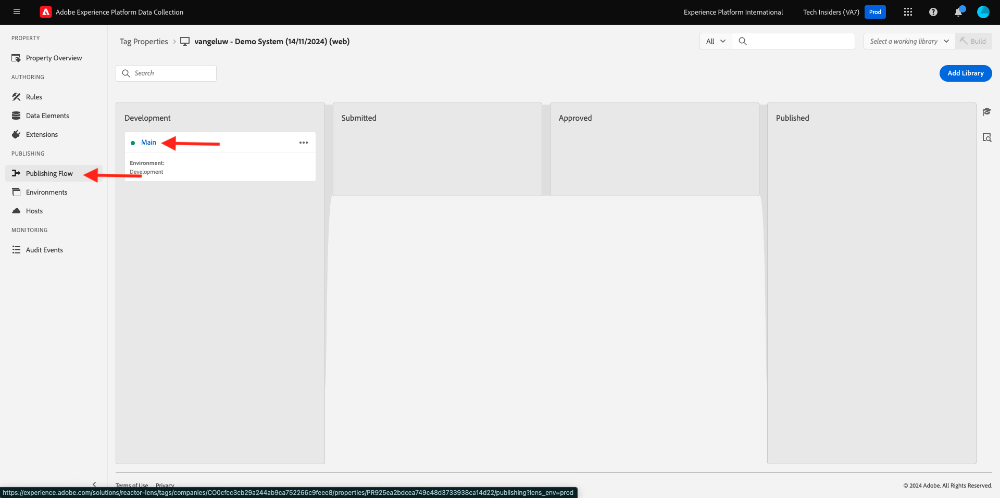

# 1.1.3 Présentation de la collecte de données Adobe Experience Platform

## Contexte

Examinons maintenant de plus près les éléments de base de la collecte de données Adobe Experience Platform, pour comprendre ce qui est installé sur votre site web de démonstration. Vous regarderez de plus près l’extension Adobe Experience Platform Web SDK, vous configurerez un élément de données et une règle et vous apprendrez à publier une bibliothèque.

## Extension de balise Adobe Experience Platform Web SDK

Une extension de balise est un ensemble empaqueté de code qui étend l’interface de collecte de données de Adobe Experience Platform et la fonctionnalité de bibliothèque. La collecte de données Adobe Experience Platform est la plateforme et les extensions de balises sont comme les applications qui s’exécutent sur la plateforme. Toutes les extensions utilisées dans le tutoriel sont créées et gérées par Adobe, mais des tiers peuvent créer leurs propres extensions pour limiter la quantité de code personnalisé que les utilisateurs de la collecte de données Adobe Experience Platform doivent gérer.

Accédez à [Collecte de données Adobe Experience Platform](https://experience.adobe.com/launch/) puis sélectionnez **Balises**.

Il s’agit de la page Propriétés de la collecte de données Adobe Experience Platform que vous avez déjà vue.

Dans **Prise en main**, le système de démonstration a créé deux propriétés client pour vous : une pour le site web et une pour l’application mobile. Recherchez-les en `--aepUserLdap--` dans la zone **[!UICONTROL Rechercher]**.
Cliquez pour ouvrir la propriété **Web**.

Vous verrez ensuite la page Aperçu des propriétés . Cliquez sur **[!UICONTROL Extensions]** dans le rail de gauche, puis sur **Adobe Experience Platform Web SDK** et enfin sur **[!UICONTROL Configurer]**.

Bienvenue dans le SDK web de Adobe Experience Platform ! Ici, vous pouvez configurer l’extension avec le flux de données que vous avez créé dans [Prise en main](./../../../../modules/getting-started/gettingstarted/ex2.md) ainsi qu’une configuration plus avancée.

Le domaine Edge par défaut est toujours **edge.adobedc.net**. Si vous avez implémenté une configuration CNAME dans votre environnement Adobe Experience Cloud ou Adobe Experience Platform, vous devez mettre à jour le domaine **[!UICONTROL Edge]**.

Si le domaine Edge de votre instance est différent du domaine par défaut, veuillez mettre à jour le domaine Edge ici. Si vous n’êtes pas sûr, utilisez le domaine par défaut. Un domaine Edge permet de configurer un serveur de suivi propriétaire, qui utilise ensuite une configuration CNAME en arrière-plan pour s’assurer que les données sont collectées dans Adobe.

Sous **[!UICONTROL Flux de données]**, vous avez déjà sélectionné votre flux de données dans la section **Prise en main**. Vous avez sélectionné ce flux de données : `--aepUserLdap-- - Demo System Datastream`, dans la liste de la zone **[!UICONTROL Flux de données]**, pour chacun des environnements.

Cliquez sur **[!UICONTROL Enregistrer]** pour revenir à la vue Extensions.

## Éléments de données

Les éléments de données sont les blocs de construction de votre dictionnaire de données (ou mappage de données). Utilisez des éléments de données pour recueillir, organiser et diffuser des données dans les technologies marketing et publicitaires.

Un seul élément de données est une variable dont la valeur peut être mappée à des chaînes de requête, des URL, des valeurs de cookie, des variables JavaScript, etc. Vous pouvez référencer cette valeur par son nom de variable tout au long de la collecte de données Adobe Experience Platform. Cette collection d’éléments de données devient le dictionnaire des données définies que vous pouvez utiliser pour créer vos règles (événements, conditions et actions). Ce dictionnaire de données est partagé avec l’ensemble de la collecte de données Adobe Experience Platform en vue d’être utilisé avec toute extension ajoutée à votre propriété.

Vous allez maintenant modifier un élément de données existant dans un format convivial pour le SDK Web.

Cliquez sur Éléments de données dans le rail de gauche pour accéder à la page Éléments de données .

>[!NOTE]
>
>Vous ne modifiez qu’un élément de données dans cet exercice, mais vous pouvez voir le bouton **[!UICONTROL Ajouter un élément de données]** sur cette page, qui sera utilisé pour ajouter une nouvelle variable au dictionnaire de données. Vous pouvez ensuite l’utiliser dans toute la collecte de données Adobe Experience Platform. N’hésitez pas à consulter d’autres éléments de données déjà existants, en utilisant principalement le stockage local comme source de données.

Dans la barre de recherche, saisissez **XDM - Vue du produit** et cliquez sur l’élément de données qu’il renvoie.

Cet écran affiche l’objet XDM que vous allez modifier. Le modèle de données d’expérience (XDM) est un concept qui sera exploré beaucoup plus en détail tout au long de ce tutoriel technique, mais pour l’instant, il suffit de le comprendre comme le format requis par Adobe Experience Platform Web SDK. Vous ajouterez un peu plus d’informations aux données collectées dans les pages Article du site web de démonstration.

Cliquez sur le bouton Plus en regard de **Web** au bas de l’arborescence.

Cliquez sur le bouton Plus en regard de **webPageDetails**.

Cliquez sur **siteSection**. Vous voyez maintenant que **siteSection** n’est pas encore lié à un élément de données. Changeons ça.

Faites défiler vers le haut et saisissez le `%Product Category%` de texte. Cliquez sur **[!UICONTROL Enregistrer]**.

À ce stade, l’extension Adobe Experience Platform Web SDK est installée et vous avez mis à jour un élément de données pour collecter des données par rapport à une structure XDM. Ensuite, vérifions les règles qui enverront les données au bon moment.

## Règles

La collecte de données Adobe Experience Platform est un système basé sur des règles. Il recherche les interactions utilisateur et les données associées. Lorsque les critères définis dans votre règle sont satisfaits, la règle déclenche l’extension, le script ou le code côté client que vous avez identifié.

Créez des règles pour intégrer les données et les fonctionnalités du marketing, ainsi qu’une technologie d’annonces qui rassemble les produits disparates en une seule solution.

Décomposons la règle qui envoie des données sur les pages d’article.

Cliquez sur **[!UICONTROL Règles]** dans le rail de gauche.

**[!UICONTROL Rechercher]** pour `Product View`.

Cliquez sur la règle renvoyée.

Jetons un coup d’œil aux différents éléments qui constituent cette règle.

Pour toutes les règles : si un **[!UICONTROL événement]** spécifié se produit, les **[!UICONTROL conditions]** sont évaluées, puis les **[!UICONTROL actions]** spécifiées ont lieu si nécessaire.

Cliquez sur l’événement **principal - Événement personnalisé**. Il s’agit de la vue qui se charge.

Cliquez sur le menu déroulant **Type d’événement**.

Cette opération répertorie certaines des interactions standard que vous pouvez utiliser pour signaler à la collecte de données Adobe Experience Platform d’exécuter les actions, si les conditions sont vraies.

Cliquez sur **[!UICONTROL Annuler]** pour revenir à la règle.

Cliquez sur l’action **Envoyer l’événement d’expérience « Vue du produit »**.

Vous pouvez voir ici les données envoyées à Edge par le SDK Web Adobe Experience Platform. Plus précisément, il s’agit d’utiliser l’**alliage** **[!UICONTROL instance]** du SDK web. L’événement **[!UICONTROL Type]** est défini sur **Consultations de produit Commerce (panier)** et les données XDM que vous envoyez sont l’élément de données **XDM - Consultation produit** que vous avez modifié précédemment.

Maintenant que vous avez consulté la règle, vous pouvez publier toutes vos modifications dans la collecte de données Adobe Experience Platform.

## Publication dans une bibliothèque

Enfin, pour valider la règle et l’élément de données que vous venez de mettre à jour, vous devez publier une bibliothèque contenant les éléments modifiés dans votre propriété . Pour effectuer quelques étapes rapides, reportez-vous à la section **[!UICONTROL Publication]** de la collecte de données Adobe Experience Platform.

Cliquez sur **[!UICONTROL Flux de publication]** dans le volet de navigation de gauche

Cliquez sur la bibliothèque existante, appelée **Principal**.

Cliquez sur le bouton **Ajouter toutes les ressources modifiées**. Ensuite,
Cliquez sur le bouton **Enregistrer et créer pour développement**.

La création de la bibliothèque peut prendre quelques minutes et, lorsqu’elle est terminée, un point vert s’affiche à gauche du nom de la bibliothèque.

Comme vous pouvez le voir dans l’écran Flux de publication , le processus de publication dans la collecte de données Adobe Experience Platform est beaucoup plus complexe, et dépasse la portée de ce tutoriel. Nous allons simplement utiliser une seule bibliothèque dans notre environnement de développement.

## Étapes suivantes

Accédez à [1.1.4 Collecte de données web côté client](./ex4.md){target="_blank"}

Revenez à [Configuration de la collecte de données Adobe Experience Platform et de l’extension de balise Web SDK](./data-ingestion-launch-web-sdk.md){target="_blank"}

Revenir à [Tous les modules](./../../../../overview.md){target="_blank"}
