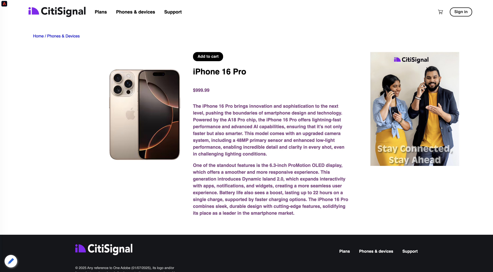

# 1.2.1 De l&#39;inconnu au connu sur le site

## Contexte

Le parcours de l&#39;inconnu au connu est l&#39;un des sujets les plus importants parmi les marques de nos jours, tout comme le parcours client de l&#39;acquisition à la rétention.

Adobe Experience Platform joue un rôle considérable dans ce parcours. La plateforme est le cerveau de la communication, le système d&#39;expérience d&#39;enregistrement.

Platform est un environnement dans lequel le mot **client** est plus large que les **clients connus**. Il est très important de le mentionner lorsque vous vous adressez à des marques : un visiteur inconnu sur le site web est également un client du point de vue de Platform et, par conséquent, tout le comportement en tant que visiteur inconnu est également envoyé à Platform. Grâce à cette approche, lorsque ce client devient finalement un client connu, une marque peut également visualiser ce qui s&#39;est passé avant ce moment. Cela est utile du point de vue de l’attribution et de l’optimisation de l’expérience.

## Qu&#39;allez-vous faire ?

Vous allez désormais ingérer des données dans Adobe Experience Platform qui seront liées à des identifiants tels que des ECID et des adresses e-mail. L’objectif est de comprendre le contexte commercial de ce que vous êtes sur le point de faire du point de vue de la configuration. Dans l’exercice suivant, vous allez commencer à configurer tout ce dont vous avez besoin pour rendre possible toute cette ingestion de données dans votre propre environnement sandbox.

### Flux de Parcours client

Accédez à [https://dsn.adobe.com](https://dsn.adobe.com). Après vous être connecté avec votre Adobe ID, voici ce que vous verrez. Cliquez sur le **de 3 points...** sur le projet de votre site web, puis cliquez sur **Exécuter** pour l’ouvrir.

Vous verrez ensuite votre site web de démonstration s’ouvrir. Sélectionnez l’URL et copiez-la dans le presse-papiers.

Ouvrez une nouvelle fenêtre de navigateur en mode privé.

Collez l’URL de votre site web de démonstration, que vous avez copiée à l’étape précédente. Il vous sera ensuite demandé de vous connecter à l’aide de votre Adobe ID.

Sélectionnez votre type de compte et terminez le processus de connexion.

Votre site web est alors chargé dans une fenêtre de navigateur en mode privé. Pour chaque démonstration, vous devez utiliser une nouvelle fenêtre de navigateur en mode privé pour charger l’URL de votre site web de démonstration.

Cliquez sur l’icône du logo Adobe dans le coin supérieur gauche de l’écran pour ouvrir la visionneuse de profils.

Affichez le panneau Visionneuse de profils et le profil client en temps réel avec l’Experience Cloud ID **** comme identifiant principal pour ce client actuellement inconnu.

Vous pouvez également afficher tous les événements d’expérience qui ont été collectés en fonction du comportement du client ou de la cliente. La liste est actuellement vide, mais cela va bientôt changer.

Accédez à la catégorie de produits **Téléphones et appareils**. Cliquez ensuite sur le produit **iPhone 15 Pro**.

Vous verrez ensuite la page des détails du produit. Un événement d’expérience de type **Vue du produit** a été envoyé à Adobe Experience Platform à l’aide de l’implémentation de Web SDK que vous avez examinée dans le module précédent.

Ouvrez le panneau Visionneuse de profil et jetez un coup d’œil à vos **Événements d’expérience**.

>[!NOTE]
>
>Si l’événement ne s’affiche pas immédiatement, actualisez la page.

Revenez à la page de catégorie **Téléphones et appareils**, puis cliquez sur un autre produit. Un autre événement d’expérience a été envoyé à Adobe Experience Platform.

Ouvrez le panneau Visionneuse de profils. Vous verrez désormais 2 événements d’expérience de type **consultation du produit**. Bien que le comportement soit anonyme, avec le consentement approprié en place, nous sommes en mesure de suivre chaque clic et de le stocker dans Adobe Experience Platform. Une fois que le client anonyme sera connu, nous pourrons fusionner automatiquement tous les comportements anonymes au profil connu.

Cliquez sur **Se connecter** pour accéder à la page d’inscription/de connexion.

Cliquez sur **Créer un compte**.

Renseignez vos informations et cliquez sur **S’inscrire** après quoi vous serez redirigé vers la page précédente.

Ouvrez le panneau Visionneuse de profils et accédez au profil client en temps réel. Dans le panneau Visionneuse de profil, toutes vos données personnelles doivent s’afficher, comme vos nouveaux identifiants d’e-mail et de téléphone ajoutés.

Dans le panneau Visionneuse de profil, accédez à Événements d’expérience. Vous verrez les 2 produits que vous avez consultés précédemment dans le panneau Visionneuse de profils. Ces deux événements sont désormais également liés à votre profil « connu ».

Vous avez maintenant ingéré des données dans Adobe Experience Platform et vous les avez liées à des identifiants tels que des ECID et des adresses e-mail. L’objectif est de comprendre le contexte commercial de ce que vous êtes sur le point de faire. Dans l’exercice suivant, vous allez commencer à configurer tout ce dont vous avez besoin pour rendre possible toute cette ingestion de données.

## Étapes suivantes

Accédez à [1.2.2 Configuration des schémas et définition des identifiants](./ex2.md){target="_blank"}

Revenir à [Ingestion des données](./data-ingestion.md){target="_blank"}

Revenir à [Tous les modules](./../../../../overview.md){target="_blank"}
