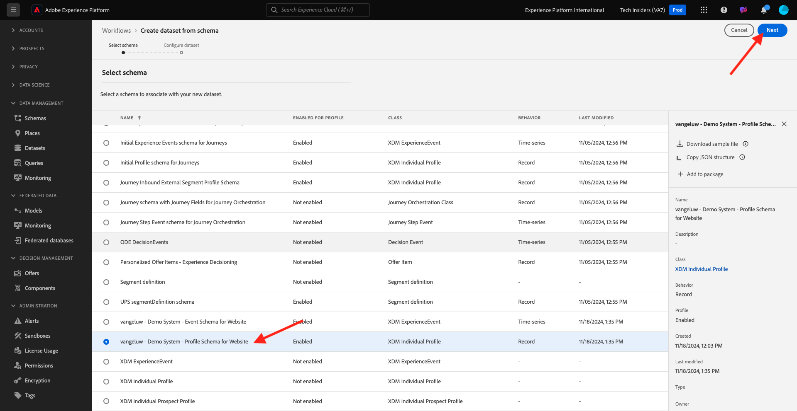

# 1.2.3 Configuration De Jeux De Données

Dans cet exercice, vous allez configurer des jeux de données pour capturer et stocker des informations de profil et le comportement des clients. Chaque jeu de données créé dans ce utilise l’un des schémas que vous avez créés à l’étape précédente.

## Contexte

Après avoir défini la réponse aux questions **Qui est ce client ?** et **Que fait ce client ?** devrait ressembler à ceci : vous devez maintenant créer un compartiment qui utilise ces informations pour recevoir et valider les données envoyées à Adobe Experience Platform.

## Créer des jeux de données

Vous devez maintenant créer 2 jeux de données :

- 1 jeu de données pour capturer les informations qui répondent au **Qui est ce client ?** - question.
- 1 jeu de données pour capturer les informations qui répondent au **Que fait ce client ?** - question.

Connectez-vous à Adobe Experience Platform en accédant à cette URL : [https://experience.adobe.com/platform](https://experience.adobe.com/platform).

Une fois connecté, vous accédez à la page d’accueil de Adobe Experience Platform.

Avant de continuer, vous devez sélectionner un **[!UICONTROL sandbox]**. Le sandbox à sélectionner est nommé ``--aepSandboxName--``. Après avoir sélectionné la [!UICONTROL sandbox] appropriée, la modification d’écran s’affiche et vous êtes maintenant dans votre [!UICONTROL sandbox] dédié.

Dans Adobe Experience Platform, cliquez sur **[!UICONTROL Jeux de données]** dans le menu situé dans la partie gauche de l’écran.  Vous verrez alors ceci :

Commençons par créer le jeu de données pour capturer les informations d’enregistrement du site web.

Vous devez créer un jeu de données. Pour créer un jeu de données, cliquez sur le bouton **[!UICONTROL + Créer un jeu de données]**.

Vous devez définir un jeu de données à partir du schéma que vous avez défini à l’étape précédente. Cliquez sur l’option **[!UICONTROL Créer un jeu de données à partir d’un schéma]** - .

Dans l’écran suivant, vous devez sélectionner le schéma que vous avez créé en 1, `--aepUserLdap-- - Demo System - Profile Schema for Website`.

Cliquez sur **Suivant**.

Donnons un nom à votre jeu de données.

Comme nom de jeu de données, utilisez le suivant :

`--aepUserLdap-- - Demo System - Profile Dataset for Website`

Cliquez sur **Terminer**.

Vous verrez maintenant ceci :

Revenez à la présentation de [!UICONTROL Jeux de données]. Le jeu de données que vous avez créé apparaît maintenant dans la fenêtre contextuelle de la présentation.

Ensuite, vous allez configurer un deuxième jeu de données pour capturer les interactions du site web.

Cliquez sur **[!UICONTROL + Créer un jeu de données]**.

Vous devez définir un jeu de données à partir du schéma que vous avez défini à l’étape précédente. Cliquez sur l’option **[!UICONTROL Créer un jeu de données à partir d’un schéma]** - .

Dans l’écran suivant, vous devez sélectionner le schéma que vous avez créé précédemment, `--aepUserLdap-- - Demo System - Event Schema for Website`.

Cliquez sur **Suivant**.

Donnons un nom à votre jeu de données.

Comme nom de jeu de données, utilisez le suivant :

`--aepUserLdap-- - Demo System - Event Dataset for Website`

Cliquez sur **Terminer**.

Vous verrez alors ceci :

Revenez à l’écran d’aperçu [!UICONTROL Jeux de données].

Vous devez maintenant activer vos jeux de données pour qu’ils fassent partie du profil client en temps réel de Adobe Experience Platform.

Ouvrez votre `--aepUserLdap-- - Demo System - Profile Dataset for Website` de jeu de données en cliquant dessus.

Recherchez l’icône de basculement [!UICONTROL Profil] sur le côté droit de l’écran.
Cliquez sur le bouton (bascule) [!UICONTROL Profil] pour activer ce jeu de données pour [!UICONTROL Profil].

Cliquez sur **[!UICONTROL Activer]**.

Votre jeu de données est maintenant activé pour [!UICONTROL Profil].

Revenez à la présentation des jeux de données et ouvrez votre jeu de données `--aepUserLdap-- - Demo System - Event Dataset` pour le site Web en cliquant dessus.

Recherchez l’icône de basculement [!UICONTROL Profil] sur le côté droit de l’écran. Cliquez sur le bouton (bascule) [!UICONTROL Profil] pour activer [!UICONTROL Profil].

Cliquez sur **[!UICONTROL Activer]**.

Votre jeu de données est maintenant activé pour [!UICONTROL Profil].

## Étapes suivantes

Accédez à [1.2.4 Ingestion de données à partir de sources hors ligne](./ex4.md){target="_blank"}

Revenir à [Ingestion des données](./data-ingestion.md){target="_blank"}

Revenir à [Tous les modules](./../../../../overview.md){target="_blank"}
